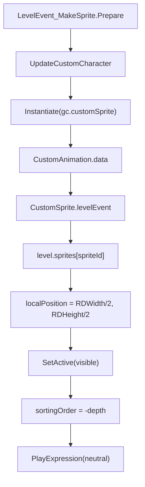
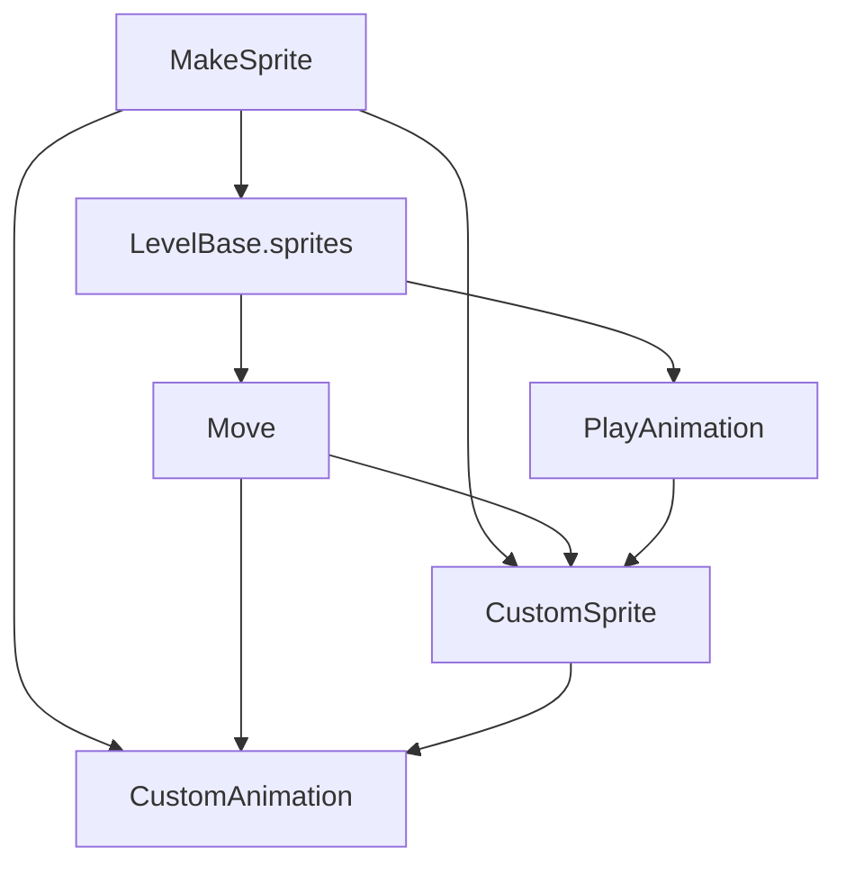

# 精灵生命周期事件

本页深写 `MakeSprite`、`Move` 和 `PlayAnimation`。这三个事件组成自定义精灵的主流程：`MakeSprite` 创建并注册精灵，`Move` 改变精灵位置、缩放、角度和 pivot，`PlayAnimation` 播放指定表情动画。

## 事件总览

| 事件 | 事件类 | Inspector 面板 | 时间线控件 | 主要职责 |
| --- | --- | --- | --- | --- |
| `MakeSprite` | `LevelEvent_MakeSprite` | `InspectorPanel_MakeSprite` | `LevelEventControl_MakeSprite` | 加载默认角色或自定义角色资源，创建 `CustomSprite` 并写入 `LevelBase.sprites` |
| `Move` | `LevelEvent_Move` | `InspectorPanel_Move` | `LevelEventControl_Action` | 对目标精灵执行位置、缩放、旋转、pivot 动画 |
| `PlayAnimation` | `LevelEvent_PlayAnimation` | `InspectorPanel_PlayAnimation` | `LevelEventControl_Action` | 对目标精灵播放指定 expression |

## MakeSprite 基本信息

| 项目 | 内容 |
| --- | --- |
| 源码 | `RDFucked/Assets/Scripts/Assembly-CSharp/RDLevelEditor/LevelEvent_MakeSprite.cs` |
| 继承 | `LevelEvent_Base` |
| 执行时机 | `OnPrebar` |
| 房间用法 | `RoomsUsage.OneRoom` |
| 排序偏移 | `-10` |
| 默认资源 | `Resources/DefaultSprite` |

`MakeSprite` 是精灵事件链的起点。事件运行前会准备角色动画数据，运行准备阶段会实例化 `gc.customSprite`，把它放入指定房间的 `spriteContainer`，再用 `spriteId` 注册到 `level.sprites`。

## MakeSprite 字段与属性

| 名称 | 类型 | 默认值 | 序列化名 | 作用 |
| --- | --- | --- | --- | --- |
| `failedLoadingCustomCharacter` | `bool` | `false` | 不直接序列化 | 记录自定义角色或图片加载失败状态，Inspector 用它显示错误文本 |
| `customAnimation` | `CustomAnimation` | `null` | 不直接序列化 | 保存实例化精灵上的动画组件引用 |
| `random` | `System.Random` | 静态实例 | 不直接序列化 | 生成默认 `spriteId` |
| `defaultSpritePath` | `const string` | `DefaultSprite` | 不直接序列化 | 自定义图片模式加载的基础 JSON 模板资源名 |
| `visible` | `bool` | `true` | `visible` | 创建后是否显示精灵 |
| `preview` | `bool` | `true` | `preview` | 编辑器中是否预览该精灵 |
| `spriteId` | `string` | `RandomString(7)` | `id` | 精灵唯一 ID，后续 `Move`、`PlayAnimation` 通过 `target` 指向它 |
| `filename` | `string` | 空字符串 | `filename` | 自定义角色 JSON 或图片文件名 |
| `character` | `Character` | `Beans` | `character` | 默认角色枚举；`filename` 非空时改用 `Character.Custom` |
| `depth` | `int` | `1` | `depth` | 渲染深度，运行时写入 `SpriteRenderer.sortingOrder = -depth` |
| `filter` | `TextureFilter` | 枚举默认值 | `filter` | 自定义图片纹理过滤方式 |

## MakeSprite 条件显示

| 方法 | 返回规则 | 影响字段 |
| --- | --- | --- |
| `EnableCharacterIf()` | `filename` 为空时返回 `character != Character.Custom`，否则返回 `false` | 控制 `character` 是否显示 |
| `EnableFilenameIf()` | 返回 `!EnableCharacterIf()` | 控制 `filename` 是否显示 |
| `EnableFilterIf()` | 返回 `!filename.IsNullOrEmpty()` | 控制 `filter` 是否显示 |

这组条件让默认角色模式和自定义资源模式互斥。默认角色使用 `character`，自定义资源使用 `filename` 和 `filter`。

## MakeSprite 生命周期

| 方法 | 行为 |
| --- | --- |
| `Init()` | 清空 `filename`，设置 `character = Character.Beans`，生成 7 位 `spriteId`，并设置 `usesY = false` |
| `RandomString(int length)` | 从小写字母和数字中随机抽取字符，拼接成默认 ID |
| `Prepare()` | 加载自定义角色数据，设置 `prepared = true`，调用 `CreateSprite()`，再播放 `neutral` 表情 |
| `CreateSprite()` | 实例化 `gc.customSprite`，配置 `CustomAnimation` 和 `CustomSprite`，注册到 `level.sprites`，设置位置、显示状态和排序 |
| `PlayExpression(string expression)` | 当动画数据存在指定 clip 时调用 `customAnimation.Play(expression)` |
| `Encode()` | 在 `RDLevelData.encodingLevelEvents` 为真时返回 `null`；否则清理缩进后走基类编码 |
| `Decode(Dictionary<string, object> dict)` | 执行基类解码；当 `filename` 非空时设置 `character = Character.Custom`；编辑器模式下刷新自定义角色数据 |
| `UpdateCustomCharacter(bool justReturnErrors, bool editorRowHeader = false)` | 根据 `filename` 加载图片或角色 JSON，并更新编辑器或关卡中的 custom character 数据 |
| `Run()` | 对已经创建的精灵写入自定义图片纹理的 `filterMode` |

## MakeSprite 创建流程

`CreateSprite()` 从 `game.rooms[room].spriteContainer` 取得父节点，实例化 `gc.customSprite`。如果 `character == Character.Custom`，动画数据来自 `level.customCharacterData[filename]`；否则来自 `scrChar.baseCharacterAnimations[character]`。

## 自定义资源加载

| 输入 | 加载路径 | 运行结果 |
| --- | --- | --- |
| 图片文件扩展名 | `RDEditorUtils.LoadLevelTexture(filename)` | 读取图片纹理，再用 `DefaultSprite` JSON 模板创建 custom character |
| 非图片文件名 | `LevelEvent_MakeRow.UpdateCustomCharacter(Path.GetFileNameWithoutExtension(filename), ...)` | 按自定义角色目录和 JSON 规则加载角色动画数据 |

图片模式会把纹理 `wrapMode` 设置为 `Clamp`。`filter == TextureFilter.NearestNeighbor` 时使用 `FilterMode.Point`，其他情况使用 `FilterMode.Bilinear`。加载成功后，`CustomCharacterData.spriteSize` 会被写成纹理宽高。

## InspectorPanel_MakeSprite

| 字段 | UI 类型 | 作用 |
| --- | --- | --- |
| `filename` | `Text` | 显示当前默认角色名、自定义角色名或文件名 |
| `character` | `CharacterPicker` | 选择默认角色或自定义角色 |
| `room` | `Dropdown` | 选择精灵所在房间 |
| `visibility` | `ToggleGroup` | 读写 `visible` |
| `previewToggle` | `ToggleGroup` | 读写 `preview` |
| `container` | `RectTransform` | 错误提示显示时调整面板布局 |
| `depth` | `InputField` | 读写 `depth` |
| `characterErrorText` | `Text` | 自定义角色加载失败时显示错误 |
| `updateRoomDropdown` | `bool` | 控制是否刷新房间下拉框 |

`Awake()` 会为显示、预览、深度和房间下拉框注册保存监听，并初始化角色选择器列表。角色列表由 `RDEditorUtils.GetAvailableDialogueCharacters()`、`Character.Beans` 和 `RDEditorConstants.AvailableSpriteCharacters` 组合而成。

## 房间切换逻辑

当 `room` 下拉框改变时，`RoomDropdownWasUpdated()` 会在保存状态作用域中执行以下动作：

| 步骤 | 行为 |
| --- | --- |
| 定位当前精灵 | 从 `editor.spritesData` 找到当前 `MakeSprite` 的索引 |
| 同步房间 | 修改当前 `MakeSprite.room`，并同步关联精灵事件的 `room` |
| 移动 UI 控件 | 把关联的精灵事件控件移动到目标房间容器 |
| 重新排布 | 对事件控件执行向下移动检测，避免时间线控件重叠 |
| 刷新界面 | 更新相关控件、精灵页签、房间下拉框和 sprites tab |

这说明 `MakeSprite` 的房间不是孤立字段。编辑器中切换房间时，它会带动同一精灵 ID 下的后续精灵事件一起迁移到新房间。

## Move 基本信息

| 项目 | 内容 |
| --- | --- |
| 源码 | `RDFucked/Assets/Scripts/Assembly-CSharp/RDLevelEditor/LevelEvent_Move.cs` |
| 继承 | `LevelEvent_Base` |
| 接口 | `IDurationHaver` |
| 执行时机 | `OnBar` |
| 房间用法 | `RoomsUsage.NotUsed` |
| 目标字段 | 使用 `target` 指向 `MakeSprite.spriteId` |

`Move` 只操作目标精灵，不直接使用房间字段。`LevelEvent_Base.DecodeTargetId()` 会根据 `target` 在 `RDLevelData.current.sprites` 中查找对应 `MakeSprite`，并给 `LevelEvent_Move.makeSprite` 填入引用。

## Move 字段与属性

| 名称 | 类型 | 默认值 | 控件 | 作用 |
| --- | --- | --- | --- | --- |
| `makeSprite` | `LevelEvent_MakeSprite` | 解码时查找 | 不直接序列化 | 目标 `MakeSprite` 引用，用于旧版本 pivot 迁移 |
| `spritePosition` | `FloatExpression2?` | `(50, 50)` | `ExpPositionPicker` | 目标位置，百分比坐标，运行时换算为 `RDWidth` / `RDHeight` 像素 |
| `scale` | `FloatExpression2?` | `(1, 1)` | `Off` | X/Y 缩放 |
| `angle` | `FloatExpression?` | `0` | `InputField`，单位 degrees | 旋转角度 |
| `pivot` | `Float2?` | `(50, 50)` | `Off` | 动画 mesh pivot，百分比坐标 |
| `duration` | `float` | `1` | `InputField`，单位 beats | 动画持续拍数 |
| `ease` | `Ease` | `Linear` | 自动枚举控件 | DOTween 缓动类型 |

## Move Decode

`Decode()` 会先调用基类解码。之后存在一段旧版本迁移：当 `pivot` 存在、`makeSprite` 存在、关卡版本号小于 65 且目标角色是 `Character.Beans` 时，pivot 会围绕 50 做一次比例修正。

| 轴 | 修正规则 |
| --- | --- |
| X | `50 + (oldX - 50) * 0.84210527` |
| Y | `50 + (oldY - 50) * 0.8378378` |

## Move Run

`Run()` 使用 `RunOnBeat()` 包住实际动作。如果 `level.sprites` 中不存在 `target`，事件会写 debug log 并结束。找到目标后，`duration` 会通过 `conductor.DurationBeatsToTime(beat - 1, duration)` 换算成秒。

| 属性 | 运行行为 |
| --- | --- |
| `spritePosition.x` | 先 kill `positionTweenX`，再 `DOLocalMoveX(RDWidth * x / 100, durationSeconds)` |
| `spritePosition.y` | 先 kill `positionTweenY`，再 `DOLocalMoveY(RDHeight * y / 100, durationSeconds)` |
| `scale.x` | 先 kill `scaleTweenX`，再 `DOScaleX(x, durationSeconds)` |
| `scale.y` | 先 kill `scaleTweenY`，再 `DOScaleY(y, durationSeconds)` |
| `angle` | 调用 `ent.Rotate(value, durationSeconds, ease)` |
| `pivot.x` | 用 `DOTween.To` 修改 `customAnimation.pivotX`，每次更新调用 `UpdateMesh()` |
| `pivot.y` | 用 `DOTween.To` 修改 `customAnimation.pivotY`，每次更新调用 `UpdateMesh()` |

所有 tween 都会设置 `ease`。表达式字段在运行时调用 `Unbox(level)`，因此位置、缩放和角度可以依赖关卡表达式上下文求值。

## PlayAnimation 基本信息

| 项目 | 内容 |
| --- | --- |
| 源码 | `RDFucked/Assets/Scripts/Assembly-CSharp/RDLevelEditor/LevelEvent_PlayAnimation.cs` |
| 继承 | `LevelEvent_Base` |
| 执行时机 | `OnBar` |
| 房间用法 | `RoomsUsage.NotUsed` |
| 目标字段 | 使用 `target` 指向 `MakeSprite.spriteId` |

## PlayAnimation 属性与运行

| 名称 | 类型 | 默认值 | 控件 | 作用 |
| --- | --- | --- | --- | --- |
| `expression` | `string` | 空字符串 | `Dropdown` | 要播放的 custom character clip 名称 |

`Run()` 同样使用 `RunOnBeat()`。找到 `level.sprites[target]` 后，直接调用 `PlayExpression(expression)`。目标不存在时写 debug log。

`GetTooltipText()` 会先查找本地化键 `editor.expression.{expression}`。存在本地化文本时显示本地化文本，否则显示原始 `expression` 字符串。

## 调用关系

## 与其他精灵事件的边界

| 事件 | 与本页事件的关系 |
| --- | --- |
| `Tint` | 使用同一个 `target` 精灵，修改渲染颜色或混合参数 |
| `Tile` | 使用同一个 `target` 精灵，修改平铺与缩放相关表现 |
| `SetVisible` | 使用同一个 `target` 精灵，控制显示隐藏 |
| `ReorderSprite` | 使用同一个 `target` 精灵，调整精灵显示顺序 |
| `Blend` | 可作用于精灵或窗口内容，用于混合显示效果 |

`MakeSprite` 负责把目标放入 `LevelBase.sprites`。其他精灵事件依赖这个字典查找目标，因此 `spriteId` 是精灵事件链的核心连接点。

