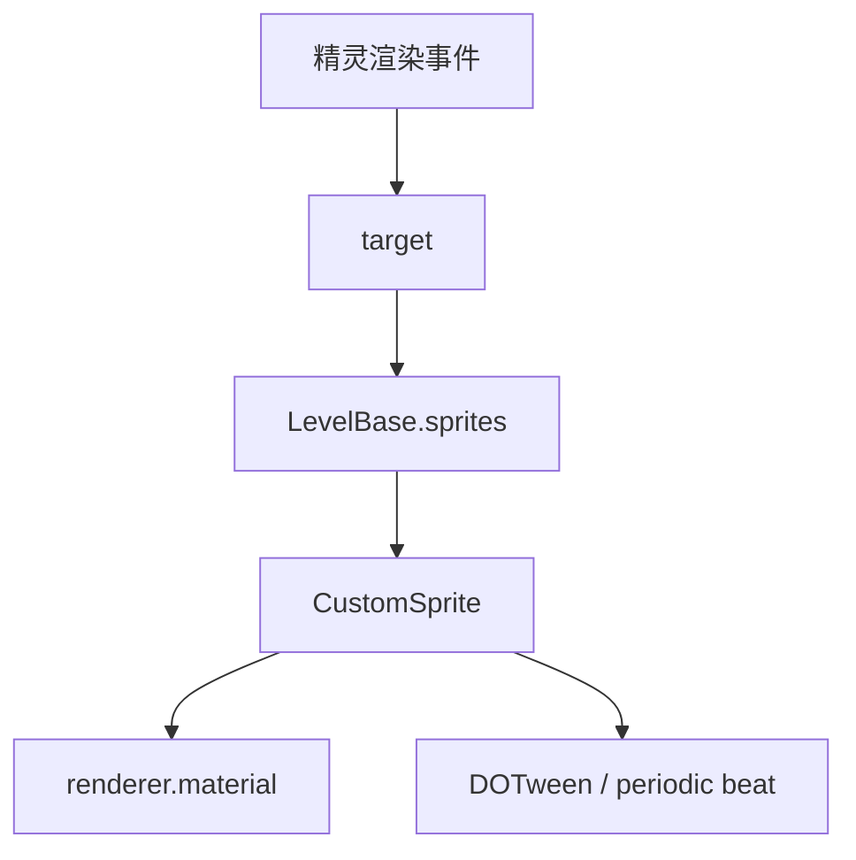

# 精灵渲染与排序事件

本页深写 `Tint`、`Tile`、`SetVisible`、`ReorderSprite` 和 `Blend`。这些事件都依赖 `MakeSprite` 创建出的 `CustomSprite`，通过 `target` 查找 `LevelBase.sprites[target]` 后修改材质、纹理平铺、显示状态或排序。

## 事件总览

| 事件 | 事件类 | Inspector 面板 | 主要职责 |
| --- | --- | --- | --- |
| `Tint` | `LevelEvent_Tint` | `InspectorPanel_Tint` | 修改精灵边框、叠色和透明度 |
| `Tile` | `LevelEvent_Tile` | `InspectorPanel_Tile` | 修改精灵纹理平铺、偏移和滚动/脉冲速度 |
| `SetVisible` | `LevelEvent_SetVisible` | `InspectorPanel_SetVisible` | 开关精灵 `GameObject` |
| `ReorderSprite` | `LevelEvent_ReorderSprite` | `InspectorPanel_ReorderSprite` | 改变精灵所在房间、Sorting Layer 和深度 |
| `Blend` | `LevelEvent_Blend` | `InspectorPanel_Blend` | 修改精灵材质混合模式 |

## 共同前提

| 项目 | 内容 |
| --- | --- |
| 目标来源 | `LevelBase.sprites` 字典 |
| 目标键 | `target`，通常来自 `MakeSprite.spriteId` |
| 执行时机 | 全部是 `OnBar` |
| 房间用法 | 全部是 `RoomsUsage.NotUsed` |

`Tint`、`Tile`、`SetVisible`、`Blend` 在找不到目标时会写 debug log。`ReorderSprite` 找不到目标时不执行后续操作。

## Tint

| 项目 | 内容 |
| --- | --- |
| 源码 | `RDFucked/Assets/Scripts/Assembly-CSharp/RDLevelEditor/LevelEvent_Tint.cs` |
| 继承 | `LevelEvent_Base` |
| 接口 | `IDurationHaver` |

### 属性

| 名称 | 类型 | 默认值 | 条件 | 作用 |
| --- | --- | --- | --- | --- |
| `border` | `BorderType?` | `None` | 始终显示 | 边框类型 |
| `borderColor` | `ColorOrPalette` | `Color.white` | `border != None` | 边框或发光颜色 |
| `borderPulse` | `bool?` | `true` | `border != None` | 是否用音量追踪驱动边框 alpha |
| `borderPulseMin` | `float` | `0.1` | `borderPulse == true` | 边框脉冲最小 alpha |
| `borderPulseMax` | `float` | `1` | `borderPulse == true` | 边框脉冲最大 alpha |
| `tint` | `bool?` | `false` | 始终显示 | 是否启用叠色 |
| `tintColor` | `ColorOrPalette` | `Color.white` | `tint == true` | 叠色颜色 |
| `opacity` | `int?` | `100` | 始终显示 | 精灵透明度百分比 |
| `duration` | `float` | `0` | 始终显示 | 过渡拍数 |
| `ease` | `Ease` | `Linear` | 始终显示 | DOTween 缓动 |

### 编码与旧版本迁移

`Encode()` 会处理两个特殊透明度字段：

| 字段 | 条件 | 输出 |
| --- | --- | --- |
| `borderOpacity` | `borderColor.alpha` 存在且不在 0 到 1 | 写出 `borderColor.alpha * 100` |
| `tintOpacity` | `tintColor.alpha` 存在且不在 0 到 1 | 写出 `tintColor.alpha * 100` |

`Decode()` 会读取 `borderOpacity` 和 `tintOpacity`，把百分比还原为 0 到 1 的 alpha。版本号小于 66 时，如果旧数据没有写 `border`、`tint`、`opacity`，会分别补成 `None`、`false`、`100`。

### Run

`Run()` 会在 `RunOnBeat()` 中读取目标 `CustomSprite`，取 `customSprite.renderer.material`，并把 `duration` 从拍数换算成秒。

| 属性 | 材质字段或对象 | 行为 |
| --- | --- | --- |
| `border` | `RDShaderProperties.OutlineID` | `Outline` 写 1，其他写 0 |
| `borderColor` | `RDShaderProperties.GlowColorID` | kill `borderTween`，用 `DOColor()` 过渡到目标颜色 |
| `borderPulse` | `scrVolumeTracker` | 为边框颜色创建或删除 alpha tracker |
| `tintColor` | `RDShaderProperties.OverlayColorID` | kill `tintTween`，用 `DOColor()` 过渡到叠色 |
| `opacity` | `RDShaderProperties.OpacityID` | kill `opacityTween`，用 `DOFloat(opacity / 100f)` 过渡透明度 |

当 `border == None` 时，边框目标颜色是 `Color.clear`，并会删除已有的 `borderGlowTracker`。

## Tile

| 项目 | 内容 |
| --- | --- |
| 源码 | `RDFucked/Assets/Scripts/Assembly-CSharp/RDLevelEditor/LevelEvent_Tile.cs` |
| 继承 | `LevelEvent_Base` |
| 接口 | `IDurationHaver` |

### 属性

| 名称 | 类型 | 默认值 | 条件 | 作用 |
| --- | --- | --- | --- | --- |
| `tiling` | `Float2?` | `(2, 2)` | 始终显示 | 纹理平铺倍率 |
| `position` | `Float2?` | `(0, 0)` | 可关闭 | 纹理偏移 |
| `speed` | `Float2?` | `(0, 0)` | 可关闭 | 滚动或脉冲速度 |
| `speedDescription` | `bool` | `false` | `tilingType == Scroll` | 显示滚动说明 |
| `pulseDescription` | `bool` | `false` | `tilingType == Pulse` | 显示脉冲说明 |
| `tilingType` | `TilingType` | 枚举默认值 | `speed` 启用 | `Scroll` 或 `Pulse` 行为 |
| `interval` | `float` | `1` | `tilingType == Pulse` | 脉冲间隔拍数 |
| `duration` | `float` | `0` | 始终显示 | 过渡拍数 |
| `ease` | `Ease` | `Linear` | 始终显示 | DOTween 缓动 |

### 条件方法

| 方法 | 规则 |
| --- | --- |
| `EnableTilingIf()` | `speed.HasValue` |
| `EnableIntervalIf()` | `speed` 启用且 `tilingType == Pulse` |
| `EnableSpeedDescriptionIf()` | `speed` 启用且 `tilingType == Scroll` |
| `EnablePulseDescriptionIf()` | `speed` 启用且 `tilingType == Pulse` |

`Decode()` 在版本号小于 60 时会把 `position` 乘以 `-1`，用于迁移旧偏移方向。

### Run

`Run()` 找到目标精灵后，确保材质有 `mainTexture`。当 `tiling`、`position` 或 `speed` 任一存在时，把 `mainTexture.wrapMode` 设为 `TextureWrapMode.Repeat`。

| 属性 | 目标字段 | 行为 |
| --- | --- | --- |
| `position.x` | `sprite.tileOffset.x` | kill `positionTweenX`，通过 `DOTween.To()` 过渡 |
| `position.y` | `sprite.tileOffset.y` | kill `positionTweenY`，通过 `DOTween.To()` 过渡 |
| `tiling.x` | `sprite.tileAmount.x` | kill `tilingTweenX`，通过 `DOTween.To()` 过渡 |
| `tiling.y` | `sprite.tileAmount.y` | kill `tilingTweenY`，通过 `DOTween.To()` 过渡 |
| `speed.x` | `CustomSprite.SetTileSpeedX()` | 设置 X 轴滚动或脉冲 |
| `speed.y` | `CustomSprite.SetTileSpeedY()` | 设置 Y 轴滚动或脉冲 |

`InspectorPanel_Tile.SaveProperties()` 会对 `properties` 执行两轮 `Save()`。这样保存后条件字段会在同一次保存流程里根据最新属性状态再保存一遍。

## CustomSprite 平铺更新

`CustomSprite.Update()` 每帧调用 `UpdateTile()`。

| 字段 | 来源 | 用途 |
| --- | --- | --- |
| `tileOffset` | `Tile.position` tween | 基础纹理偏移 |
| `tileAmount` | `Tile.tiling` tween | 写入 `mainTextureScale` |
| `speed` | `SetTileSpeedX/Y()` | Scroll 模式每帧累加偏移 |
| `pulseOffset` | Periodic beat 回调 | Pulse 模式按拍推进偏移 |
| `scrollOffset` | 每帧累加 | Scroll 模式的动态偏移 |

`SetTileSpeedX()` 和 `SetTileSpeedY()` 都会先 kill 对应轴的旧 tween，并移除旧的 periodic beat 事件。`Scroll` 模式用 DOTween 过渡到速度值，`Pulse` 模式通过 `scrExecuteOnPeriodicBeat.Add()` 按间隔推进偏移。

## SetVisible

| 项目 | 内容 |
| --- | --- |
| 源码 | `RDFucked/Assets/Scripts/Assembly-CSharp/RDLevelEditor/LevelEvent_SetVisible.cs` |
| 继承 | `LevelEvent_Base` |

| 名称 | 类型 | 默认值 | 作用 |
| --- | --- | --- | --- |
| `visible` | `bool` | `true` | 控制目标精灵 `GameObject.SetActive(visible)` |

`GetTooltipText()` 根据 `visible` 返回显示或隐藏的本地化文本。

## ReorderSprite

| 项目 | 内容 |
| --- | --- |
| 源码 | `RDFucked/Assets/Scripts/Assembly-CSharp/RDLevelEditor/LevelEvent_ReorderSprite.cs` |
| 继承 | `LevelEvent_Base` |

### 属性

| 名称 | 类型 | 默认值 | 作用 |
| --- | --- | --- | --- |
| `newRoom` | `RoomSelectType?` | `Room1` | 把精灵移动到指定房间的 `spriteContainer` |
| `depth` | `int?` | `0` | 设置渲染顺序 |
| `sortingLayerName` | `RDSortingLayer?` | `Default` | 设置 Sorting Layer：`Default`、`Background`、`Foreground` |

`Run()` 找到目标精灵后依次处理房间、Sorting Layer、深度：

| 属性 | 行为 |
| --- | --- |
| `newRoom` | `customSprite.transform.SetParent(game.rooms[value].spriteContainer, false)` |
| `sortingLayerName` | 设置 `customSprite.renderer.sortingLayerName` |
| `depth` | `Default` 层使用 `-depth`，其他层使用 `depth` |

## Blend

| 项目 | 内容 |
| --- | --- |
| 源码 | `RDFucked/Assets/Scripts/Assembly-CSharp/RDLevelEditor/LevelEvent_Blend.cs` |
| 继承 | `LevelEvent_Base` |

| 名称 | 类型 | 默认值 | 控件 | 作用 |
| --- | --- | --- | --- | --- |
| `blendType` | `SpriteBlendType` | 枚举默认值 | `Dropdown`，选项 `None`、`Additive`、`Multiply`、`Invert` | 设置材质混合参数 |

### 混合参数

| `blendType` | `_BlendFirst` | `_BlendSecond` |
| --- | --- | --- |
| `Additive` | `1` | `1` |
| `Multiply` | `2` | `10` |
| `Invert` | `4` | `10` |
| `None` | `1` | `10` |

`GetTooltipText()` 返回 `RDString.GetEnumValue(blendType)`。

## 调用关系

## 与精灵生命周期事件的关系

| 前置事件 | 后续事件 |
| --- | --- |
| `MakeSprite` 创建 `CustomSprite` 并注册 `spriteId` | 本页事件通过 `target` 查找并修改该精灵 |
| `Move` 负责 transform、scale、angle、pivot | `Tint`、`Tile`、`Blend` 负责材质与纹理 |
| `PlayAnimation` 负责 expression | `SetVisible`、`ReorderSprite` 负责显示状态和层级 |

