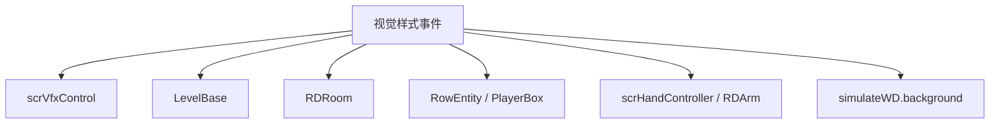

# 视觉样式与特效事件

本页深写 `SetTheme`、`SetVFXPreset`、`SetBackgroundColor`、`SetForeground`、`SetSpeed`、`Flash`、`CustomFlash`、`TintRows`、`FlipScreen`、`InvertColors`、`ShowHands`、`PaintHands` 和 `DesktopColor`。这些事件覆盖主题背景、VFX、图片层、闪光、行染色、屏幕翻转、手部显示和桌面背景。

## 事件总览

| 事件 | 事件类 | 主要职责 |
| --- | --- | --- |
| `SetTheme` | `LevelEvent_SetTheme` | 预载并切换房间主题背景 |
| `SetVFXPreset` | `LevelEvent_SetVFXPreset` | 启用、禁用或调整主题 VFX |
| `SetBackgroundColor` | `LevelEvent_SetBackgroundColor` | 设置背景颜色或背景图片层 |
| `SetForeground` | `LevelEvent_SetForeground` | 设置前景图片层 |
| `SetSpeed` | `LevelEvent_SetSpeed` | 平滑改变游戏视觉速度 |
| `Flash` | `LevelEvent_Flash` | 使用短、中、长三档白色闪光 |
| `CustomFlash` | `LevelEvent_CustomFlash` | 使用自定义颜色、透明度、缓动和背景层闪光 |
| `TintRows` | `LevelEvent_TintRows` | 改变行与玩家框边框、叠色、透明度、特效和心脏 |
| `FlipScreen` | `LevelEvent_FlipScreen` | 按房间翻转 X/Y 画面 |
| `InvertColors` | `LevelEvent_InvertColors` | 开关画面反色 |
| `ShowHands` | `LevelEvent_ShowHands` | 显示、隐藏或切换手部动作 |
| `PaintHands` | `LevelEvent_PaintHands` | 改变手部实体边框、叠色和透明度 |
| `DesktopColor` | `LevelEvent_DesktopColor` | 改变模拟桌面背景颜色 |

## SetTheme

| 项目 | 内容 |
| --- | --- |
| 源码 | `RDFucked/Assets/Scripts/Assembly-CSharp/RDLevelEditor/LevelEvent_SetTheme.cs` |
| 执行时机 | `OnBar`，排序偏移 `-10` |
| 房间用法 | `RoomsUsage.ManyRooms` |

| 名称 | 类型 | 默认值 | 条件 | 作用 |
| --- | --- | --- | --- | --- |
| `moveRowContainer` | `bool` | 解码时设置 | 不序列化 | 版本号小于 30 时启用旧行容器移动行为 |
| `preset` | `RDTheme` | 枚举默认值 | 始终显示 | 主题枚举 |
| `variant` | `int` | `0` | 主题存在变体 | 主题变体 |
| `enablePosition` | `bool` | `false` | 主题支持定位 | 是否自定义主题位置 |
| `positionX` | `float` | `0` | `enablePosition` | 主题横向滚动位置 |
| `positionDuration` | `float` | `0` | `enablePosition` | 主题滚动拍数 |
| `positionEase` | `Ease` | `Linear` | `enablePosition` | 主题滚动缓动 |
| `firstRowOnFloor` | `bool` | `false` | 开发模式且字段为真 | 第一行贴地显示 |
| `skipPaintEffects` | `bool` | `true` | 始终显示 | 跳过 paint effects |

`Prepare()` 会对每个目标房间调用 `game.currentLevel.PreloadTheme(preset, room, variant)`。`Decode()` 中，版本号小于 9 且 `preset == Kaleidoscope` 时改为 `HallOfMirrors`。

`Run()` 对每个房间调用：

```csharp
ShowThemeBackgrounds(preset, room, true, true, moveRowContainer, firstRowOnFloor, !skipPaintEffects, variant)
```

若 `enablePosition` 为真，继续调用 `rooms[room].ScrollTheme(positionX, durationSeconds, positionEase)`；否则调用 `TryResetScroll()`。

## SetVFXPreset

| 项目 | 内容 |
| --- | --- |
| 源码 | `RDFucked/Assets/Scripts/Assembly-CSharp/RDLevelEditor/LevelEvent_SetVFXPreset.cs` |
| 执行时机 | `OnBar`，`MiawMiaw` 走 `RunPrebar()` |
| 房间用法 | 由 `RDEditorConstants.VFXInfos[preset].roomsUsage` 决定 |

### 属性

| 名称 | 类型 | 默认值 | 条件来源 | 作用 |
| --- | --- | --- | --- | --- |
| `preset` | `RDThemeFX` | 枚举默认值 | 始终显示 | VFX 类型 |
| `enable` | `bool` | `true` | `preset != DisableAll` | 启用或禁用该 VFX |
| `threshold` | `float?` | `0.3` | `hasThreshold` | 阈值 |
| `intensity` | `float?` | `100` | `hasIntensity` | 强度百分比 |
| `color` | `ColorOrPalette?` | `Color.white` | `hasColor` | VFX 颜色 |
| `amount` | `Float2?` | `(1, 1)` | `hasXY` | XY 参数 |
| `xySpeed` | `Float2?` | `(0, 0)` | `hasXYSpeed` | XY 速度参数 |
| `speedPerc` | `float?` | `100` | `hasSpeed` | 速度百分比 |
| `duration` | `float` | `0` | `hasEase` | 过渡拍数 |
| `ease` | `Ease` | `Linear` | `hasEase` | 过渡缓动 |

`UpdateRoomsUsage()` 会根据 `VFXInfos[preset].roomsUsage` 更新 `roomsUsage` 并清理房间数据。`Prepare()` 会把目标 VFX 记入房间的 `preloadedVFX`。

### 运行逻辑

| 情况 | 行为 |
| --- | --- |
| `preset == MiawMiaw` | `Run()` 直接返回；`RunPrebar()` 中添加或禁用 |
| `preset == DisableAll` 且 `room == -1` | 遍历支持 `ManyRoomsAndOnTop` 的 VFX 并禁用 |
| `preset == DisableAll` 且普通房间 | 调用 `level.AddThemeFX(preset, room)` |
| `enable == true` | 组装 floatX、floatY、intensity、extra、duration、ease、color 后调用 `level.AddThemeFX()` |
| `enable == false` | 调用 `level.DisableThemeFX(preset, room)` |

`extra` 对 `Bloom` 使用 `threshold`，对有 speed 的 VFX 使用 `speedPerc / 100f`。

## SetBackgroundColor

| 项目 | 内容 |
| --- | --- |
| 源码 | `RDFucked/Assets/Scripts/Assembly-CSharp/RDLevelEditor/LevelEvent_SetBackgroundColor.cs` |
| 房间用法 | `RoomsUsage.ManyRoomsAndOnTop` |

| 名称 | 类型 | 默认值 | 条件 | 作用 |
| --- | --- | --- | --- | --- |
| `textures` | `Texture2D[]` | `null` | 不序列化 | `Prepare()` 加载的背景图片 |
| `backgroundType` | `BackgroundType` | 枚举默认值 | 始终显示 | 背景类型 |
| `images` | `string[]` | 空数组 | 图片模式且不含 OnTop | 图片文件列表 |
| `color` | `ColorOrPalette` | `Color.white` | 始终显示 | 背景颜色或图片染色 |
| `fps` | `float` | `30` | 多图片 | 图片播放帧率 |
| `contentMode` | `ContentMode` | `ScaleToFill` | 图片模式 | 图片填充方式 |
| `filter` | `TextureFilter` | 枚举默认值 | 隐藏字段 | 图片过滤方式 |
| `tilingType` | `TilingType` | 枚举默认值 | `contentMode == Tiled` | 平铺滚动或脉冲 |
| `speed` | `Float2` | `(0, 0)` | `contentMode == Tiled` | 平铺速度 |
| `duration` | `float` | `0` | `contentMode == Tiled` | 速度过渡拍数 |
| `interval` | `float` | `1` | `tilingType == Pulse` | 脉冲间隔 |
| `ease` | `Ease` | `Linear` | `contentMode == Tiled` | 缓动 |

`Encode()` 在平铺模式下把 `speed` 改写为旧格式 `scrollX` / `scrollY`。`Decode()` 支持从 `image` 字符串迁移为数组，也支持从 `scrollX` / `scrollY` 还原 `speed`。

`Run()` 分三类：

| 情况 | 行为 |
| --- | --- |
| `backgroundType == Color` | 对颜色做 alpha 预乘，再调用 `vfx.BgColor(color, room)` |
| 已加载图片 | 取房间 Background texture layer，按 `contentMode`、`filter`、颜色、速度、fps、duration 显示 |
| 无图片 | `rooms[room].HideTextureLayer(Background)` |

可访问性范围内，图片颜色会按背景变暗设置调整亮度。

## SetForeground

| 项目 | 内容 |
| --- | --- |
| 源码 | `RDFucked/Assets/Scripts/Assembly-CSharp/RDLevelEditor/LevelEvent_SetForeground.cs` |
| 房间用法 | `RoomsUsage.ManyRoomsAndOnTop` |

`SetForeground` 与背景图片层结构接近，但固定作用于 Foreground texture layer，不包含 `backgroundType`。`Prepare()` 加载图片并确保普通房间的 Foreground 层存在。`Run()` 中存在图片时调用 `vfx.GetForegroundTextureLayer(room).Show(...)`，没有图片时关闭该层 GameObject。

| 字段 | 说明 |
| --- | --- |
| `images` | 前景图片列表，旧单字符串会迁移为数组 |
| `color` | 前景图片染色 |
| `fps` | 多图片播放帧率 |
| `contentMode` | 填充方式 |
| `tilingType`、`speed`、`duration`、`interval`、`ease` | 仅平铺模式下用于滚动或脉冲 |

## SetSpeed

| 项目 | 内容 |
| --- | --- |
| 源码 | `RDFucked/Assets/Scripts/Assembly-CSharp/RDLevelEditor/LevelEvent_SetSpeed.cs` |
| 接口 | `IDurationHaver` |

| 名称 | 类型 | 默认值 | 作用 |
| --- | --- | --- | --- |
| `setSpeedTween` | `Tween` | 静态字段 | 保存当前速度 tween |
| `speed` | `float` | `1` | 目标视觉速度 |
| `duration` | `float` | `0` | 过渡拍数 |
| `ease` | `Ease` | `Linear` | 缓动 |

`Run()` 会 kill 旧 `setSpeedTween`，以 `game.visualSpeed / RDTime.speed` 为起点 tween 到 `speed`，每次更新和完成时调用 `game.SetVisualSpeed(gameSpeed)`。Tween 使用 independent update。

## Flash 与 CustomFlash

### Flash

| 项目 | 内容 |
| --- | --- |
| 源码 | `RDFucked/Assets/Scripts/Assembly-CSharp/RDLevelEditor/LevelEvent_Flash.cs` |
| 房间用法 | `RoomsUsage.ManyRoomsAndOnTop` |

| `simpleDuration` | 实际拍数 |
| --- | --- |
| `Short` | `1` |
| `Medium` | `2` |
| `Long` | `4` |

`Run()` 会把拍数换算成秒，再对每个目标房间调用 `vfx.Flash(room, seconds, 1f)`。

### CustomFlash

| 名称 | 类型 | 默认值 | 作用 |
| --- | --- | --- | --- |
| `startColor` | `ColorOrPalette?` | `Color.white` | 闪光起始颜色 |
| `startOpacity` | `int?` | `100` | 起始透明度百分比 |
| `endColor` | `ColorOrPalette?` | `Color.white` | 闪光结束颜色 |
| `endOpacity` | `int?` | `0` | 结束透明度百分比 |
| `background` | `bool` | `false` | 为真时使用房间背景 overlay |
| `duration` | `float` | `2` | 持续拍数 |
| `ease` | `Ease` | `Linear` | 缓动 |
| `reducedStrength` | `int?` | `50` | reduced flash 模式下强度百分比 |

`Decode()` 支持旧颜色字符串中的 alpha 迁移到 `startOpacity` / `endOpacity`。`Run()` 会根据 `background` 选择 `GetRoomBackgroundOverlay()` 或 `GetRoomOverlay()`，计算当前全局闪光强度、reduced flash 强度和亮度，再调用 `scrQuad.TweenColorFromTo()`。

## TintRows

| 项目 | 内容 |
| --- | --- |
| 源码 | `RDFucked/Assets/Scripts/Assembly-CSharp/RDLevelEditor/LevelEvent_TintRows.cs` |
| 排序偏移 | `-1` |

`TintRows` 可以作用于全部行，也可以作用于单行。`row == -1` 时 `roomsUsage` 为 `ManyRoomsAndOnTop`，否则为 `NotUsed`。

| 名称 | 类型 | 默认值 | 作用 |
| --- | --- | --- | --- |
| `border`、`borderColor`、`borderOpacity` | 边框相关 | `None`、白色、100 | 行边框或 glow |
| `borderPulse`、`borderPulseMin`、`borderPulseMax` | 脉冲相关 | `true`、0.1、1 | 用音量追踪驱动边框 alpha |
| `tint`、`tintColor`、`tintOpacity` | 叠色相关 | `false`、白色、100 | 行叠色 |
| `opacity` | `int?` | `100` | 行透明度 |
| `duration`、`ease` | 过渡 | `0`、Linear | Tween 参数 |
| `effect` | `RowEffect?` | `None` | 行特效，如 Electric |
| `effectSound` | `bool` | `true` | Electric 特效预备音 |
| `heart` | `RDHeartType?` | `Default` | 心脏类型 |
| `heartTransition` | `bool` | `true` | 心脏切换是否过渡 |

`RunPrebar()` 在 `effect == Electric` 且 `effectSound` 为真时播放 `sndInsomniacVirusCue`。`Run()` 计算边框颜色和叠色后，对目标行调用 `TintRow()`。单行模式下，如果该行有 shadow/host 行，也会递归染色对应行。

`TintRow()` 会调用 `RowEntity.SetEffect()`、`SetHeart()`、`TweenBorder()`、`TweenTint()`、`TweenOpacity()`，并同步 `playerBox`。

## FlipScreen 与 InvertColors

| 事件 | 属性 | 行为 |
| --- | --- | --- |
| `FlipScreen` | `bool[] flip = { true, false }` | 对每个目标房间调用 `vfx.SetFlipScreenX(flip[0])` 和 `vfx.SetFlipScreenY(flip[1])` |
| `InvertColors` | `bool enable = true` | 对每个目标房间调用 `vfx.InvertScreenColors(enable, room)` |

`FlipScreen.Encode()` 会把数组形式改写为 `flipX` / `flipY`。`Decode()` 支持从 `flipX` / `flipY` 还原数组。

## ShowHands 与 PaintHands

### ShowHands

| 名称 | 类型 | 默认值 | 条件 | 作用 |
| --- | --- | --- | --- | --- |
| `hand` | `Hand` | `Right` | 始终显示 | 左手、右手或双手 |
| `action` | `HandAction` | 枚举默认值 | 始终显示 | 显示、隐藏或其他手部动作 |
| `extent` | `HandExtent` | 枚举默认值 | 显示单手时 | 手伸出范围 |
| `forceRaise` | `bool` | `true` | Show 或 Hide | 强制抬手 |
| `alignVisibleArea` | `bool` | `false` | 始终显示 | 对齐可见区域，序列化名 `align` |
| `instant` | `bool` | `false` | 始终显示 | 是否立即切换 |

`Run()` 会为每个目标房间取得对应 `scrHandController`。Show/Hide 默认时长 0.75 秒，其他动作 0.25 秒，`instant` 时改为 0。目标为双手或另一只手已经处于 Show 时，会同时 Toggle 左右手。

### PaintHands

`PaintHands` 的字段结构与精灵/行染色接近，作用对象是 `RDArm.allSprites` 中的 `Entity`。

| 字段组 | 行为 |
| --- | --- |
| `hands` | 选择左手、右手或双手 |
| `border`、`borderColor`、`borderPulse` | 设置手部实体边框、Outline 和 glow tracker |
| `tint`、`tintColor` | 设置手部实体叠色 |
| `opacity` | 设置手部实体透明度 |
| `duration`、`ease` | Tween 参数 |

`TintArm()` 会跳过 `arm.dontOutline` 中的实体边框，但仍处理叠色和透明度。

## DesktopColor

| 项目 | 内容 |
| --- | --- |
| 源码 | `RDFucked/Assets/Scripts/Assembly-CSharp/RDLevelEditor/LevelEvent_DesktopColor.cs` |
| 接口 | `IDurationHaver` |

| 名称 | 类型 | 默认值 | 作用 |
| --- | --- | --- | --- |
| `startColor` | `ColorOrPalette?` | `Color.white` | 起始桌面颜色；为空时使用当前颜色 |
| `endColor` | `ColorOrPalette?` | `new Color(0.514f, 0.306f, 0.592f, 1f)` | 目标桌面颜色 |
| `duration` | `float` | `2` | 持续拍数 |
| `ease` | `Ease` | `Linear` | 缓动 |

`Run()` 取 `game.simulateWD?.background`，kill 旧 tween，先写入起始颜色，再在颜色不同的情况下用 `DOColor()` 过渡到结束颜色。

## 调用关系




