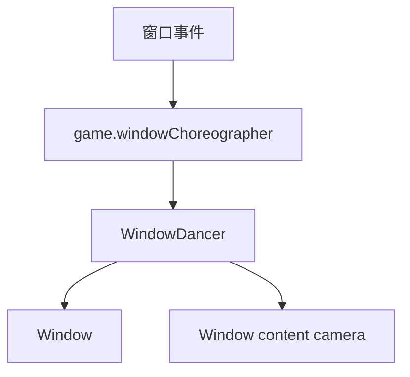

# 窗口控制事件

本页深写 `NewWindowDance`、`WindowResize`、`SetWindowContent`、`HideWindow`、`RenameWindow`、`ReorderWindows` 和 `SetMainWindow`。这些事件都围绕 `scnGame.windowChoreographer`、`WindowDancer` 和 `Window` 工作。

## 事件总览

| 事件 | 事件类 | Inspector 面板 | 主要职责 |
| --- | --- | --- | --- |
| `NewWindowDance` | `LevelEvent_NewWindowDance` | `InspectorPanel_NewWindowDance` | 切换或更新窗口舞蹈 preset |
| `WindowResize` | `LevelEvent_WindowResize` | `InspectorPanel_WindowResize` | 缩放窗口、改变 pivot，并联动窗口内相机 zoom |
| `SetWindowContent` | `LevelEvent_SetWindowContent` | `InspectorPanel_SetWindowContent` | 设置窗口显示 OnTop 或指定房间，并调整窗口内容相机 |
| `HideWindow` | `LevelEvent_HideWindow` | `InspectorPanel_HideWindow` | 显示/隐藏窗口，开发模式下设置透明和无边框 |
| `RenameWindow` | `LevelEvent_RenameWindow` | `InspectorPanel_RenameWindow` | 重置、设置或追加窗口标题 |
| `ReorderWindows` | `LevelEvent_ReorderWindows` | `InspectorPanel_ReorderWindows` | 设置窗口 z-order |
| `SetMainWindow` | `LevelEvent_SetMainWindow` | `InspectorPanel_SetMainWindow` | 指定哪个窗口渲染 UI |

## 共同前提

| 项目 | 内容 |
| --- | --- |
| 执行时机 | 全部是 `OnBar` |
| 房间用法 | 全部是 `RoomsUsage.NotUsed` |
| 窗口索引 | 多数事件使用 `y`；`NewWindowDance` 和 `WindowResize` 在非 Windows 页签时使用 0 |
| 空对象保护 | 多数运行逻辑先检查 `game.windowChoreographer != null` |

## NewWindowDance

| 项目 | 内容 |
| --- | --- |
| 源码 | `RDFucked/Assets/Scripts/Assembly-CSharp/RDLevelEditor/LevelEvent_NewWindowDance.cs` |
| 继承 | `LevelEvent_Base` |
| 接口 | `IDurationHaver` |

### 属性

| 名称 | 类型 | 默认值 | 条件 | 作用 |
| --- | --- | --- | --- | --- |
| `window` | `int` | 计算属性 | 不序列化 | 当前页签不是 `Tab.Windows` 时返回 0，否则返回 `y` |
| `preset` | `WindowDancePreset` | 枚举默认值 | 始终显示 | 舞蹈 preset |
| `samePresetBehavior` | `SamePresetBehavior` | `Reset` | `preset != Move` | 同 preset 再触发时的行为 |
| `position` | `Float2` | `(50, 50)` | 始终显示 | preset 位置参数 |
| `reference` | `ReferenceType` | 枚举默认值 | `preset == Move` | Move preset 的参考点 |
| `speed` | `float` | `0` | Wrap 或 Ellipse 且不是 Keep | 速度，单位 `%/beat` |
| `useCircle` | `bool` | `false` | `preset == Ellipse` | Ellipse 使用圆形参数 |
| `amplitude` | `float?` | `0` | 非向量振幅 preset | 标量振幅百分比 |
| `amplitudeVector` | `Float2` | `(0, 0)` | 向量振幅 preset | X/Y 独立振幅 |
| `angle` | `float?` | `0` | Sway、Ellipse、Wrap | 角度 |
| `frequency` | `float` | `0` | Sway、Wrap、ShakePer 且不是 Keep | 频率，单位 `/beat` |
| `period` | `float` | `0` | ShakePer 且不是 Keep | 周期拍数 |
| `subEase` | `Ease` | `Linear` | Sway 或 ShakePer | 子缓动 |
| `easeType` | `EasingType` | 枚举默认值 | Sway 且不是 Keep | 缓动类型 |
| `easingDuration` | `float` | 代理 `duration` | 始终显示 | 过渡拍数 |
| `ease` | `Ease` | `Linear` | 始终显示 | 过渡缓动 |

### 版本迁移

| 版本条件 | 处理 |
| --- | --- |
| `< 56` 且存在 `usePosition` | 按旧 `PositionType` 决定是否清空 `position` |
| `< 56` | `angle = 90 - angle % 360` |
| `< 56` 且 `preset == Wrap` | `amplitude` 与 `amplitudeVector` 乘以 2 |
| `< 56` 且 `preset == Sway` | `subEase = ease`，`frequency = 1 / easingDuration` |
| `< 56` 且 `preset == ShakePer` | 把旧 `easingDuration` 拆到 `period`，并重算 `frequency` |
| `< 63` 且 `preset == Ellipse` | `speed *= 100` |

### Run

`Run()` 会取 `windowChoreographer.dancers[window]`，把编辑器字段转换为 `WindowDancePresetInfo`，然后调用：

| 步骤 | 调用 |
| --- | --- |
| 切换 preset | `windowDancer.ChangePreset(presetInfo, position.xUsed, position.yUsed, angle.HasValue, usingAmpX, usingAmpY)` |
| 设置 pivot | `windowDancer.SetPivot(Float2.one * 0.5f, referenceType, referenceType, easeDur, ease)` |
| 刷新 preset | `windowDancer.UpdatePreset()` |
| 标记事件触发 | `game.windowDanceEventCalled = true` |

`speed` 和 `frequency` 会除以 `conductor.unscaledCrotchet`；`position` 与 `amplitude` 会从百分比转为 0 到 1；`angle` 会从角度转为弧度。

## WindowResize

| 项目 | 内容 |
| --- | --- |
| 源码 | `RDFucked/Assets/Scripts/Assembly-CSharp/RDLevelEditor/LevelEvent_WindowResize.cs` |
| 继承 | `LevelEvent_Base` |
| 接口 | `IDurationHaver` |

| 名称 | 类型 | 默认值 | 条件 | 作用 |
| --- | --- | --- | --- | --- |
| `window` | `int` | 计算属性 | 不序列化 | 非 Windows 页签时返回 0，否则返回 `y` |
| `scale` | `FloatExpression2?` | `(1, 1)` | 始终显示 | 目标窗口缩放 |
| `zoomMode` | `ZoomMode` | 枚举默认值 | `scale` 启用 | 是否按缩放同步相机 zoom |
| `pivotMode` | `PivotMode` | 枚举默认值 | 始终显示 | pivot 模式 |
| `pivot` | `Float2?` | `(50, 50)` | `pivotMode == Default` | 自定义 pivot |
| `anchorType` | `PivotAnchorType` | `LeftEdge` | `pivotMode == AnchorEdge` | 锚边类型 |
| `duration` | `float` | `1` | 始终显示 | 过渡拍数 |
| `ease` | `Ease` | `Linear` | 始终显示 | 缓动 |

`Decode()` 在旧数据存在 `scale` 但没有 `zoomMode` 时，把 `zoomMode` 设为 `None`。

`Run()` 会把 `scale` 表达式通过 `UnboxToFloat2(level)` 求值，再把 X/Y 限制到不超过 2。之后调用 `windowDancer.SetScale()`。当 `zoomMode != None` 时，`Fill` 使用 X/Y 中较大值，另一种模式使用较小值，再调用 `SetCamZoom(num * 100f)`。

`pivotMode == Default` 且 `pivot` 存在时，会调用 `windowDancer.SetPivot(pivot / 100f, Center, Center, easeDur, ease)`。执行缩放或 pivot 后调用 `UpdatePreset()`。

## SetWindowContent

| 项目 | 内容 |
| --- | --- |
| 源码 | `RDFucked/Assets/Scripts/Assembly-CSharp/RDLevelEditor/LevelEvent_SetWindowContent.cs` |
| 继承 | `LevelEvent_Base` |

| 名称 | 类型 | 默认值 | 条件 | 作用 |
| --- | --- | --- | --- | --- |
| `window` | `int` | `y` | 不序列化 | 目标窗口 |
| `contentMode` | `WindowContentMode?` | `OnTop` | 始终显示 | 窗口内容来源 |
| `roomIndex` | `int` | `0` | `contentMode == Room` | 目标房间 |
| `position` | `Float2?` | `(50, 50)` | 可关闭 | 内容相机位置 |
| `zoom` | `int?` | `100` | 可关闭 | 内容相机 zoom |
| `angle` | `float?` | `0` | 可关闭 | 内容相机角度 |
| `duration` | `float` | `1` | 任一相机属性启用 | 过渡拍数 |
| `ease` | `Ease` | 枚举默认值 | 任一相机属性启用 | 缓动 |

`Run()` 先根据 `contentMode` 设置窗口内容来源：`OnTop` 对应 `-1`，`Room` 对应 `roomIndex`。随后对目标 `WindowDancer` 调用 `SetCamPosition()`、`SetCamAngle()`、`SetCamZoom()`。

`InspectorPanel_SetWindowContent` 在 `Awake()` 中生成 4 个房间名，并在更新属性时给 `roomIndex` 下拉框设置选项。

## HideWindow

| 项目 | 内容 |
| --- | --- |
| 源码 | `RDFucked/Assets/Scripts/Assembly-CSharp/RDLevelEditor/LevelEvent_HideWindow.cs` |
| 继承 | `LevelEvent_Base` |

| 名称 | 类型 | 默认值 | 条件 | 作用 |
| --- | --- | --- | --- | --- |
| `window` | `int` | `y` | 不序列化 | 目标窗口 |
| `show` | `bool` | `false` | 始终显示 | 调用 `windowDancer.SetVisible(show)` |
| `transparent` | `bool?` | `false` | `RDBase.isAdvanced` | 调用 `window.SetTransparent()` |
| `frameless` | `bool?` | `false` | `RDBase.isAdvanced` | 调用 `window.SetFrameless()` |

## RenameWindow

| 项目 | 内容 |
| --- | --- |
| 源码 | `RDFucked/Assets/Scripts/Assembly-CSharp/RDLevelEditor/LevelEvent_RenameWindow.cs` |
| 继承 | `LevelEvent_Base` |

| 名称 | 类型 | 默认值 | 条件 | 作用 |
| --- | --- | --- | --- | --- |
| `window` | `int` | `y` | 不序列化 | 目标窗口 |
| `action` | `WindowNameAction` | 枚举默认值 | 始终显示 | `Reset`、`Set` 或 `Append` |
| `text` | `string` | 空字符串 | `action != Reset` | 标题文本 |

`Run()` 取得 `windowChoreographer.dancers[window].window` 后执行：

| `action` | 调用 |
| --- | --- |
| `Reset` | `window.ResetTitle()` |
| `Set` | `window.SetTitle(text)` |
| `Append` | `window.SetTitle(text, append: true)` |

## ReorderWindows

| 项目 | 内容 |
| --- | --- |
| 源码 | `RDFucked/Assets/Scripts/Assembly-CSharp/RDLevelEditor/LevelEvent_ReorderWindows.cs` |
| 继承 | `LevelEvent_Base` |

| 名称 | 类型 | 默认值 | 作用 |
| --- | --- | --- | --- |
| `order` | `int[]` | `{ 0, 1, 2, 3 }` | 写入 `windowChoreographer.zOrder` |

`Run()` 只在 `windowChoreographer` 存在时执行。

## SetMainWindow

| 项目 | 内容 |
| --- | --- |
| 源码 | `RDFucked/Assets/Scripts/Assembly-CSharp/RDLevelEditor/LevelEvent_SetMainWindow.cs` |
| 继承 | `LevelEvent_Base` |

| 名称 | 类型 | 作用 |
| --- | --- | --- |
| `window` | `int` | 目标主窗口索引，来自 `y` |
| `description` | `bool` | 用于 Inspector 显示说明文本，不保存业务状态 |

`Run()` 遍历 `windowChoreographer.dancers`，只让目标窗口 `window.shouldRenderUI = true`，其他窗口为 `false`。

## 调用关系

## 使用边界

| 需求 | 事件 |
| --- | --- |
| 做窗口移动、摇摆、环绕等 preset 动作 | `NewWindowDance` |
| 缩放窗口或改变 pivot | `WindowResize` |
| 改变窗口显示哪个房间或 OnTop 内容 | `SetWindowContent` |
| 显示、隐藏、透明或无边框 | `HideWindow` |
| 修改窗口标题 | `RenameWindow` |
| 改变窗口前后顺序 | `ReorderWindows` |
| 指定 UI 渲染所在窗口 | `SetMainWindow` |

