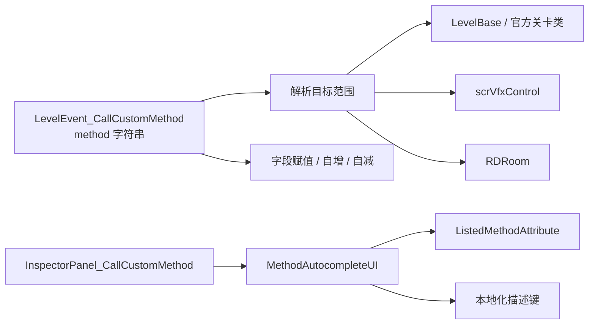

# 自定义方法事件

本页整理 RD 源码中与自定义方法调用相关的入口。它连接编辑器事件 `CallCustomMethod`、方法自动补全、`ListedMethodAttribute` 标记方法、官方关卡脚本方法，以及 Ink 对关卡方法的调用入口。

## 源码位置

| 类型 | 源码路径 | 职责 |
| --- | --- | --- |
| `LevelEvent_CallCustomMethod` | `RDFucked/Assets/Scripts/Assembly-CSharp/RDLevelEditor/LevelEvent_CallCustomMethod.cs` | 编辑器事件，保存自定义方法表达式并在时间线上触发 |
| `InspectorPanel_CallCustomMethod` | `RDFucked/Assets/Scripts/Assembly-CSharp/RDLevelEditor/InspectorPanel_CallCustomMethod.cs` | 自定义方法事件的属性面板，连接输入框和自动补全 |
| `MethodAutocompleteUI` | `RDFucked/Assets/Scripts/Assembly-CSharp/MethodAutocompleteUI.cs` | 读取可列出方法并生成自动补全候选 |
| `ListedMethodAttribute` | `RDFucked/Assets/Scripts/Assembly-CSharp/ListedMethodAttribute.cs` | 标记可在自定义方法 UI 中列出的方法 |
| `RDInk` | `RDFucked/Assets/Scripts/Assembly-CSharp/RDInk.cs` | 绑定 Ink 外部函数 `runLevelMethod` |

## 调用入口

| 入口 | 输入形式 | 目标对象 | 说明 |
| --- | --- | --- | --- |
| `LevelEvent_CallCustomMethod` | `Method()` 或 `level.Method()` | 当前 `LevelBase` 或官方关卡子类实例 | 事件触发时通过反射调用方法 |
| `LevelEvent_CallCustomMethod` | `vfx.Method()` | `scrVfxControl` | 用于触发 VFX 控制对象上的公开实例方法 |
| `LevelEvent_CallCustomMethod` | `room1.Method()` 到 `room4.Method()` | 对应 `RDRoom` | 房间编号从 1 开始写入事件字符串，内部映射到房间数组 |
| `LevelEvent_CallCustomMethod` | `room[0].Method()` 到 `room[3].Method()` | 对应 `RDRoom` | 直接使用数组下标写法 |
| `LevelEvent_CallCustomMethod` | `field = value` | 当前 `LevelBase` 或关卡子类字段 | 设置字段值 |
| `LevelEvent_CallCustomMethod` | `field++`、`field--` | 当前 `LevelBase` 或关卡子类字段 | 对数值字段做自增或自减 |
| `RDInk.runLevelMethod` | 方法名字符串 | 当前 `LevelBase` 或关卡子类实例 | Ink 外部函数，只按名称调用无参方法 |

## 参数解析

`LevelEvent_CallCustomMethod` 在解析参数时按字符串内容转换类型。

| 写法 | 结果类型 | 行为 |
| --- | --- | --- |
| `str:hello` | `string` | 去掉 `str:` 前缀后传入字符串 |
| `"hello"` | `string` | 去掉双引号后传入字符串 |
| `true` | `bool` | 转为 `true` |
| `false` | `bool` | 转为 `false` |
| `1.5` | `float` | 包含小数点时按浮点数读取，失败后走表达式求值 |
| `12` | `int` | 默认按整数读取，失败后走表达式求值 |

字段赋值也使用相同的基础转换规则，并支持 `str:` 前缀写入字符串。

## 自动补全规则

`MethodAutocompleteUI` 通过反射读取候选方法，范围由调用前缀决定。

| 前缀 | 反射类型 | 自动补全来源 |
| --- | --- | --- |
| 无前缀或 `level` | `LevelBase`，以及当前官方关卡子类 | 关卡级方法 |
| `vfx` | `scrVfxControl` | VFX 控制方法 |
| `room` | `RDRoom` | 房间方法 |

自动补全候选还需要满足以下条件：

- 方法是公开实例方法。
- 方法返回值是 `void`。
- 方法声明在当前扫描类型上。
- 参数类型只使用 `int`、`float`、`string`、`bool`。
- 带有 `[ListedMethod]` 的方法会被列出。
- 开发模式下，未带 `[ListedMethod]` 但满足签名规则的方法也会进入候选。

## ListedMethodAttribute

`ListedMethodAttribute` 只用于方法。

| 成员 | 类型 | 默认值 | 作用 |
| --- | --- | --- | --- |
| `showDescription` | `bool` | 构造参数 `hasDesc`，默认 `true` | 控制自动补全 UI 是否查找本地化描述 |
| `ListedMethodAttribute(bool hasDesc = true)` | 构造函数 | `true` | 创建标记并写入 `showDescription` |

`InspectorPanel_CallCustomMethod` 会使用 `customMethod.{scope}.{method}` 作为本地化键读取描述文本。`[ListedMethod(false)]` 会关闭描述显示，但方法仍可作为候选出现。

## LevelBase 方法

以下方法来自 `LevelBase` 中带 `[ListedMethod(true)]` 的公开方法。

| 方法 | 说明 |
| --- | --- |
| `SetMistakeWeightInstant(int row, float weight)` | 立即设置指定行的失误权重 |
| `SetRankMargin(string rankStr, int margin)` | 设置指定评级的分数边界 |
| `CurrentSongVol(float volume = 1f, float duration = 1f)` | 调整当前歌曲音量 |
| `StopSong(float duration)` | 在给定时长内停止当前歌曲 |
| `SetShadowRow(int target, int source)` | 将目标行设置为来源行的影子行 |
| `UnsetShadowRow(int target, int source)` | 解除影子行关系 |
| `SetClumsyRow(int target, int clumsiness)` | 设置目标行的笨拙程度 |
| `SetHandToP1(int room, bool rightHand)` | 将房间手部绑定到玩家 1 |
| `SetHandToP2(int room, bool rightHand)` | 将房间手部绑定到玩家 2 |
| `SetHandToPlayer(int room, bool rightHand)` | 按当前玩家逻辑设置房间手部 |
| `Mistake()` | 触发一次失误 |
| `MistakeSilent()` | 触发一次静默失误 |
| `MistakeOrHeal(float weight = 1f)` | 根据当前状态处理失误或治疗 |
| `MistakeOrHealP1(float weight = 1f)` | 对玩家 1 执行失误或治疗 |
| `MistakeOrHealP2(float weight = 1f)` | 对玩家 2 执行失误或治疗 |
| `MistakeOrHealSilent(float weight = 1f)` | 静默执行失误或治疗 |
| `MistakeOrHealP1Silent(float weight = 1f)` | 对玩家 1 静默执行失误或治疗 |
| `MistakeOrHealP2Silent(float weight = 1f)` | 对玩家 2 静默执行失误或治疗 |
| `Hit()` | 记录正确击打 |
| `HitIncorrect()` | 记录错误击打 |
| `ResetHitHistory()` | 重置所有玩家击打历史 |
| `ResetHitHistoryP1()` | 重置玩家 1 击打历史 |
| `ResetHitHistoryP2()` | 重置玩家 2 击打历史 |
| `OneSongAtATime(bool enabled)` | 控制同时播放歌曲的限制 |
| `ToggleRowReflection(int row, bool enabled)` | 开关指定行倒影 |
| `ToggleRowReflectionRoom(int room, bool enabled)` | 开关指定房间内行倒影 |
| `ToggleRowHitFX(int row, bool on)` | 开关指定行击打特效 |
| `TweenRowPulseBend(int row, int pulse, float amount, float durationBeats, string easeStr)` | 补间调整指定行脉冲弯曲 |
| `TweenOneshotPositionOverride(int row, float overridePosition, float durationBeats, string easeStr)` | 补间调整 Oneshot 位置覆盖值 |
| `TweenOneshotPositionOverrideLerp(int row, float overridePercent, float durationBeats, string easeStr)` | 按百分比补间调整 Oneshot 位置覆盖值 |
| `TweenFloat(int floatID, float val, float durationBeats, string easeStr)` | 补间写入关卡浮点参数 |
| `StopEverything()` | 停止当前关卡运行中的主要活动 |
| `ShowSpotlight(int row, bool playAudio)` | 显示指定行聚光灯 |
| `ExpandSpotlight(float durationBeats)` | 扩展聚光灯 |
| `HideSpotlight()` | 隐藏聚光灯 |
| `StopAllBeats()` | 停止所有节拍 |
| `CrackAllHearts()` | 裂开所有心形状态显示 |
| `UpdateAllHearts()` | 刷新所有心形状态显示 |
| `SetHeartMistakes(int rowID, float mistakes)` | 设置指定行心形失误数 |
| `ShakeRow(int rowID, int amount, float duration)` | 震动指定行 |
| `IgnoreInput(bool disable)` | 控制是否忽略玩家输入 |
| `SetRowLength(int row, int length)` | 立即设置指定行长度 |
| `SetRowLengthTimed(int row, int length, float durationBeats)` | 在指定节拍时长内调整行长度 |
| `StopDialogue()` | 停止当前对话 |
| `StopDialogueInstant()` | 立即停止当前对话 |

## RDRoom 方法

以下方法来自 `RDRoom` 中带 `[ListedMethod(true)]` 的公开方法。

| 方法 | 说明 |
| --- | --- |
| `SetVignetteAlpha(float alpha)` | 设置房间暗角透明度 |
| `EditKaleidoscopeColor(bool primaryColor, string colHex, float durationInBeats, string easeString)` | 调整万花筒主色或副色 |
| `EditKaleidoscopeSpeed(float speed, float durationInBeats, string easeString)` | 调整万花筒速度 |
| `EditKaleidoscopeRate(float rate)` | 调整万花筒速率 |
| `EditKaleidoscopeColors(float r1, float g1, float b1, float r2, float g2, float b2)` | 以 RGB 数值设置万花筒两组颜色 |
| `SyncKaleidoscopes(int otherRoom)` | 将万花筒状态同步到另一个房间 |
| `EditKaleidoscopeRepeat(int repeat)` | 设置万花筒重复数 |
| `EditKaleidoscopeOffset(float offset, float durationBeats, string easeStr)` | 补间调整万花筒偏移 |
| `EditKaleidoscopeRoll(float roll, float durationBeats, string easeStr)` | 补间调整万花筒滚转 |
| `ToggleKaleidoscopeSymmetry(bool enabled)` | 开关万花筒对称 |
| `ColeLight(int index)` | 切换 Cole 房间灯光模式 |
| `CafeLight(int patternID)` | 切换咖啡厅灯光模式 |
| `CafeLightColor(string colHex, float opacity, float durationInBeats)` | 调整咖啡厅灯光颜色和透明度 |
| `CafeDoor(bool open)` | 开关咖啡厅门 |
| `PaigeDoor(bool open)` | 开关 Paige 房间门 |
| `AbandonedDoor(bool open)` | 开关废弃场景门 |
| `AbandonedElevator(bool open)` | 开关废弃场景电梯 |
| `SpaceCloseup(bool enabled)` | 开关太空近景 |
| `SpaceStars(bool enabled)` | 开关太空星星 |
| `SamuraiDoor(bool open, bool instant, bool updateLanterns)` | 控制 Samurai 场景门并按参数更新灯笼 |
| `SamuraiLanterns(bool show, float duration, string easeStr)` | 显示或隐藏 Samurai 灯笼 |
| `SamuraiTransparentBG(bool enabled)` | 开关 Samurai 透明背景 |
| `PhysioEdega(bool show)` | 显示或隐藏 Physio Edega 元素 |
| `PhysioLights(bool on)` | 开关 Physio 灯光 |
| `StadiumBaseballRain(float baseballsPerSecond)` | 设置体育场棒球雨密度 |
| `StadiumLightning(bool showTeam)` | 触发体育场闪电表现 |
| `StadiumGlitchyLights(bool enabled)` | 开关体育场故障灯光 |
| `SetWardScroll(float speed, float durationInBeats, string easeString)` | 调整病房横向滚动速度 |
| `IncrementWardScrollOffset(float xDistance, float durationInBeats, string easeString)` | 增加病房滚动偏移 |
| `SetWardScrollOffsetSmooth(float targetX, float durationInBeats, float accelerationBeats, float decelerationBeats)` | 平滑调整病房滚动偏移 |
| `SetWardSeamless(bool seamless)` | 开关病房无缝滚动 |
| `ToggleWardTVs(bool enabled)` | 开关病房电视 |
| `PopBalloons(float percentage)` | 按比例弹出气球 |
| `SetBalloonsSpawnDelay(float delay)` | 设置气球生成延迟 |
| `SetBalloonsSortingOrder(int layer, int order)` | 设置气球排序层和顺序 |
| `FlowingDiamonds(float arc, float direction)` | 控制流动钻石轨迹 |
| `SpawnParticle(string particleName, float x, float y, float scale)` | 在房间中生成指定粒子 |
| `DarkenedRollerdisco(bool night)` | 切换 Rollerdisco 暗色状态 |
| `TintRecordsRoom(bool tintForeground, string colorHex, float opacity, float beats, string easeStr)` | 调整唱片房间前景或背景染色 |
| `EnableTypingIan(bool enable)` | 开关 Typing Ian 表现 |
| `ShowBossStageText(float xOffset, float yOffset, string colorHex)` | 显示 Boss 舞台文字 |
| `SetRollerdiscoScrollSpeed(float speed, float durationInBeats, string ease)` | 调整 Rollerdisco 滚动速度 |
| `SetRollerdiscoScrollOffset(float xDistance, float durationInBeats, string ease)` | 调整 Rollerdisco 滚动偏移 |
| `SetEyesVerticalShift(bool isSmall, float speed)` | 设置眼睛垂直移动速度 |
| `SetEyesColor(bool isSmall, bool isOutline, string colorHex, float opacity, float durationInBeats, string easeStr)` | 调整眼睛颜色 |
| `SetEyesBackgroundColor(bool isSmall, string colorHex, float opacity, float durationInBeats, string easeStr)` | 调整眼睛背景颜色 |
| `SetEyesFocus(bool isSmall, float screenX, float screenY, float durationInBeats, string easeStr)` | 将眼睛焦点移动到屏幕坐标 |
| `SetEyesFocusRow(bool isSmall, int rowID)` | 将眼睛焦点移动到指定行 |
| `EyesBlink(bool isSmall, float percent)` | 控制眼睛眨眼百分比 |
| `EyesToggle(bool isSmall, float percent, bool equally)` | 控制眼睛显示比例 |

## 官方关卡方法

以下方法来自官方关卡脚本中带 `[ListedMethod(false)]` 的公开方法。这些方法会出现在对应官方关卡类型的 `level` 范围内。

| 关卡类 | 方法 | 说明 |
| --- | --- | --- |
| `Level_Freezeshot` | `SetAfterimageParams(float pasteSeconds, float fadeSeconds, string colorHex, float size)` | 设置残影粘贴间隔、淡出时间、颜色和大小 |
| `Level_Freezeshot` | `ToggleAfterimages(bool on)` | 开关残影 |
| `Level_DistantDuet` | `SetSkySpeed(float speed, float durBeats, string easeStr)` | 调整天空滚动速度 |
| `Level_DistantDuet` | `ToggleSecondSky(bool on)` | 开关第二层天空 |
| `Level_DistantDuet` | `ToggleGreySky(bool on)` | 开关灰色天空 |
| `Level_CareLess` | `ToggleIconRain(bool toggle)` | 开关图标雨 |
| `Level_CareLess` | `DeactivateIconRain()` | 停用图标雨 |
| `Level_CareLess` | `ToggleIconSpiral(bool toggle)` | 开关图标螺旋 |

## 与事件系统的关系

## 写作进度

本页已经完成自定义方法调用规则和已标注候选方法总览。后续复核会把常用方法拆成更细的源码索引页，补充调用前提、场景状态和与事件页的交叉链接。

