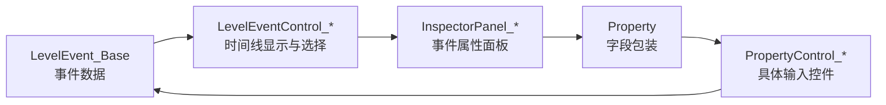

# 编辑器控件索引

本页整理关卡编辑器事件 UI 的三层控件：时间线控件 `LevelEventControl_*`、属性面板 `InspectorPanel_*`、属性字段控件 `PropertyControl_*`。三者共同把 `LevelEvent_Base` 数据显示到编辑器，并把用户输入保存回事件对象。

时间线层的详细说明已经拆到 [时间线与事件控件](/api/editor-events/timeline-controls.md)。本页保留三层结构索引和跨页面入口。

## 三层结构

## LevelEventControl_Base

| 项目 | 内容 |
| --- | --- |
| 源码 | `RDFucked/Assets/Scripts/Assembly-CSharp/RDLevelEditor/LevelEventControl_Base.cs` |
| 命名空间 | `RDLevelEditor` |
| 继承 | `RDEditorBase` |
| 主要职责 | 保存一个时间线控件对应的 `levelEvent`，计算位置、颜色、选中状态、条件标记、标签标记和持续时间条 |

### 关键字段

| 字段 | 类型 | 作用 |
| --- | --- | --- |
| `paletteColor` | `int` | 从 `RDConstants.data.colorPalette` 读取事件基础颜色 |
| `initialColor` | `Color` | 控件初始化后的主色 |
| `image` | `Image` | 时间线事件主体图像 |
| `border` | `Image` | 事件边框图像 |
| `conditional` | `Image` | 条件标记 |
| `tagIndicator` | `Image` | 标签标记 |
| `paletteIndicators` | `GameObject` | 调色板颜色指示容器 |
| `durationBorder` | `Image` | 持续时间外框 |
| `durationFill` | `Image` | 持续时间填充 |
| `selectedAlpha` | `float` | 选中时透明度 |
| `focusedAlpha` | `float` | 聚焦时透明度 |
| `deselectedAlpha` | `float` | 未选中时透明度 |
| `levelEvent` | `LevelEvent_Base` | 当前控件显示和编辑的事件数据 |
| `tabSection` | `TabSection` | 当前控件所在标签区域 |
| `rt` | `RectTransform` | 当前控件的 RectTransform |
| `trigger` | `LevelEventControlEventTrigger` | 鼠标和拖拽事件触发器 |
| `visible` | `bool` | 控件是否显示 |
| `selected` | `bool` | 控件是否处于选中状态 |
| `shouldUpdateUI` | `bool` | 延迟刷新 UI 标记 |
| `showingBorders` | `bool` | 是否显示拖拽边框 |

### 关键属性

| 属性 | 类型 | 作用 |
| --- | --- | --- |
| `tab` | `Tab` | 返回 `tabSection.tab` |
| `bar` | `int` | 读写 `levelEvent.bar` |
| `beat` | `float` | 读写 `levelEvent.beat` |
| `isBase` | `bool` | 判断事件类型是否为 `LevelEventType.None` |
| `rightPosition` | `float` | 控件右边缘 X 坐标 |
| `bottomPosition` | `float` | 控件底部 Y 坐标 |
| `iconSprite` | `Sprite` | 从 `Resources/LevelEventIcons` 读取主图标 |
| `secondaryIconSprite` | `Sprite` | 从 `Resources/LevelEventIcons` 读取副图标 |
| `container` | `List<LevelEventControl_Base>` | 按标签和行号返回控件所在的编辑器列表 |
| `visualRowIndex` | `int` | 在同一房间内计算当前行的视觉索引 |

### 关键方法

| 方法 | 行为 |
| --- | --- |
| `Awake()` | 获取 `Image`、`RectTransform`、触发器，初始化事件颜色 |
| `SaveAndUpdateUI()` | 先保存事件数据，再标记 UI 刷新 |
| `SaveData()` | 单选且编辑器状态允许时调用 `levelEvent.SaveData()` |
| `ShowDataOnInspector()` | 子类事件打开对应 `InspectorPanel`，基础占位事件打开事件选择面板 |
| `UpdateUI()` | 将 `shouldUpdateUI` 置为 `true` |
| `UpdateDurationBar(bool show)` | 对实现 `IDurationHaver` 的事件显示持续时间条 |
| `UpdateUIInternal()` | 刷新选中状态、条件标记、标签标记、调色板颜色指示 |
| `ShowAsSelected(bool notBeingActuallySelected = false)` | 设置选中颜色、边框、节拍附加条，并显示持续时间条 |
| `ShowAsDeselected()` | 设置未选中颜色、边框，并隐藏持续时间条 |
| `GetIconFromName(string levelEventName, bool tryGetPrimary = false)` | 读取事件图标，缺失时回退到 `Default` |
| `ShowBorders(bool show)` | 显示或隐藏左右边框和左上角控件 |
| `OnDelete()` | 删除时扩展点，基类为空实现 |
| `OnDoubleClick()` | 双击时扩展点，基类为空实现 |
| `SnapBeatToGrid()` | 按当前编辑器分母把事件节拍吸附到网格 |
| `SetPosWithSpriteTarget()` | 在 Sprite 标签里按目标精灵所在房间和顺序计算控件位置 |

## 时间线控件类型

| 类型 | 主要用途 |
| --- | --- |
| `LevelEventControl_Action` | 通用动作事件控件，处理视觉图标、背景图、前景图、文字事件联动和双击选择关联文本 |
| `LevelEventControl_AddClassicBeat` | Classic、Oneshot、FreeTime、PulseFreeTime 节拍控件，绘制脉冲、循环、Hold、Skipshot、细分等时间线形状 |
| `LevelEventControl_Room` | 房间标签事件控件 |
| `LevelEventControl_RowAction` | 行标签动作控件 |
| `LevelEventControl_SetRowXs` | 行 X pattern 与节拍修饰控件 |
| `LevelEventControl_ShowRooms` | 显示房间事件控件 |
| `LevelEventControl_Song` | 歌曲标签事件控件 |
| `LevelEventControl_Sprite` | 精灵标签事件控件 |
| `LevelEventControl_Window` | 窗口标签事件控件 |

## InspectorPanel 类型索引

这些类都继承 `InspectorPanel`，类名后缀与事件名建立对应关系。

| 分组 | 面板类型 |
| --- | --- |
| 歌曲与音频 | `InspectorPanel_PlaySong`、`InspectorPanel_SetBeatsPerMinute`、`InspectorPanel_SetCrotchetsPerBar`、`InspectorPanel_SetBeatSound`、`InspectorPanel_SetCountingSound`、`InspectorPanel_SetClapSounds`、`InspectorPanel_PlaySound`、`InspectorPanel_SetGameSound` |
| 行与节拍 | `InspectorPanel_MakeRow`、`InspectorPanel_AddClassicBeat`、`InspectorPanel_AddOneshotBeat`、`InspectorPanel_AddFreeTimeBeat`、`InspectorPanel_PulseFreeTimeBeat`、`InspectorPanel_MoveRow`、`InspectorPanel_HideRow`、`InspectorPanel_ReorderRow`、`InspectorPanel_SetRowXs`、`InspectorPanel_SetOneshotWave`、`InspectorPanel_SpinningRows`、`InspectorPanel_ChangePlayersRows` |
| 视觉与镜头 | `InspectorPanel_SetTheme`、`InspectorPanel_SetVFXPreset`、`InspectorPanel_SetBackgroundColor`、`InspectorPanel_SetForeground`、`InspectorPanel_Flash`、`InspectorPanel_CustomFlash`、`InspectorPanel_MoveCamera`、`InspectorPanel_PulseCamera`、`InspectorPanel_ShakeScreen`、`InspectorPanel_ShakeScreenCustom`、`InspectorPanel_FlipScreen`、`InspectorPanel_InvertColors`、`InspectorPanel_TintRows`、`InspectorPanel_PaintHands`、`InspectorPanel_DesktopColor` |
| 房间与精灵 | `InspectorPanel_ShowRooms`、`InspectorPanel_MoveRoom`、`InspectorPanel_FadeRoom`、`InspectorPanel_MaskRoom`、`InspectorPanel_SetRoomPerspective`、`InspectorPanel_SetRoomContentMode`、`InspectorPanel_ReorderRooms`、`InspectorPanel_MakeSprite`、`InspectorPanel_Move`、`InspectorPanel_SetVisible`、`InspectorPanel_Tint`、`InspectorPanel_Tile`、`InspectorPanel_PlayAnimation`、`InspectorPanel_ReorderSprite`、`InspectorPanel_Blend` |
| 文本与脚本 | `InspectorPanel_ShowDialogue`、`InspectorPanel_AdvanceText`、`InspectorPanel_FloatingText`、`InspectorPanel_ReadNarration`、`InspectorPanel_NarrateRowInfo`、`InspectorPanel_Comment`、`InspectorPanel_CommentShow`、`InspectorPanel_CallCustomMethod`、`InspectorPanel_PlayExpression`、`InspectorPanel_ChangeCharacter`、`InspectorPanel_Stutter`、`InspectorPanel_TagAction`、`InspectorPanel_TextExplosion` |
| 窗口与流程 | `InspectorPanel_NewWindowDance`、`InspectorPanel_SetMainWindow`、`InspectorPanel_RenameWindow`、`InspectorPanel_WindowResize`、`InspectorPanel_HideWindow`、`InspectorPanel_SetWindowContent`、`InspectorPanel_ReorderWindows`、`InspectorPanel_SetPlayStyle`、`InspectorPanel_ShowStatusSign`、`InspectorPanel_FinishLevel`、`InspectorPanel_SayReadyGetSetGo`、`InspectorPanel_BassDrop`、`InspectorPanel_Calibration`、`InspectorPanel_LevelSettings` |

## PropertyControl

| 项目 | 内容 |
| --- | --- |
| 源码 | `RDFucked/Assets/Scripts/Assembly-CSharp/RDLevelEditor/PropertyControl.cs` |
| 命名空间 | `RDLevelEditor` |
| 继承 | `RDBase` |
| 主要职责 | 把一个事件属性包装成具体 UI 控件，提供读取、保存、监听和高度调整接口 |

### 抽象接口

| 方法或属性 | 行为 |
| --- | --- |
| `controlObject` | 返回控件主体对象 |
| `AddListeners(InspectorPanel.ChangeAction action)` | 绑定用户输入变化监听 |
| `Setup()` | 初始化控件 |
| `UpdateUI(LevelEvent_Base levelEvent)` | 从事件对象读取值并显示到控件 |
| `Save(LevelEvent_Base levelEvent)` | 从控件读取值并保存到事件对象 |

### 通用辅助方法

| 方法 | 行为 |
| --- | --- |
| `GetEventValue(LevelEvent_Base levelEvent)` | 通过 `BasePropertyInfo.propertyInfo` 反射读取事件属性值 |
| `SetEventValue(LevelEvent_Base levelEvent, object value)` | 通过反射写入事件属性值 |
| `SetPropertyControlHeight(float height, ...)` | 调整控件和属性行高度，并按参数刷新布局 |
| `SetToggleOnValue(object val)` | 对可空属性更新 Toggle 打开时的默认值 |
| `Create(Property property)` | 根据 `ControlAttribute` 类型选择 `RDConstants.data` 中的 prefab 并实例化 |

## ControlAttribute 到 PropertyControl

`PropertyControl.Create` 使用 `ControlAttribute` 派生类型选择控件 prefab。

| Attribute | 控件类型 |
| --- | --- |
| `DescriptionAttribute` | `PropertyControl_Description` |
| `ButtonAttribute` | `PropertyControl_Button` |
| `InputFieldAttribute` | `PropertyControl_InputField` |
| `ColorAttribute` | `PropertyControl_Color` |
| `DropdownAttribute` | `PropertyControl_Dropdown` |
| `RowAttribute` | `PropertyControl_Row` |
| `CheckboxAttribute` | `PropertyControl_Checkbox` |
| `ToggleGroupAttribute` | `PropertyControl_ToggleGroup` |
| `SliderAttribute` | `PropertyControl_Slider` |
| `SliderAlphaAttribute` | `PropertyControl_SliderAlpha` |
| `SliderPercentAttribute` | `PropertyControl_SliderPercent` |
| `PositionPickerAttribute` | `PropertyControl_PositionPicker` |
| `ExpPositionPickerAttribute` | `PropertyControl_ExpPositionPicker` |
| `CharacterPickerAttribute` | `PropertyControl_CharacterPicker` |
| `HandAttribute` | `PropertyControl_Hand` |
| `SetCountingSound` | `PropertyControl_SetCountingSound` |
| `SetGameSoundAttribute` | `PropertyControl_SetGameSound` |
| `SoundAttribute` | `PropertyControl_Sound` |
| `ImageAttribute` | `PropertyControl_Image` |
| `ReorderRoomsAttribute` | `PropertyControl_ReorderRooms` |
| `ShowRoomsAttribute` | `PropertyControl_ShowRooms` |
| `SetRoomPerspectiveAttribute` | `PropertyControl_SetRoomPerspective` |
| `FlipScreenAttribute` | `PropertyControl_FlipScreen` |
| `PulsePickerAttribute` | `PropertyControl_PulsePicker` |
| `BPMCalculatorAttribute` | `PropertyControl_BPMCalculator` |
| `BeatModifiersAttribute` | `PropertyControl_BeatModifiers` |
| `ShowDialogueAttribute` | `PropertyControl_ShowDialogue` |

## 与现有页面的关系

| 页面 | 关系 |
| --- | --- |
| [LevelEvent_Base](/api/editor-events/LevelEvent_Base.md) | 事件数据来源 |
| [BasePropertyInfo](/api/editor-events/BasePropertyInfo.md) | 字段反射和属性包装来源 |
| [InspectorPanel](/api/editor-events/InspectorPanel.md) | 面板创建、显示、保存和自动控件生成 |
| [Inspector 面板索引与专项行为](/api/editor-events/inspector-panels.md) | `InspectorPanel_*` 子类、空子类、手工面板和字段联动 |
| [时间线与事件控件](/api/editor-events/timeline-controls.md) | `Timeline`、`TabSection`、事件控件、点击创建、拖拽移动和坐标换算 |
| [自定义方法事件](/api/editor-events/custom-methods.md) | `InspectorPanel_CallCustomMethod` 的方法补全与调用规则 |

