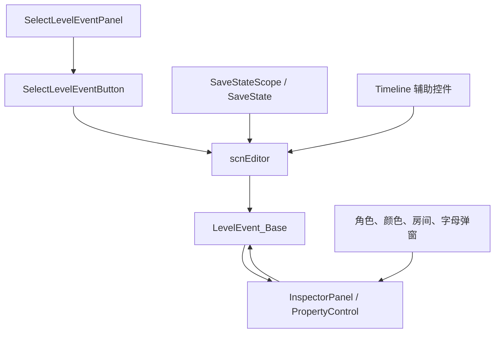

# 编辑器 UI 辅助类

本页补阶段 7 的编辑器 UI 辅助覆盖，集中整理 `RDLevelEditor` 目录中不参与事件运行、但参与事件创建、属性编辑、弹窗选择、时间线交互和保存状态的类。它们把用户操作写回 `scnEditor`、`LevelEvent_Base` 派生对象或对应的属性控件。

## 源码范围

| 类型 | 源码路径 | 职责 |
| --- | --- | --- |
| `BulkSelectPanel` | `RDFucked/Assets/Scripts/Assembly-CSharp/RDLevelEditor/BulkSelectPanel.cs` | 多选事件时批量移动小节、批量写入 tag 和 `tagRunNormally`。 |
| `SelectLevelEventPanel` | `RDFucked/Assets/Scripts/Assembly-CSharp/RDLevelEditor/SelectLevelEventPanel.cs` | 新建事件选择面板，按标签页、分类、房间过滤和快捷键创建事件。 |
| `SelectLevelEventButton` | `RDFucked/Assets/Scripts/Assembly-CSharp/RDLevelEditor/SelectLevelEventButton.cs` | 单个事件类型按钮，显示图标、标签、快捷键和选中状态。 |
| `EventCategory` | `RDFucked/Assets/Scripts/Assembly-CSharp/RDLevelEditor/EventCategory.cs` | 事件选择器分类枚举。 |
| `CharacterButton` | `RDFucked/Assets/Scripts/Assembly-CSharp/RDLevelEditor/CharacterButton.cs` | 角色或表情选择按钮，显示内置角色、自定义角色和特殊角色入口。 |
| `RDCharacterPickerPopup` | `RDFucked/Assets/Scripts/Assembly-CSharp/RDLevelEditor/RDCharacterPickerPopup.cs` | 角色选择弹窗，列出角色、读取自定义角色目录、切换表情页并回写 `CharacterPicker`。 |
| `LetterMovementButton` | `RDFucked/Assets/Scripts/Assembly-CSharp/RDLevelEditor/LetterMovementButton.cs` | 字母运动选择按钮，预览 `LetterMovementType` 的文本效果。 |
| `RDLetterMovementPickerPopup` | `RDFucked/Assets/Scripts/Assembly-CSharp/RDLevelEditor/RDLetterMovementPickerPopup.cs` | 字母运动弹窗，创建按钮并回写 `LetterMovementPicker`。 |
| `EventRoomsTooltip` | `RDFucked/Assets/Scripts/Assembly-CSharp/RDLevelEditor/EventRoomsTooltip.cs` | 事件房间提示图标，按事件房间数组点亮房间或 top 图标。 |
| `RDRoomsSelectionPopup` | `RDFucked/Assets/Scripts/Assembly-CSharp/RDLevelEditor/RDRoomsSelectionPopup.cs` | 房间选择弹窗，支持事件房间和事件选择面板过滤房间两种模式。 |
| `PalettePickerButton` | `RDFucked/Assets/Scripts/Assembly-CSharp/RDLevelEditor/PalettePickerButton.cs` | 调色板按钮，只负责显示色块颜色。 |
| `RDColorPickerPopup` | `RDFucked/Assets/Scripts/Assembly-CSharp/RDLevelEditor/RDColorPickerPopup.cs` | 颜色选择弹窗，处理 hex、RGBA、调色板引用、透明度和画面取色。 |
| `ExpInputField` | `RDFucked/Assets/Scripts/Assembly-CSharp/RDLevelEditor/ExpInputField.cs` | 表达式输入框，允许用 `{}` 包裹表达式并绕过普通数值校验。 |
| `PropertyControl_GameSound` | `RDFucked/Assets/Scripts/Assembly-CSharp/RDLevelEditor/PropertyControl_GameSound.cs` | `SetGameSound` 的单个声音条目控件，切换启用、显示默认文件和 mixer path。 |
| `SoundFieldFileLoader` | `RDFucked/Assets/Scripts/Assembly-CSharp/RDLevelEditor/SoundFieldFileLoader.cs` | 声音字段文件输入 UI，按启用状态显示输入框、浏览按钮和设置按钮。 |
| `SpriteHeader` | `RDFucked/Assets/Scripts/Assembly-CSharp/RDLevelEditor/SpriteHeader.cs` | Sprites 标签页左侧精灵头部，创建精灵、打开 `MakeSprite` Inspector 和显示预览。 |
| `SpritesListScroll` | `RDFucked/Assets/Scripts/Assembly-CSharp/RDLevelEditor/SpritesListScroll.cs` | 精灵列表滚轮转发，把滚动传给时间线竖向滚动。 |
| `TimelineHeightEventTrigger` | `RDFucked/Assets/Scripts/Assembly-CSharp/RDLevelEditor/TimelineHeightEventTrigger.cs` | 时间线高度拖拽控件，修改 `timeline.rowCellCount` 并播放滑条音效。 |
| `tlHorizontalScrollRect` | `RDFucked/Assets/Scripts/Assembly-CSharp/RDLevelEditor/tlHorizontalScrollRect.cs` | 水平滚动区域，按住左 Shift 时把滚轮转发给竖向滚动。 |
| `FollowPlayheadEventTrigger` | `RDFucked/Assets/Scripts/Assembly-CSharp/RDLevelEditor/FollowPlayheadEventTrigger.cs` | 右键点击时调用 `timeline.CenterOnPlayhead()`。 |
| `SnapButtonEventTrigger` | `RDFucked/Assets/Scripts/Assembly-CSharp/RDLevelEditor/SnapButtonEventTrigger.cs` | Snap 按钮点击控件，左键正向切换 snap，右键反向切换。 |
| `TutorialMask` | `RDFucked/Assets/Scripts/Assembly-CSharp/RDLevelEditor/TutorialMask.cs` | 教程遮罩，按矩形边和角阻挡点击，并在有效点击后推进教程。 |
| `UITextUpdater` | `RDFucked/Assets/Scripts/Assembly-CSharp/RDLevelEditor/UITextUpdater.cs` | 监听 `Text` 或 `InputField` 内容变化，并调用 `RDEditorUtils.UpdateUIText()`。 |
| `UpdateUIOnFullRoom` | `RDFucked/Assets/Scripts/Assembly-CSharp/RDLevelEditor/UpdateUIOnFullRoom.cs` | 按房间行数量改变 UI 文本颜色，房间已有 4 行时显示灰色。 |
| `SaveStateScope` | `RDFucked/Assets/Scripts/Assembly-CSharp/RDLevelEditor/SaveStateScope.cs` | `IDisposable` 保存状态作用域，进入时调用 `SaveState()` 并增加 `changingState`。 |
| `SetEditorVersion` | `RDFucked/Assets/Scripts/Assembly-CSharp/RDLevelEditor/SetEditorVersion.cs` | 用 `RDEditorConstants.DisplayVersion` 替换 UI 文本或 TextMesh 中的 `[editor_version]`。 |
| `ExtensionAssociation` | `RDFucked/Assets/Scripts/Assembly-CSharp/RDLevelEditor/ExtensionAssociation.cs` | Windows 下检查命令行 `.rdlevel` 参数并写入文件关联注册表。 |
| `RDBetaLock` | `RDFucked/Assets/Scripts/Assembly-CSharp/RDLevelEditor/RDBetaLock.cs` | Beta 分支下显示对象，非 Beta 分支隐藏对象。 |
| `InspectorPanel_SetHandOwner` | `RDFucked/Assets/Scripts/Assembly-CSharp/RDLevelEditor/InspectorPanel_SetHandOwner.cs` | 空派生 Inspector，用于绑定 `SetHandOwner` 事件的面板 prefab。 |
| `InspectorPanel_SetHeartExplodeInterval` | `RDFucked/Assets/Scripts/Assembly-CSharp/RDLevelEditor/InspectorPanel_SetHeartExplodeInterval.cs` | 空派生 Inspector，用于绑定心脏爆炸间隔事件的面板 prefab。 |
| `InspectorPanel_SetHeartExplodeVolume` | `RDFucked/Assets/Scripts/Assembly-CSharp/RDLevelEditor/InspectorPanel_SetHeartExplodeVolume.cs` | 空派生 Inspector，用于绑定心脏爆炸音量事件的面板 prefab。 |
| `InspectorPanel_ShowHands` | `RDFucked/Assets/Scripts/Assembly-CSharp/RDLevelEditor/InspectorPanel_ShowHands.cs` | `ShowHands` 专项 Inspector，根据 hand 字段调整 action 下拉选项。 |

## 编辑器操作链路

这些类大多继承 `RDEditorBase` 或直接访问 `scnEditor.instance`。共同落点是编辑器状态：创建事件时调用 `SetLevelEventControlType()`，批量编辑时更新 `selectedControls` 中的事件数据，弹窗选择后调用对应 picker 的 `onEndEdit`，时间线辅助则直接调用 `timeline` 或 `editor` 的交互方法。

## 批量选择与事件类型选择

### BulkSelectPanel

| 方法 | 行为 |
| --- | --- |
| `Start()` | 给 `barPlusButton` 和 `barMinusButton` 添加监听，分别调用 `editor.OffsetSelectedEventsByBar(1)` 和 `OffsetSelectedEventsByBar(-1)`。 |
| `Initialize()` | 读取当前多选事件的 tag 和 `tagRunNormally`，计算混合显示状态，设置输入框、占位文本、toggle 和 hover 颜色。 |
| `ShowTagInput(bool)` | 在小节偏移 UI 和 tag UI 之间切换，并写入 `editor.tagFieldMode`。 |
| `UpdateTag(string)` | 遍历 `editor.selectedControls`，把每个事件的 `tag` 改成输入值，并调用 `SaveAndUpdateUI()`。 |
| `UpdateTagRunNormally(bool)` | 运行时且非初始化状态下批量写入 `tagRunNormally`，再刷新事件 UI。 |

`initializing` 用来避免初始化 UI 时触发保存或播放值变化音效。

### SelectLevelEventPanel

`SelectLevelEventPanel.Awake()` 根据 `willDisplayLevelEventsFromTab` 读取对应 `TabSection.availableEvents` 和快捷键，跳过 `RDEditorConstants.hiddenEvents` 中的事件，再实例化 `SelectLevelEventButton`。每个按钮点击后走两条路径：

| 条件 | 行为 |
| --- | --- |
| `NewWindowDance` 位于 Actions 标签页且编辑器不在 filter mode | 调用 `editor.MoveToWindowTab(createWindowDance: true)`。 |
| 其他事件类型 | 清空条件面板当前面板，调用 `editor.SetLevelEventControlType(type, copyRow)`。 |

`OnEnable()` 会按分类、filter mode、房间筛选、grid view 和高级功能状态刷新按钮可见性。Song 和 Actions 标签页的 grid view 状态会写入 `Persistence.SetLevelEditorCollapseSoundEventList()` 或 `Persistence.SetLevelEditorCollapseActionEventList()`。

### 快捷键和分类

| 成员 | 行为 |
| --- | --- |
| `categoriesForTab` | Actions 分为 `Gameplay`、`Environment`、`RowFX`、`CamFX`、`VisualFX`、`Text`、`Utility`；Song 分为 `Song`、`Gameplay`、`Sounds`。 |
| `ShouldUnlistEvent(Tab, LevelEventType)` | 隐藏 hidden event；高级事件在 `RDBase.isAdvanced` 为 false 时隐藏。 |
| `Update()` | 忽略 Ctrl/Alt/Shift 等控制键正在按下的状态；按 `TabSection.shortcuts` 触发事件类型切换。 |
| `ShowRoomsSelectionPopup()` | 打开 `RDRoomsSelectionPopup`，并进入 action event rooms 过滤模式。 |

### SelectLevelEventButton

| 成员或方法 | 行为 |
| --- | --- |
| `selected` | setter 调用 `ShowAsSelected()`。 |
| `ShowAsSelected(bool)` | 切换背景 sprite，更新 label 和 shortcut 颜色。 |
| `SetGridMode(bool)` | grid mode 下隐藏文本，让图标居中；列表模式下恢复整行布局。 |
| `OnPointerEnter` / `OnPointerExit` | grid mode 悬停时把事件名和快捷键写入 `inspectorPanelManager.gridViewLabel`。 |

## 弹窗选择器

### 角色和表情

| 类型 | 关键行为 |
| --- | --- |
| `CharacterButton.Setup()` | 对普通角色创建 `CustomPortrait`，对 `Character.Custom` 读取编辑器自定义角色数据并设置 portrait。 |
| `CharacterButton.SetupSpecial()` | 对 `None`、`New`、`Otto`、`Player`、`BlankCPU` 使用特殊 UI。 |
| `CharacterButton.Select()` | 自定义角色在未保存关卡时提示保存；角色按钮回写 `SelectCharacter()`；表情按钮回写 `SelectExpression()`；`Character.New` 切到自定义输入。 |
| `RDCharacterPickerPopup.ShowCharacters()` | 打开弹窗，扫描 `LevelValidation.CustomCharactersPath` 下的有效自定义角色目录，创建角色按钮。 |
| `RDCharacterPickerPopup.ShowExpressions()` | 按角色或自定义角色的 `CustomAnimationData.clips` 创建表情按钮，并可添加 none 或 new 入口。 |
| `RDCharacterPickerPopup.Update()` | 按 100 BPM 的 `0.6` 秒间隔驱动按钮 portrait 的 beat 预览。 |

`SetCharacterInfo()` 会为联动角色显示来源文本，例如 `Muse Dash`、`Bits & Bops`、`vivid/stasis`、`Circle of Sparks`、`Beatblock`。

### 字母运动

| 类型 | 关键行为 |
| --- | --- |
| `LetterMovementButton.Setup()` | 设置按钮文本和字体，并对 `Shake`、`Wave`、`Swirl` 调用 `LetterMovementController.AddCharIndex()` 显示预览。 |
| `LetterMovementButton.Select()` | 调用 `editor.letterMovementPickerPopup.SelectLetterMovementType()`。 |
| `RDLetterMovementPickerPopup.ShowLetterMovementTypes()` | 打开弹窗，按传入的 `LetterMovementType[]` 创建按钮。 |
| `RDLetterMovementPickerPopup.SelectLetterMovementType()` | 调用 picker 的 `SetLetterMovementType()` 和 `onEndEdit()`，然后隐藏弹窗。 |

### 房间选择

`EventRoomsTooltip.SetRooms(int[])` 先把所有房间图标设为灰色，再按事件房间数组点亮对应房间。数组中出现小于 0 或超出 `roomIcons` 长度的值时，显示 top 图标。

`RDRoomsSelectionPopup` 有两种运行模式：

| 模式 | 数据来源 | 写回目标 |
| --- | --- | --- |
| 事件房间选择 | `levelEvent.rooms` 和 `levelEvent.roomsUsage` | 写回 `levelEvent.rooms`，再调用 `levelEvent.inspectorPanel.UpdateUI(levelEvent)`。 |
| 事件列表房间过滤 | `actionEventPanel.rooms` | 写回 `actionEventPanel.rooms`，再调用 `actionEventPanel.OnEnable()`。 |

`ToggleClicked(int)` 会根据 `RoomsUsage.OneRoom`、`OneRoomOrOnTop`、`ManyRoomsAndOnTop` 和 top 选项处理互斥或多选。`UpdateUI()` 控制 toggle 勾选状态，并按是否允许 top 调整弹窗高度。

### 颜色选择

`RDColorPickerPopup` 连接 `ColorPicker`、`CUIColorPicker`、hex 输入、RGBA 输入、alpha 控件、调色板 toggle 和画面取色。

| 成员或方法 | 行为 |
| --- | --- |
| `paletteIndex` | 返回当前选中的调色板索引，减去第一个“非调色板” toggle。 |
| `usingPaletteColor` | `paletteIndex >= 0`。 |
| `color` | 使用调色板时返回 `palX`；使用 hex 时返回合法 hex；hex 不合法时返回 `lastValidColor`。 |
| `Start()` | 监听 hex 输入和调色板 toggle，切换 `lastValidColor`、边框颜色和 CUI 是否可交互。 |
| `SetResultColorFromRGBAInputs()` | clamp 当前 RGBA 输入到 `0..255`，再写入 `cuiColorPicker.Color`。 |
| `Show(ColorPicker)` | 根据是否保存 alpha 和是否允许调色板调整面板尺寸、输入限制、色块、位置和动画。 |
| `Hide()` | 把最终颜色写回 `colorPicker.color`，调用 `colorPicker.onEndEdit(color)`，播放收起动画。 |
| `SelectUsingCrosshair()` | 暂停编辑器预览，读取 `gameView` 的 `RenderTexture` 到 `textureForCrosshair`，并设置 `pickerUsingCrosshair`。 |

`PalettePickerButton.SetImageColor()` 只负责把调色板颜色写入按钮色块。

## 属性控件补充

| 类型 | 关键行为 |
| --- | --- |
| `ExpInputField` | 继承 `RDInputField`，只允许最前面输入 `{`、最后输入 `}`；当文本以 `{` 开头时跳过普通无效判断。 |
| `PropertyControl_GameSound` | 通过 label 按钮切换 `SoundDataStruct.used`；使用 `RDGameSounds.defaultSounds` 显示默认文件；按声音类型返回 mixer path；外部声音且不是手部 pop 或 mistake 时显示 offset。 |
| `SoundFieldFileLoader` | `ShowLabel()` 控制文件名输入、浏览按钮、设置按钮和 label 颜色；`SetTextFromSoundType()` 用 `GameSoundType` 本地化名和 off 文本更新 label。 |

`PropertyControl_GameSound.GetMixerPath()` 把 mistake、hand pop、heart explosion、hold、freeze、burn、skipshot、holdshot 等声音映射到对应 mixer group，其余声音落到 `GameplaySoundsParent`。

## Sprites 标签页与时间线辅助

### SpriteHeader

| 方法 | 行为 |
| --- | --- |
| `AddButtonClick()` | 创建 `LevelEvent_MakeSprite`，写入当前 sprites tab 页房间，取消事件选择，调用 `editor.AddNewSprite()`，刷新 Sprites 标签页并打开面板。 |
| `ShowButtonClick()` / `Select()` | 打开当前 sprite 的 `InspectorPanel_MakeSprite`。 |
| `ShowPanel(string)` | 设置 `editor.selectedSprite`，查找 `LevelEvent_MakeSprite`，更新 Inspector 和 Sprites 标签页 UI。 |
| `UpdateUI()` | 显示 sprite 序号、短名、预览图、背景、添加按钮和最后使用颜色。 |
| `GetSpriteDataIndex()` / `GetSpriteData()` | 按 sprite header index、page 或 sprite id 查找 `editor.spritesData`。 |

`UpdateUI()` 使用 `CustomAnimationData` 的 `mainTexture`、`rowPreviewFrame`、`rowPreviewOffset`、`spriteSize` 和 `rowPreviewScale` 计算 sprite 预览。

### 时间线辅助

| 类型 | 行为 |
| --- | --- |
| `SpritesListScroll` | `OnScroll()` 调用 `timeline.verticalScrollRect.BaseScroll(data)`。 |
| `TimelineHeightEventTrigger` | 拖拽时用鼠标 Y 差除以 `14` 计算行格数量变化，写入 `timeline.rowCellCount` 并刷新 UI。 |
| `tlHorizontalScrollRect` | 左 Shift 按住时把滚轮交给 `verticalScrollRect.OnScroll()`，否则执行水平滚动。 |
| `FollowPlayheadEventTrigger` | 右键点击调用 `timeline.CenterOnPlayhead()`。 |
| `SnapButtonEventTrigger` | 右键调用 `editor.CycleSnapValues(-1)`，其他点击调用 `CycleSnapValues(1)`。 |

## 教程、文本刷新和房间容量提示

| 类型 | 行为 |
| --- | --- |
| `TutorialMask` | `set()` 按左上和右下边界调整四边遮罩和四角；点击未被遮罩拦截的区域后隐藏对象并调用 `scnEditor.instance.TutorialAdvance()`。 |
| `UITextUpdater` | `Awake()` 查找 `Text` 或 `InputField.textComponent`；`Update()` 检查文本变化并调用 `RDEditorUtils.UpdateUIText()`。 |
| `UpdateUIOnFullRoom` | 统计当前房间的 `LevelEvent_MakeRow` 数量，达到 4 行时把文本设为灰色，否则设为黑色。 |

## 保存、版本和文件关联

| 类型 | 行为 |
| --- | --- |
| `SaveStateScope` | 构造时按参数调用 `editor.SaveState(clearRedo, skipTimelinePos)`，随后 `editor.changingState++`；`Dispose()` 时 `changingState--`。 |
| `SetEditorVersion` | `Start()` 读取 `Text` 或 `TextMesh`，把 `[editor_version]` 替换成 `RDEditorConstants.DisplayVersion`。 |
| `ExtensionAssociation.CheckForFileExtension()` | 扫描命令行参数，返回包含指定扩展名的参数。 |
| `ExtensionAssociation.CheckExtensionAssociation()` | Windows 下写入 `.rdlevel` 文件关联、默认图标、打开命令和版本值，并调用 `SHChangeNotify()`。 |
| `RDBetaLock` | `Awake()` 默认隐藏对象，`GC.onBetaBranch` 为真时显示对象。 |

## 专项 Inspector 派生类

| 类型 | 行为 |
| --- | --- |
| `InspectorPanel_SetHandOwner` | 空派生类，用于 Unity prefab 绑定和类型查找。 |
| `InspectorPanel_SetHeartExplodeInterval` | 空派生类，用于 Unity prefab 绑定和类型查找。 |
| `InspectorPanel_SetHeartExplodeVolume` | 空派生类，用于 Unity prefab 绑定和类型查找。 |
| `InspectorPanel_ShowHands` | 根据 `LevelEvent_ShowHands.hand` 决定 `action` 下拉选项。`Hand.Both` 使用 `Show`、`Hide`、`Raise`、`Lower`；其他手部只使用 `Show`、`Hide`。 |

`InspectorPanel_ShowHands.UpdateUIProperties()` 和 `SaveProperties()` 都会检查 `action` 控件的选项长度，并在保存前保留仍合法的 dropdown value。

## 相关页面

| 页面 | 关系 |
| --- | --- |
| [scnEditor](/api/core/scnEditor.md) | 这些 UI 辅助类的主要编辑器状态来源。 |
| [编辑器控件索引](/api/editor-events/editor-controls.md) | 时间线控件、事件控件和属性字段控件主页面。 |
| [时间线与事件控件](/api/editor-events/timeline-controls.md) | `SelectLevelEventPanel`、事件按钮和时间线行为的上层结构。 |
| [Inspector 面板索引与专项行为](/api/editor-events/inspector-panels.md) | 专项 Inspector 和属性面板体系。 |
| [属性反射与小型模型](/api/data-models/property-reflection-small-models.md) | 属性控件和 Attribute 映射。 |

