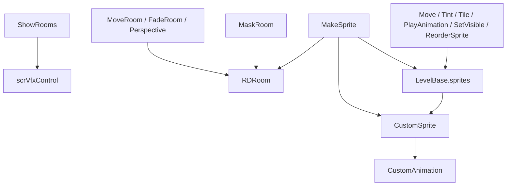

# 房间与精灵事件

本页覆盖房间显示、房间变换、遮罩、透视、房间排序，以及自定义精灵创建、移动、染色、平铺、动画、可见性和排序相关的 `LevelEvent_*`。

## 事件总览

| 事件 | 源码 | 执行时机 | 目标 | 主要作用 |
| --- | --- | --- | --- | --- |
| `LevelEvent_ShowRooms` | `RDLevelEditor/LevelEvent_ShowRooms.cs` | `OnBar` | 多房间 | 显示指定房间并按高度比例重新分配房间布局。 |
| `LevelEvent_MoveRoom` | `RDLevelEditor/LevelEvent_MoveRoom.cs` | `OnBar` | `y` 指向的房间 | 移动、缩放、旋转房间 render quad 和 pivot。 |
| `LevelEvent_ReorderRooms` | `RDLevelEditor/LevelEvent_ReorderRooms.cs` | `OnBar` | 房间数组 | 设置房间 render quad 的 sorting order。 |
| `LevelEvent_SetRoomContentMode` | `RDLevelEditor/LevelEvent_SetRoomContentMode.cs` | `OnBar` | `y` 指向的房间 | 设置房间内容填充模式。 |
| `LevelEvent_MaskRoom` | `RDLevelEditor/LevelEvent_MaskRoom.cs` | `OnBar` | `y` 或 `rooms` | 设置房间图片遮罩、房间遮罩或 chromakey。 |
| `LevelEvent_FadeRoom` | `RDLevelEditor/LevelEvent_FadeRoom.cs` | `OnBar` | `y` 指向的房间 | Tween 房间材质 `_Opacity`。 |
| `LevelEvent_SetRoomPerspective` | `RDLevelEditor/LevelEvent_SetRoomPerspective.cs` | `OnBar` | `y` 指向的房间 | Tween 房间四角透视顶点。 |
| `LevelEvent_MakeSprite` | `RDLevelEditor/LevelEvent_MakeSprite.cs` | `OnPrebar` | 单房间 | 创建 `CustomSprite` 并注册到 `LevelBase.sprites`。 |
| `LevelEvent_Move` | `RDLevelEditor/LevelEvent_Move.cs` | `OnBar` | `target` 精灵 | 移动、缩放、旋转精灵并设置 pivot。 |
| `LevelEvent_Tint` | `RDLevelEditor/LevelEvent_Tint.cs` | `OnBar` | `target` 精灵 | Tween 精灵边框、染色和透明度。 |
| `LevelEvent_Tile` | `RDLevelEditor/LevelEvent_Tile.cs` | `OnBar` | `target` 精灵 | 调整精灵材质 tiling、offset 和滚动速度。 |
| `LevelEvent_PlayAnimation` | `RDLevelEditor/LevelEvent_PlayAnimation.cs` | `OnBar` | `target` 精灵 | 播放精灵表情动画。 |
| `LevelEvent_SetVisible` | `RDLevelEditor/LevelEvent_SetVisible.cs` | `OnBar` | `target` 精灵 | 显示或隐藏精灵 GameObject。 |
| `LevelEvent_ReorderSprite` | `RDLevelEditor/LevelEvent_ReorderSprite.cs` | `OnBar` | `target` 精灵 | 移动精灵到新房间，设置 sorting layer 和 depth。 |

## 房间显示与排序

### ShowRooms

| 项目 | 内容 |
| --- | --- |
| Attribute | `OnBar, RoomsUsage.ManyRooms` |
| 私有字段 | `parameters`、`indexesArray`、`newHeights` |
| 主要对象 | `scrVfxControl` |

| 属性 | 类型 | 默认值 | 作用 |
| --- | --- | --- | --- |
| `heights` | `int[]` | 长度 4 的数组 | 四个房间的目标高度百分比。 |
| `duration` | `float` | `1` | 过渡时长，保存键为 `transitionTime`。 |
| `ease` | `Ease` | `InOutSine` | 房间显示过渡 easing。 |

`Prepare()` 会生成给 `vfx.ShowRooms` 使用的 `parameters` 字符串，并收集要显示的房间索引。`ProcessHeights()` 会把未显示房间高度归零，并把显示房间高度归一化到总和 100%。

`Run()` 中会设置 `vfx.roomsAnimationDuration`，调用 `vfx.ShowRooms(parameters, processedHeights, ease)`，然后让 `game.RepositionRowsAndStrips()` 重排行和条带。

### ReorderRooms

| 属性 | 类型 | 默认值 | 作用 |
| --- | --- | --- | --- |
| `order` | `int[]` | `[0, 1, 2, 3]` | 房间显示顺序。 |

`Run()` 遍历 `order`，把 `game.rooms[num].renderQuad` 的 `Renderer.sortingOrder` 设置为 `4 - i`。

## 房间变换

### MoveRoom

| 项目 | 内容 |
| --- | --- |
| Attribute | `OnBar, RoomsUsage.NotUsed` |
| 目标 | `game.rooms[y]` |
| 主要库 | DOTween |

| 属性 | 类型 | 默认值 | 作用 |
| --- | --- | --- | --- |
| `roomPosition` | `Float2?` | `(50, 50)` | 房间位置百分比，换算为 RD 宽高坐标。 |
| `scale` | `Float2?` | `(100, 100)` | 房间缩放百分比。 |
| `angle` | `float?` | `0` | 房间旋转角度。 |
| `pivot` | `Float2?` | `(50, 50)` | 房间 pivot 百分比。 |
| `duration` | `float` | `1` | 过渡 beat 数。 |
| `ease` | `Ease` | `Linear` | DOTween easing。 |

`Run()` 通过 `RunOnBeat` 操作 `RDRoom.renderQuadPivot` 和 `renderQuad.transform`：

| 属性 | Tween 字段 |
| --- | --- |
| X/Y 位置 | `positionTweenX`、`positionTweenY` |
| X/Y 缩放 | `scaleTweenX`、`scaleTweenY` |
| 角度 | `RDRoom.Rotate(...)` |
| X/Y pivot | 版本大于等于 64 时分别使用 `pivotTweenX`、`pivotTweenY`；旧版本直接 tween transform local position。 |

只要事件实际设置了位置、缩放、角度或 pivot，`RDRoom.customTransform` 会变为真，并设置 `roomMovedByLevelEvent = true`。

### FadeRoom

| 属性 | 类型 | 默认值 | 作用 |
| --- | --- | --- | --- |
| `opacity` | `int` | `100` | 房间透明度百分比，范围 `0` 到 `100`。 |
| `duration` | `float` | `0` | 过渡 beat 数。 |
| `ease` | `Ease` | `Linear` | Tween easing。 |

`Run()` 取得 `game.rooms[y]`，kill 旧的 `opacityTween`，再对 `quadMaterial` 的 `_Opacity` 做 `DOFloat(opacity / 100f)`。

### SetRoomPerspective

| 字段 | 类型 | 默认值 | 作用 |
| --- | --- | --- | --- |
| `cornerPositionsUsed` | `bool[]` | 四个 `true` | 每个角是否参与写入。 |

| 属性 | 类型 | 默认值 | 作用 |
| --- | --- | --- | --- |
| `cornerPositions` | `Float2[]` | 左下、右下、左上、右上四角 | 四个顶点的目标百分比位置。 |
| `duration` | `float` | `1` | 过渡 beat 数。 |
| `ease` | `Ease` | `Linear` | Tween easing。 |

`Run()` 遍历四个角。启用且坐标被使用时，分别 kill `vertexTweensX/Y[i]`，把百分比换算为 `-0.5` 到 `0.5` 的顶点位置，更新 `perspectiveRoomCorners`，并 tween `currentVertexPositions`。有任一顶点变化时调用 `room.UpdateVertices()` 并设置 `customTransform = true`。

## 房间内容与遮罩

### SetRoomContentMode

| 属性 | 类型 | 默认值 | 作用 |
| --- | --- | --- | --- |
| `mode` | `ContentMode` | 默认枚举值 | `Center`、`AspectFill` 或 `Real`。 |

`Run()` 在 beat 上写入 `game.rooms[y].contentMode = mode`。

### MaskRoom

| 项目 | 内容 |
| --- | --- |
| Attribute | `OnBar, RoomsUsage.NotUsed` |
| 目标 | 默认 `y` 指向单房间；当解码到 `rooms` 字段时切换为 `ManyRooms` |

| 属性 | 类型 | 默认值 | 启用条件 |
| --- | --- | --- | --- |
| `maskType` | `MaskType` | 默认枚举值 | 始终显示。 |
| `images` | `string[]` | 空数组 | `maskType == Image`。 |
| `fps` | `float` | `30` | 图片遮罩且多图。 |
| `sourceRoom` | `int` | `0` | `maskType == Room`。 |
| `keyColor` | `ColorOrPalette` | `Color.white` | `maskType == Color`。 |
| `colorCutoff` | `int` | `0` | `maskType == Color`。 |
| `colorFeathering` | `int` | `0` | `maskType == Color`。 |
| `alphaMode` | `AlphaMode` | 默认枚举值 | `maskType != None`。 |

`Prepare()` 将 `images` 加载为 alpha 贴图数组。`Run()` 的分支：

| `maskType` | 行为 |
| --- | --- |
| `Image` | 调用 `RDRoom.ShowMasks(textures, FilterMode.Point, fps)`，启用 mask，关闭 chromakey。 |
| `Room` | 调用 `SetRoomMask(sourceRoom)`，启用 mask，关闭 chromakey。 |
| `Color` | 调用 `SetColorMask(keyColor, cutoff, feathering)`，关闭 mask，启用 chromakey。 |
| `None` | 关闭 mask 和 chromakey。 |

最后调用 `SetMaskAlphaMode(maskType != None && alphaMode == Inverted)`。

## MakeSprite

| 项目 | 内容 |
| --- | --- |
| Attribute | `OnPrebar, sortOffset -10, RoomsUsage.OneRoom, usesBar false, usesBeat false, usesType false, defaultRow 0` |
| 注册表 | `LevelBase.sprites[spriteId] = CustomSprite` |
| 默认资源 | `Resources/DefaultSprite` |

| 字段 | 类型 | 作用 |
| --- | --- | --- |
| `failedLoadingCustomCharacter` | `bool` | 精灵图片或自定义角色加载失败标记。 |
| `customAnimation` | `CustomAnimation` | 创建出的精灵动画组件引用。 |
| `random` | `System.Random` | 生成默认 `spriteId`。 |

| 属性 | 类型 | 默认值 | 作用 |
| --- | --- | --- | --- |
| `visible` | `bool` | `true` | 创建后 GameObject 是否激活。 |
| `preview` | `bool` | `true` | 编辑器预览字段。 |
| `spriteId` | `string` | 随机 7 字符 | 保存和后续事件查找使用的精灵 ID。 |
| `filename` | `string` | 空字符串 | 自定义图片或自定义角色文件名。 |
| `character` | `Character` | `Beans` | 内置角色动画来源。 |
| `depth` | `int` | `1` | 默认 sorting order 写为 `-depth`。 |
| `filter` | `TextureFilter` | 默认枚举值 | 自定义图片纹理 filter。 |

`Init()` 会生成随机 `spriteId` 并设置 `usesY = false`。`Prepare()` 加载自定义角色或图片，创建精灵，播放 `neutral` 表情。

`CreateSprite()` 的关键步骤：

1. 在 `game.rooms[room].spriteContainer` 下实例化 `gc.customSprite`。
2. 设置 `CustomAnimation.data`，内置角色来自 `scrChar.baseCharacterAnimations`，自定义角色来自 `level.customCharacterData[filename]`。
3. 把 `CustomSprite` 注册到 `level.sprites`。
4. 把精灵移动到 RD 画面中心。
5. 设置 active 状态和 `renderer.sortingOrder = -depth`。

自定义图片加载路径会用 `DefaultSprite` 的 JSON 动画数据，并把图片尺寸写入 `CustomAnimationData.spriteSize`。

## 精灵变换

### Move

| 项目 | 内容 |
| --- | --- |
| Attribute | `OnBar, usesTargetId true` |
| 目标 | `LevelBase.sprites[target]` |
| 版本迁移 | 版本低于 65 且 `MakeSprite.character == Beans` 时修正 pivot 坐标 |

| 属性 | 类型 | 默认值 | 作用 |
| --- | --- | --- | --- |
| `spritePosition` | `FloatExpression2?` | `(50, 50)` | 精灵位置百分比表达式。 |
| `scale` | `FloatExpression2?` | `(1, 1)` | 精灵缩放表达式。 |
| `angle` | `FloatExpression?` | `0` | 旋转角度表达式。 |
| `pivot` | `Float2?` | `(50, 50)` | 动画 mesh pivot。 |
| `duration` | `float` | `1` | 过渡 beat 数。 |
| `ease` | `Ease` | `Linear` | Tween easing。 |

`Run()` 找到 `CustomSprite` 后，按已启用的 X/Y 值分别 tween transform 位置、缩放、旋转和 `customAnimation.pivotX/Y`。pivot tween 的 `OnUpdate` 会调用 `customAnimation.UpdateMesh()`。

### ReorderSprite

| 属性 | 类型 | 默认值 | 作用 |
| --- | --- | --- | --- |
| `newRoom` | `RoomSelectType?` | `Room1` | 移动到目标房间的 `spriteContainer`。 |
| `depth` | `int?` | `0` | 设置 sorting order。 |
| `sortingLayerName` | `RDSortingLayer?` | `Default` | 设置 `Default`、`Background` 或 `Foreground` sorting layer。 |

`Run()` 中，`Default` 层的 sorting order 使用 `-depth`，`Background` 和 `Foreground` 层使用正 `depth`。

## 精灵视觉状态

### Tint

| 属性 | 类型 | 默认值 | 作用 |
| --- | --- | --- | --- |
| `border` | `BorderType?` | `None` | 精灵边框类型。 |
| `borderColor` | `ColorOrPalette` | `Color.white` | 边框颜色。 |
| `borderPulse` | `bool?` | `true` | 边框 alpha 是否随音量 pulse。 |
| `borderPulseMin` | `float` | `0.1` | pulse 最小 alpha。 |
| `borderPulseMax` | `float` | `1` | pulse 最大 alpha。 |
| `tint` | `bool?` | `false` | 是否启用 overlay tint。 |
| `tintColor` | `ColorOrPalette` | `Color.white` | overlay tint 颜色。 |
| `opacity` | `int?` | `100` | 精灵透明度。 |
| `duration` | `float` | `0` | 过渡 beat 数。 |
| `ease` | `Ease` | `Linear` | Tween easing。 |

`Encode()` 会在 `borderColor.alpha` 或 `tintColor.alpha` 超出 0 到 1 时追加旧字段 `borderOpacity`、`tintOpacity`。`Decode()` 读取这些旧字段并写回颜色 alpha。

`Run()` 会操作目标精灵材质：

| 属性 | 材质字段 |
| --- | --- |
| 边框类型 | `RDShaderProperties.OutlineID` |
| 边框颜色 | `RDShaderProperties.GlowColorID` |
| 染色颜色 | `RDShaderProperties.OverlayColorID` |
| 透明度 | `RDShaderProperties.OpacityID` |

边框 pulse 开启时会创建 `scrVolumeTracker`，关闭边框时删除旧 tracker。

### SetVisible

| 属性 | 类型 | 默认值 | 作用 |
| --- | --- | --- | --- |
| `visible` | `bool` | `true` | 是否激活目标精灵 GameObject。 |

`Run()` 找到 `level.sprites[target]` 后调用 `gameObject.SetActive(visible)`。

### PlayAnimation

| 属性 | 类型 | 默认值 | 作用 |
| --- | --- | --- | --- |
| `expression` | `string` | 空字符串 | 要播放的表情动画名。 |

`Run()` 调用 `level.sprites[target].PlayExpression(expression)`。Tooltip 会先查 `editor.expression.{expression}` 本地化键，找不到时直接返回表达式字符串。

## 精灵平铺

### Tile

| 项目 | 内容 |
| --- | --- |
| Attribute | `OnBar, usesTargetId true` |
| 目标 | `LevelBase.sprites[target]` |
| 版本迁移 | 版本低于 60 时 `position *= -1` |

| 属性 | 类型 | 默认值 | 作用 |
| --- | --- | --- | --- |
| `tiling` | `Float2?` | `(2, 2)` | 纹理重复数量。 |
| `position` | `Float2?` | `(0, 0)` | tile offset。 |
| `speed` | `Float2?` | `(0, 0)` | tile 滚动速度。 |
| `speedDescription` | `bool` | `false` | Scroll 模式说明 UI。 |
| `pulseDescription` | `bool` | `false` | Pulse 模式说明 UI。 |
| `tilingType` | `TilingType` | 默认枚举值 | `speed` 启用时显示。 |
| `interval` | `float` | `1` | Pulse 模式间隔。 |
| `duration` | `float` | `0` | tween beat 数。 |
| `ease` | `Ease` | `Linear` | tween easing。 |

`Run()` 会保证材质主贴图存在，并在使用 tiling、position 或 speed 时把 wrapMode 设置为 `Repeat`。然后分别 tween `sprite.tileOffset`、`sprite.tileAmount`，并调用 `SetTileSpeedX/Y` 设置滚动。

## 关系图

