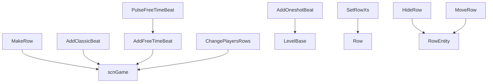

# 行与节拍事件

本页覆盖编辑器中创建行、添加节拍、移动行、隐藏行、修改行节拍修饰、自由节拍和玩家换行相关的 `LevelEvent_*`。

## 事件总览

| 事件 | 源码 | 执行时机 | 行 | 主要作用 |
| --- | --- | --- | --- | --- |
| `LevelEvent_MakeRow` | `RDLevelEditor/LevelEvent_MakeRow.cs` | `OnPrebar` | 默认行 `0` | 创建行实体、角色、玩家归属和行 pulse sound。 |
| `LevelEvent_AddClassicBeat` | `RDLevelEditor/LevelEvent_AddClassicBeat.cs` | `OnPrebar` | 使用行 | 添加 Classic 行普通节拍或长按节拍。 |
| `LevelEvent_AddOneshotBeat` | `RDLevelEditor/LevelEvent_AddOneshotBeat.cs` | `OnPrebar` | 使用行 | 添加 Oneshot 行节拍，支持方块、三角、冻拍、燃拍、跳拍、长按和循环。 |
| `LevelEvent_AddFreeTimeBeat` | `RDLevelEditor/LevelEvent_AddFreeTimeBeat.cs` | `OnPrebar` | 使用行 | 添加自由节拍起点，并聚合后续 pulse 事件。 |
| `LevelEvent_PulseFreeTimeBeat` | `RDLevelEditor/LevelEvent_PulseFreeTimeBeat.cs` | `OnPrebar` | 使用行 | 修改自由节拍 pulse，作为 `AddFreeTimeBeat` 的后续节点。 |
| `LevelEvent_SetRowXs` | `RDLevelEditor/LevelEvent_SetRowXs.cs` | `OnBar` | 使用行 | 设置 X pattern、切分提示和修饰音。 |
| `LevelEvent_SetOneshotWave` | `RDLevelEditor/LevelEvent_SetOneshotWave.cs` | `OnBar` | 使用行 | 设置 Oneshot 波形类型、高度和宽度。 |
| `LevelEvent_HideRow` | `RDLevelEditor/LevelEvent_HideRow.cs` | `OnBar` | 使用行 | 显示、隐藏或部分显示行。 |
| `LevelEvent_MoveRow` | `RDLevelEditor/LevelEvent_MoveRow.cs` | `OnBar` | 使用行 | 移动、缩放、旋转整行、角色或心脏。 |
| `LevelEvent_ChangePlayersRows` | `RDLevelEditor/LevelEvent_ChangePlayersRows.cs` | `OnPrebar` | 不使用 | 批量改变行的玩家归属和 CPU 标记。 |

## MakeRow

| 项目 | 内容 |
| --- | --- |
| Attribute | `OnPrebar, sortOffset -10, RoomsUsage.OneRoom, usesBar false, usesBeat false, usesType false, defaultRow 0` |
| 主要运行对象 | `scnGame.rows`、`Row`、`RowEntity` |
| 特殊保存 | `Encode()` 在 `character == Custom` 时把角色写成 `custom:{customCharacterName}`，并追加 `pulseSound.Encode()` |

### 字段与属性

| 名称 | 类型 | 默认值 | 作用 |
| --- | --- | --- | --- |
| `pulseSound` | `SoundData` | `Shaker` | 行 pulse sound 的运行时声音数据。 |
| `mimicsRow` | `bool` | `false` | 解码时由 `rowToMimic` 是否存在决定。 |
| `customCharacterName` | `string` | `null` | 自定义角色名。 |
| `failedLoadingCustomCharacter` | `bool` | `false` | 自定义角色加载失败标记。 |
| `rowType` | `RowType` | 默认枚举值 | Classic 或 Oneshot 行类型。 |
| `player` | `RDPlayer` | 默认枚举值 | 行所属玩家。 |
| `character` | `Character` | 默认枚举值 | 行角色。 |
| `cpuMarker` | `Character` | `Otto` | CPU 标记角色。 |
| `hideAtStart` | `bool` | `false` | 创建后是否立刻隐藏。 |
| `rowToMimic` | `int` | `0` | 被模仿的行索引。 |
| `muteBeats` | `bool` | `false` | 是否静音该行 beat。 |
| `muteIn1P` | `bool` | `false` | 单人模式下是否静音。 |
| `length` | `int?` | `7` | 行长度；可关闭。 |
| `muted` | `bool` | 计算属性 | `muteBeats` 为真时静音；`muteIn1P` 在非双人模式下静音。 |

### 方法

| 方法 | 行为 |
| --- | --- |
| `Init()` | 初始化 `pulseSound`，并设置 `usesY = false`。 |
| `Prepare()` | 加载自定义角色资源，准备 `pulseSound`，完成后调用 `CreateRow()`。 |
| `CreateRow()` | 调用 `game.MakeRow` 创建行，设置角色、玩家、房间、模仿行、pulse sound 和行长度。 |
| `Decode(Dictionary<string, object> dict)` | 处理 `custom:` 角色字符串，调用基类解码，读取 `pulseSound`，并设置 `mimicsRow`。 |
| `PrepareCustomCharacter(string customCharacterName)` | 预加载自定义角色相关音频文件。 |
| `UpdateCustomCharacter(...)` | 加载自定义角色 PNG、JSON 和可选 outline、glow、freeze 贴图。 |
| `Run()` | 让行实体 `Present`，并按 `hideAtStart` 决定是否隐藏。 |
| `GetRowString(bool shortName = false)` | 返回编辑器行显示名。 |

## AddClassicBeat

| 项目 | 内容 |
| --- | --- |
| Attribute | `OnPrebar, defaultRow 0` |
| 私有字段 | `soundData: SoundData` |
| 协作事件 | 长按且 `setXs != NoChange` 时在 `Prepare()` 中创建 `LevelEvent_SetRowXs` |

| 属性 | 类型 | 默认值 | 作用 |
| --- | --- | --- | --- |
| `tick` | `float` | `1` | 节拍间距。 |
| `swing` | `float` | `0` | Swing 偏移；只在 `hold == 0` 时启用。 |
| `hold` | `float` | `0` | 长按持续 beat 数。 |
| `setXs` | `SetXs` | 默认枚举值 | 长按时生成 X pattern 的方式。 |
| `legacy` | `bool` | 解码设置 | 旧版本 Swing 兼容标记。 |
| `length` | `int?` | `7` | 节拍长度。 |
| `sound` | `SoundDataStruct?` | `Shaker` | 自定义 pulse sound。 |
| `switchToSetRowXs` | `bool` | `false` | UI 按钮，切换当前控件类型为 `SetRowXs`。 |
| `breakIntoFreeTime` | `bool` | `false` | UI 按钮，把 Classic Beat 拆成自由节拍事件。 |

| 方法 | 行为 |
| --- | --- |
| `Validate()` | 限制 `tick >= 0`，并把 `swing` 限制在 `0` 到 `tick * 2`。 |
| `GetLength()` | 返回 `length ?? 7`。 |
| `Prepare()` | 验证参数，准备长按相关内置音效和自定义声音。 |
| `Run()` | 对所有命中的行调用 `game.AddBeat` 或 `game.AddBeatHold`。 |
| `SwitchControlToSetRowXs()` | 保存状态、播放编辑器音效，并调用 `editor.SetLevelEventControlType(LevelEventType.SetRowXs, copyRow: true)`。 |
| `BreakIntoFreeTimeBeats()` | 创建 `AddFreeTimeBeat`、多个 `PulseFreeTimeBeat` 和必要的 `SetRowXs`，再删除当前控件。 |
| `GetOffsetFromSwing(...)` | 旧 Swing 偏移计算。 |
| `GetOffsetFromSwingNew(...)` | 当前 Swing 偏移计算。 |

`Run()` 中会遍历 `game.rows`。只有 `level.RowGetsBeat(row, i, tag)` 返回真且 `level.data.rows[i].muted` 为假时，才给对应行添加节拍。

## AddOneshotBeat

| 项目 | 内容 |
| --- | --- |
| Attribute | `OnPrebar, defaultRow 0` |
| 私有字段 | `soundData`、`_absoluteClapPos` |
| 公共字段 | `boomOffset`、`prebarAudioSrcs` |

### 属性

| 属性 | 类型 | 默认值 | 作用 |
| --- | --- | --- | --- |
| `pulseType` | `OneshotPulseType` | 默认枚举值 | Oneshot pulse 类型。 |
| `freezeBurnMode` | `FreezeBurnMode` | 默认枚举值 | 冻拍或燃拍模式。 |
| `interval` | `float` | `2` | cue 到命中的间隔。 |
| `tick` | `float` | `1` | beat 长度。 |
| `delay` | `float` | `0` | Freezeshot 延迟。 |
| `loops` | `int` | `0` | 循环次数。 |
| `subdivisions` | `int` | `0` | 方块或三角细分数。 |
| `subdivSound` | `bool` | `true` | 是否使用细分音效。 |
| `skipshot` | `bool` | `false` | 是否启用跳拍 cue。 |
| `hold` | `bool` | `false` | 是否生成长按。 |
| `holdCue` | `HoldCueType` | 默认枚举值 | 长按 cue 类型。 |
| `subdivTickOverride` | `float` | `0` | Burnshot 细分 tick 覆盖值。 |
| `sound` | `SoundDataStruct?` | `Shaker` | 自定义 Oneshot sound。 |
| `absoluteClapPos` | `float` | 计算属性 | 按当前小节节拍和 `clapPosition` 换算绝对 beat。 |
| `actualDelay` | `float` | 计算属性 | 仅 Freezeshot 返回 `delay`，其他模式返回 `0`。 |

### 方法

| 方法 | 行为 |
| --- | --- |
| `Validate()` | 修正 loops、delay、tick、interval、subdivisions、subdivTickOverride。 |
| `Prepare()` | 根据冻拍、燃拍、长按调整 `barAndBeat` 和 `boomOffset`，准备声音，并为 loops 动态加入额外 `LevelEvent_AddOneshotBeat`。 |
| `Encode()` | 先 `Validate()` 再调用基类编码。 |
| `Decode(Dictionary<string, object> dict)` | 迁移 `squareSound`；兼容旧版 delay、Burnshot、Skipshot 数据；最后验证参数。 |
| `RunPrebar()` | 为跳拍和细分数拍预先安排 cue 音、spotlight 和 skipshot 动画相关音源。 |
| `Run()` | 对命中的 Oneshot 行调用 `level.AddBeatOneshot`，并处理三角细分、方块细分、长按、跳拍动画。 |
| `CapXPosForPositiveFreezeBurnCueTime()` | 在编辑器中限制位置，保证冻拍或燃拍 cue 时间为正。 |
| `CustomControlName()` | 返回 `AddOneshotBeat`。 |

## AddFreeTimeBeat 与 PulseFreeTimeBeat

### AddFreeTimeBeat

| 项目 | 内容 |
| --- | --- |
| Attribute | `OnPrebar, defaultRow 0` |
| 私有数组 | `pulseBeats`、`pulseReleaseBeats`、`pulseIndexes` |

| 属性 | 类型 | 默认值 | 作用 |
| --- | --- | --- | --- |
| `pulse` | `int` | `0` | 起始 pulse，范围 `0` 到 `6`。 |
| `hold` | `float` | `0` | 起始 pulse 的释放 beat 偏移。 |

`Prepare()` 会从当前事件之后扫描同一行的 `PulseFreeTimeBeat`。扫描到 `Remove`、pulse 达到 `6` 或销毁标记后停止。然后它根据当前拍号计算每个 pulse 的相对 beat 和释放 beat。

`Run()` 把 `pulseBeats` 和 `pulseReleaseBeats` 转成 conductor 时间，并对当前行及其 shadow 行调用 `game.AddBeatFreeFlex`。

### PulseFreeTimeBeat

| 属性 | 类型 | 默认值 | 作用 |
| --- | --- | --- | --- |
| `action` | `PulseAction` | 默认枚举值 | 增加、减少、移除或自定义 pulse。 |
| `hold` | `float` | `0` | 释放 beat 偏移。 |
| `customPulse` | `int` | `0` | `action == Custom` 时使用。 |

`PulseFreeTimeBeat.Run()` 是空实现。它的实际效果由前面的 `AddFreeTimeBeat.Prepare()` 扫描并汇总。

## SetRowXs

| 项目 | 内容 |
| --- | --- |
| Attribute | `OnBar, sortOffset -1, defaultRow 0, constantConditionalsOnly true` |
| 主要运行对象 | `Row` |

| 属性 | 类型 | 默认值 | 作用 |
| --- | --- | --- | --- |
| `pattern` | `string` | `"------"` | X pattern，由 `BeatModifiers` 控件编辑。 |
| `syncoBeat` | `int` | `-1` | 切分提示 beat；`-1` 表示关闭。 |
| `syncoSwing` | `float` | `0` | 切分 swing。 |
| `syncoVolume` | `int` | `70` | 修饰音量百分比。 |
| `syncoPitch` | `int` | `100` | 修饰音 pitch 百分比。 |
| `syncoStyle` | `SyncoStyle` | 默认枚举值 | 切分提示样式。 |
| `syncoPlayModifierSound` | `bool` | `true` | Chirp 开启时播放修饰开启音。 |
| `syncoPlayModifierOffSound` | `bool` | `true` | Chirp 关闭时播放修饰关闭音。 |

| 方法 | 行为 |
| --- | --- |
| `Decode(Dictionary<string, object> dict)` | 兼容版本不高于 57 和 63 的修饰音字段。 |
| `Validate()` | 把 `syncoSwing` 限制在 `0` 到 `1`。 |
| `RunPrebar()` | 为命中的行设置切分参数；Chirp 样式下通过 `RunOnBeat(..., forcePrebar: true)` 播放修饰音。 |
| `Run()` | 设置行的 syncopation aesthetic、beat skips aesthetic 和每个 beatbox 的 `pulseMode`。 |
| `SetModifiers(Row prop)` | 写入 `SetSyncopationCueStyle`、`SetSyncopation`、`SetBeatSkips`。 |
| `CustomControlName()` | 返回 `SetRowXs`。 |

## SetOneshotWave

| 项目 | 内容 |
| --- | --- |
| Attribute | `OnBar, sortOffset -1, defaultRow 0` |
| 主要运行对象 | `RowEntity.oneshotRowController` |

| 属性 | 类型 | 默认值 | 作用 |
| --- | --- | --- | --- |
| `waveType` | `WaveType` | 默认枚举值 | 波形类型，下拉项包含 `BoomAndRush`、`Ball`、`Spring`、`Spike`、`SpikeHuge`、`Single`。 |
| `height` | `int` | `100` | 波形高度百分比。 |
| `width` | `int` | `100` | 波形宽度百分比。 |

`Run()` 通过 `RunOnBeat` 读取 `level.rows[row].ent`，写入 `waveManager.waveType`、`waveHeightMultiplier` 和 `waveWidthMultiplier`。

## HideRow

| 项目 | 内容 |
| --- | --- |
| Attribute | `OnBar, defaultRow 0` |
| 主要运行对象 | `RowEntity` |

| 属性 | 类型 | 默认值 | 作用 |
| --- | --- | --- | --- |
| `show` | `RowVisibilityMode` | `Hidden` | 目标可见状态：可见、只显示行、只显示角色或隐藏。 |
| `transitionType` | `TransitionType` | 默认枚举值 | 过渡方式。 |

`Decode()` 兼容版本低于 17 的布尔 `show` 字段。`Run()` 会在 beat 上执行：

| `show` | 行为 |
| --- | --- |
| `Visible` | 按 `transitionType` 调用 `ent.Show`。 |
| `OnlyRow` | 显示行，隐藏角色。 |
| `OnlyCharacter` | 隐藏行但保持角色可见。 |
| 其他 | 调用 `ent.Hide(keepCharacterVisible: false, effects)`。 |

可见性从隐藏变为显示或反向变化时，会调用 `game.RepositionRowsAndStrips()`；反射行启用时还会更新 reflection 原点。

## MoveRow

| 项目 | 内容 |
| --- | --- |
| Attribute | `OnBar, defaultRow 0` |
| 接口 | `IDurationHaver` |
| 主要库 | DOTween |

| 属性 | 类型 | 默认值 | 作用 |
| --- | --- | --- | --- |
| `rowTarget` | `MoveRowTarget` | 默认枚举值 | 移动目标：整行、角色或心脏。 |
| `customPosition` | `bool` | `true` | 整行是否启用自定义位置。 |
| `offDescription` | `bool` | `false` | UI 描述属性，不保存。 |
| `rowPosition` | `FloatExpression2?` | `(50, 50)` | 目标位置百分比表达式。 |
| `scale` | `FloatExpression2?` | `(1, 1)` | 缩放表达式。 |
| `angle` | `FloatExpression?` | `0` | 旋转角度表达式。 |
| `pivot` | `float?` | `0` | 整行 pivot。 |
| `duration` | `float` | `1` | 过渡 beat 数。 |
| `ease` | `Ease` | `Linear` | DOTween ease。 |
| `accelerationDuration` | `float?` | `0` | 加速时长。 |
| `decelerationDuration` | `float?` | `0` | 减速时长。 |

`Run()` 中的目标对象选择：

| `rowTarget` | Transform |
| --- | --- |
| `WholeRow` | `ent.transform` |
| `Character` | `ent.characterContainer`，缩放时使用 `ent.character.transform` |
| `Heart` | `ent.heartContainer` |

`SetMovingTweens(RowEntity ent)` 会把 beat duration 换算成秒，然后分别创建位置、旋转、缩放、pivot tween。加速时长存在时使用 `VelocityBasedEase` 生成自定义 ease 函数。

## ChangePlayersRows

| 项目 | 内容 |
| --- | --- |
| Attribute | `OnPrebar` |
| 主要运行对象 | `scnGame.ChangeRowPlayers` |

| 属性 | 类型 | 默认值 | 作用 |
| --- | --- | --- | --- |
| `playerMode` | `PlayerMode` | `OneOrTwoPlayers` | 决定按单人还是双人模式处理。 |
| `players` | `RDPlayer[]` | 16 个 `NoChange` | 每行目标玩家。 |
| `cpuMarkers` | `Character[]` | 16 个 `Otto` | 每行 CPU 标记。 |
| `flashingOnBeat` | `bool` | `true` | 是否在 beat 上闪烁提示。 |

`Decode()` 中，如果旧数据没有 `flashingOnBeat`，版本大于等于 25 时设为真；没有 `cpuMarkers` 时全部填 `Character.None`。

`Run()` 通过 `RunOnBeat` 调用 `game.ChangeRowPlayers`。`TaggedActionVariant()` 则调用 `game.ChangeRowPlayersImmediately`，用于标签触发时立即换行。

## 行事件关系图

