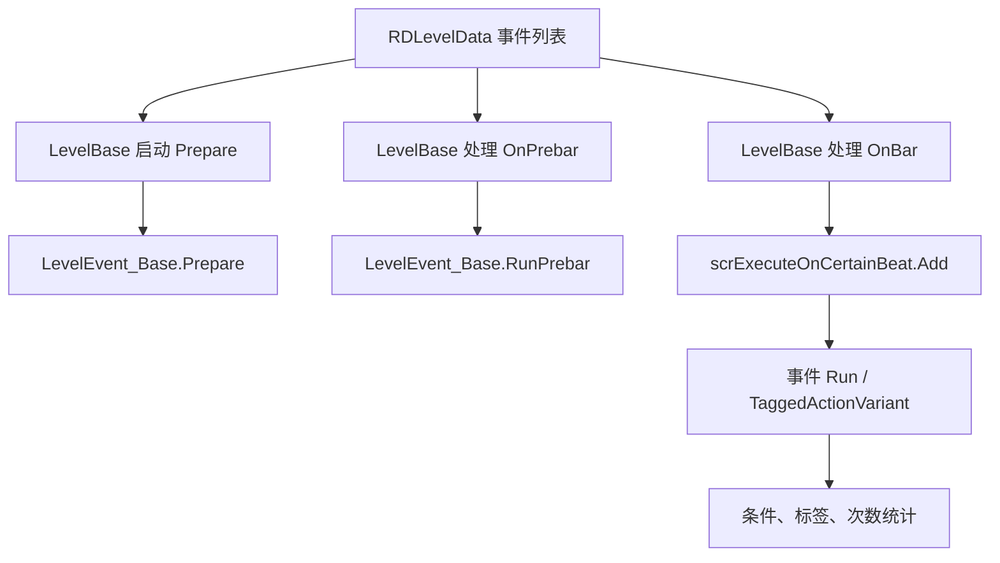

# 事件运行路径

本页记录关卡事件从编辑器数据进入运行时的执行链路，重点覆盖 `LevelEvent_Base`、`LevelBase` 和 `scrExecuteOnCertainBeat` 之间的协作。

## 源码位置

| 类型 | 源码路径 | 职责 |
| --- | --- | --- |
| `LevelEvent_Base` | `RDFucked/Assets/Scripts/Assembly-CSharp/RDLevelEditor/LevelEvent_Base.cs` | 事件公共数据、编码解码、条件、标签、准备与运行入口 |
| `LevelBase` | `RDFucked/Assets/Scripts/Assembly-CSharp/LevelBase.cs` | 运行关卡时读取事件列表、执行预备逻辑、调度事件 |
| `scrExecuteOnCertainBeat` | `RDFucked/Assets/Scripts/Assembly-CSharp/scrExecuteOnCertainBeat.cs` | 按音乐时间执行延迟动作，并处理 Scrub 时的时间追赶 |

## 核心流程

## LevelEvent_Base 运行入口

| 方法 | 默认行为 | 子类用途 |
| --- | --- | --- |
| `Prepare()` | 设置 `prepared = true` 并结束协程 | 预载资源、建立运行前缓存、准备音频或动画对象 |
| `Run()` | 调用 `RDEditorUtils.NotImplemented()` | 事件的主要运行逻辑 |
| `RunPrebar()` | 空实现 | 小节前执行的预备逻辑 |
| `TaggedActionVariant()` | 空实现 | 标签触发时的变体逻辑 |
| `CustomControlName()` | 返回 `null` | 为编辑器控件提供自定义名称 |
| `GetTooltipText()` | 返回 `null` | 为编辑器控件提供提示文本 |

## 执行时机

`LevelEvent_Base.executionTime` 默认是 `LevelEventExecutionTime.OnBar`，构造时会从 `LevelEventInfoAttribute.executionTime` 写入实际值。

| 时机 | 处理路径 | 说明 |
| --- | --- | --- |
| `OnPrebar` | `LevelBase` 直接调用 `RunPrebar()`，并在条件允许时提前执行动作 | 用于需要在小节开始前准备的事件 |
| `OnBar` | `LevelBase` 进入按节拍调度，最终由 `scrExecuteOnCertainBeat` 执行动作 | 用于绝大多数按事件节拍运行的事件 |

`LevelBase` 对第一小节有额外处理：当配置要求第一拍事件在预备小节执行时，会把部分 `beat == 1` 且 `executionTime == OnBar` 的事件改为 `OnPrebar`，`ShowHands` 不走这条改写。

## 条件与标签

| 机制 | 源码行为 |
| --- | --- |
| 本地条件 | `conditionals` 保存条件编号，负数编码代表取反 |
| 全局条件 | `globalConditionals` 保存字符串条件，编码时与本地条件合并 |
| 条件时长 | `conditionalDuration > 0` 时创建 `TimedAction`，把动作、条件和结束时间交给 `game.timedActions` |
| 标签 | `tag` 非空时事件可被标签系统引用 |
| 正常运行标签事件 | `tagRunNormally` 为真时，带标签事件仍按普通时间线运行 |
| 标签变体 | 标签触发路径会先调用 `TaggedActionVariant()`，再按事件逻辑执行动作 |

## scrExecuteOnCertainBeat

`scrExecuteOnCertainBeat.Add` 接收动作、目标节拍、调试文本、是否扣除延迟、是否接近下一小节、事件类型，并返回一个执行器对象。

| 字段或属性 | 类型 | 作用 |
| --- | --- | --- |
| `debugStats` | `string` | 调试文本，也用于按标签清理执行器 |
| `barToExecute` | `int` | 创建执行器时的当前小节 |
| `timeToExecuteFromBarStart` | `float` | 从当前小节起点到执行点的时间 |
| `timeToExecuteAbs` | `double` | 绝对执行时间 |
| `isAudioEvent` | `bool` | 为真时按 `conductor.audioPos` 判断是否到点 |
| `levelEventType` | `LevelEventType` | 当前执行器对应的事件类型 |
| `isReadyToExecute` | `bool` | 当前音频或视觉时间是否超过执行点 |

### 方法

| 方法 | 行为 |
| --- | --- |
| `Update()` | 执行器未移除且到达执行时间时调用 `RunAction()` |
| `Add(...)` | 创建执行器；目标节拍小于 0 时立即执行动作 |
| `Clear(bool execute, string tag = null)` | 清理全部或指定调试文本的执行器，可选择先执行动作 |
| `MoveBackBy(double time, bool andPlay)` | Scrub 回退时移动剩余执行器和 DOTween 动画进度 |
| `RunAction()` | 禁用执行器，调用动作，然后移除自身 |

## Scrub 追赶

`MoveBackBy` 会把未完成的 `scrExecuteOnCertainBeat` 重新排序并调整 `timeToExecuteAbs`。如果调整后执行器已经到点，就立即执行动作。

`ShowDialogue` 有单独处理：执行后调用 `RDInk.mainDialogue.FastForward` 快进对话。其他事件会比较执行前后的 DOTween 播放列表，把新创建的 Tween 按回退时间推进或缓存到 `tweensStillLeftToScrub`。

## 与页面的关系

| 页面 | 关系 |
| --- | --- |
| [LevelEvent_Base](/api/editor-events/LevelEvent_Base.md) | 事件公共字段、编码解码和条件细节 |
| [事件覆盖清单](/api/editor-events/event-coverage.md) | 每个 `LevelEventType` 的页面归属 |
| [编辑器控件索引](/api/editor-events/editor-controls.md) | 事件在编辑器时间线和属性面板中的显示路径 |
| [scrConductor](/api/core/scrConductor.md) | 提供音频时间、视觉时间、节拍到秒的换算 |

