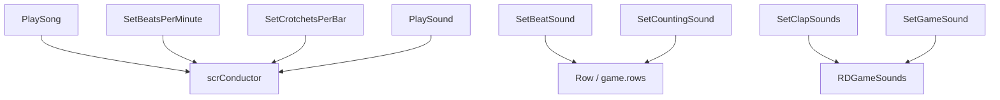

# 歌曲与音频事件

本页覆盖关卡编辑器中直接影响歌曲、BPM、节拍声音、计数声音、拍手声音和全局游戏音效的 `LevelEvent_*`。

## 事件总览

| 事件 | 源码 | 执行时机 | 行 | 主要作用 |
| --- | --- | --- | --- | --- |
| `LevelEvent_PlaySong` | `RDLevelEditor/LevelEvent_PlaySong.cs` | `OnPrebar` | 不使用 | 准备并播放歌曲，同时设置 BPM。 |
| `LevelEvent_SetBeatsPerMinute` | `RDLevelEditor/LevelEvent_SetBeatsPerMinute.cs` | `OnPrebar` | 不使用 | 添加 BPM 变更；在第 1 拍附近立即设置 conductor BPM。 |
| `LevelEvent_SetCrotchetsPerBar` | `RDLevelEditor/LevelEvent_SetCrotchetsPerBar.cs` | `OnPrebar` | 不使用 | 设置每小节 crotchet 数和视觉 beat 倍率。 |
| `LevelEvent_PlaySound` | `RDLevelEditor/LevelEvent_PlaySound.cs` | `OnPrebar` | 不使用 | 在指定 beat 播放自定义音效，支持标签立即播放分支。 |
| `LevelEvent_SetBeatSound` | `RDLevelEditor/LevelEvent_SetBeatSound.cs` | `OnPrebar` | 使用行 | 设置某一行的 pulse sound。 |
| `LevelEvent_SetCountingSound` | `RDLevelEditor/LevelEvent_SetCountingSound.cs` | `OnPrebar` | 使用行 | 设置某一行的数拍声音。 |
| `LevelEvent_SetClapSounds` | `RDLevelEditor/LevelEvent_SetClapSounds.cs` | `OnPrebar` | 不使用 | 设置 Classic 或 Oneshot 行的 P1、P2、CPU 拍手命中音。 |
| `LevelEvent_SetGameSound` | `RDLevelEditor/LevelEvent_SetGameSound.cs` | `OnBar` 或 `OnPrebar` | 不使用 | 替换错误音、手弹出音、爆心音、跳拍音、长按音等游戏音效。 |

## PlaySong

| 项目 | 内容 |
| --- | --- |
| Attribute | `LevelEventExecutionTime.OnPrebar, sortOffset -9, RoomsUsage.NotUsed, usesBeat false` |
| 私有字段 | `songSoundData: SoundData` |
| 主要运行对象 | `scrConductor` |

### 属性

| 属性 | 类型 | 默认值 | 控件 | 作用 |
| --- | --- | --- | --- | --- |
| `song` | `SoundDataStruct` | `sndOrientalTechno` | `Sound` | 歌曲声音数据。 |
| `beatsPerMinute` | `float` | `100` | `BPMCalculator` | 播放歌曲时设置的 BPM。 |
| `loop` | `bool` | `false` | `DontShow` | 传给 `conductor.PlaySong` 的循环参数。 |

### 方法

| 方法 | 行为 |
| --- | --- |
| `Prepare()` | 把 `song` 转成 `SoundData`，等待 `SoundData.Prepare()`，完成后设置 `prepared = true`。 |
| `Decode(Dictionary<string, object> dict)` | 迁移旧版 `song` 字段；按关卡版本调整音量，再写回 `song`。 |
| `Run()` | 通过 `RunOnBeat` 设置 BPM，保存 previous/current song，并调用 `conductor.PlaySong`。 |
| `GetTooltipText()` | 返回文件名、BPM 和声音参数提示。 |

`Decode` 的版本迁移规则：

| 条件 | 音量处理 |
| --- | --- |
| `settings.version < 5` | 音量加 `30`。 |
| `settings.version < 13` | 音量再加 `10`。 |
| `settings.version < 42` 且歌曲是外部音频 | 使用 `(volume - 40) / 0.88` 重新换算。 |

## SetBeatsPerMinute

| 项目 | 内容 |
| --- | --- |
| Attribute | `LevelEventExecutionTime.OnPrebar, sortOffset -9, constantConditionalsOnly true` |
| 主要运行对象 | `scrConductor` |

| 属性 | 类型 | 默认值 | 控件 | 作用 |
| --- | --- | --- | --- | --- |
| `beatsPerMinute` | `float` | `100` | `BPMCalculator` | 新 BPM，范围来自 `FloatInfo(1, 1000)`。 |

| 方法 | 行为 |
| --- | --- |
| `Run()` | 当 `beat` 接近 `1` 时立即调用 `conductor.SetBPM`；始终调用 `conductor.AddBPMChange(beat - 1, beatsPerMinute)`。 |
| `GetTooltipText()` | 返回 `"数值 BPM"`。 |

## SetCrotchetsPerBar

| 项目 | 内容 |
| --- | --- |
| Attribute | `LevelEventExecutionTime.OnPrebar, usesBeat false` |
| 主要运行对象 | `scrConductor` |

| 属性 | 类型 | 默认值 | 作用 |
| --- | --- | --- | --- |
| `crotchetsPerBar` | `int` | `8` | 写入 `conductor.crotchetsPerBar`。 |
| `visualBeatMultiplier` | `float` | `1` | 写入 `conductor.visualBeatLengthMultiplier`。 |

| 方法 | 行为 |
| --- | --- |
| `Run()` | 更新 conductor 的每小节 crotchet 数和视觉 beat 长度倍率。 |
| `GetTooltipText()` | 返回视觉倍率；当 `crotchetsPerBar >= 10` 时同时显示 `{crotchetsPerBar}/4`。 |

## PlaySound

| 项目 | 内容 |
| --- | --- |
| Attribute | `LevelEventExecutionTime.OnPrebar, sortOffset -9` |
| 私有字段 | `soundData: SoundData` |
| 特殊标签方法 | `hasTaggedSpecialMethod` 返回 `true` |

### 属性

| 属性 | 类型 | 默认值 | 控件 | 作用 |
| --- | --- | --- | --- | --- |
| `sound` | `SoundDataStruct` | `Shaker` | `Sound` | 要播放的音效。 |
| `customSoundType` | `CustomSoundType` | `CueSound` | `Dropdown` | 决定 mixer 路径。 |

### 方法

| 方法 | 行为 |
| --- | --- |
| `GetSounds()` | 合并 `BeatSounds`、P1/P2/CPU clap sounds、`PlaySounds`，返回字符串数组。 |
| `EnableIsCustomIf()` | 当 `sound.filename` 是音频文件路径时返回 `true`。 |
| `Decode(Dictionary<string, object> dict)` | 迁移旧版 `sound` 字段后调用基类解码。 |
| `Prepare()` | 把 `sound` 转成 `SoundData` 并准备音频。 |
| `TaggedActionVariant()` | 标签触发时调用 `scrConductor.PlayImmediately` 立即播放。 |
| `Run()` | 计算 `conductor.BeatToTime(beat - 1)`，再调用 `conductor.PlayBeat`。 |
| `GetMixerPath()` | 按 `customSoundType` 返回 `CustomMusicSound`、`CustomBeatSound`、`CustomHitSound`、`CustomOtherSound` 或 `CustomCueSound`。 |
| `PreviewSound()` | 在编辑器中立即预听。 |
| `GetTooltipText()` | 返回本地化名称和声音参数提示。 |

`customSoundType == MusicSound` 时，播放 pitch 会乘上 `RDTime.speed`；其他类型使用 `1`。

## SetBeatSound

| 项目 | 内容 |
| --- | --- |
| Attribute | `LevelEventExecutionTime.OnPrebar, sortOffset -1, defaultRow 0, constantConditionalsOnly true` |
| 私有字段 | `soundData: SoundData` |

| 属性 | 类型 | 默认值 | 控件 | 作用 |
| --- | --- | --- | --- | --- |
| `sound` | `SoundDataStruct` | `Shaker` | `Sound` | 行 pulse sound。 |
| `copyRowButton` | `bool` | `false` | `Button` | UI 按钮，调用 `CopyRowBeatSound`，不参与保存。 |

| 方法 | 行为 |
| --- | --- |
| `GetBeatSounds()` | 从 `RDEditorConstants.BeatSounds` 返回可选声音名。 |
| `CopyRowBeatSound()` | 从 `editor.rowsData[row].pulseSound` 复制声音到当前事件。 |
| `Decode(Dictionary<string, object> dict)` | 迁移旧版 `sound` 字段后调用基类解码。 |
| `Prepare()` | 准备 `soundData`；外部音频或非 `None` 文件会把 `filename` 替换为 `conductorFilename`。 |
| `Run()` | 调用 `game.rows[row].SetPulseSounds(soundData)`。 |
| `PreviewSound()` | 使用 `MixerPath.BeatsoundsRows[row]` 预听。 |
| `GetTooltipText()` | 返回行文本、声音名和声音参数提示。 |

## SetCountingSound

| 项目 | 内容 |
| --- | --- |
| Attribute | `LevelEventExecutionTime.OnPrebar, sortOffset -1, defaultRow 0, constantConditionalsOnly true` |
| 私有字段 | `soundsData: SoundData[]` |

| 属性 | 类型 | 默认值 | 控件 | 作用 |
| --- | --- | --- | --- | --- |
| `enabled` | `bool` | `true` | `ToggleGroup` | 是否启用行数拍声音。 |
| `voiceSource` | `CountingVoiceSource` | `JyiCount` | `Dropdown` | 默认数拍声音来源；仅在 `enabled` 时启用。 |
| `volume` | `int` | `100` | `Slider` | 数拍音量百分比；仅在 `enabled` 时启用。 |
| `subdivOffset` | `float` | `0.5` | `Slider` | Oneshot 行的细分偏移；由 `EnableSubdivOffsetIf` 控制显示。 |
| `sounds` | `SoundDataStruct[]` | 空数组 | `SetCountingSound` | 自定义数拍声音数组；仅 `voiceSource == Custom` 时启用。 |

| 方法 | 行为 |
| --- | --- |
| `IfEnabled()` | 返回 `enabled`。 |
| `EnableSubdivOffsetIf()` | `enabled` 且当前行为 `RowType.Oneshot` 时返回 `true`。 |
| `EnableSoundsIf()` | `enabled` 且 `voiceSource == Custom` 时返回 `true`。 |
| `Prepare()` | 自定义 voice source 时逐个准备 `sounds`；其他来源直接完成。 |
| `Run()` | 写入 `Row.rowCountingVoiceEnabled`、`countingSounds`、`rowCountingVoiceSubdivOffset`，并调用 `Row.SetCountingSounds`。 |
| `ValidateVoiceSource(bool isOneshot)` | Oneshot 行使用 `JyiCount` 时改为 `JyiCountEnglish`。 |
| `GetTooltipText()` | 返回行名、voice source 或关闭文本、音量百分比。 |

## SetClapSounds

| 项目 | 内容 |
| --- | --- |
| Attribute | `LevelEventExecutionTime.OnPrebar, sortOffset -1` |
| 静态默认值 | `p1SoundDefault`、`p2SoundDefault`、`cpuSoundDefault` |
| 私有字段 | `p1SoundData`、`p2SoundData`、`cpuSoundData` |

| 属性 | 类型 | 默认值 | 控件 | 作用 |
| --- | --- | --- | --- | --- |
| `rowType` | `RowType` | 默认枚举值 | `ToggleGroup` | 选择 Classic 或 Oneshot 声音组。 |
| `p1Sound` | `SoundDataStruct?` | `ClapHit` | `Sound` | P1 拍手命中音。 |
| `p2Sound` | `SoundDataStruct?` | `ClapHitP2` | `Sound` + `Off` | P2 拍手命中音。 |
| `cpuSound` | `SoundDataStruct?` | `ClapHitCPU` | `Sound` + `Off` | CPU 拍手命中音。 |

| 方法 | 行为 |
| --- | --- |
| `GetClapSoundsP1()` | 返回 P1、P2、CPU 三组 clap sound 的合并列表，P1 优先。 |
| `GetClapSoundsP2()` | 返回 P2、P1、CPU 三组 clap sound 的合并列表，P2 优先。 |
| `GetClapSoundsCPU()` | 返回 CPU、P1、P2 三组 clap sound 的合并列表，CPU 优先。 |
| `Prepare()` | 分别准备 P1、P2、CPU 的 `SoundData`。 |
| `Decode(Dictionary<string, object> dict)` | 迁移旧字段；处理旧版 `p1Used`、`p2Used`、`cpuUsed`；版本不高于 49 时把 `cpuSound` 设为 `p2Sound`。 |
| `Run()` | 调用 `SetPlayerHitSounds`。 |
| `SetPlayerHitSounds(RowType rowType, SoundData p1Sound, SoundData p2Sound, SoundData cpuSound)` | 按 Classic 或 Oneshot 写入对应 `RDGameSounds`。 |
| `GetTooltipText()` | 返回行类型和已启用声音的名称、音量。 |

## SetGameSound

| 项目 | 内容 |
| --- | --- |
| Attribute | `LevelEventExecutionTime.OnBar, sortOffset -1` |
| 私有字段 | `soundsData: SoundData[]` |
| 主要运行对象 | `RDGameSounds` |

| 属性 | 类型 | 默认值 | 控件 | 作用 |
| --- | --- | --- | --- | --- |
| `soundType` | `GameSoundType` | `SmallMistake` | `Dropdown` | 要替换的游戏音效类型。 |
| `sounds` | `SoundDataStruct[]` | 单个空声音 | `SetGameSound` | 新声音数组，支持分组子类型。 |

### 运行逻辑

`Decode` 兼容旧数据：

| 数据形态 | 处理 |
| --- | --- |
| 包含 `soundSubtypes` | 调用 `RDEditorUtils.DecodeSoundArray` 生成 `soundsData`。 |
| `soundType` 属于 `gameSoundGroups` 子类型 | 找到所在分组，把旧单音效放到分组对应位置，其余设为未使用。 |
| 普通单类型 | 创建单个 `SoundData` 并从旧字段解码。 |

解码后会同步 `sounds` 数组，并按 `soundType` 调整执行时机：

| 条件 | 执行时机 | 排序偏移 |
| --- | --- | --- |
| `soundType` 数值在 `20` 到 `24` 范围 | `OnBar` | `0` |
| 其他类型 | `OnPrebar` | `-10` |

| 方法 | 行为 |
| --- | --- |
| `Init()` | 初始化 `soundsData` 为单个空 `SoundData`。 |
| `Prepare()` | 把每个 `SoundDataStruct` 转成 `SoundData`，设置分组子类型并准备音频。 |
| `Run()` | 对每个启用声音调用 `RDGameSounds.Set`；`OnBar` 类型通过 `RunOnBeat` 调度。 |
| `GetTooltipText()` | 返回 `soundType` 的本地化枚举名。 |
| `CopyFromInternal(LevelEvent_Base levelEvent)` | 复制 `soundType`，并深复制 `soundsData`。 |

## 音频事件关系图

