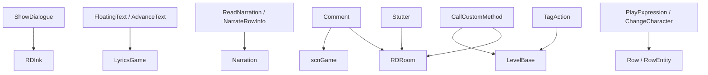

# 文本、旁白与脚本控制事件

本页覆盖对话、浮动文字、旁白、注释、标签运行、自定义方法、角色表情、换角色、Stutter 和结算相关的 `LevelEvent_*`。

## 事件总览

| 事件 | 源码 | 执行时机 | 主要对象 | 主要作用 |
| --- | --- | --- | --- | --- |
| `LevelEvent_ShowDialogue` | `RDLevelEditor/LevelEvent_ShowDialogue.cs` | `OnBar` | `RDInk` | 显示普通文本对话或运行 Ink。 |
| `LevelEvent_FloatingText` | `RDLevelEditor/LevelEvent_FloatingText.cs` | `OnBar` | `scrVfxControl.allLyrics` | 创建歌词式浮动文字。 |
| `LevelEvent_AdvanceText` | `RDLevelEditor/LevelEvent_AdvanceText.cs` | `OnBar` | `LyricsGame` | 推进指定浮动文字的下一行。 |
| `LevelEvent_ReadNarration` | `RDLevelEditor/LevelEvent_ReadNarration.cs` | `OnBar` | `Narration` | 朗读自定义旁白文本。 |
| `LevelEvent_NarrateRowInfo` | `RDLevelEditor/LevelEvent_NarrateRowInfo.cs` | `OnBar` / `OnPrebar` | `Narration`、`Row` | 播放行连接、更新、断开、在线、离线等信息旁白。 |
| `LevelEvent_Comment` | `RDLevelEditor/LevelEvent_Comment.cs` | `OnBar` | Inspector / 多个运行时对象 | 编辑器注释；以 `()=>` 开头时执行内置指令。 |
| `LevelEvent_TagAction` | `RDLevelEditor/LevelEvent_TagAction.cs` | `OnBar` | `LevelBase` | 运行、启用或禁用带标签事件。 |
| `LevelEvent_CallCustomMethod` | `RDLevelEditor/LevelEvent_CallCustomMethod.cs` | 可配置 | `LevelBase`、`scrVfxControl`、`RDRoom` | 通过反射调用方法或读写字段。 |
| `LevelEvent_FinishLevel` | `RDLevelEditor/LevelEvent_FinishLevel.cs` | `OnBar` | `RankScreen` | 进入结算。 |
| `LevelEvent_PlayExpression` | `RDLevelEditor/LevelEvent_PlayExpression.cs` | `OnBar` | `scrChar` | 播放或替换行角色表情。 |
| `LevelEvent_ChangeCharacter` | `RDLevelEditor/LevelEvent_ChangeCharacter.cs` | `OnBar` | `RowEntity` | 切换行角色，支持自定义角色。 |
| `LevelEvent_Stutter` | `RDLevelEditor/LevelEvent_Stutter.cs` | `OnBar` | `scrStutter` | 为房间添加或取消 stutter。 |

## ShowDialogue

| 项目 | 内容 |
| --- | --- |
| Attribute | `OnBar, RoomsUsage.OneRoomOrOnTop` |
| Ink 前缀 | `[[ink:` |
| 默认房间 | `OnCreate()` 设置 `room = 4`；旧数据没有 `rooms` 时解码后也设为 `4` |

| 属性 | 类型 | 默认值 | 作用 |
| --- | --- | --- | --- |
| `text` | `string` | `editor.ShowDialogue.sampleText` | 对话文本或 Ink 指令。 |
| `speed` | `float` | `1` | 保存字段，但在当前运行逻辑中未直接使用。 |
| `localized` | `bool` | `false` | 是否使用多语言文本。 |
| `localizedText` | `Dictionary<string, string>` | 空字典 | 语言名到文本的映射；编码时写为 `text{Language}`。 |
| `panelSide` | `RDInk.PanelSide` | 默认枚举值 | 对话面板侧。 |
| `portraitSide` | `RDInk.PortraitSide` | 默认枚举值 | 头像侧。 |
| `playTextSounds` | `bool` | `true` | 是否启用 Ink 语音源；版本低于 44 时解码为 false。 |

`Prepare()` 的文本资源预处理：

1. 非 Ink 文本下，若 `localized` 为真且当前语言存在文本，则替换 `text`。
2. 按行扫描 `角色名: 文本` 格式。
3. 角色名前缀是图片文件时预加载贴图。
4. 角色名不是内置 `Character` 且尚未在 `customCharacterData` 中时，调用 `LevelEvent_MakeRow.UpdateCustomCharacter` 和 `PrepareCustomCharacter`。

`Run()` 有两条路径：

| 文本形式 | 行为 |
| --- | --- |
| `[[ink:...]]` | 解析 Ink 文件和 knot，设置 panel room、panel side、text sound，并运行 `RDInk.Run` 或 `RunInlineInk`；Active Ink 会调用 `Freeze`。 |
| 普通文本 | 支持 `[[key]]` 本地化和花括号变量，调用 `ink.RunFromText(text, panelSide, portraitSide)`，再按关卡 active dialogue 设置 Freeze。 |

## FloatingText 与 AdvanceText

### FloatingText

| 项目 | 内容 |
| --- | --- |
| Attribute | `OnBar, RoomsUsage.ManyRoomsAndOnTop` |
| ID 管理 | `OnCreate()` 调用 `GenerateNewID()`；复制时保留原 ID |
| 删除联动 | `OnDelete()` 删除同 ID 的 `AdvanceText` 控件 |

| 属性 | 类型 | 默认值 | 作用 |
| --- | --- | --- | --- |
| `id` | `int` | 自动生成 | 浮动文字 ID。 |
| `text` | `string` | `editor.FloatingText.text.example` | 文字内容，支持 `[[key]]` 本地化片段。 |
| `times` | `string` | `null` | 保存字段。 |
| `color` | `ColorOrPalette` | `Color.white` | 文字颜色。 |
| `outlineColor` | `ColorOrPalette` | `Color.black` | 描边颜色。 |
| `textPosition` | `Vector2` | `(50, 50)` | 文字位置百分比。 |
| `font` | `TextFont` | 默认枚举值 | 字体。 |
| `size` | `int` | `8` | 字号。 |
| `angle` | `float` | `0` | 旋转角度。 |
| `showChildren` | `bool` | `true` | 保存字段。 |
| `fadeOutDuration` | `float` | `3` | 淡出 beat 数，保存键为 `fadeOutRate`。 |
| `mode` | `FloatingTextMode` | `FadeOut` | 淡出或立刻隐藏模式。 |
| `anchor` | `TextAnchor` | `MiddleCenter` | 文字锚点。 |
| `narrate` | `bool` | `true` | 是否旁白；版本不高于 50 时解码为 false。 |
| `narrationCategory` | `NarrationCategory` | `Subtitles` | 旁白分类；旧值 `Main` 会迁移为 `Fallback`。 |

`Run()` 中，如果 `vfx.allLyrics` 已经包含同 ID，会 reset 并 advance 已有歌词。否则会为每个目标房间创建一个歌词对象，首个使用事件 ID，后续房间用 `GenerateNewTempId()` 生成临时 ID。

旁白逻辑会拼接 `splitLyrics`，移除 rich text color 标签，解析花括号变量，再调用 `Narration.Say`。

### AdvanceText

| 属性 | 类型 | 默认值 | 作用 |
| --- | --- | --- | --- |
| `id` | `int` | `0` | 要推进的 `FloatingText.id`。 |
| `fadeOutDuration` | `float?` | `null` | 自定义淡出 beat 数；为空时使用对应 `FloatingText.fadeOutDuration`。 |
| `duration` | `float` | 计算属性 | `IDurationHaver` 接口使用。 |
| `floatingText` | `LevelEvent_FloatingText` | 查找结果 | 在编辑器控件列表中寻找同 ID 的 FloatingText。 |

`Run()` 会遍历 `RDLevelData.current.levelEvents` 找到同 ID 的 `FloatingText`，再遍历它的 `currentIds`，对 `vfx.allLyrics` 中的 `LyricsGame` 调用 `AdvanceText(customFadeTime)`。

## 旁白事件

### ReadNarration

| 属性 | 类型 | 默认值 | 作用 |
| --- | --- | --- | --- |
| `text` | `string` | `editor.ReadNarration.exampleText` | 要朗读的文本。 |
| `category` | `NarrationCategory` | `Description` | 旁白分类，下拉项包含 Notification、Description、Subtitles、Instruction。 |

`Run()` 在 scrubbing 或分类关闭时直接返回。文本会按 `|` 分段，形如 `[[key]]` 的段落会先本地化，再移除 rich text color 标签并解析花括号变量，最后在 beat 上调用 `Narration.Say(textToSay, category, false)`。

### NarrateRowInfo

| 项目 | 内容 |
| --- | --- |
| Attribute | `OnBar, sortOffset -1, defaultRow 0` |
| 特殊标签方法 | `hasTaggedSpecialMethod` 返回 `true` |

| 属性 | 类型 | 默认值 | 作用 |
| --- | --- | --- | --- |
| `infoType` | `NarrateInfoType` | 默认枚举值 | Connect、Update、Disconnect、Online、Offline 等信息类型。 |
| `soundOnly` | `bool` | `false` | 只播放提示音。 |
| `narrateSkipBeats` | `NarrateSkipBeats` | 默认枚举值 | 是否朗读跳过 beat。 |
| `skipsUnstable` | `bool` | `false` | 跳过 beat 是否 unstable。 |
| `customPattern` | `string` | `"------"` | 自定义跳过 pattern。 |
| `customPlayer` | `RDPlayer` | `AutoDetect` | 旁白声像玩家来源。 |
| `customRowLength` | `int?` | `7` | 高级选项，行长度。 |

`RunPrebar()` 负责播放提示音，`Run()` 负责在 beat 上调用 `NarrateNow()`。标签触发时，`TaggedActionVariant()` 会立即播放提示音并旁白。

提示音映射：

| `infoType` | 声音 |
| --- | --- |
| `Connect` | `sndPatientConnect` |
| `Update` | `sndPatientUpdate` |
| `Disconnect` | `sndPatientDisconnect` |
| `Online` | `sndOttoActivate` |
| `Offline` | `sndOttoDeactivate` |

## Comment

| 项目 | 内容 |
| --- | --- |
| Attribute | `OnBar, RoomsUsage.NotUsed` |
| 普通用途 | 编辑器注释，可以在播放时显示注释面板 |
| 指令用途 | `text` 以 `()=>` 开头时按内置指令执行 |

| 属性 | 类型 | 默认值 | 作用 |
| --- | --- | --- | --- |
| `text` | `string` | `null` | 注释文本或指令文本。 |
| `color` | `ColorOrPalette` | `colorPalette[10]` | 注释颜色。 |
| `show` | `bool` | `false` | 编辑器播放时是否显示注释。 |

`Encode()` 会根据 `tab != Tab.Sprites` 调整 `usesY`。`GetCommentColors()` 根据背景色明暗决定文本色和描边色。

### Comment 指令

`text` 去掉 `()=>` 后按前缀分发：

| 前缀 | 参数 | 行为 |
| --- | --- | --- |
| `create` | `prefab, x, y` | 从 `Resources/PublicPrefabs/{prefab}` 实例化对象并移动到 RD 坐标。 |
| `freeze` | `unfreeze` 或 `unfreeze, redundant` | 非 scrubbing 时调用 `conductor.Freeze(unfreeze)`。 |
| `unfreeze` | `changeStyle` | 非 scrubbing 时调用 `conductor.SetPlayStyle(changeStyle)`。 |
| `setPlayStyle` | `changeStyle` | 非 scrubbing 时调用 `conductor.SetPlayStyle(changeStyle)`。 |
| `shockwave` | `distortion/duration/size, value` | 设置关卡 shockwave 倍率字段。 |
| `roomOpacity` | `room, opacity, duration` | Tween 房间材质 `_Opacity`。 |
| `wavyRowsAmplitude` | `room, amplitude, duration` | Tween `RDRoom.wavyRowsAmplitude`。 |
| `trueCameraMove` | `room, x, y, duration, ease` | Tween 房间 camera parent localPosition。 |
| `windowSize` | `xPercent, yPercent, easeDur` | 调整第一个窗口舞蹈 dancer 的 scale。 |
| `roomPeek` | `room, peekWindowMode[, update]` | 设置 `RDRoom.peekWindowMode`，可立即更新。 |

普通注释显示路径只在 `game.editorMode`、`show == true`、非 scrubbing 且 `editor.commentPlaybackEnabled` 时执行，会打开 `InspectorPanel_CommentShow`。

## 标签与自定义调用

### TagAction

| 属性 | 类型 | 保存键 | 作用 |
| --- | --- | --- | --- |
| `action` | `TagAction` | `Action` | `Run`、`RunAll`、`RunRandom`、`Enable`、`Disable`、`EnableAll`、`DisableAll`。 |
| `tagName` | `string` | `Tag` | 目标标签名，运行前会解析花括号变量。 |

`Run()` 的分支：

| `action` | 行为 |
| --- | --- |
| `Run` | 调用 `level.RunTagWithType(tag, typeToRun)`。 |
| `RunAll` | 调用 `level.RunTagContaining(false, typeToRun, tag)`。 |
| `RunRandom` | 调用 `level.RunRandomTagWithType(tag, typeToRun)`。 |
| `Enable` / `Disable` | 调用 `EnableTag` 或 `DisableTag`。 |
| `EnableAll` / `DisableAll` | 调用 `EnableTagsContaining` 或 `DisableTagsContaining`。 |

对于运行类 action，事件会分别调度非声音和声音两类 tagged event；声音分支使用 `forceMinusLatency`。

### CallCustomMethod

| 项目 | 内容 |
| --- | --- |
| Attribute | `OnBar, RoomsUsage.NotUsed` |
| 反射目标 | `LevelBase`、`scrVfxControl`、`RDRoom` |
| 执行时机 | `levelEventExecution` 写入基类 `executionTime` |

| 属性 | 类型 | 默认值 | 作用 |
| --- | --- | --- | --- |
| `methodName` | `string` | 空字符串 | 方法、字段或操作表达式。 |
| `levelEventExecution` | `LevelEventExecutionTime` | `OnBar` | 事件执行时机。 |
| `sortOffset` | `int` | `0` | 写入 `sortOrderOffset`。 |
| `description` | `bool` | `false` | 高级模式显示帮助说明。 |

`Prepare()` 会先解析花括号变量，再识别目标前缀：

| 前缀 | 目标类型 | 实例 |
| --- | --- | --- |
| `vfx.` | `scrVfxControl` | `base.vfx` |
| `level.` | 当前 `LevelBase` 类型 | `LevelBase.level` |
| `room[0].` 到 `room[3].` | `RDRoom` | `game.rooms[0..3]` |
| `room1.` 到 `room4.` | `RDRoom` | `game.rooms[0..3]` |
| 无前缀 | 当前 `LevelBase` 类型 | `LevelBase.level` |

表达式形式：

| 形式 | 行为 |
| --- | --- |
| `Method()` 或 `Method(arg1,arg2)` | 查找方法并在 `Run()` 中 `Invoke`。 |
| `field = value` | 查找字段并设置值。 |
| `field++` | int 或 float 字段加 1。 |
| `field--` | int 或 float 字段减 1。 |
| `field` | 查找字段但不执行写操作。 |

参数解码规则：

| 文本 | 类型 |
| --- | --- |
| `str:xxx` | 字符串，去掉 `str:`。 |
| `"xxx"` | 字符串，去掉引号。 |
| 包含 `true` | `bool true`。 |
| 包含 `false` | `bool false`。 |
| 包含 `.` | float，失败时用 `EvalStringWithVariables`。 |
| 其他 | int，失败时用 `EvalStringWithVariables`。 |

执行结束后，如果编辑器存在，会调用 `editor.ipm.UpdateBlankPanel()`。

## 结束与行角色

### FinishLevel

`Run()` 通过 `RunOnBeat` 调用 `game.rankscreen.AdvanceGameover()`。页面中的 `description` 是 UI 描述属性。

### PlayExpression

| 属性 | 类型 | 默认值 | 作用 |
| --- | --- | --- | --- |
| `expression` | `string` | `neutral` | 要播放的角色表情。 |
| `replace` | `bool` | `false` | 是否替换角色的默认表情字段。 |
| `targetExpression` | `OverrideExpression` | 默认枚举值 | 替换目标：Neutral、Happy、Barely、Missed、Prehit、Beep。 |

`Run()` 会 clamp 行号，取得 `game.rows[row].ent.character`。`replace` 为真时先替换对应动画名；当当前表情正是被替换的旧表情，或 `replace` 为假时，调用 `character.PlayExpression(...)`。启用 `shadowRowsCopyExpressions` 时，会同步 shadow 行。

### ChangeCharacter

| 属性 | 类型 | 默认值 | 作用 |
| --- | --- | --- | --- |
| `character` | `Character` | 默认枚举值 | 目标角色。 |
| `customCharacter` | `string` | 空字符串 | 自定义角色名；`character == Custom` 时启用。 |
| `transition` | `TransitionType` | `Instant` | 是否平滑切换。 |

`Prepare()` 会加载自定义角色。`Run()` 中，普通角色调用 `RowEntity.ChangeCharacter`，自定义角色调用 `ChangeCharacterCustom`。

## Stutter

| 项目 | 内容 |
| --- | --- |
| Attribute | `OnBar, RoomsUsage.ManyRooms` |
| 主要对象 | `game.rooms[room].stutter` |

| 属性 | 类型 | 默认值 | 作用 |
| --- | --- | --- | --- |
| `action` | `StutterAction` | 默认枚举值 | 添加或取消 stutter。 |
| `sourceBeat` | `float` | `1` | 添加 stutter 时的源 beat。 |
| `length` | `float` | `1` | stutter 长度。 |
| `loops` | `int` | `1` | 循环次数。 |

`Validate()` 会把 `sourceBeat` 限制在 `1` 到当前 `beat`，把 `length` 修正为正数，把 `loops` 修正为至少 1。`Prepare()` 启用目标房间的 `stutter` 组件。`Run()` 中，`Add` 调用 `AddStutter(beat - 1, sourceBeat - 1, length, loops)`，`Cancel` 调用 `EndStutterOnBeat(beat - 1)`。

## 关系图

