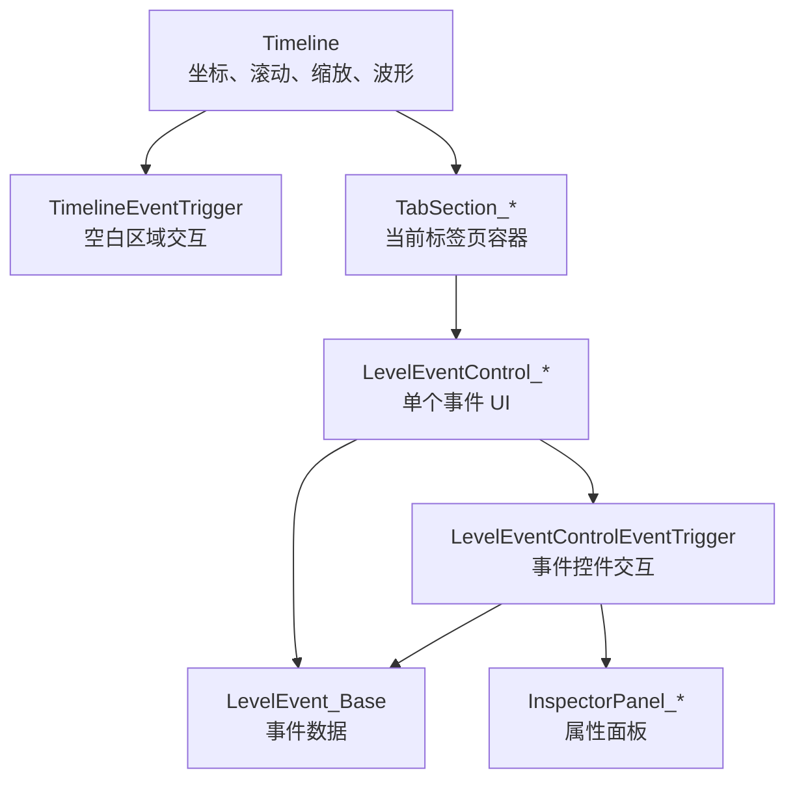
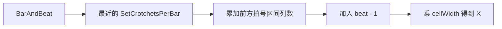
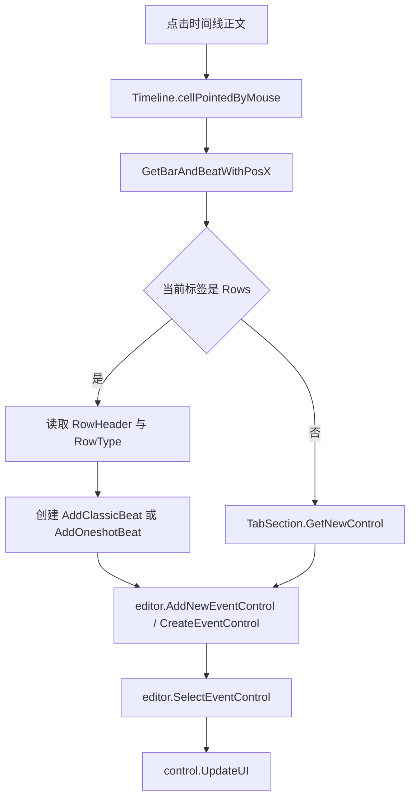
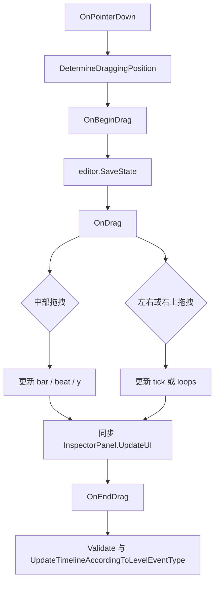

# 时间线与事件控件

本页深写关卡编辑器底部时间线系统。时间线层负责把 `LevelEvent_Base` 显示为可点击、可拖拽、可缩放的 UI 控件，并把鼠标操作转回事件的小节、节拍、行、房间、窗口或精灵目标。

## 源码范围

| 类型 | 源码路径 | 职责 |
| --- | --- | --- |
| `Timeline` | `RDFucked/Assets/Scripts/Assembly-CSharp/RDLevelEditor/Timeline.cs` | 时间线尺寸、缩放、滚动、播放头、书签、波形、网格和坐标换算 |
| `TimelineEventTrigger` | `RDFucked/Assets/Scripts/Assembly-CSharp/RDLevelEditor/TimelineEventTrigger.cs` | 时间线空白区域点击、右键书签、拖拽删除和滚轮跟随控制 |
| `LevelEventControl_Base` | `RDFucked/Assets/Scripts/Assembly-CSharp/RDLevelEditor/LevelEventControl_Base.cs` | 所有事件控件的基类，负责选中状态、图标、条件标记、标签标记和持续时间条 |
| `LevelEventControlEventTrigger` | `RDFucked/Assets/Scripts/Assembly-CSharp/RDLevelEditor/LevelEventControlEventTrigger.cs` | 单个事件控件的点击、选中、多选、启用禁用、拖拽移动和节拍拉伸 |
| `TabSection` | `RDFucked/Assets/Scripts/Assembly-CSharp/RDLevelEditor/TabSection.cs` | 标签页容器、分页、事件控件容器和延迟 UI 刷新 |
| `TabSection_*` | `RDFucked/Assets/Scripts/Assembly-CSharp/RDLevelEditor/TabSection_*.cs` | 歌曲、行、动作、房间、精灵、窗口标签页的专属头部和预览 |
| `LevelEventControl_*` | `RDFucked/Assets/Scripts/Assembly-CSharp/RDLevelEditor/LevelEventControl_*.cs` | 各标签页事件控件的专属显示逻辑 |

## 总体关系

## Timeline 字段

| 字段 | 类型 | 作用 |
| --- | --- | --- |
| `playhead` | `RectTransform` | 底部时间线中的播放头。 |
| `playheadLine` | `RectTransform` | 滚动条区域里的播放头缩略线。 |
| `scrollRect` | `ScrollRect` | 水平滚动主体。 |
| `scrollviewContent` | `RectTransform` | 承载网格、事件控件、波形和书签的横向内容区域。 |
| `scrollViewVertContent` | `RectTransform` | 纵向滚动内容区域。 |
| `verticalScrollRect` | `tlVerticalScrollRect` | 与横向滚动联动的纵向滚动组件。 |
| `wavePrefab` | `GameObject` | 歌曲波形图块 prefab。 |
| `bookmarkPrefab` | `GameObject` | 时间线书签 prefab。 |
| `wavesContainer` | `RectTransform` | 歌曲波形图块父节点。 |
| `numbersContainer` | `Transform` | 小节编号父节点。 |
| `grid` | `Transform` | 时间线主网格 RawImage。 |
| `beatLines` | `Transform` | 节拍线 RawImage。 |
| `cachedBarNumbers` | `List<RectTransform>` | 已创建的小节编号缓存。 |
| `cachedWaveTextures` | `Dictionary<string, Texture>` | 按音频名缓存的波形贴图。 |
| `bookmarks` | `List<tlBookmark>` | 当前时间线书签。 |
| `currentBookmark` | `tlBookmark` | 当前高亮书签。 |
| `followPlayhead` | `bool` | 是否让时间线跟随播放头滚动。 |
| `barColumns` | `List<int>` | 每个小节起点所在列，用于小节编号和坐标换算。 |
| `zoomIndex` | `int` | 横向缩放档位索引。 |
| `zoomVertIndex` | `int` | 纵向缩放档位索引。 |
| `rowCellCount` | `int` | 当前时间线可见行格数。 |
| `selectionBox` | `RectTransform` | Alt 框选时显示的选择框。 |
| `setCrotchetsPerBarEventsTemp` | `List<LevelEvent_SetCrotchetsPerBar>` | 拖拽期间冻结的小节拍号事件副本。 |

## Timeline 属性

| 属性 | 类型 | 作用 |
| --- | --- | --- |
| `scaledRowCellCount` | `int` | 按纵向缩放换算后的可见行数。 |
| `usedRowCount` | `int` | 当前标签页需要显示的行数；行、房间、窗口标签固定使用可见行数，歌曲和动作按事件最大 y 扩展。 |
| `center` | `float` | 当前水平视口中心在内容坐标中的位置。 |
| `centerVert` | `float` | 当前纵向视口中心在内容坐标中的位置。 |
| `height` | `float` | 时间线显示高度。 |
| `width` | `float` | 时间线 RectTransform 宽度。 |
| `cellWidth` | `int` | 单格横向像素，基础值 14 乘以横向缩放。 |
| `cellHeight` | `int` | 单格纵向像素，基础值 14 乘以纵向缩放。 |
| `zoomFactor` | `float` | 当前横向缩放倍率。 |
| `zoomVertFactor` | `float` | 当前纵向缩放倍率。 |
| `MousePositionOnTimeline` | `Vector2` | 鼠标在时间线内容坐标中的位置。 |
| `mouseIsOnNumbers` | `bool` | 鼠标是否位于顶部小节编号区域。 |
| `cellPointedByMouse` | `Int2` | 鼠标指向的列与行索引。 |
| `IsMousePointerCloserToCellOnRight` | `bool` | 鼠标在当前格内是否更靠近右边界。 |
| `setCrotchetsPerBarEvents` | `List<LevelEvent_SetCrotchetsPerBar>` | 按 `sortOrder` 排序后的拍号事件列表，包含默认 1:1 八拍。 |
| `setBeatsPerMinuteEvents` | `List<LevelEvent_SetBeatsPerMinute>` | BPM 事件列表，`PlaySong` 会被转成同位置的 BPM 事件参与排序。 |
| `setBeatModifiersEvents` | `List<LevelEvent_SetRowXs>` | 当前缓存的 `SetRowXs` 修饰事件。 |

## Timeline 方法

| 方法 | 行为 |
| --- | --- |
| `Awake()` | 创建默认 `SetCrotchetsPerBar`，连接纵向滚动、横向滚动和 `TimelineEventTrigger`。 |
| `Setup()` | 为横向和纵向缩放档位创建网格贴图，设置网格颜色，触发第一次 `UpdateUI()`。 |
| `UpdateWhereToGo()` | 按播放头位置计算跟随播放头时的目标横向位置。 |
| `UpdateContentX(float lerpSpeed = 0.8f)` | 用插值移动到 `whereToGo`，接近目标时直接贴合。 |
| `CenterOnPosition(float x, float duration = 0f)` | 把横向视口中心移动到指定内容 X。 |
| `CenterOnVertPosition(float y, float duration = 0f)` | 把纵向视口中心移动到指定内容 Y。 |
| `CenterOnPlayhead()` | 将视口居中到播放头位置。 |
| `ScrollTo(float x, float duration = 0f)` | 限制横向滚动范围，并用 DOTween 设置 `horizontalNormalizedPosition`。 |
| `ScrollToVert(float y, float duration = 0f)` | 限制纵向滚动范围，并用 DOTween 设置纵向 normalized position。 |
| `PreviousPage()` / `NextPage()` | 关闭跟随播放头，并按一个视口宽度向左或向右翻页。 |
| `PreviousBookmark()` / `NextBookmark()` | 在书签列表中选择当前书签左侧或右侧最近的书签。 |
| `SelectBookmark(tlBookmark bookmark)` | 清空其他书签高亮，居中到目标书签并设为当前书签。 |
| `ClearBookmarks()` | 删除所有书签对象和书签线。 |
| `AddBookmark(float xPos)` | 在指定 X 坐标创建书签并加入列表。 |
| `ZoomIn()` / `ZoomOut()` | 调整横向缩放档位，刷新网格、书签和事件控件。 |
| `ZoomVert()` | 在两个纵向缩放档位之间切换。 |
| `CycleExpanded(bool playSound = true)` | 在 4、8、12 行显示高度之间切换。 |
| `MovePlayHead(float pos)` | 移动播放头，并同步滚动条缩略播放头线。 |
| `ToggleFollowPlayhead()` / `UnfollowPlayhead()` | 开关或关闭播放头跟随。 |
| `UpdateMaxUsedY()` | 根据当前标签页事件或精灵头数量计算最大使用行。 |
| `UpdateUI(bool updateControls = true)` | 更新高度、刷新 `SetRowXs` 缓存，并标记下一帧协程刷新。 |
| `UpdateClassicControlsForRow(int row)` | 刷新指定行内所有 `LevelEventControl_AddClassicBeat`。 |
| `GetClosestSetCPBEventWithBar(int bar, List<LevelEvent_SetCrotchetsPerBar> cpbEvents)` | 从拍号事件列表中找出目标小节之前最近的拍号事件。 |
| `GetClosestSetBeatModifiersEventWithRow(int row, BarAndBeat barAndBeat)` | 找出指定行和时间点之前最近的启用状态 `SetRowXs`。 |
| `FixBarAndBeat(BarAndBeat barAndBeat)` | 先转 X 坐标再转回小节节拍，用当前拍号规则规整位置。 |
| `GetPosXFromBarAndBeat(...)` | 将小节节拍换算为时间线 X 坐标。 |
| `GetColumnFromBarAndBeat(...)` | 将小节节拍换算为网格列，不乘 `cellWidth`。 |
| `GetRowIndexWithPosY(int y)` | 将 Y 坐标换算为行索引。 |
| `GetPosYFromRowIndex(int rowIndex)` | 将行索引换算为时间线 Y 坐标。 |
| `GetBarAndBeatWithPosX(float posX, ...)` | 将 X 坐标换算回 `BarAndBeat`。 |
| `GetBarAndBeatWithColumn(float column, List<LevelEvent_SetCrotchetsPerBar> cpbEvents)` | 将网格列换算回 `BarAndBeat`。 |
| `UpdateSetBeatModifiersCache()` | 从行事件控件中收集 `SetRowXs` 并按 `sortOrder` 排序。 |
| `PlayPassiveSoundIfCooldown(string sound, float pitch = 1f)` | 在冷却时间内限制被动编辑音效重复播放。 |

`UpdateUIInternalCo()` 是时间线刷新协程。它会遍历所有事件控件，更新最大宽度和最大使用行；遇到 `PlaySong` 时读取音频文件并生成波形图块；随后重算内容宽度、书签线、小节编号、网格尺寸、行列表偏移和事件控件 UI。

## 小节节拍与 X 坐标

`Timeline` 用 `SetCrotchetsPerBar` 事件决定每个小节的列数。默认拍号事件固定为第 1 小节第 1 拍、每小节 8 个 crotchet。换算流程如下：

反向换算由 `GetBarAndBeatWithPosX` 完成：先用 X 除以 `cellWidth` 得到列，再从最后一个不超过该列的拍号事件开始计算小节与节拍。

## TimelineEventTrigger

`TimelineEventTrigger` 绑定在时间线空白区域，继承 `RDEventTrigger` 并实现 `IScrollHandler`。

| 操作 | 行为 |
| --- | --- |
| 左键点击顶部编号区 | 用指向列换算小节，并调用 `editor.ScrubToBar(bar)`。 |
| 左键点击 Rows 标签正文 | 根据当前行类型创建 `AddClassicBeat` 或 `AddOneshotBeat`，设置 `row` 与 `barAndBeat`，再创建时间线控件并选中。 |
| 左键点击 Actions、Song、Rooms、Sprites、Windows 标签正文 | 通过当前 `TabSection.GetNewControl()` 创建默认控件，设置位置和专属行信息，再加入编辑器控件列表。 |
| 右键点击顶部编号区 | 对靠近的格线创建、删除或切换书签颜色。Shift 右键切下一个颜色，Ctrl 右键切上一个颜色。 |
| 右键点击正文空白处 | 取消当前选择。 |
| 右键拖拽正文 | 删除鼠标经过的当前标签页事件控件。 |
| 滚轮 | 未按 Shift 时关闭播放头跟随。 |

在 `Sprites` 标签页中，左键创建事件前会从当前页精灵头换算 `lastUsedSprite`。在 `Windows` 标签页中，新事件会把 `rooms` 设置成点击的窗口索引。

## LevelEventControl_Base

| 成员 | 类型 | 作用 |
| --- | --- | --- |
| `paletteColor` | `int` | 从全局调色板读取事件基础颜色。 |
| `image` | `Image` | 控件主体图像。 |
| `border` | `Image` | 控件边框。 |
| `conditional` | `Image` | 条件标记。 |
| `tagIndicator` | `Image` | 标签标记。 |
| `paletteIndicators` | `GameObject` | 使用调色板颜色时显示的小色块容器。 |
| `durationBorder` / `durationFill` | `Image` | `IDurationHaver` 事件选中时显示的持续时间条。 |
| `selectedAlpha` / `focusedAlpha` / `deselectedAlpha` | `float` | 选中、聚焦和未选中透明度。 |
| `levelEvent` | `LevelEvent_Base` | 当前控件绑定的事件数据。 |
| `tabSection` | `TabSection` | 当前控件所在标签页。 |
| `trigger` | `LevelEventControlEventTrigger` | 当前控件的鼠标交互组件。 |
| `visible` | `bool` | 控件可见状态。 |
| `selected` | `bool` | 控件是否被选中。 |
| `shouldUpdateUI` | `bool` | 延迟刷新标记，由 `TabSection.LateUpdate()` 消费。 |

### 关键行为

| 方法 | 行为 |
| --- | --- |
| `Awake()` | 获取图像、RectTransform 和交互组件，并读取初始颜色。 |
| `SaveAndUpdateUI()` | 保存事件数据并标记 UI 刷新。 |
| `SaveData()` | 单选且编辑器状态允许时调用 `levelEvent.SaveData()`。 |
| `ShowDataOnInspector()` | 子类事件显示对应 `InspectorPanel`，基础占位事件显示事件选择面板。 |
| `UpdateUI()` | 设置 `shouldUpdateUI = true`。 |
| `UpdateDurationBar(bool show)` | 对实现 `IDurationHaver` 的事件计算并显示持续时间条。 |
| `UpdateUIInternal()` | 刷新选中状态、条件标记、标签标记和调色板指示。 |
| `ShowAsSelected(bool notBeingActuallySelected = false)` | 设置选中颜色、边框、层级和持续时间条。 |
| `ShowAsDeselected()` | 设置未选中颜色、边框，并隐藏持续时间条。 |
| `GetIconFromName(string levelEventName, bool tryGetPrimary = false)` | 从 `Resources/LevelEventIcons` 加载图标，失败时回退到 `Default`。 |
| `ShowBorders(bool show)` | 开关左右边框和左上角拖拽提示。 |
| `SnapBeatToGrid()` | 按编辑器分母吸附 `beat`。 |
| `SetPosWithSpriteTarget()` | 在精灵标签中按目标精灵所在房间和顺序设置控件坐标。 |

条件标记颜色来自 `HasAnyConditionals()`、`HasPositiveConditionals()` 和 `HasNegativeConditionals()`。标签标记在 `tag` 非空时显示，颜色由 `tagRunNormally` 决定。

## LevelEventControlEventTrigger

`LevelEventControlEventTrigger` 负责单个事件控件的交互，它会直接修改 `LevelEvent_Base` 的位置、启用状态、行号、目标精灵或窗口房间。

| 操作 | 行为 |
| --- | --- |
| 鼠标进入控件 | 显示边框，记录当前格位置，设置编辑器 hovered control。 |
| 鼠标离开控件 | 清除 hovered control，隐藏边框，并清理节拍控件的指针高亮。 |
| 左键按下 | 记录拖拽起点，按鼠标位于控件左侧、右侧、顶部右侧或中部判断拖拽模式。 |
| 左键拖拽中部 | 按网格移动所有已选控件，更新 `bar`、`beat` 和 `y`。 |
| 左键拖拽 Classic 左侧或右侧 | 调整 `AddClassicBeat.tick`，并同步 Inspector。 |
| 左键拖拽 Oneshot 左侧或右侧 | 调整 `AddOneshotBeat.tick`，处理 freeze/burn/hold 的最小位置限制，并同步 Inspector。 |
| 左键拖拽 Oneshot 顶部右侧 | 调整 `AddOneshotBeat.loops`。 |
| Alt 左键拖拽 | 克隆当前选中控件后开始移动。 |
| 右键点击控件 | 多选时取消选择；单选时删除当前控件。 |
| Shift 或 Meta 左键点击 | 把当前控件加入选择。 |
| Ctrl 左键点击 | 切换当前控件或当前多选控件的 `active`。 |
| 普通左键点击 | 选择控件；多个控件重叠时在命中的控件之间轮换。 |
| 双击 | 调用控件的 `OnDoubleClick()` 扩展点。 |

拖拽行位置时会按标签页做额外处理：

| 标签页 | 行拖拽处理 |
| --- | --- |
| Rows | 通过 `RowHeader.GetRowDataIndex()` 换算真实行索引，并检查 Classic、Hold、Oneshot 行类型与事件类型的兼容性。 |
| Sprites | 按目标精灵切换 `target`，并把控件从旧 `eventControls_sprites` 列表移动到新列表。 |
| Windows | 把 `rooms` 写成当前窗口索引数组。 |

## TabSection

`TabSection` 是每个底部标签页的容器基类。它把标签页映射到可用事件类型、快捷键、事件控件容器和分页状态。

| 字段或属性 | 类型 | 作用 |
| --- | --- | --- |
| `tab` | `Tab` | 当前标签枚举。 |
| `tabRT` | `RectTransform` | 左侧标签按钮 RectTransform。 |
| `tabPanel` | `RectTransform` | 标签页主体面板。 |
| `pageToggles` | `Toggle[]` | 行、精灵等分页切换 Toggle。 |
| `tabButton` | `Button` | 标签按钮。 |
| `availableEvents` | `LevelEventType[]` | 当前标签允许创建的事件类型，来自 `RDEditorConstants.levelEventTabs`。 |
| `shortcuts` | `RDEditorKeycode[]` | 当前标签事件快捷键，来自 `RDEditorConstants.eventKeyCodes`。 |
| `container` | `GameObject[]` | 当前标签页下事件控件父节点。Rows 和 Sprites 为 4 页，其余为 1 页。 |
| `pageIndex` | `int` | 当前分页索引。 |
| `tabIndex` | `int` | `tab` 的整数值。 |
| `color` | `Color` | 当前标签使用的编辑器内部颜色。 |
| `containerTransform` | `Transform` | 当前分页的事件控件父节点。 |
| `tabName` | `string` | `tab.ToString()`。 |

| 方法 | 行为 |
| --- | --- |
| `Setup()` | 读取当前标签可用事件和快捷键，查找事件控件容器，然后隐藏当前标签。 |
| `Show(bool animated = true)` / `Hide(bool animated = true)` | 调用 `SetVisible` 开关标签页。 |
| `ChangePageExternal(int index)` | Unity UI 调用入口，切换到指定页。 |
| `ChangePage(int index, bool calledByUnity)` | 切页、切换当前标签、更新 Rows 或 Sprites 头部选择，并刷新 UI。 |
| `ShowNothingSelectedPanel()` | 显示“未选择事件”的空白面板。 |
| `ShowMultipleSelectedPanel()` | 显示空白面板和批量选择面板。 |
| `UpdateUI()` | 虚方法，子类刷新标签头部。 |
| `DefaultControlName()` | 虚方法，返回当前标签默认事件控件资源名。 |
| `GetNewControl()` | 从 `Resources/LevelEventControl_{DefaultControlName()}` 实例化控件。 |
| `LateUpdate()` | 遍历当前标签控件列表，消费 `shouldUpdateUI` 并调用 `UpdateUIInternal()`。 |

## TabSection 子类

| 类型 | 默认控件 | 专属行为 |
| --- | --- | --- |
| `TabSection_Song` | `LevelEventControl_Song` | 在 `Setup()` 中把 `tab` 固定为 `Tab.Song`。 |
| `TabSection_Actions` | `LevelEventControl_Action` | 使用通用动作控件作为默认控件。 |
| `TabSection_Rows` | `LevelEventControl_AddClassicBeat` | 本地化房间分页文本，并用 `RowHeader` 显示当前房间最多 4 行。 |
| `TabSection_Rooms` | `LevelEventControl_ShowRooms` | 显示 4 个房间预览；鼠标悬停预览时把编辑器 game view 临时切到房间渲染纹理。 |
| `TabSection_Sprites` | `LevelEventControl_Sprite` | 按当前房间动态创建精灵头部，纵向滚动时同步头部列表 Y 坐标。 |
| `TabSection_Windows` | `LevelEventControl_Window` | 显示 4 个窗口预览；鼠标悬停窗口标签时切换窗口颜色标识。 |

## LevelEventControl 子类

| 类型 | 主要事件 | 显示行为 |
| --- | --- | --- |
| `LevelEventControl_Action` | Actions 标签下大多数动作事件 | 设置通用图标；对背景、前景、闪光、行染色、手部染色、浮动文字、AdvanceText、Comment、FlipScreen 做专属图标和颜色处理。 |
| `LevelEventControl_AddClassicBeat` | `AddClassicBeat`、`AddOneshotBeat`、`AddFreeTimeBeat`、`PulseFreeTimeBeat` | 绘制 Classic、Oneshot、FreeTime 的节拍长度、Hold、Skipshot、细分、loop 和 pulse 视觉。 |
| `LevelEventControl_SetRowXs` | `SetRowXs` | 在行标签中显示 X pattern、Synco 和修饰状态，并影响同一行 Classic 控件刷新。 |
| `LevelEventControl_RowAction` | 行动作事件 | 以行位置显示行隐藏、移动、排序、换玩家等行事件。 |
| `LevelEventControl_Room` | 房间事件 | 按房间索引显示在 Rooms 标签的固定 4 行区域。 |
| `LevelEventControl_ShowRooms` | `ShowRooms` | 用房间显示状态决定控件显示内容。 |
| `LevelEventControl_Sprite` | 精灵事件 | 按目标精灵所属房间与精灵列表位置显示。 |
| `LevelEventControl_Song` | 歌曲事件 | 用 Song 标签的时间线控件显示歌曲、BPM、拍号和声音事件。 |
| `LevelEventControl_Window` | 窗口事件 | 按窗口索引显示在 Windows 标签的固定 4 行区域。 |

`LevelEventControl_Action.OnDoubleClick()` 对 `FloatingText` 和 `AdvanceText` 有专属联动：双击 `FloatingText` 会选中同 id 的 `AdvanceText`；双击 `AdvanceText` 会选中同 id 的 `FloatingText` 和其他 `AdvanceText`。

## 事件创建流程

## 事件拖拽流程

## 与其他页面的关系

| 页面 | 关系 |
| --- | --- |
| [InspectorPanel](/api/editor-events/InspectorPanel.md) | 事件控件选中后显示并保存右侧属性面板。 |
| [Inspector 面板读写链路](/api/editor-events/inspector-flow.md) | 解释输入控件如何把字段写回 `LevelEvent_Base`。 |
| [编辑器控件索引](/api/editor-events/editor-controls.md) | 汇总时间线控件、Inspector 面板和属性字段控件三层结构。 |
| [事件运行路径](/api/editor-events/runtime-flow.md) | 说明保存后的事件数据如何进入游戏运行调度。 |
| [歌曲时间线事件](/api/editor-events/SongTimingEvents.md) | 解释 BPM 和拍号事件如何影响时间线坐标。 |
| [FloatingText 事件](/api/editor-events/FloatingTextEvents.md) | 解释 `FloatingText` 与 `AdvanceText` 的时间线联动。 |

