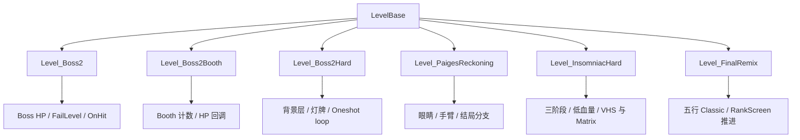

# Boss 与高压段落

本页覆盖阶段 5 的第二组官方关卡脚本：`Level_Boss2`、`Level_Boss2Booth`、`Level_Boss2Hard`、`Level_PaigesReckoning`、`Level_InsomniacHard` 和 `Level_FinalRemix`。这些脚本集中处理 Boss 血量、失败覆写、低血量提示、镜头滚动、专用背景、剧情失败和高密度小节流程。

## 源码范围

| 类 | 源码路径 | 继承 | 主要职责 |
| --- | --- | --- | --- |
| `Level_Boss2` | `RDFucked/Assets/Scripts/Assembly-CSharp/Level_Boss2.cs` | `LevelBase` | Boss2 正式关卡，加载病房、咖啡店、boss 文字、HP，并覆写失败与命中扣血。 |
| `Level_Boss2Booth` | `RDFucked/Assets/Scripts/Assembly-CSharp/Level_Boss2Booth.cs` | `LevelBase` | Boss2 Booth 变体，统计音符总数、命中数和 miss 数，并使用 Booth 失败流程。 |
| `Level_Boss2Hard` | `RDFucked/Assets/Scripts/Assembly-CSharp/Level_Boss2Hard.cs` | `LevelBase` | Boss2 夜班脚本，加载多层背景和灯牌，按小节控制 oneshot loop 与提示灯。 |
| `Level_PaigesReckoning` | `RDFucked/Assets/Scripts/Assembly-CSharp/Level_PaigesReckoning.cs` | `LevelBase` | Paige 终盘 Boss，控制多眼背景、手臂、失败剧情、结局分支和 rank screen 文本。 |
| `Level_InsomniacHard` | `RDFucked/Assets/Scripts/Assembly-CSharp/Level_InsomniacHard.cs` | `LevelBase` | Oriental Insomniac 夜班 Boss，管理三阶段 HP、VHS/Matrix 特效、低血量提示和剧情失败。 |
| `Level_FinalRemix` | `RDFucked/Assets/Scripts/Assembly-CSharp/Level_FinalRemix.cs` | `LevelBase` | FinalRemix 收束段落，创建五行 Classic、播放 `sndLeanOn` 并推进 rank screen。 |

## 模块关系

## `Level_Boss2`

`Level_Boss2` 是 Boss2 正式关卡脚本，构造函数接收 `RDLevelData` 并传给 `LevelBase`。它把 `.rdlevel` 数据事件与专用场景对象连接起来，负责 HP 条、主病房移动、咖啡店背景、boss 舞台文字和 Boss 失败流程。

### 关键字段

| 字段 | 类型 | 可见性 | 作用 |
| --- | --- | --- | --- |
| `hoodieWard` | `GameObject` | 私有 | Hoodie boy 病房 prefab 实例，关卡前半段显示。 |
| `mainWard` | `GameObject` | 私有 | 主病房 prefab 实例，关卡后半段用于 room3 滚动。 |
| `bossText` | `RDBossStageText` | 私有 | HUD 上的 boss 舞台文字。 |
| `coffeeShopBg` | `GameObject` | 私有 | room2 咖啡店背景。 |
| `coffeeShopFg` | `GameObject` | 私有 | room1 咖啡店前景。 |
| `coffeeShopIntro` | `GameObject` | 私有 | intro 咖啡店对象。 |
| `videoBloom` | `VideoBloom` | 私有 | Boss2 使用的视频 bloom 后处理。 |
| `passedCheckpoint` | `bool` | 私有静态 | 记录是否通过 checkpoint，preactions 中用于预裂心形。 |
| `room3CamScrollX` | `float` | 私有 | room3 摄像机横向滚动速度。 |
| `originalPos` | `Vector3` | 私有 | room3 摄像机返回用初始位置。 |
| `lastOneshot` | `BeatOneshot` | 公开 | 上一次处理过的 oneshot，用于避免同一 boom 时间重复扣 boss HP。 |

### 初始化与素材

| 方法 | 行为 |
| --- | --- |
| `Init()` | 调用 `base.Init()`；加载 `RDBossStageText`；把 boss 文字放到 HUD 右侧；加载咖啡店背景、前景和 intro 对象；关闭 room3 咖啡店；取得 `VideoBloom`；设置 `/` 跳过目标小节为 94。 |
| `LoadBigAssets()` | 设置 `missesToCrackHeart = 16`、`levelType = Boss`、`bossActNum = 2`、`runFirstActionBarInPreactions = true`、`charsOnlyOnStart = true`；加载 `RDHoodieBoyWard` 与 `RDMainWard`；主病房启用 seamless 并关闭灯；调用 `SetUpFlashMarginFeedback(RowType.Oneshot)`。 |
| `preactions()` | 第 1 小节在二人模式移动世界空间房间；通过 checkpoint 后按计算值预裂两行心形；调用 `SetBgStyle(1)`。 |
| `actions()` | 在第 1 小节播放 boss 文字；第 3 小节显示 HP 并以 `CountHits()` 设置 boss 最大 HP；第 4、52、85、91、101、105 小节切换病房、行表情、room3 滚动和 stutter。 |

### 公开方法

| 方法 | 作用 |
| --- | --- |
| `EnableRoom3CoffeeShop()` | 显示 room3 咖啡店背景和前景。 |
| `DisableRoom3CoffeeShop()` | 隐藏 room3 咖啡店背景和前景。 |
| `TransitionRoom3CoffeeShopToNight()` | 把 room3 咖啡店切换到夜间外观。 |
| `TransitionIntroCoffeeShopToNight()` | 把 intro 咖啡店切换到夜间外观。 |
| `ToggleIntroCoffeeShop(bool)` | 开关 intro 咖啡店对象。 |
| `OpenRoom3Door()` | 打开 room3 主病房门。 |
| `CloseRoom3Door()` | 关闭 room3 主病房门。 |
| `ToggleBloom(bool)` | 开关 `VideoBloom`。 |
| `Room2CamScrollX(float)` | 设置 room2 摄像机 X 滚动。 |
| `ReturnRoom2Cam()` | 让 room2 摄像机回到原位。 |
| `Room3CamScrollX(float)` | 设置 room3 摄像机 X 滚动。 |
| `ReturnRoom3Cam()` | 让 room3 摄像机回到原位。 |

### 命中、滚动和失败

`OnHit(HitType hitType, Beat beat)` 把 `Beat` 转为 `BeatOneshot`。当当前 oneshot 的 `boomTimeAbs` 与 `lastOneshot` 不同，脚本调用 `hpController.bossHP.DealDamage(hitType)`，然后把当前 oneshot 记录到 `lastOneshot`。

`LateUpdate2()` 只在 `mainWard` 激活时滚动 room3 摄像机。它用 `room3CamScrollX * Time.deltaTime * 120` 移动 `game.rooms[3].cam.offset`，并按 seamless 宽度 510 循环主病房 X 坐标。

`FailLevel(RowEntity ent)` 会把 rank 设为失败值，设置 `failedLevel`，触发闪光和震屏，停止周期节拍，播放最终裂心、聚光灯、`Boss2.GameOver` 旁白、gameover 表情，并在延迟后把状态切到 `bossFailRestart`，附带 checkpoint 重开信息。

## `Level_Boss2Booth`

`Level_Boss2Booth` 复用 Boss2 的病房、咖啡店、room3 滚动和失败结构，但它把 Booth 模式的计数作为主线状态：脚本公开 `notesHitCorrectly`、`notesMissed` 和 `notesCount`。

### Booth 计数字段

| 字段 | 类型 | 作用 |
| --- | --- | --- |
| `notesHitCorrectly` | `int` | Booth 命中正确数量，第 3 小节注册的 hit callback 会递增它。 |
| `notesMissed` | `int` | Booth miss 数。 |
| `notesCount` | `int` | `LoadBigAssets()` 扫描事件列表得到的总音符数。 |

`LoadBigAssets()` 会遍历 `levelData.levelEvents`，统计 `LevelEvent_AddOneshotBeat`、`LevelEvent_AddClassicBeat` 和 `LevelEvent_AddFreeTimeBeat`，并写入 `notesCount`。第 3 小节显示 HP，设置 boss 最大 HP，同时注册命中回调更新 `notesHitCorrectly`。

`LateUpdate2()` 与 Boss2 相同地滚动 room3，但 `room3CamScrollX == 0` 时会直接返回，避免执行 seamless 循环。

`FailLevel(RowEntity ent)` 使用 Booth 版本失败流程：设置失败 rank、闪光、震屏、最终裂心、聚光灯、gameover 表情和 `bossFailRestart` 状态；它同样会清理周期节拍。

## `Level_Boss2Hard`

`Level_Boss2Hard` 是 Boss2 夜班脚本，重点不在 `FailLevel()`，而在多层背景、灯牌提示和 dense oneshot 编排。

### 关键行为

| 方法 | 行为 |
| --- | --- |
| `Init()` | 设置 rank 边界为 `{100, 50, 35, 25, 8, 0}`，并把 `sndBoss2` 加入 `songsUsed`。 |
| `LoadBigAssets()` | 加载 Boss2 背景层、云、前景、灯牌和路灯 glow；保存 `mClubSignOn` 与 `mCafeSignOn`；调整背景排序并把背景 alpha 设为 0。 |
| `preactions()` | 第 1 小节设置 BPM、CPB、Oneshot 行和背景样式；第 2 小节播放音乐；后续小节大量调用 `LoopOneshotSimple()`，并用 `Stop(float beatnum)` 杀掉指定 oneshot。 |
| `BeepGet()` | 打开 Club sign，设置发光颜色。 |
| `BeepSet()` | 打开 Cafe sign，并把 Club sign 发光切到另一组颜色。 |
| `BeepGo()` | 关闭 Club sign 和 Cafe sign 发光。 |

私有 `Stop(float beatnum)` 直接调用 `game.KillOneshot(1, beatnum)`。这个方法让脚本可以在小节表里按节拍终止 row1 的 oneshot。

## `Level_PaigesReckoning`

`Level_PaigesReckoning` 是 Paige 终盘 Boss 脚本。它在 `Init()` 中把 canvas layer 设置为 5；在素材加载中准备大小两组 `RDManyEyes`、boss 文字、Boss 类型、Paige 失败规则和专用 rank screen 文本入口。

### 初始化状态

| 设置 | 值或行为 |
| --- | --- |
| `noBossFail` | `true` |
| `hpController.noP2BossBar` | `true` |
| `player1HP.useMistakes` | `true` |
| `levelType` | `Boss` |
| `bossActNum` | `6` |
| `cutsceneBarsDesc` | `(33, 60)` 与 `(2, 13)` |
| `preactions()` 第 1 小节 | 把 `missesToCrackHeart` 设为 `rankLowerBounds[1]` |
| `actions()` 第 128 小节 | 把 `missesToCrackHeart` 设为 `999` |

### 眼睛控制方法

| 方法 | 作用 |
| --- | --- |
| `EyeAngle(float angle, float duration, string easeStr)` | 解析缓动并设置大眼、小眼滚动角度。 |
| `EyeScroll(float amount, float duration, string easeStr)` | 设置大眼滚动速度，小眼速度为传入值的一半。 |
| `EyesClose(float percent)` | 设置眼睛闭合比例。 |
| `EyesToggleSmall(bool open)` | 以 4 倍 timeScale 播放小眼 blink。 |
| `EyesToggle()` | 切换眼睛显示状态。 |
| `EyesToggleEqually()` | 同步切换大小眼状态。 |
| `EyesBlink()` | 触发眨眼。 |
| `StareAtMark()` | 让眼睛盯向 marker。 |
| `StareAtPlayer(bool p2)` | 根据玩家与手部归属选择目标手臂。 |

### 手臂与按钮方法

| 方法 | 作用 |
| --- | --- |
| `GetArm(int room, bool leftArm)` | 根据房间和左右手取得 `scrHand`。 |
| `MoveArmX(int room, bool leftArm, float x)` | 移动指定手臂 X。 |
| `MoveArmY(int room, bool leftArm, float y)` | 移动指定手臂 Y。 |
| `SetArmZ(int room, bool leftArm, float z)` | 设置指定手臂 Z。 |
| `MoveButtonX(int room, bool leftArm, float x)` | 移动对应按钮 X。 |
| `MoveButtonY(int room, bool leftArm, float y)` | 移动对应按钮 Y。 |
| `ChangeArmCharacter(int room, bool leftArm, Character character)` | 更换指定手臂角色。 |
| `ToggleNervous(int room, bool leftArm, bool on)` | 开关手臂紧张表现。 |
| `PlayArmAnim(int room, bool leftArm, string anim)` | 播放指定手臂动画。 |

### 结局与失败

| 方法 | 作用 |
| --- | --- |
| `ShowBossText(int room, float xPerc, float yPerc)` | 非 scrubbing 状态下显示 boss 文字，位置由房间编号和百分比坐标决定。 |
| `SetVerticalShiftSpeed(float)` | 设置眼睛垂直偏移速度。 |
| `SetEnding(bool paigeStays)` | 内部关卡来源时设置 rank screen 是否可跳过、结局描述和 `Persistence.SetPaigeEnding(paigeStays)`。 |
| `SetLevelFailed()` | 设置 rank screen 标题为失败文本，描述为 Paige 重试文本。 |
| `SetRankScreenSkippable()` | 允许跳过 rank screen。 |

`OnMistake(RowEntity ent)` 在 `numMistakes > missesToCrackHeart` 时调用 `game.FailLevel(rows[0].ent)`。`FailLevel(RowEntity ent)` 会进入 Paige 专用失败：失败 rank、row0 gameover、清理节拍、杀掉 DOTween、最终裂心、聚光灯、运行 `FailLevelSpotlight` 与 `FailLevel` tag，并通过 `PlayGameOverDialogue()` 播放失败剧情。

## `Level_InsomniacHard`

`Level_InsomniacHard` 是 Oriental Insomniac 夜班 Boss。它把三阶段 HP、VHS 滤镜、Matrix 背景、低血量旁白、stutter、障碍特效和剧情失败整合在一个脚本中。

### 常量和静态状态

| 名称 | 值 | 作用 |
| --- | --- | --- |
| `Phase1HP` | `21` | 第一阶段 HP。 |
| `Phase1HPLeftover` | `4` | 第一阶段保留 HP。 |
| `Phase2HP` | `25` | 第二阶段 HP。 |
| `Phase2HPLeftover` | `4` | 第二阶段保留 HP。 |
| `Phase3HP` | `19` | 第三阶段 HP。 |
| `DialogueFile` | `diaInsomniacHard` | Ink 对话文件名。 |
| `MinHealthPctToBeep` | `.3f` | 触发低血量 beep 的血量比例阈值。 |
| `LowHPBeepSound1` | `yi...` | 低血量中文计数音 1。 |
| `LowHPBeepSound2` | `san...` | 低血量中文计数音 2。 |
| `hasGlitched` | `bool` | 静态 glitch 状态。 |
| `numberOfTries` | `int` | 静态尝试次数。 |

### 初始化与素材

| 方法 | 行为 |
| --- | --- |
| `Init()` | 开启多房间；添加 `sndOrientalInsomniacHardRep`；加载 boss stage text；设置黑色文字、glitch mode、Instant 裂心、Boss 类型、`missesToCrackHeart = 11`、不可跳过 rank screen、对话文件和 `/` 跳转小节 174。 |
| `LoadBigAssets()` | 设置 `bossActNum = 4`；加载 stutter、日夜背景、宝塔、灯、星、花瓣、猫、蝙蝠、Matrix 背景、VHS 滤镜和 SamuraiBoss Classic 行；二人模式下隐藏额外行。 |
| `SetBgStyle(1)` | 配置 bloom 与 vignette。 |
| `SetBgStyle(2)` | 显示 Matrix 背景，设置 bloom tint，隐藏日间、天空和 noise 背景，显示夜间背景。 |
| `ShowMatrixes(bool)` | 统一开关 Matrix 背景可见性。 |

### 小节流程

| 小节范围 | 行为 |
| --- | --- |
| 第 1 小节 | 设置 Classic、BPM 90、歌曲、行声音和命中音。 |
| 第 2 小节 | 显示 HP。 |
| 第 4 小节 | 切到 BPM 160，开启花瓣粒子、sprite glow 和 boss 行。 |
| 第 20 小节 | 进入 cutscene 段落，切 OffBeat。 |
| 第 24 到 29 小节 | 切 handmode、临时改变行声音、切 OffBeat。 |
| 第 33 到 41 小节 | 高 BPM/CPB 段落，创建视觉节拍并切回 Classic。 |
| 第 66 到 69 小节 | 切 OffBeat 后调整 CPB，并跳转到后段。 |
| 第 166 到 182 小节 | BPM 180 后段，设置 possessed 状态，添加加速节拍和断线旁白。 |
| 第 187 到 192 小节 | 结束段落，显示 HP、淡出背景、推进 rank screen 和完美分支。 |

`actions()` 中还会在前段安排 glitch intro、boss stage、Matrix/VHS、distraction、stutter、possessed 状态、遮挡、reduce flash 分支和低闪光处理。`NumberFlashingOnAction()` 在第 41 到 48 小节闪出数字 1 到 7，第 49 小节清理显示。

### 公开和覆写方法

| 方法 | 作用 |
| --- | --- |
| `StartInterlude()` | 进入 interlude：关闭花瓣、设置 cutscene、清 possessed、隐藏主背景、显示 sky、降低 bloom、背景转黑、关闭 wavy rows、显示 Matrix。 |
| `AddObstruction(int type, float playbeat, float length, float alpha = 1)` | 按类型安排 glitch 或 noise 遮挡；支持负 `playbeat` 延迟和 beat 调度两种路径。 |
| `OnMistake(RowEntity ent)` | 调用 `stutter.EndCurrentStutter()`。 |
| `OnHit(HitType hitType, Beat beat)` | 调用 `hpController.bossHP.DealDamage(hitType)`。 |
| `OnEnterLowHealth()` | 设置低血量计数、调用基类逻辑并显示 `LOW HEALTH`。 |
| `OnExitLowHealth()` | 调用基类逻辑并清理低血量文字。 |
| `OnLowHealthEveryPrebar()` | 按当前小节安排低血量 beep，后段使用专用序列。 |
| `FailLevel(RowEntity ent)` | 关闭 glitch/noise、清 distraction、设置失败、闪光震屏、关闭 VHS、最终裂心、聚光灯、gameover 表情，并按当前小节选择 Ink gameover 节点。 |

## `Level_FinalRemix`

`Level_FinalRemix` 是一个短小的收束脚本。`Init()` 把 `sndLeanOn` 加入 `songsUsed`，设置 `heartExplodeType = Instant`，并开启多房间。

`preactions()` 第 1 小节设置 BPM 200、播放音乐、创建 5 行 Classic：`Samurai`、`Boy`、`Girl`、`Samurai`、`SamuraiBoss`。同一小节还添加 `IntimateRain`、`Sakura` 和 `Matrix` 背景，并设置多个房间背景色。

`actions()` 第 1 小节显示 `"1,2,3,4"` 房间，第 32 和第 33 小节调用 `rankscreen.AdvanceGameover()` 推进结算流程。

## 与编辑器事件的关系

| 关系 | 说明 |
| --- | --- |
| `.rdlevel` 事件驱动 | `Level_Boss2`、`Level_Boss2Booth` 等脚本使用 `RDLevelData` 构造函数接收关卡事件，再在小节回调中补充官方专用行为。 |
| `CallCustomMethod` | 页面中列出的公开方法可以被关卡事件或 Ink 调用，前提是当前关卡脚本实例和对应素材已经初始化。 |
| Boss HP | `Level_Boss2`、`Level_InsomniacHard` 通过 `OnHit()` 直接推动 `hpController.bossHP`。 |
| 自定义失败流程 | `Level_Boss2`、`Level_Boss2Booth`、`Level_PaigesReckoning`、`Level_InsomniacHard` 覆写 `FailLevel()`，失败不再只走 `LevelBase` 默认路径。 |
| 小节脚本 | 高压段落大量依赖 `preactions()` 与 `actions()` 的 `conductor.barNumber` 分支；修改事件顺序时需要同时检查这些硬编码小节。 |

## 复核状态

本页已纳入 [官方关卡覆盖清单](/api/levels/coverage.md)，对应 Boss 与高压段落类群已完成阶段 7 复核。

