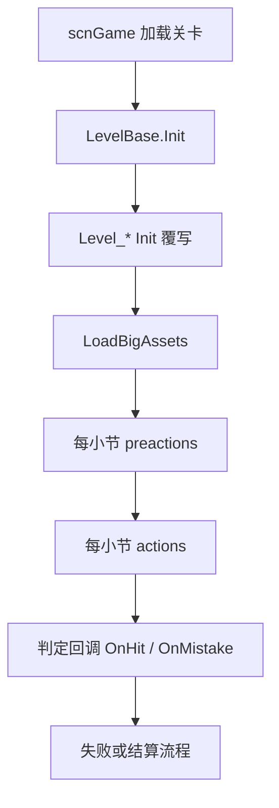

# 官方关卡脚本总览

本页建立阶段 5 的索引骨架。官方关卡脚本集中在 `RDFucked/Assets/Scripts/Assembly-CSharp` 根目录，文件名以 `Level_` 开头；绝大多数继承 `LevelBase`，少数辅助类型继承 `RDBase`。

## 源码范围

| 类型族 | 源码路径 | 职责 |
| --- | --- | --- |
| `Level_*` | `RDFucked/Assets/Scripts/Assembly-CSharp/Level_*.cs` | 官方关卡脚本，按关卡覆写 `Init()`、`LoadBigAssets()`、`preactions()`、`actions()` 和判定回调。 |
| `Level_Tutorial_*` | `RDFucked/Assets/Scripts/Assembly-CSharp/Level_Tutorial_*.cs` | 教程关卡脚本，负责教学对话、手部提示、行创建和下一关跳转。 |
| `Level_*H` | `RDFucked/Assets/Scripts/Assembly-CSharp/Level_*H.cs` | 硬版或变体脚本，通常复用基础关卡机制并追加视觉、节奏或素材逻辑。 |
| `Level_*Booth` | `RDFucked/Assets/Scripts/Assembly-CSharp/Level_*Booth.cs` | Booth 或展会模式变体。 |
| `Level_LesMis_Helper` | `RDFucked/Assets/Scripts/Assembly-CSharp/Level_LesMis_Helper.cs` | `Level_Lesmis` 的辅助组件，继承 `RDBase`。 |

## 共同结构

大多数官方关卡脚本通过以下入口接入 `LevelBase`：

| 方法 | 调用位置 | 常见职责 |
| --- | --- | --- |
| `Init()` | 关卡初始化阶段 | 设置 `levelType`、`songsUsed`、rank 边界、boss 标记、跳转目标、特殊行配置。 |
| `LoadBigAssets()` | 大素材加载协程 | 加载关卡专用 prefab、背景、视频后处理、角色场景、Ink 文件和主题资源。 |
| `preactions()` | 每小节预执行 | 根据 `conductor.barNumber` 安排行创建、节拍、冻结、音乐、状态文字、失败提示。 |
| `actions()` | 每小节执行 | 安排视觉效果、剧情动作、房间切换、特效、tag 或自定义方法。 |
| `Update()` | 每帧更新 | 处理持续视觉、场景滚动、实时输入或镜头状态。 |
| `OnHit()` | 判定命中后 | 推进 boss 血量、体育场棒球、特殊反馈、剧情状态。 |
| `OnMistake()` | 判定失误后 | 触发低血量、失败预处理、特殊视觉或剧情。 |
| `FailLevel()` | 关卡失败时 | 覆盖默认失败流程，播放剧情失败、boss 结算或 checkpoint 行为。 |
| `BeepGet()`、`BeepSet()`、`BeepGo()` | Oneshot 提示音阶段 | 同步灯光、聚光灯、提示视觉。 |

## 分组索引

| 分组 | 脚本 | 特征 |
| --- | --- | --- |
| 教程与开场 | `Level_Intro`、`Level_Tutorial_1`、`Level_Tutorial_2`、`Level_Tutorial_3`、`Level_Tutorial_Boss2`、`Level_Tutorial_DistantDuet`、`Level_Tutorial_EighthDelay`、`Level_Tutorial_Lofi`、`Level_Tutorial_Oneshot`、`Level_Tutorial_OneshotIntro`、`Level_OpeningCreds` | 教学对话、手部提示、关卡跳转、教程主题。 |
| Oriental 与早期主线 | `Level_OrientalTechno`、`Level_OrientalDubstep`、`Level_OrientalInsomniac`、`Level_Intimate`、`Level_IntimateH`、`Level_Classy`、`Level_ClassyC`、`Level_ClassyH`、`Level_KnowYou`、`Level_Invisible` | 早期 classic/oneshot 教学后主线，含低血量、主题和行控制变体。 |
| Boss 与高压段落 | `Level_Boss2`、`Level_Boss2Hard`、`Level_Boss2Booth`、`Level_PaigesReckoning`、`Level_FinalRemix`、`Level_InsomniacHard` | boss 血量、失败覆写、checkpoint、低血量、镜头和场景推进。 |
| 运动与节奏变体 | `Level_Freezeshot`、`Level_FreezeshotH`、`Level_FreezeshotBooth`、`Level_AthleteTherapy`、`Level_AthleteFinale`、`Level_Injury` | 体育场、棒球命中反馈、afterimage、burst 粒子和运动场景。 |
| 视觉与窗口特殊关卡 | `Level_SVT`、`Level_Smokin`、`Level_Blurred`、`Level_Bitterness`、`Level_Montage`、`Level_Montage2`、`Level_AfterimageTest`、`Level_Trailer` | 万花筒、减速、视频/镜头/afterimage、预告片和 montage 逻辑。 |
| 叙事与场景关卡 | `Level_Lofi`、`Level_Lounge`、`Level_LuckyBreak`、`Level_HaileyDuet`、`Level_DistantDuet`、`Level_HelpingHands`、`Level_Steinway`、`Level_SteinwayH`、`Level_StevensonsTango` | 手部归属、房间灯光、音量切换、二人模式与叙事节奏。 |
| 其他官方与测试脚本 | `Level_Garden`、`Level_GAndTonic`、`Level_GongXi`、`Level_FlyAway`、`Level_EdegaPerformance`、`Level_EdegaRave`、`Level_ArtExercise`、`Level_Playground`、`Level_OST`、`Level_Dummy`、`Level_MyLevel`、`Level_djtest`、`Level_CareLess`、`Level_Heldbeats`、`Level_Lean`、`Level_Lesmis`、`Level_Unbeatable`、`Level_Unreachable`、`Level_VividStasis`、`Level_SparkLine`、`Level_SongOfTheSea`、`Level_Rollerdisco` | 官方曲目、活动曲目、测试脚本、空实现脚本和关卡专用方法。 |

## 构造函数模式

| 模式 | 脚本特征 |
| --- | --- |
| `public Level_X(RDLevelData data) : base(data)` | `.rdlevel` 数据驱动关卡常用模式，例如 `Level_Boss2`、`Level_Freezeshot`、`Level_Lofi`、`Level_SVT`。 |
| 无显式构造函数 | 仍继承 `LevelBase`，通过默认构造进入 Unity 或运行时流程，例如 `Level_Intro`、`Level_Tutorial_1`、`Level_Boss2Hard`。 |
| 辅助组件 | `Level_LesMis_Helper` 继承 `RDBase`，不走 `LevelBase` 关卡生命周期。 |

## 已确认的重点脚本入口

| 脚本 | 已读源码重点 | 后续页面归属 |
| --- | --- | --- |
| `Level_Intro` | `Init()` 设置 intro/tutorial 类型与跳转目标；`LoadBigAssets()` 加载 notes 背景、Ink 和 basement；按 `LevelPhase` 分发 `preactions()` 与 `actions()`；教程段创建 Farmer/Tentacle 行并注册命中回调。 | 教程与开场页 |
| `Level_Tutorial_1` | 加载教程 Ink 参数；按 booth、custom button、two-player 选择文本；创建 Classic 行，处理 miss/help、任意输入统计和下一关跳转。 | 教程与开场页 |
| `Level_Tutorial_2` | `levelToSkipTo = Level.Intimate`；显示 tutorial 主题；创建 Farmer Classic 行；`ShowRowX()` 设置 `----xx` 并旁白更新行信息。 | 教程与开场页 |
| `Level_Tutorial_3` | 使用数据构造函数；加载 `diaTutorial3`；第 1 小节播放教程音乐并串行运行两个 Ink 节点后跳转 `Level.Classy`。 | 教程与开场页 |
| `Level_Boss2` | 加载 boss 文本、咖啡店前后景、主病房和 hoodie ward；显示 HP；覆盖 `FailLevel()`；`OnHit()` 根据 oneshot boom 时间对 boss 扣血。 | Boss 与高压段落页 |
| `Level_Boss2Hard` | 设置 rank 边界和 boss2 音乐；加载 Boss2 背景层和灯牌；按小节大量切换 oneshot loop；覆盖 `BeepGet/Set/Go()` 控制灯牌。 | Boss 与高压段落页 |
| `Level_Boss2Booth` | 扫描 beat 事件计算 Booth 音符总数；注册命中回调；复用 Boss2 病房和 room3 滚动；覆盖 Booth 失败流程。 | Boss 与高压段落页 |
| `Level_PaigesReckoning` | 加载大小眼背景、boss 文字和手臂方法；按 miss 触发失败；提供结局分支、rank screen 文本和 Paige 专用失败流程。 | Boss 与高压段落页 |
| `Level_InsomniacHard` | 设置三阶段 HP、VHS/Matrix、低血量 beep、stutter、障碍特效和剧情失败；`OnHit()` 对 boss 扣血。 | Boss 与高压段落页 |
| `Level_FinalRemix` | 创建五行 Classic、添加 IntimateRain/Sakura/Matrix 背景，显示多房间并推进 rank screen。 | Boss 与高压段落页 |
| `Level_Freezeshot` | 加载 afterimage render texture 队列；按灯光 pattern 安排体育场灯；`OnHit()` 调用 `stadium.HitBaseball()`；提供 `SetAfterimageParams()` 与 `ToggleAfterimages()`。 | 运动与节奏变体页 |
| `Level_FreezeshotH` | 提供 burst 粒子参数方法；`LevelEventWasRun()` 捕捉 `SetVisible` 并对 handwrite 动画目标做 shader fade。 | 运动与节奏变体页 |
| `Level_FreezeshotBooth` | 创建 Booth afterimage 队列；从 `RDHoodieBoyWard` 收集 16 个灯背景；提供 Ian 手部切入方法。 | 运动与节奏变体页 |
| `Level_AthleteTherapy` | 加载蹦极绳；处理 hold 爆炸音、rummage 声、tag 计时器、beat 清理和偷听成就。 | 运动与节奏变体页 |
| `Level_AthleteFinale` | 设置 Boss checkpoint、杯子投掷、体育场棒球、特殊棒球、屋顶切换、雨、闪电、HP 和失败剧情。 | 运动与节奏变体页 |
| `Level_Injury` | 加载泡泡、泡泡遮罩和手机直播；重建 room render texture；控制记分牌灯、棒球 voxel、病房滚动和 JanitorTV 同步。 | 运动与节奏变体页 |
| `Level_Lofi` | 加载 hoodie ward 到 room2；禁用部分玩家/CPU 手；按灯光 pattern 切换灯；`EnterIanHand()` 切换 Ian 手部。 | 叙事与场景关卡页 |
| `Level_Lounge` | 保留空的 `Init()`、`preactions()`、`actions()` 覆写。 | 叙事与场景关卡页 |
| `Level_LuckyBreak` | 使用体育场棒球、记分牌、雨、风暴、闪电和 Edega 显示方法。 | 叙事与场景关卡页 |
| `Level_HaileyDuet` | 加载 BubbleMask 与 Intimate 背景；提供 sunset、咖啡店、投杯和泡泡遮罩方法。 | 叙事与场景关卡页 |
| `Level_DistantDuet` | 加载双层城市天空；配置 Paige 手部、夜间病房、天空速度、第二天空和灰度切换。 | 叙事与场景关卡页 |
| `Level_HelpingHands` | 加载 seamless 主病房与 credits；处理 room1 行挂载、credits/preorders 滚动和昼夜病房。 | 叙事与场景关卡页 |
| `Level_Steinway` | 根据二人模式配置 Ian 手部与玩家手部；提供鸟声与 Mrs Stevenson 音量切换。 | 叙事与场景关卡页 |
| `Level_SteinwayH` | 提供与 Steinway 相同的鸟声和 Mrs Stevenson 音量切换方法。 | 叙事与场景关卡页 |
| `Level_StevensonsTango` | 移动 room0 理疗房背景并开关理疗前景 renderer。 | 叙事与场景关卡页 |
| `Level_SVT` | 启用 kaleidoscope；命中时触发 oneshot slowdown；覆盖 Beep 聚光灯；提供万花筒颜色、旋转、wave mode 等公开方法。 | 视觉与窗口特殊关卡页 |
| `Level_Smokin` | 加载咖啡店前后景；按命中投杯；管理疲劳表情、顾客、夜间灯光和快速 beat 波形。 | 视觉与窗口特殊关卡页 |
| `Level_Blurred` | 设置 cutscene 段落；提供移除电视、禁用角色染色和角色 tint 方法。 | 视觉与窗口特殊关卡页 |
| `Level_Bitterness` | 设置 Boss checkpoint 与失败流程；控制 Cole 灯、破灯、咖啡店顾客、icon 粒子、医院层和 Boss 文字。 | 视觉与窗口特殊关卡页 |
| `Level_Montage` | 设置 Montage Boss、Samurai ward、咖啡杯堆、window peek、手动裂心、Boss 通过状态和 gameover 对话。 | 视觉与窗口特殊关卡页 |
| `Level_Montage2` | 设置 CareLess 粒子、ColeMidi、记分牌、接球回调、窗口 peek、歌词替换和分段失败 tag。 | 视觉与窗口特殊关卡页 |
| `Level_Trailer` | 控制 trailer HP、infinite zoom、rooftop、room1 棒球 voxel、下落棒球和二人模式切换。 | 视觉与窗口特殊关卡页 |

## 覆写方法分布

| 覆写点 | 已发现脚本示例 |
| --- | --- |
| `Init()` | `Level_Boss2`、`Level_Boss2Hard`、`Level_Intro`、`Level_Tutorial_*`、`Level_Oriental*`、`Level_Montage*`、`Level_PaigesReckoning`。 |
| `LoadBigAssets()` | `Level_Boss2`、`Level_Freezeshot`、`Level_Lofi`、`Level_SVT`、`Level_Tutorial_*`、`Level_GongXi`、`Level_Garden`。 |
| `preactions()` / `actions()` | 绝大多数有特殊小节逻辑的官方关卡。 |
| `OnHit()` | `Level_Boss2`、`Level_Freezeshot`、`Level_AthleteTherapy`、`Level_AthleteFinale`、`Level_Injury`、`Level_Montage`、`Level_SVT`。 |
| `OnMistake()` | `Level_Bitterness`、`Level_InsomniacHard`、`Level_Montage`、`Level_PaigesReckoning`、`Level_Smokin`、`Level_SVT`。 |
| `FailLevel()` | `Level_Boss2`、`Level_Boss2Booth`、`Level_Bitterness`、`Level_AthleteFinale`、`Level_InsomniacHard`、`Level_PaigesReckoning`。 |
| `BeepGet()` / `BeepSet()` / `BeepGo()` | `Level_Boss2Hard`、`Level_Tutorial_Boss2`、`Level_Tutorial_DistantDuet`、`Level_Tutorial_Oneshot`、`Level_SVT`、`Level_Smokin`。 |

## 文档拆分计划

| 页面 | 覆盖范围 | 状态 |
| --- | --- | --- |
| `overview.md` | 阶段 5 总览、分组、已读重点脚本入口 | 本页已建立 |
| `tutorials-opening.md` | `Level_Intro` 与 `Level_Tutorial_*`、`Level_OpeningCreds` | 已建立 |
| `boss-high-pressure.md` | Boss、Paige、Insomniac hard、FinalRemix | 已建立 |
| `athlete-freezeshot.md` | Freezeshot、Athlete、Injury | 已建立 |
| `visual-special.md` | SVT、Smokin、Blurred、Bitterness、Montage、Trailer | 已建立 |
| `story-scene-levels.md` | Lofi、Lounge、LuckyBreak、HaileyDuet、DistantDuet、Steinway | 已建立 |
| `misc-official-levels.md` | 活动曲、测试脚本、空实现与其他官方脚本 | 已建立 |
| `coverage.md` | 75 个 `Level_*.cs` 文件的专题页或文件级归属 | 已建立 |

## 源码研究关注点

| 场景 | 注意事项 |
| --- | --- |
| 调用官方关卡公开方法 | 很多 `public void` 是给 `CallCustomMethod` 或 Ink 调用的关卡专用入口，依赖关卡内 prefab、行编号、房间和已加载资源。 |
| `preactions()` / `actions()` 回调 | 这些方法按小节执行，内部常用 `conductor.barNumber` 和 `scrExecuteOnCertainBeat` 安排延迟动作。 |
| `OnHit()` / `OnMistake()` 回调 | Boss、体育场和低血量关卡在这些回调中推进状态，改动会影响结算、失败和视觉反馈。 |
| 复用素材加载逻辑 | `LoadBigAssets()` 会实例化关卡专用 prefab，并把它们放到指定房间或 HUD 位置；复用前需要先确认当前关卡有相同资源。 |

