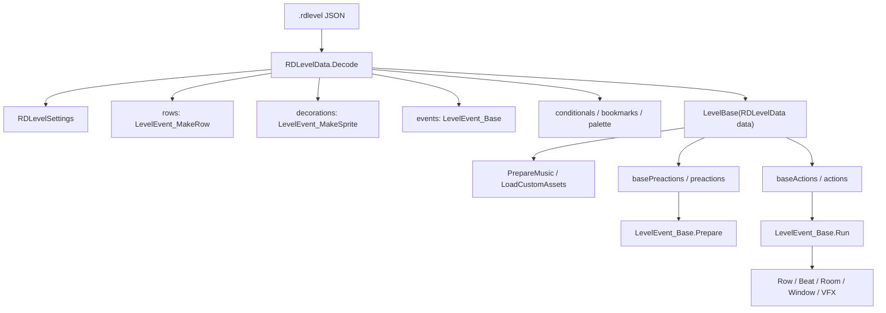
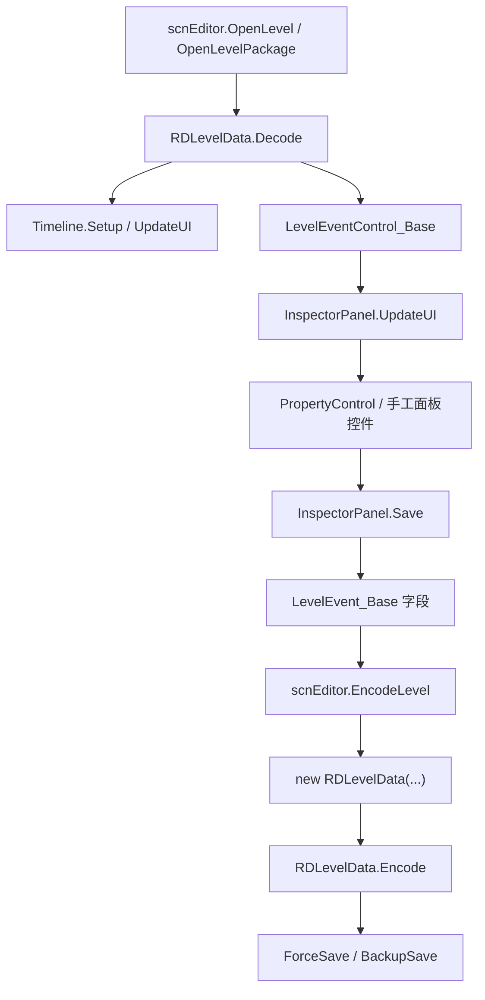
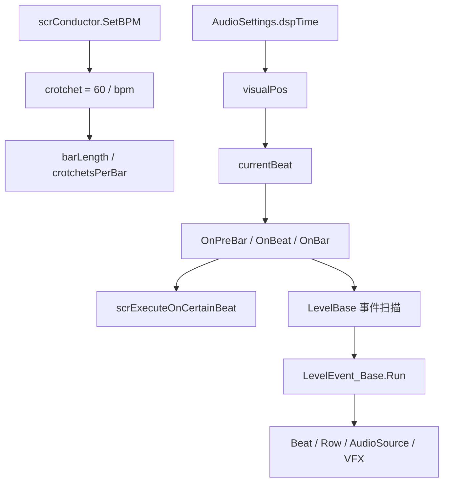
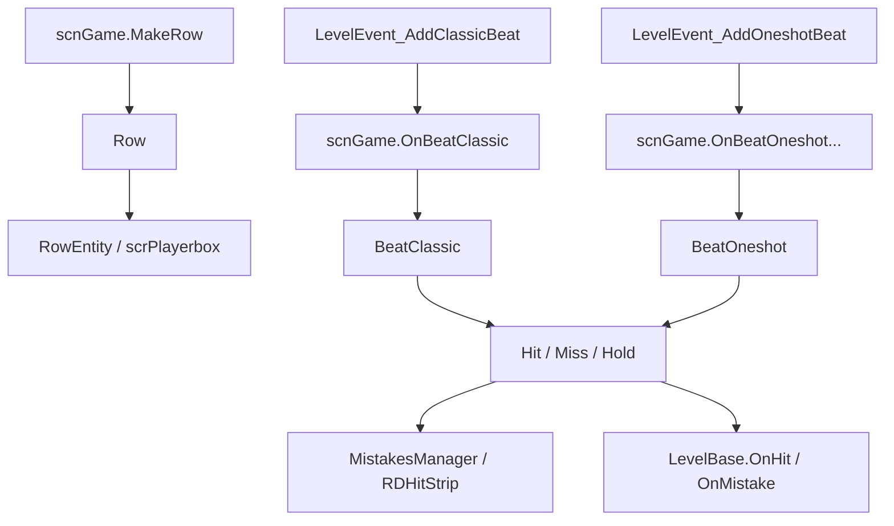
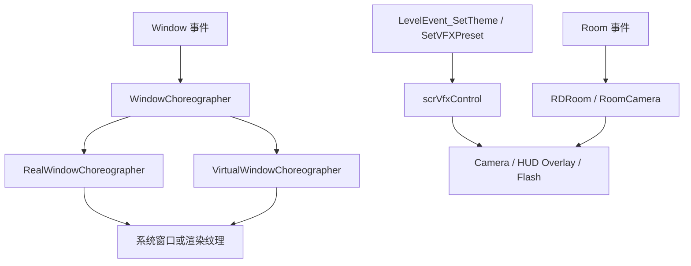

# 主干调用图

本页汇总阶段 7 复核后的主干调用关系。图中的节点来自已读源码：`RDLevelData` 负责关卡数据结构，`scnEditor` 负责编辑器读写与时间线，`scnGame` 负责运行场景加载和游戏流程，`LevelBase` 负责关卡逻辑与事件调度，`scrConductor` 负责音乐时间和小节推进，`LevelEvent_Base` 负责事件解码、准备、条件检查和运行。

## 关卡数据到运行时

源码关系：

| 起点 | 落点 | 源码依据 |
| --- | --- | --- |
| `RDLevelData` | `settings`、`rows`、`levelEvents`、`conditionals`、`bookmarks` | `RDLevelData` 构造和 `Decode()` 读取 JSON 根字段 |
| `LevelBase(RDLevelData data)` | `data.levelEvents` | 构造函数绑定关卡数据并过滤事件 |
| `LevelBase` | `LevelEvent_Base.Run()` | 关卡运行时按事件时间触发 `Run()` |
| `LevelEvent_Base.Run()` | 行、节拍、房间、窗口、视觉系统 | 各派生事件在运行阶段调用 `scnGame`、`scrVfxControl`、窗口和音频入口 |

## 编辑器读写路径

源码关系：

| 起点 | 落点 | 源码依据 |
| --- | --- | --- |
| `scnEditor` | `RDLevelData` | 打开关卡时用 JSON 构造 `RDLevelData` |
| `RDLevelData` | `Timeline` | 打开后清空并重建时间线控件、书签和缓存 |
| `InspectorPanel` | `LevelEvent_Base` | 面板保存时把 UI 控件值写回事件对象 |
| `scnEditor` | `new RDLevelData(...)` | 保存时收集 settings、rows、events、conditionals、sprites、bookmarks 和 palette |
| `RDLevelData.Encode()` | `.rdlevel` 文件 | 编码 JSON 后由保存入口写入磁盘 |

## 音乐时间与事件触发

源码关系：

| 起点 | 落点 | 源码依据 |
| --- | --- | --- |
| `SetBPM(float)` | `crotchet` | `scrConductor.crotchet` 由 `60f / bpm` 得出 |
| `visualPos` | `currentBeat` | `visualPos` 减去小节起点后换算为当前拍 |
| 小节推进 | `barNumber`、`barNumberUpdateOnBar` | `scrConductor` 在小节边界更新编号和缓存 |
| `StartTheGame()` | `basePreactions()`、`preactions()`、`baseActions()`、`actions()` | `scnGame.StartTheGame()` 启动关卡脚本和事件注册 |
| 事件触发 | `LevelEvent_Base.Run()` | `LevelBase` 和事件调度器按节拍运行事件 |

## 判定与行系统

源码关系：

| 起点 | 落点 | 源码依据 |
| --- | --- | --- |
| `MakeRow()` | `Row`、`RowEntity` | `scnGame` 创建行并挂接角色与房间信息 |
| `OnBeatClassic()` | Classic 节拍循环 | `scnGame` 根据行号、起始拍和周期生成 classic beat |
| `OnBeatOneshot...()` | Oneshot 节拍 | `scnGame` 生成 oneshot 音频提示和判定对象 |
| 判定结果 | `LevelBase.OnHit()`、`OnMistake()` | 关卡脚本可覆写命中、失误、低血量和失败流程 |

## 窗口与视觉系统

源码关系：

| 起点 | 落点 | 源码依据 |
| --- | --- | --- |
| 视觉事件 | `scrVfxControl` | 主题、滤镜、闪光、背景和前景事件集中落到 VFX 控制器 |
| 房间事件 | `RDRoom`、`RoomCamera` | 房间显示、透视、遮罩和排序由房间组件承接 |
| 窗口事件 | `WindowChoreographer` | 窗口舞蹈、标题、内容、缩放和排序由窗口系统承接 |

## 复核入口

| 主题 | 继续阅读 |
| --- | --- |
| 核心类职责 | [核心骨架](/modules/core.md) |
| 编辑器事件管线 | [编辑器事件系统](/modules/editor-events.md) |
| 运行时主干 | [运行时游戏系统](/modules/runtime.md) |
| 数据结构 | [数据模型与枚举](/modules/data-models.md) |
| 官方关卡脚本 | [官方关卡脚本](/modules/levels.md) |

