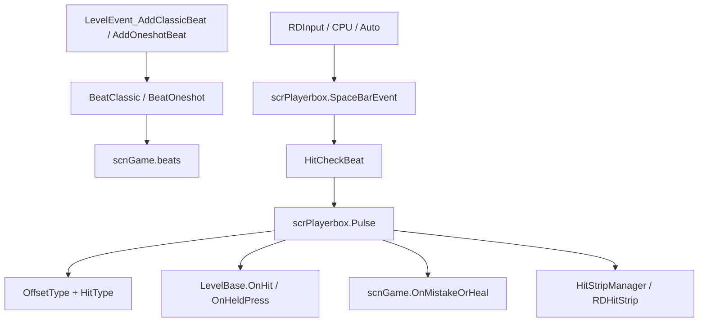
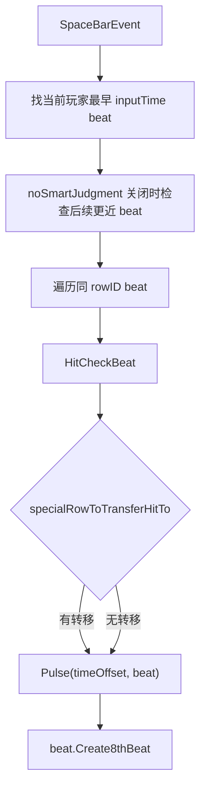

# 节拍与判定

本页深写运行时节拍与命中判定链路。编辑器里的 `AddClassicBeat`、`AddOneshotBeat`、`AddFreeTimeBeat` 等事件在运行时会创建 `BeatClassic` 或 `BeatOneshot`，玩家输入由 `scrPlayerbox` 判定，命中结果写入 `scnGame` 和 `LevelBase`。

## 源码范围

| 类型 | 源码路径 | 职责 |
| --- | --- | --- |
| `Beat` | `RDFucked/Assets/Scripts/Assembly-CSharp/Beat.cs` | 节拍实体基类，保存输入时间、释放时间、所属行、错误权重、音频源、爆心时间和 miss 超时处理。 |
| `BeatClassic` | `RDFucked/Assets/Scripts/Assembly-CSharp/BeatClassic.cs` | Classic 七拍序列和 FreeTime 序列，负责 pulse sound、计数音、swing、synco、hold pulse 和 beatbox 状态。 |
| `BeatOneshot` | `RDFucked/Assets/Scripts/Assembly-CSharp/BeatOneshot.cs` | Oneshot 节拍，负责 boom、rush、chak、freeze、burn、hold、subdivision、wave 和 friend group。 |
| `scrPlayerbox` | `RDFucked/Assets/Scripts/Assembly-CSharp/scrPlayerbox.cs` | 玩家输入判定核心，处理按下、释放、hit offset、命中动画、标签事件和 hold。 |
| `RDHitStrip` | `RDFucked/Assets/Scripts/Assembly-CSharp/RDHitStrip.cs` | 命中条视觉，显示普通 flash 和 hold progress。 |
| `HitStripManager` | `RDFucked/Assets/Scripts/Assembly-CSharp/HitStripManager.cs` | 命中条池和行合并逻辑。 |
| `HitType` | `RDFucked/Assets/Scripts/Assembly-CSharp/HitType.cs` | 事件回调使用的命中类型枚举。 |
| `OffsetType` | `RDFucked/Assets/Scripts/Assembly-CSharp/OffsetType.cs` | 统计与判定使用的偏移类型枚举。 |

## 判定总流程

## HitType

| 值 | 数值 | 用途 |
| --- | --- | --- |
| `Hit` | `0` | 完美命中。 |
| `JustMiss` | `1` | 轻微提前或轻微滞后。 |
| `BigMiss` | `2` | 严重提前、严重滞后或按下判定中的 bomb 失败。 |
| `AnyMiss` | `3` | `scrExecuteOnHit` 使用的泛化 miss 类型。 |
| `AnyMissWithinCounted` | `4` | 计数范围内的泛化 miss 类型。 |
| `MissCompletely` | `5` | 完全漏拍，`Beat.Update()` 超时后触发。 |
| `EarlyOnly` | `6` | 只匹配提前命中的执行器类型。 |
| `LateOnly` | `7` | 只匹配滞后命中的执行器类型。 |

## OffsetType

| 值 | 数值 | 用途 |
| --- | --- | --- |
| `VeryEarly` | `-2` | 严重提前。 |
| `SlightlyEarly` | `-1` | 轻微提前。 |
| `Perfect` | `0` | 完美。 |
| `SlightlyLate` | `1` | 轻微滞后。 |
| `VeryLate` | `2` | 严重滞后。 |
| `Missed` | `-9999` | 漏拍或 bomb 失败。 |
| `AnyEarlyOrLate` | `-10000` | 泛化提前或滞后匹配。 |
| `Null` | `-10001` | 空偏移占位。 |

`scrPlayerbox.Pulse()` 先得到 `OffsetType`，再映射到 `HitType`：`Perfect` 对应 `Hit`，轻微提前或轻微滞后对应 `JustMiss`，严重提前、严重滞后和 bomb 失败对应 `BigMiss`。完全漏拍不经过 `Pulse()`，由 `Beat.Update()` 触发 `HitType.BigMiss` 或标签 `[onMiss]`。

## Beat 基类字段

| 字段 | 类型 | 作用 |
| --- | --- | --- |
| `playerHitSoundsIndex` | `int` | 选择玩家 clap sound 的索引。 |
| `hasHeldPulses` | `bool` | 是否存在 hold pulse。 |
| `isHeldClap` | `bool` | 第 7 拍 clap 是否为 hold。 |
| `inputTimeSansCalibration` | `double` | 未加输入校准的命中时间。 |
| `releaseTimeSansCalibration` | `double` | 未加输入校准的释放时间。 |
| `lastHoldInputTime` / `lastHoldReleaseTime` | `double[]` | P1/P2 最近 hold 输入与释放时间。 |
| `weight` | `float` | 错误权重。 |
| `bar` | `int` | 创建节拍时的 monotonic 小节。 |
| `specialRowToTransferHitTo` | `int` | 命中转移到其他行的目标行号，默认 `-1`。 |
| `row` | `Row` | 所属行。 |
| `isLenientMargins` | `bool` | 是否使用宽松判定。 |
| `isLastBeat` | `bool` | 是否为最后一拍，用于无失误时掌声反馈。 |
| `dontPlayMistakeSound` | `bool` | 禁止播放本 beat 的 mistake sound。 |
| `dead` | `bool` | 是否已结束或等待销毁。 |
| `deadByMistake` | `bool` | 是否因错误而死亡。 |
| `unhittable` | `bool` | 是否不参与命中。 |
| `hasPulsed7thBeat` | `bool` | 第 7 拍是否已经 pulse。 |
| `bomb` | `bool` | 是否为 bomb beat。 |
| `audioSources` | `List<AudioSource>` | 本 beat 安排的音频源。 |
| `audioTimes` / `audioEndTimes` | `Dictionary<AudioSource, double>` | 音频源对应的开始和结束时间。 |
| `explodeTimeAbs` | `double` | 绝对爆心时间。 |
| `playerDrives7thBeat` | `bool` | 第 7 拍是否由玩家实际输入时间驱动。 |
| `playerDriven7thBeatHitTime` | `double` | 玩家驱动第 7 拍时的实际命中时间。 |

## Beat 基类属性

| 属性 | 类型 | 作用 |
| --- | --- | --- |
| `player` | `RDPlayer` | 从 `row.GetCurrentPlayer()` 读取当前玩家。 |
| `BeatSoundMixerGroup` | `AudioMixerGroup` | 当前行 pulse sound 的 mixer group。 |
| `SpecialOneshotCuesMixerGroup` | `AudioMixerGroup` | Oneshot 特殊 cue mixer group。 |
| `CountingVoiceMixerGroup` | `AudioMixerGroup` | 数拍语音 mixer group。 |
| `HitSoundMixerGroup` | `AudioMixerGroup` | P1/P2 clap sound mixer group。 |
| `inputTime` | `double` | 按玩家校准修正后的输入时间。 |
| `releaseTime` | `double` | 按玩家校准修正后的释放时间。 |
| `rowID` | `int` | 读写 `row.id`，setter 从 `game.rows` 取行。 |
| `hitSoundData` | `RDGameSoundData` | 根据当前玩家选择 CPU、P1 或 P2 的 clap sound。 |

## Beat 基类方法

| 方法 | 行为 |
| --- | --- |
| `RefreshMistakeWeight()` | 把关卡 `mistakeWeight` 与行 `mistakeWeight` 相乘，写入 `weight`。 |
| `Update()` | 处理超时 miss、bomb 超时、CPU 自动按下、hold release pop 和行失效删除。 |
| `LateUpdate()` | 处理 hold 自动判定、自动模式模拟按键和 dead beat 销毁。 |
| `DestroyBeatIfNotHeldBeat(...)` | 非 hold beat 立即销毁；hold pulse 只标记第 7 拍已 pulse。 |
| `CutOffHeldSounds()` | 停止 drum roll、release clap 和所有 hold sound。 |
| `DestroyBeat(...)` | 标记 dead，刷新 Classic beatbox，停止音频，清理 hold sound，调用销毁回调，从 `game.beats` 移除。 |
| `KillSounds()` | 停止当前 beat 的普通音频源。 |
| `SetOnDestroy(Action)` | 设置销毁回调并返回当前 beat。 |
| `SetLastBeat()` | 标记最后一拍并返回当前 beat。 |
| `Create8thBeat()` | 按关卡爆心设置调度心脏爆炸和爆炸音效。 |
| `SetWeight(float)` | 设置错误权重。 |
| `SetTransferRow(int)` | 设置命中转移目标行。 |
| `PlayHitSoundIfNoOthersPlaying(...)` | 安排 clap sound，避免同时间同玩家重复播放。 |
| `PlayHeldClapSound(float holdStart, float holdEnd)` | 安排 hold clap 的开始音和结束音。 |
| `MoveBackBy(double time)` | 回退输入、释放和爆心时间；回退后已经越过当前音频位置则标记 dead。 |
| `RunEventsTaggedOnMiss(int rowID)` | 运行 `[onMiss]` 和 `[onMiss][rowX]` 标签事件。 |

## BeatClassic

`BeatClassic` 负责 Classic 七拍和 FreeTime flexible 节拍。构造函数接收行号，写入 `rowID`，刷新错误权重，并使用行的 `transferTarget` 设置命中转移。

| 成员 | 类型 | 作用 |
| --- | --- | --- |
| `SingleBeat` | 内部类 | 保存一个 beatbox 节点的编号、绝对时间、释放时间、到下一拍间隔、bend 和音频源。 |
| `defaultTick` | `float` | 初始 tick。 |
| `swing` | `float` | 自定义 swing 值。 |
| `offset` | `float` | 起始拍换算出的时间偏移。 |
| `tick` | `float` | 当前 tick。 |
| `swingType` | `SwingBeatType` | swing 计算模式。 |
| `beats` | `List<SingleBeat>` | Classic 或 FreeTime 节点列表。 |
| `beatboxStatuses` | `BeatboxStatus[]` | 六个 beatbox 的 hold 状态。 |
| `currentActivatedArrayPosition` | `int` | 当前已激活的 `beats` 列表位置。 |
| `currentBeatbox` | `int` | 当前 beatbox 编号。 |
| `freeTimeEvent` | `LevelEvent_AddFreeTimeBeat` | FreeTime 事件来源。 |

| 方法 | 行为 |
| --- | --- |
| `Add7BeatsClassic(...)` | 按 start beat、tick、swing、hold、synco 和 length 生成七拍时间数组，再进入 flexible 创建路径。 |
| `Add7BeatsFreetime(float[] arrTimes, ...)` | 把 FreeTime 的绝对数组转为当前小节内相对时间，并进入 flexible 创建路径。 |
| `Add7BeatsFreetimeFlexible(...)` | 创建 `SingleBeat` 列表，安排 pulse sound、hold sound、计数音、synco cue、输入时间和爆心。 |
| `MakeNonHeldBeatSound(...)` | 为非 hold pulse 安排行 pulse sound，并应用交替音高和 beat sound mode。 |
| `GetAlternatingBeatPitchMultiplier(int i)` | 根据 `scrConductor.BeatsoundPitchMode` 返回交替音高倍率。 |
| `SetHeartExplosion(double hittimeFSAB)` | 根据关卡 `crotchetsToExplode` 和 `heartExplodeType` 计算爆心时间。 |
| `Update()` | 根据 hold pulse 或普通 pulse 更新 beatbox 状态，然后调用基类 `Update()`。 |
| `UpdateCurrentBeatbox()` | 用 `conductor.visualPos` 找到当前激活 beatbox，处理 FreeTime 条件和销毁标记。 |
| `UpdateBeatboxStatuses()` | 对 hold pulse 更新六个 beatbox 的 rolling 状态。 |
| `LateUpdate()` | 在需要刷新时调用每个 `scrBeatbox.RefreshPulseStatus()`，再执行基类 `LateUpdate()`。 |
| `MoveBackBy(double timeDiff)` | 回退基类时间，并回退所有 `SingleBeat` 的命中和释放时间。 |

## BeatOneshot

`BeatOneshot` 负责 Oneshot 的三段时间：`boom`、`rush`、`chak`。`chakTimeAbs` 是主要输入时间；freeze、burn、hold 和 subdivision 都围绕这些时间点扩展。

| 成员 | 类型 | 作用 |
| --- | --- | --- |
| `phase` | `int` | Oneshot 动画阶段。 |
| `boomTime` / `rushTime` / `chakTime` | `float` | 当前小节内的三段时间。 |
| `boomTimeAbs` / `rushTimeAbs` / `chakTimeAbs` | `double` | 绝对三段时间。 |
| `pulseType` | `OneshotPulseType` | Wave、Square、Triangle 等 Oneshot 视觉类型。 |
| `friendGroup` | `OneshotFriendGroup` | 同一输入点 Oneshot 的分组数据。 |
| `subdivBuddies` | `List<BeatOneshot>` | subdivision 关联 beat。 |
| `freezeshot` | `bool` | 是否为 freeze。 |
| `secondSubdivisionOrLater` | `bool` | 是否为第二个或之后的 subdivision。 |
| `tick` | `float` | boom 到 chak 的节拍间隔。 |
| `assignedToWave` | `RDWave` | 当前 Oneshot 绑定的 wave。 |
| `subdivCount` / `subdivIndex` | `int` | subdivision 数量和索引。 |
| `waveOffset` | `float` | wave 偏移。 |
| `polygonRotation` | `float` | Square/Triangle 的旋转角。 |

| 方法 | 行为 |
| --- | --- |
| `AddBeatOneShot(...)` | 计算 boom、rush、chak、释放和爆心时间；安排 hit sound、freeze/burn cue、hold cue、视觉执行器和 friend group。 |
| `PlayFreezeshotBurnshotSounds(...)` | 按给定时间数组播放 freeze 或 burn 的特殊 cue。 |
| `ShouldHaveShadows()` | 根据 tick、friend group、wavePeriod 和 pulse type 判断是否显示影子。 |
| `KillSubdivBuddyWeights()` | miss 时降低 subdivision buddy 的错误权重。 |
| `MoveBackBy(double timeDiff)` | 回退基类时间，并回退 boom、chak、rush 绝对时间。 |

## 按下判定

`scrPlayerbox.SpaceBarEvent(bool CPUTriggered)` 是按下判定入口。它会先找到当前玩家最早的可命中 beat，再按 smart judgment 查找更合适的后续 beat，最后遍历同一行的 beat 并调用 `Pulse()`。

`HitCheckBeat(float margin, Beat beat, double positiontouse = 999.0)` 的规则：

| 情况 | 判定 |
| --- | --- |
| `beat == null` | 返回 false。 |
| `beat.bomb` | 绝对时间差小于 `0.08`。 |
| 普通 beat | 绝对时间差小于传入 margin。 |
| `isLenientMargins` 且非玩家驱动第 7 拍 | 绝对时间差小于 `0.4`。 |
| `isLenientMargins` 且玩家驱动第 7 拍 | 当前时间大于 `beat.inputTime`。 |

## Pulse 结果

`scrPlayerbox.Pulse()` 根据 `timeOffset` 计算 `OffsetType` 和水平位置：

| 条件 | `OffsetType` | 水平偏移 |
| --- | --- | --- |
| `timeOffset <= -0.2` | `VeryEarly` | `-2` |
| `-0.2 < timeOffset <= -hitMargin` | `SlightlyEarly` | `-1` |
| `-hitMargin < timeOffset <= hitMargin` | `Perfect` | `0` |
| `hitMargin < timeOffset <= 0.2` | `SlightlyLate` | `1` |
| `timeOffset > 0.2` | `VeryLate` | `2` |
| auto、CPU 无误差、宽松判定或 non-bomb 例外 | `Perfect` | `0` |
| bomb | `Missed` | `missed` 表情与 big mistake 音 |

`Pulse()` 的后续动作包括：

| 动作 | 说明 |
| --- | --- |
| `game.AddHitOffset(rowID, offsetType)` | 记录命中偏移。Perfect hold press 在 `countHeldPresses` 关闭时不计入。 |
| `game.OnMistakeOrHeal(...)` | 非 Perfect 或 bomb 时更新错误或治疗。 |
| `ent.CrackAdvance(...)` | 推进角色裂纹。 |
| `game.FlashBorderFeedback(...)` | 显示正确或错误边框反馈。 |
| `scrExecuteOnHit` | 按 `HitType`、EarlyOnly、LateOnly、AnyMiss 等条件执行回调。 |
| `currentLevel.RunTagContaining...` | 运行 `[onHit]`、`[onMiss]`、`[onHeldPressHit]`、`[onHeldPressMiss]` 和带 `[rowX]` 的标签事件。 |
| `currentLevel.OnHit(...)` | 通知关卡脚本命中结果。 |
| `currentLevel.OnHeldPress(...)` | hold press 时通知关卡脚本。 |
| `SetHorizontalPosition(num)` | 把 playerbox 放到 early、perfect 或 late 位置。 |
| beat 状态更新 | Classic 刷新 beatbox；Oneshot flatten wave；非 hold beat 标记 dead。 |
| `mistakesManager` | 更新 absolute mistake 和连续错误。 |

## Hold 释放

hold clap 在 `Pulse()` 中 Perfect 后进入 hold 状态：

| 状态 | 行为 |
| --- | --- |
| `currentHoldBeat = beat` | 当前 playerbox 记录 hold beat。 |
| `holdBar.visibleHold = true` | 显示 hold bar。 |
| `hitStripManager.ShowHitstrip(player, beat)` | 命中条进入 hold 显示。 |
| `UpdateHold()` | 每帧根据 `audioPos` 在输入到释放之间的进度更新 glow、hold bar、heart flash 和 hit strip。 |

`SpaceBarReleased(RDPlayer player, bool cpuTriggered = false)` 处理释放判定：

| 释放结果 | 行为 |
| --- | --- |
| `SlightlyEarly` | 位置设为 early，错误边框，big mistake 音，`OnMistakeOrHeal`，hold bar early 释放效果。 |
| `SlightlyLate` | 位置设为 late，错误边框，低音高 big mistake 音，`OnMistakeOrHeal`，角色恢复。 |
| `Perfect` | 正确边框，happy 表情，创建爆心，释放效果，并自动命中 release 时间附近的同玩家 beat。 |

释放后会记录 `AddHitOffset(rowID, offsetType)`，运行 `[onHit]`、`[onHeldReleaseHit]`、`[onMiss]`、`[onHeldReleaseMiss]` 与对应 `[rowX]` 标签，并调用 `currentLevel.OnHit(offsetType, currentHoldBeat)`。

## 漏拍

`Beat.Update()` 在 `conductor.audioPos > inputTime + 0.4` 且没有被玩家命中时处理漏拍：

| 步骤 | 行为 |
| --- | --- |
| 销毁 | 调用 `DestroyBeat()` 或按 bomb 规则只记录 Perfect 后销毁。 |
| 状态文本 | `LEDSign.showMarginError` 开启时显示过晚反馈。 |
| 角色反馈 | 调用 `row.ent.ExpressionPlusFX("missed")`。 |
| 统计 | 调用 `game.AddHitOffset(rowID, OffsetType.Missed)`。 |
| 错误 | 调用 `game.OnMistakeOrHeal(0.4f, weight, row)` 和 `row.ent.CrackAdvance(weight)`。 |
| 音效 | 播放 P1、P2 或通用 mistake sound，受 `dontPlayMistakeSound` 和 shadow row 规则影响。 |
| 执行器 | 执行 `scrExecuteOnHit` 中 `MissCompletely` 或 `AnyMiss` 的回调。 |
| 标签 | 调用 `RunEventsTaggedOnMiss(rowID)`。 |
| 关卡回调 | 调用 `currentLevel.OnHit(HitType.BigMiss, this)`。 |

## 命中条

`HitStripManager.ShowHitstrip(RDPlayer player, Beat heldBeat = null)` 负责显示命中条。它先收集当前玩家可显示且可命中的行，再按房间、旋转、最近 beat 时间和轴向距离把行分组。

| 类型 | 行为 |
| --- | --- |
| `HitStripManager.hitstrips` | 长度 16 的命中条池。 |
| `lastActiveRowInRoomForPlayer` | 记录每个玩家每个房间最后活跃行，用于 pop hitstrip。 |
| `maxDistanceToMerge` | 行命中条合并的轴向距离阈值 `40`。 |
| `maxTimeToMerge` | 行命中条合并的最近 beat 时间差阈值 `0.025`。 |
| `ShowHitstrip()` | 根据当前 beat 或 held beat 找行，分组后调用 `FlashGroup()`。 |
| `Release()` | 释放指定玩家正在 hold 的命中条。 |
| `SetHoldProgress()` | 更新指定玩家 hold 命中条的进度和粒子速度。 |
| `PingRow(Row row)` | 记录指定行是该玩家该房间最后活跃行。 |

`RDHitStrip` 本身负责视觉：

| 方法 | 行为 |
| --- | --- |
| `SetPlayer(RDPlayer player)` | 根据玩家和 defib mode 设置宽度与颜色。 |
| `SetWidth(DefibMode defibMode)` | Hard 宽度 `11`，VeryEasy/Easy/Unmissable 宽度 `39`，默认 `24`。 |
| `Flash(bool hold = false)` | 普通命中条 flash 或进入 hold。 |
| `SetHoldProgress(float t)` | 按 hold 进度混合颜色、粒子颜色和粒子透明度。 |
| `StartHolding()` | 开始 hold 显示。 |
| `StopHolding()` | 淡出 hold 显示和粒子。 |
| `LateUpdate()` | 按关联行的 `hitstripCenter` 合并宽度、旋转、位置和玩家区域高度。 |

## 相关页面

| 页面 | 关系 |
| --- | --- |
| [运行时系统总览](/api/runtime/overview.md) | 阶段 3 总入口。 |
| [AddClassicBeat](/api/editor-events/AddClassicBeat.md) | Classic beat 的编辑器事件来源。 |
| [AddOneshotBeat](/api/editor-events/AddOneshotBeat.md) | Oneshot beat 的编辑器事件来源。 |
| [行控制与自由节拍事件](/api/editor-events/RowControlEvents.md) | FreeTime、行移动、隐藏和行状态事件来源。 |
| [scnGame](/api/core/scnGame.md) | `game.beats`、错误反馈、命中偏移和 `HitStripManager` 所属场景。 |
| [LevelBase](/api/core/LevelBase.md) | `OnHit`、`OnHeldPress` 和标签事件运行入口。 |

