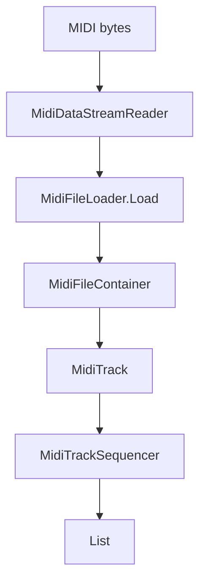

# 依赖与兼容辅助

本页覆盖 `Assembly-CSharp` 中以源码形式随项目一起编译的轻量依赖、项目补充 UI 组件、输入常量、后处理组件、DOTween 扩展和编译兼容占位。它们不是 RD 主流程入口，但会被音频、输入、UI、视觉特效和资源装饰系统调用。

## 源码范围

| 类型族 | 文件 | 职责 |
| --- | --- | --- |
| MIDI 读取 | `SmfLite/MidiDataStreamReader`、`MidiEvent`、`MidiFileContainer`、`MidiFileLoader`、`MidiTrack`、`MidiTrackSequencer` | 读取标准 MIDI 文件字节、解析 track 和事件，并按 BPM 推进事件序列 |
| Unity UI 补充 | `UnityEngine/UI/*` | 文本描边、字距、单字移动、TMP 字符移动和临时列表对象池 |
| Rewired 常量与本地化 | `RewiredConsts/*`、`Rewired/Localization/*` | 输入 action/category/layout ID 常量，Rewired 本地化字符串提供器 |
| Kino 后处理 | `Kino/Feedback`、`Kino/Mirror` | 相机反馈残影和镜像/万花筒式后处理 |
| DOTween 扩展 | `DG/Tweening/Perspective2DSpriteExtensions` | 为 `Perspective2DSprite` 增加 scale、move、jump、shake tween |
| 程序树 | `ProceduralTree/RDProceduralTree` | 生成、扩展和渲染程序化树枝，写材质脉冲参数 |
| 编译兼容 | `System/Runtime/CompilerServices/IsExternalInit` | 为 `init` 语法相关元数据提供占位类型 |

## SmfLite MIDI 读取

| 类型 | 成员 | 行为 |
| --- | --- | --- |
| `MidiDataStreamReader` | `data`、`offset`、`Offset` | 包装 MIDI 字节数组和当前读取偏移。 |
| `MidiDataStreamReader.Advance(int length)` | 偏移推进 | 直接把 `offset` 加上指定长度。 |
| `MidiDataStreamReader.PeekByte()`、`ReadByte()` | 字节读取 | `PeekByte` 不移动偏移；`ReadByte` 返回当前字节并递增偏移。 |
| `MidiDataStreamReader.ReadChars(int length)` | 字符读取 | 连续读 byte 并转成 char 数组。 |
| `MidiDataStreamReader.ReadBEInt32()`、`ReadBEInt16()` | 大端整数 | 按 MIDI 文件格式读取大端 32 位或 16 位整数。 |
| `MidiDataStreamReader.ReadMultiByteValue()` | 可变长数值 | 读取 MIDI 可变长数量，遇到最高位为 0 的 byte 时结束。 |
| `MidiEvent` | `status`、`data1`、`data2` | MIDI 事件结构，`ToString()` 输出十六进制 status 和两个 data。 |
| `MidiFileContainer` | `division`、`tracks` | MIDI 文件容器，保存 PPQN 或 division 以及 track 列表。 |
| `MidiFileLoader.Load(byte[] data)` | 文件解析 | 要求开头为 `MThd`，header 长度为 6；跳过 format，读取 track 数和 division；不支持 SMPTE time code；逐个读取 `MTrk` track。 |
| `MidiFileLoader.ReadTrack(...)` | track 解析 | 读取 delta、running status、meta track name、system exclusive 和普通 MIDI event；普通事件写入 `MidiTrack`。 |
| `MidiTrack` | `DeltaEventPair`、`name`、`AddEvent`、`GetEnumerator`、`GetList`、`GetAtIndex` | 保存 delta 与 `MidiEvent` 的序列。 |
| `MidiTrackSequencer` | `pulsePerSecond`、`Start(float)`、`Advance(float)`、`Playing` | 用 `bpm / 60 * ppqn` 换算每秒 pulse；`Start` 定位第一条事件；`Advance` 累积 pulse，到达事件 delta 后返回当前帧应触发的事件列表。 |

`MidiFileLoader` 会记录 meta event `0xFF 0x03` 为 track name；其他 meta event 直接跳过指定长度。普通 channel event 中，status 高位为 `0xC0` 或 `0xD0` 时只读一个 data byte，否则读两个 data byte。

## Unity UI 补充

| 类型 | 成员 | 行为 |
| --- | --- | --- |
| `CharMovementInfo` | `charIndex`、`movementType`、`multipliers` | 内部结构，保存被移动字符的索引、运动类型和倍率。 |
| `FourSidedOutline` | `effectColor`、`effectDistance`、`useGraphicAlpha`、`ModifyMesh(VertexHelper vh)` | 继承 `BaseMeshEffect`。把原顶点复制到右、上、左、下四个方向，生成四向描边；距离限制在 -600 到 600。 |
| `EightSidedOutline` | `effectColor`、`effectDistance`、`useGraphicAlpha`、`ModifyMesh(VertexHelper vh)` | 生成八个方向的顶点副本，方向包含四轴向和四对角；使用 `ListPool<UIVertex>` 减少临时列表分配。 |
| `LetterSpacing` | `spacing`、`useRichText`、`ModifyVertices(List<UIVertex> verts)` | 按 `spacing * fontSize / 100` 调整每个字符顶点的 x 偏移；支持 b、i、size、color、material 标签过滤，并按 Text alignment 调整行内整体偏移。 |
| `LetterMovement` | `movementController`、`ModifyVertices(...)` | 作用于 Unity `Text`。根据 `movementController.charOffsets` 把每个字符的 6 个顶点整体平移。 |
| `LetterMovementTMP` | `movementController`、`UpdateGraphic()` | 作用于 TMP 文本。强制刷新 mesh 后，遍历可见字符并把对应 4 个顶点加上字符偏移。 |
| `LetterMovementController` | shake、wave、swirl 字段 | 管理要移动的字符集合。`AddCharIndex` 添加字符，`ClearAllChars` 清空偏移；`Update` 中按配置执行抖动、波浪或旋转运动，并刷新 Text 或 TMP 图形。 |
| `ListPool<T>` | `Get()`、`Release(List<T>)` | 基于 `ObjectPool<List<T>>` 的列表池，释放时清空列表。 |
| `ObjectPool<T>` | `Get()`、`Release(T)`、`countAll`、`countActive`、`countInactive` | 通用对象池。栈为空时创建新对象；重复释放栈顶对象会记录错误。 |

`LetterMovementController` 的运动类型来自 `LetterMovementType`：`Shake` 随机设置字符偏移，`Wave` 使用 sine 生成上下偏移，`Swirl` 使用 sine/cosine 生成圆形偏移。

## Rewired 常量与本地化

| 类型 | 成员 | 行为 |
| --- | --- | --- |
| `RewiredConsts.Action` | `gameplayInput = 54`、`gameplayCancel = 60`、`faceLeft = 61`、`faceUp = 62`、`menuSelect = 53`、`menuCancel = 52`、`finerControl = 55`、方向键常量 | Rewired action ID 常量，部分字段带 `ActionIdFieldInfo`，记录 categoryName 与 friendlyName。 |
| `RewiredConsts.Category` | `Default = 0` | Rewired category ID 常量。 |
| `RewiredConsts.Layout.Joystick` | `Default = 0`、`SplitLeft = 1`、`SplitRight = 2` | 手柄 layout ID 常量。 |
| `RewiredConsts.Layout.Keyboard`、`Mouse`、`CustomController` | `Default = 0` | 键盘、鼠标和自定义控制器默认 layout。 |
| `LocalizedStringProviderBase` | `prefetch`、`OnEnable`、`OnDisable`、`TrySetLocalizedStringProvider`、`Reload` | Rewired 本地化 provider 基类。启用时初始化并尝试注册到 `ReInput.localization.localizedStringProvider`；禁用时解除注册；`prefetch` 会同步到 ReInput localization。 |
| `LocalizedStringProvider` | `localizedStringsFile`、`dictionary`、`TryLoadLocalizedStringData` | 从 TextAsset JSON 读取 `Dictionary<string,string>`；加载失败记录错误；查询时从字典按 key 返回本地化字符串。 |

输入系统主流程见 [输入系统](/api/runtime/input-system.md)。本页只记录 Rewired 生成常量和本地化 provider 的源码行为。

## Kino 后处理

| 类型 | 成员 | 行为 |
| --- | --- | --- |
| `Kino.Feedback` | `color`、`offsetX`、`offsetY`、`rotation`、`scale`、`jaggies` | 相机反馈残影效果参数。 |
| `Kino.Feedback.feedbackMaterial` | 材质缓存 | 没有指定 shader 时查找 `Hidden/Kino/Feedback`，并创建 `HideFlags.DontSave` 材质。 |
| `Kino.Feedback.delayBuffer` | 延迟帧缓存 | 按 target camera 的 pixelWidth/pixelHeight 创建 `RenderTextureFormat.DefaultHDR` 的 RenderTexture。 |
| `Kino.Feedback.feedbackCommand` | CommandBuffer | 创建名为 `Kino.Feedback` 的 command buffer，把 delay buffer 通过 feedback material blit 到 CameraTarget。 |
| `Kino.Feedback.Update()` | 参数同步 | 确保 command buffer 已挂到 `CameraEvent.BeforeForwardAlpha`；分辨率变化时调整 delay buffer；写 `_Color`、`_Offset`、`_Rotation`、`_Scale`，并按 `jaggies` 切换 filterMode。 |
| `Kino.Feedback.OnRenderImage(...)` | 渲染 | 把 source blit 到 delayBuffer，再把 source blit 到 destination。 |
| `Kino.Feedback.OnDisable()` | 清理 | 从相机移除 command buffer，释放 delay buffer，销毁材质。 |
| `Kino.Mirror` | `_repeat`、`_offset`、`_roll`、`_symmetry`、`_shader` | 相机镜像效果。`OnRenderImage` 创建材质，写 `_Divisor`、`_Offset`、`_Roll`，按 `_symmetry` 启停 `SYMMETRY_ON` keyword，然后 blit。 |

`RDKaleidoscope` 会缓存 `Kino.Mirror` 并调用 repeat、offset、roll、symmetry 相关 setter，相关运行时页面见 [视觉与动画辅助类](/api/runtime/visual-animation-helpers.md)。

## DOTween 透视 Sprite 扩展

| 方法 | 行为 |
| --- | --- |
| `Perspective2DSpriteExtensions.DOScale(Perspective2DSprite, Vector3, float)` | tween `Perspective2DSprite.scale` 到目标 Vector3，并把 tween target 设为该 Sprite。 |
| `DOScale(Perspective2DSprite, float, float)` | 把 float 目标值扩展为同值 Vector3。 |
| `DOMove(Perspective2DSprite, Vector3, float, bool snapping)` | tween `Perspective2DSprite.position` 到目标位置，按参数设置 snapping。 |
| `DOJump(Perspective2DSprite, Vector3, float jumpPower, int numJumps, float duration, bool snapping)` | 创建 sequence；X 和 Z 线性移动，Y 轴做相对 yoyo 跳跃，并在更新时叠加到目标 y 偏移。`numJumps` 小于 1 时改为 1。 |
| `DOShakePosition(Perspective2DSprite, float duration, float strength, int vibrato, float randomness, bool snapping, bool fadeOut)` | duration 小于等于 0 时记录警告并返回 null；否则使用 `DOTween.Shake` 作用于 `position`。 |

这些扩展给 `Perspective2DSprite` 提供和 Transform 类似的 DOTween 调用方式，棒球、视觉小物件和透视 Sprite 组件可以直接使用。

## 程序树

| 类型 | 成员 | 行为 |
| --- | --- | --- |
| `RDProceduralTree.Branch` | `transform`、`segMiddle`、`segEnd`、`size`、`deviation`、`rendMiddle`、`rendEnd` | 表示一段树枝，包含中段和端点 prefab。 |
| `Branch.Resize(Vector2 size)`、`Resize()` | 尺寸更新 | `segEnd` 按 x 等比缩放，`segMiddle` 按 x 与 y/2 缩放，端点放到 y=size.y。 |
| `Branch` 材质属性 setter | `extrusionIntensity`、`pulseWavelength`、`pulsePhaseShift`、`pulseRate`、`restColor`、`pulseColor` | 同时写入中段和端点 Renderer 材质。 |
| `RDProceduralTree.Awake()` | 初始树枝 | 生成 500 个 branch pool，创建一个初始 branch，长度为 0，并把相机 lerp 到初始位置附近。 |
| `InitRNG(int seed)` | 随机源 | 用指定 seed 创建 `System.Random`。 |
| `InitRenderTexture()` | 渲染贴图 | 通过 `RDBase.Vfx.CreateRenderTexture(1)` 创建 render texture，赋给 camera target 和 quad 材质主贴图。 |
| `Spread(int amount)` | 分叉 | 从当前 branches 中随机取 `amount` 个，每个生成 `branchesPerDivision` 个新 branch，位置在原 branch 末端，角度由 `angle` 和随机 y 旋转决定，并设置 deviation。 |
| `Update()` | 生长 | 按 `iterationsPerSecond` 控制节奏，持续增加当前 branch 长度，写材质脉冲参数，定时 `Spread`，同时根据所有 branch bounds 平滑移动和旋转相机。 |
| `OnDestroy()` | 清理 | 释放并销毁 render texture。 |

## 编译兼容占位

| 类型 | 行为 |
| --- | --- |
| `System.Runtime.CompilerServices.IsExternalInit` | 空内部静态类，用于让当前编译目标识别 `init` 相关元数据。源码中没有字段和方法。 |
| `UnitySourceGeneratedAssemblyMonoScriptTypes_v1` | Unity 生成的 MonoScript 类型索引元信息，带 `CompilerGenerated`、`EditorBrowsable(Never)` 和 `GeneratedCode` 标记；内部 `MonoScriptData` 保存脚本路径数据、类型数据、类型总数、文件总数和是否 editor-only。 |

## 与其他页面的关系

| 页面 | 关系 |
| --- | --- |
| [输入系统](/api/runtime/input-system.md) | 解释 Rewired action 常量如何进入 RD 输入层。 |
| [视觉与动画辅助类](/api/runtime/visual-animation-helpers.md) | 使用 `Kino.Mirror`、`Perspective2DSpriteExtensions`、`RDProceduralTree` 等视觉依赖。 |
| [小游戏与测试组件](/api/runtime/mini-games-tests.md) | 波形测试、举重音频和测试脚本会复用本页的部分辅助类型。 |
| [架构依赖说明](/architecture/dependencies.md) | 汇总 Unity 包、插件和第三方命名空间。 |

