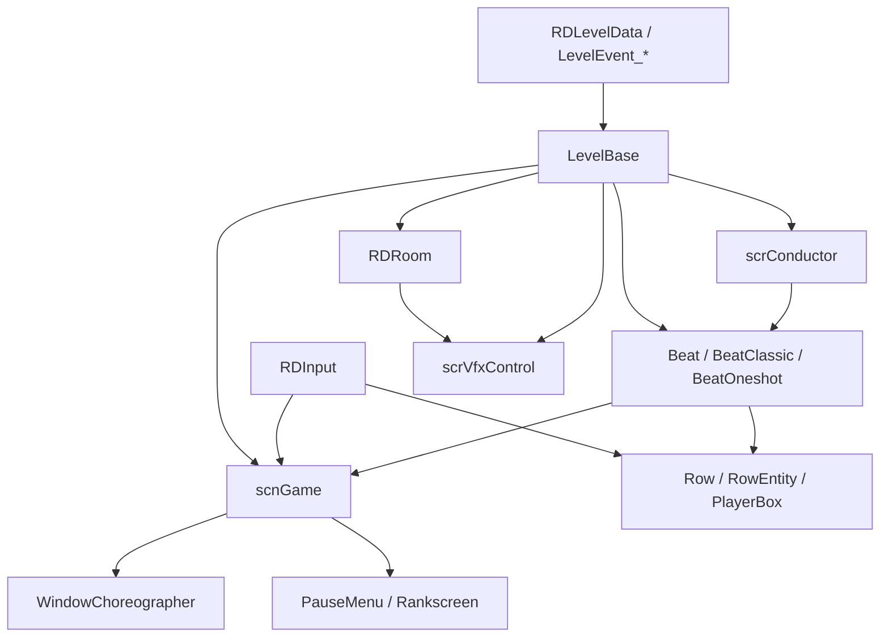

# 运行时系统总览

本页整理 Rhythm Doctor 关卡运行时的主干对象和数据流。编辑器事件最终会写入 `LevelBase`、`scnGame`、`scrConductor`、行、房间、窗口和 VFX 系统，运行时阅读可以从这些入口继续向下追踪。

## 源码范围

| 类型 | 源码路径 | 运行时职责 |
| --- | --- | --- |
| `scnGame` | `RDFucked/Assets/Scripts/Assembly-CSharp/scnGame.cs` | 游戏场景主控制器，保存当前关卡、行、房间、窗口、命中、暂停和流程状态。 |
| `LevelBase` | `RDFucked/Assets/Scripts/Assembly-CSharp/LevelBase.cs` | 关卡脚本基类，负责事件调度、关卡状态、标签事件、行和房间驱动。 |
| `scrConductor` | `RDFucked/Assets/Scripts/Assembly-CSharp/scrConductor.cs` | 音频时间轴、BPM、拍号、播放、暂停、Scrub 和定时播放入口。 |
| `Beat` | `RDFucked/Assets/Scripts/Assembly-CSharp/Beat.cs` | 节拍实体基类，保存输入时间、释放时间、判定权重、行、音频和爆心调度。 |
| `BeatClassic` | `RDFucked/Assets/Scripts/Assembly-CSharp/BeatClassic.cs` | Classic 行七拍序列，负责 pulse sound、计数音、swing、synco、hold pulse 和 beatbox 状态。 |
| `BeatOneshot` | `RDFucked/Assets/Scripts/Assembly-CSharp/BeatOneshot.cs` | Oneshot 节拍，负责 boom、rush、chak、freeze、burn、hold、subdivision 和 wave 联动。 |
| `RDInput` | `RDFucked/Assets/Scripts/Assembly-CSharp/RDInput.cs` | 静态输入聚合器，整合键盘、手柄、窗口舞蹈输入、模拟输入和双人交换。 |
| `RDRoom` | `RDFucked/Assets/Scripts/Assembly-CSharp/RDRoom.cs` | 单个房间的相机、渲染纹理、行容器、精灵容器、背景、遮罩、主题和房间 VFX。 |
| `scrVfxControl` | `RDFucked/Assets/Scripts/Assembly-CSharp/scrVfxControl.cs` | 全局 VFX 控制器，管理 HUD camera、房间叠加层、闪光、震屏、背景、歌词、粒子、分辨率和屏幕效果。 |
| `WindowChoreographer` | `RDFucked/Assets/Scripts/Assembly-CSharp/WindowChoreographer.cs` | 窗口舞蹈抽象入口。 |
| `RealWindowChoreographer` / `VirtualWindowChoreographer` | `RDFucked/Assets/Scripts/Assembly-CSharp/RealWindowChoreographer.cs`、`VirtualWindowChoreographer.cs` | 实体窗口与虚拟窗口舞蹈实现。 |

## 主干数据流

## 运行时模块分组

| 模块 | 入口类型 | 负责内容 |
| --- | --- | --- |
| [时间轴与音频](/api/runtime/audio-runtime.md) | `scrConductor`、`AudioManager` | `audioPos`、`visualPos`、小节与节拍换算、BPM、拍号、音频调度、Scrub。 |
| [关卡流程](/api/runtime/scene-flow.md) | `scnGame`、`LevelBase`、`PauseMenu`、`Rankscreen` | 加载关卡、准备事件、运行事件、暂停、失败、完成、重新开始、预览。 |
| 节拍与判定 | `Beat`、`BeatClassic`、`BeatOneshot` | 输入时间、释放时间、miss、hit offset、错误权重、爆心、hold、自动模式。 |
| 输入 | `RDInput`、`RDInputType_*` | P1/P2 主输入、方向输入、取消、跳过、重开、手柄连接、键盘默认输入、模拟输入。 |
| 行与角色 | `Row`、`RowEntity`、`scrPlayerbox`、`scrBeatbox` | 行状态、角色、pulse sound、beatbox 动画、玩家归属和行显示。 |
| 房间 | `RDRoom`、`RoomCamera` | 房间相机、房间 render texture、背景、遮罩、透视、主题、房间内行和精灵。 |
| 全局视觉 | `scrVfxControl` | 闪光、黑屏、震屏、背景、前景、歌词、浮动文字、粒子、屏幕反转、分辨率。 |
| [窗口舞蹈](/api/runtime/windows.md) | `WindowChoreographer`、`WindowDancer`、`Window` | 主窗口、虚拟窗口、真实窗口、窗口视图、窗口移动和排序。 |

## 时间与节拍对象

`scrConductor` 提供运行时的绝对时间和小节节拍换算。`Beat` 子类创建后会保存以绝对时间表示的输入点：

| 字段 | 类型 | 来源与作用 |
| --- | --- | --- |
| `inputTimeSansCalibration` | `double` | 未加输入校准的命中时间。 |
| `releaseTimeSansCalibration` | `double` | 未加输入校准的释放时间，用于 hold。 |
| `inputTime` | `double` | 加上 P1/P2 输入校准后的命中时间；玩家驱动第 7 拍时使用 `playerDriven7thBeatHitTime`。 |
| `releaseTime` | `double` | 加上输入校准后的释放时间；玩家驱动第 7 拍时保持原输入到释放的时间差。 |
| `explodeTimeAbs` | `double` | 爆心时间，`Create8thBeat()` 会据此调度心脏爆炸。 |
| `bar` | `int` | 创建节拍时的 conductor monotonic 小节。 |
| `row` | `Row` | 当前节拍所属行。 |
| `weight` | `float` | 错误权重，来自关卡 `mistakeWeight` 与行 `mistakeWeight` 的乘积。 |

## Beat 基类职责

| 方法 | 行为 |
| --- | --- |
| `RefreshMistakeWeight()` | 读取当前关卡和行的错误权重，写入 `weight`。 |
| `Update()` | 检查超时 miss、CPU 自动触发、hold release pop、bomb beat 和行失效删除。 |
| `LateUpdate()` | 处理 hold 自动释放、自动模式模拟按键和延迟销毁。 |
| `DestroyBeat(...)` | 标记 dead，刷新 Classic beatbox，停止音频，调用 `OnDestroyBeat`，从 `game.beats` 移除。 |
| `Create8thBeat()` | 根据当前关卡爆心设置调度心脏爆炸和爆炸音效。 |
| `PlayHitSoundIfNoOthersPlaying(...)` | 避免同时间同玩家重复 clap sound，并按行设置播放命中音。 |
| `PlayHeldClapSound(...)` | 为 hold hit 安排开始与结束 clap 音。 |
| `MoveBackBy(double time)` | Scrub 或时间回退时移动输入、释放和爆心时间。 |
| `RunEventsTaggedOnMiss(int rowID)` | miss 时运行 `[onMiss]` 和 `[rowX]` 标签事件。 |

`Beat.Update()` 在输入时间之后 0.4 秒仍未命中时处理 big miss：更新状态文本、角色表情、命中偏移、错误计数、边框反馈、`scrExecuteOnHit` 和当前关卡 `OnHit(HitType.BigMiss, this)`。

## Classic 与 Oneshot

| 类型 | 创建入口 | 运行时重点 |
| --- | --- | --- |
| `BeatClassic` | `Add7BeatsClassic()`、`Add7BeatsFreetime()`、`Add7BeatsFreetimeFlexible()` | 把 7 拍拆成 `SingleBeat` 列表，计算 swing、synco、hold pulse、pulse sound、计数音、beatbox 状态和爆心。 |
| `BeatOneshot` | `AddBeatOneShot()` | 计算 boom、rush、chak 三个时间点，处理 freeze、burn、hold、subdivision、wave offset、friend group 和特殊 cue 音。 |

`BeatClassic.SingleBeat` 保存 `beatboxNumber`、`timeAbs`、`timeReleaseAbs`、到下一拍的间隔、bend 和对应音频。`BeatClassic.UpdateCurrentBeatbox()` 用 `conductor.visualPos` 找出当前激活 beatbox，并刷新行上的 `scrBeatbox` 显示。

`BeatOneshot` 保存 `boomTimeAbs`、`rushTimeAbs`、`chakTimeAbs`，并通过 `friends` 和 `friendGroup` 管理同一输入点的 subdivision 或 freeze/burn 组合。`unhittable` 会让同组中非主判定 beat 不参与命中。

## 输入聚合

`RDInput` 是静态输入门面，`Setup()` 初始化 P1/P2 输入、默认键盘输入、模拟输入状态，并注册 Rewired 手柄连接与断开事件。

| 字段 | 作用 |
| --- | --- |
| `p1` / `p2` | 当前 P1/P2 主输入类型，通常是 joystick 或 custom button。 |
| `p1Default` / `p2Default` | P1/P2 默认键盘输入。 |
| `emuStates` | 自动模式、CPU 或脚本触发的模拟按键状态。 |
| `p1Press` / `p2Press` | 当前帧 P1/P2 主键按下。 |
| `p1IsPressed` / `p2IsPressed` | 当前帧 P1/P2 主键保持。 |
| `p1Release` / `p2Release` | 当前帧 P1/P2 主键释放。 |
| `anyPlayerPress` / `anyPlayerRelease` | 任意玩家主键按下或释放。 |
| `skipPressed` / `restartPressed` / `quitPressed` / `cancelPress` | 系统级操作输入。 |
| `xAxis` / `yAxis` | 手柄方向轴聚合值。 |

`RDInput.Update()` 每帧更新所有输入源。`scnGame.tapsOnly` 开启时，按下和释放都会被当作短按输入，并用 `p1HoldTime`、`p2HoldTime` 维持 0.25 秒的按住状态。

## 房间与 VFX

`RDRoom` 是单个房间的运行容器，拥有独立 `Camera`、`RoomCamera`、行容器、精灵容器、背景容器、overlay、mask 和 render texture。房间事件最终会调用它的移动、缩放、旋转、透明度、遮罩、透视和主题相关方法。

`scrVfxControl` 是全局 VFX 管理器，`Awake()` 设置 `RDBase.Vfx`，创建 HUD overlay，并初始化 shader 数据。`LoadGameEffects()` 加载闪字、glitch、noise 等关卡内效果。

| 系统 | 关键方法 |
| --- | --- |
| 黑屏与闪光 | `FadeOut()`、`FadeIn()`、`Flash()`、`ReverseFlash()`、`BlackScreenOn()`、`BlackScreenOff()` |
| 背景与前景 | `AddBgSingle()`、`AddBg()`、`RemoveBackground()`、`BgColor()`、`GetForegroundTextureLayer()` |
| 相机与屏幕 | `GetCamera()`、`ShakeCam()`、`ShakeCamSmooth()`、`StopShakeCam()`、`InvertScreenColors()`、`SetFlipScreenX()`、`SetFlipScreenY()` |
| 文本与歌词 | `CreateFloatingText()`、`AdvanceLyricsText()`、`FlashText()`、`FlashTextUI()`、`ShowMaskedText()` |
| 粒子与特效 | `SpawnParticles()`、`ShowParticlePreset()`、`PlayBassDropEffect()`、`BassDropNew()` |
| 分辨率 | `GetResolutionForScale()`、`SetResolutionWithScale()`、`SetFullscreen()`、`SetDefaultFullscreenResolution()` |

## 事件到运行时的落点

| 编辑器事件族 | 运行时落点 |
| --- | --- |
| 歌曲、BPM、拍号 | `scrConductor` 的播放、BPM 和小节换算。 |
| Classic / Oneshot / FreeTime | `BeatClassic`、`BeatOneshot`、`game.beats`、`RowEntity`。 |
| 行控制 | `Row`、`RowEntity`、`scrPlayerbox`、`scrBeatbox`。 |
| 房间控制 | `RDRoom`、`RoomCamera`、房间 overlay、房间 render texture。 |
| 视觉与镜头 | `scrVfxControl`、`RDRoom`、`RDCamera`、Unity image effects。 |
| 精灵 | `CustomSprite`、房间 `spriteContainer`、排序层、材质和动画。 |
| 窗口 | `WindowChoreographer`、`WindowDancer`、`Window`、`VirtualWindowView`。 |
| 文本、旁白、对话 | `RDInk`、`LyricsGame`、`Narration`、`scrVfxControl`。 |
| 暂停、失败、结算 | `scnGame`、`PauseMenu`、`PauseMenuMode`、`Rankscreen`。 |

## 运行时专题

| 页面 | 覆盖类型 |
| --- | --- |
| [节拍与判定](/api/runtime/beats-judgement.md) | `Beat`、`BeatClassic`、`BeatOneshot`、`HitType`、`OffsetType`、`RDHitStrip`、`HitStripManager` |
| [输入系统](/api/runtime/input-system.md) | `RDInput`、`RDInputType`、`RDInputType_Keyboard`、`RDInputType_Joystick`、`RDInputType_Touch`、`RDInputAction` |
| [行与角色](/api/runtime/rows-characters.md) | `Row`、`RowEntity`、`scrPlayerbox`、`scrBeatbox`、`Character` |
| [房间与 VFX](/api/runtime/rooms-vfx.md) | `RDRoom`、`scrVfxControl`、`RDCamera`、`Background`、`RoomCamera` |
| [窗口系统](/api/runtime/windows.md) | `WindowChoreographer`、`RealWindowChoreographer`、`VirtualWindowChoreographer`、`WindowDancer`、`Window` |
| [音频运行时](/api/runtime/audio-runtime.md) | `scrConductor`、`RDGameSounds`、`SoundData`、`AudioManager`、混音组路径 |
| [场景流程与暂停流程](/api/runtime/scene-flow.md) | `scnGame`、`PauseMenu`、`PauseMenuMode`、`Rankscreen`、`GameState`、`LevelSource`、`LevelType` |

## 相关页面

| 页面 | 关系 |
| --- | --- |
| [LevelBase](/api/core/LevelBase.md) | 关卡脚本与运行时事件调度基类。 |
| [scnGame](/api/core/scnGame.md) | 游戏场景状态、行、房间、判定和流程入口。 |
| [scrConductor](/api/core/scrConductor.md) | 音频时间轴和节拍换算核心。 |
| [事件运行路径](/api/editor-events/runtime-flow.md) | 编辑器事件进入运行时调度的链路。 |
| [节拍与判定](/api/runtime/beats-judgement.md) | `Beat`、按下、释放、漏拍和命中条。 |
| [输入系统](/api/runtime/input-system.md) | P1/P2 输入聚合、键盘、手柄、触摸、模拟按键和双人交换。 |
| [行与角色系统](/api/runtime/rows-characters.md) | 行数据、行实体、playerbox 判定框、Classic beatbox 和角色枚举。 |
| [房间与 VFX 系统](/api/runtime/rooms-vfx.md) | 房间 render texture、相机、背景前景、遮罩透视、overlay、主题和 VFX preset。 |
| [窗口系统](/api/runtime/windows.md) | 窗口编舞器、真实窗口、虚拟窗口、WindowDancer preset、窗口事件和 blit 链路。 |
| [音频运行时](/api/runtime/audio-runtime.md) | 音频加载、外部 clip、游戏音效表、mixer group、歌曲和节拍音调度。 |
| [场景流程与暂停流程](/api/runtime/scene-flow.md) | 加载、开始、暂停、跳过、重开、失败、胜利和结算退出。 |

