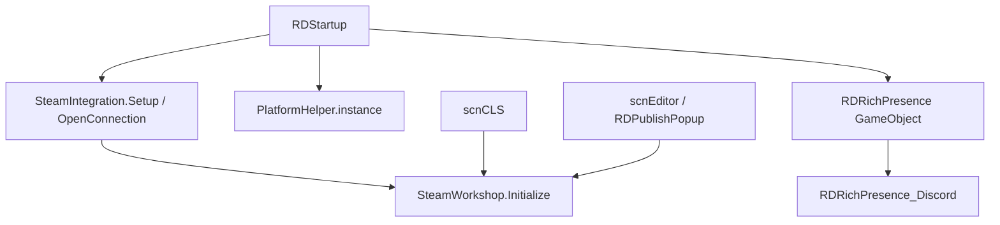

# 平台与服务辅助类

本页覆盖 RD 主工程中与外部服务、平台差异、文件抽象、富状态、Steam Workshop 和自定义关卡选择器服务入口有关的类。它们不是节拍判定主流程的一部分，但会影响启动、关卡选择、编辑器发布、窗口控制、用户身份、平台开关和文件读写。

## 源码范围

| 类型族 | 主要文件 | 职责 |
| --- | --- | --- |
| 启动接入 | `RDStartup`、`SteamIntegration`、`SteamWorkshop`、`RDRichPresence` | 启动时初始化 Steam、Workshop、平台 helper 和富状态对象 |
| 外部 Web 服务 | `Analytics`、`EditorWebServices`、`EntitlementsService` | 上传分支信息、读取认证作者数据、检查和兑换 entitlement |
| 富状态 | `DiscordPresence`、`RDRichPresence`、`RDRichPresence_Discord`、`RDRichPresenceHandler` | 根据当前场景设置 Discord activity，读取用户名称和用户 ID |
| 平台抽象 | `Platform`、`PlatformHelper`、`PlatformHelperWindows`、`PlatformHelperMac`、`PlatformHelperSwitch`、`UnityPlayerWindow*`、`RDDisableOnPlatform` | 平台枚举、显示器信息、窗口舞蹈区域、原生窗口控制和平台启停 |
| 文件与文件关联 | `RDFile`、`RDFile_Default`、`ExtensionAssociation`、`SoundFileOpener` | 统一文件读写入口、Windows `.rdlevel` 关联、临时音频文件播放 |
| 自定义关卡选择器 | `CustomLevelSyringe`、`GdkPlatformSettings`、`scrTextMobileDesktopSwitch`、`TextSwitch` | 自定义关卡针筒 UI、GDK 标识、移动/桌面文案切换和选项文本切换 |

## 启动接入

| 入口 | 源码行为 |
| --- | --- |
| `RDStartup.Startup()` | 在 `ForceNoSteamworks` 为 false 时调用 `SteamIntegration.Setup()` 和 `SteamIntegration.OpenConnection()`；Steam 初始化成功后调用 `SteamWorkshop.Initialize()`。 |
| `RDStartup.LoadPlatformHelpers()` | 当前源码直接把 `PlatformHelper.instance` 设置为 `new PlatformHelperWindows()`。 |
| `RDStartup.LoadRichPresence()` | 当 `scnBase.isDesktop` 或 `scnBase.isXbox` 为真时，创建名为 `RichPresence` 的 GameObject 并添加 `RDRichPresence`。 |
| `RDStartup.GetSteamBranch()` | Steam 初始化并读取到 beta 名称时，把分支名写入 `GC.steamBranchName`。 |

## SteamIntegration

`SteamIntegration` 是 Steamworks.NET 的静态接入层。它保存 Steam 初始化状态、用户 ID、统计、成就和 Steam 回调对象。

| 成员 | 行为 |
| --- | --- |
| `initialized` | 表示 Steam API 是否初始化成功；多数 Steam 相关方法先检查该字段。 |
| `userSteamID` | `Setup()` 成功后写入 `SteamUser.GetSteamID()` 的 ulong 值。 |
| `SteamAchievement` | 保存 achievement id、显示名称、描述和是否完成。 |
| `SteamStat` | 保存 stat 名称、数值和是否按 int 处理。 |
| `IsSteamInBigPictureMode` | Steam 未初始化时返回 false；初始化后读取 `SteamUtils.IsSteamInBigPictureMode()`。 |
| `Setup()` | 防止同一 session 重复初始化；执行 Steamworks packsize 和 dll 检查；调用 `SteamAPI.Init()`；成功时读取 beta 名称、SteamID，并写入 `DebugSettings.instance.RunningOnSteamDeck`。 |
| `OpenConnection()` | 创建 gameID 和用户统计回调，调用 `SteamUserStats.RequestCurrentStats()` 并读取本地 stat 数组。 |
| `CheckCallbacks()` | Steam 初始化后执行 `SteamAPI.RunCallbacks()`。 |
| `CloseConnection()` | 调用 `SteamAPI.Shutdown()`，并把初始化标志复位。 |
| `GetStatValue(...)` | 按 `Stat` 枚举在本地 `steamStatArray` 中查值，支持 int 和 float 引用参数。 |
| `SetStatValue(...)` | 找到 stat 后累加数值，写入 SteamUserStats 并调用 `StoreStats()`。 |
| `GetSteamFriends()`、`GetPlayersName()` | 读取 Steam 好友名称列表和当前玩家名称。 |
| `UnlockAchievement(...)`、`StoreStats()` | 设置 achievement，并按参数或外部调用提交统计。 |

`OnUserStatsReceived`、`OnUserStatsStored` 和 `OnAchievementStored` 是 Steam 回调。前者同步 achievement 显示字段和 stat 值；后两个只记录提交和成就进度结果。

## SteamWorkshop

`SteamWorkshop` 管理 Steam UGC 查询、订阅、本地 Workshop 关卡、上传、更新和删除。它主要被 `scnCLS`、`LevelDetail` 和 `RDPublishPopup` 调用。

| 成员 | 行为 |
| --- | --- |
| `ResultItem` | 保存 Workshop item id、标题、本地路径和预览图路径。 |
| `Error` | 上传、下载、查询、取消订阅和预览图校验错误枚举。 |
| `Warnings` | 上传前截断 title、description、tags 时记录的警告枚举。 |
| `errors`、`warnings`、`resultItems`、`totalPublishedItems` | 保存最近一次 Workshop 操作的结果状态。 |
| `ItemsSubscribed` | 返回 `newSubscribedItemsDict` 的数量。 |
| `OperationSucceeded` | `errors.Count == 0`。 |
| `GetCurrentDownloadingItemTitle` | 遍历新订阅 item，返回当前处于 downloading 状态的标题。 |
| `ItemsInstalled` | 统计 `ReadyToUse()` 为真的新订阅 item。 |
| `Initialize()` | 注册下载、Overlay、订阅、取消订阅和安装回调，并刷新订阅 item 数组。 |
| `OpenWorkshop()`、`OpenAgreement()` | 通过 Steam overlay 打开 Workshop 浏览页或协议页。 |
| `OverlayEnabled()` | Steam 初始化后返回 `SteamUtils.IsOverlayEnabled()`。 |
| `OnToggleGameOverlay(...)` | Overlay 打开时关闭 `scnCLS` 和 level detail 输入，关闭后恢复输入。 |
| `OnPublishedFileSubscribed(...)` | AppID 匹配时把 item 加入字典，并启动 `GetItemTitle` 查询标题。 |
| `OnPublishedFileUnsubscribed(...)` | AppID 匹配时从字典移除 item，并根据是否由游戏内触发更新 `itemsUnsubscribed`。 |
| `GetPublishedItems(int pageNumber, Action<int> OnLoadingLevel)` | 查询玩家发布的 Workshop item，下载预览图到临时目录，并填充 `resultItems`。 |
| `ReadyToUse(this PublishedFileId_t)` | 扩展方法，读取 SteamUGC item state 判断 item 是否可用。 |
| `GetLocalItems()` | 读取本地订阅 item，下载未完成 item，并收集可用关卡路径。 |
| `CheckDownloadInfo()`、`CheckUploadInfo()` | 输出下载或上传进度。 |
| `ShowItemOnWorkshop(PublishedFileId_t)` | 根据 Steam Deck 状态选择 overlay URL 格式，打开指定 item 页面。 |
| `UnsubscribeItem(PublishedFileId_t)` | 发起取消订阅请求，成功后让 level detail 移除当前关卡。 |
| `UploadToWorkshop(...)` | 校验标题、预览图、目录、描述和 tags；需要新 item 时先 `CreateItem`，随后 `StartItemUpdate`、设置 title/content/preview/description/tags/visibility，最后提交更新。失败时记录错误并删除新建 item。 |

上传校验中，标题按 127 字节限制截断，description 按 1000 字符限制截断，tag 按 64 字节限制截断；预览图必须存在，文件长度必须大于 16 且小于 1000000。

## Analytics、EditorWebServices 与 EntitlementsService

| 类型 | 成员 | 行为 |
| --- | --- | --- |
| `Analytics` | `UploadBranchToUnity()` | 每天最多执行一次。读取 `Persistence.GetLastAnalyticsUpdate()`，当天未上传时更新日期；Steam 初始化后尝试读取当前 beta 名称，并向 Unity Analytics 发送 `VersionInfo` 事件，字段为 `branch`。 |
| `EditorWebServices` | `verifiedArtistsPath` | 返回 `Application.persistentDataPath/verified_artists.json`。 |
| `EditorWebServices` | `LoadAllArtists(Action onCompleted)` | 当静态 `artists` 为空时启动 `GetArtists(" ", onCompleted)`。 |
| `EditorWebServices` | `GetArtists(string search, Action onCompleted)` | 中断上一次 `getArtists` 请求，向 `https://7thbeat.sgp1.digitaloceanspaces.com/rd_dump/rd_artists.json` 发 GET。成功后解析 JSON 列表，填充 `ArtistData.id`、`name`、`nameLowercase`、`evidenceURLs`、`link1`、`link2` 和 `approvalLevel`。 |
| `EditorWebServices` | `PostArtistRequest()`、`UploadArtist(...)`、`UploadArtistDemo()` | 使用 multipart form 发送艺术家请求或上传证据图片，当前源码中作为私有 coroutine 示例存在。 |
| `EntitlementsService` | `Start()` | 调用 `GetPlayerIdentifier()` 和 `GetEntitlements()`。 |
| `EntitlementsService` | `GetPlayerIdentifier()` | Steam 初始化时把 `playerIdentifier` 设置为 `steam:{SteamID}`。 |
| `EntitlementsService` | `GetEntitlementsRequest()` | GET `https://7thbe.at/api/entitlements/check?player_identifier=...`，responseCode 为 200 时反序列化 entitlement 字符串数组。 |
| `EntitlementsService` | `RedeemCode(string code, Action<bool,string> onCompleteAction)` | 先检查玩家标识，再把 code trim 并转大写，要求匹配 `^[A-Z0-9]{8}$`；通过后发起兑换请求。 |
| `EntitlementsService` | `RedeemCodeRequest(...)` | POST JSON 到 `https://7thbe.at/api/entitlements/redeem`；按 responseCode 选择本地化 key，200 时刷新 entitlement 列表，并通过回调返回成功标志和消息 key。 |

`EditorWebServices` 的 `langCodeToLanguage` 字典映射 `en`、`ko`、`zhs`、`zht`、`es`、`pt`、`ja`、`pl`、`ru`、`ro`、`vi`、`fr` 到 Unity `SystemLanguage`。

## 富状态

| 类型 | 成员 | 行为 |
| --- | --- | --- |
| `DiscordPresence` | `Full`、`NoEditor`、`NoCustom`、`Never`、`Disabled` | 用户设置枚举，影响富状态暴露范围。 |
| `RDRichPresence.IsAvailable` | 平台可用判断 | 非桌面平台时只允许 Xbox；桌面平台直接可用。 |
| `RDRichPresence.Awake()` | 单例初始化 | 不可用时销毁自身；首个实例创建 `RDRichPresence_Discord`、调用 `Setup()` 并 `DontDestroyOnLoad`，重复实例销毁。 |
| `RDRichPresence.Update()` | 编辑器歌曲缓存 | 每帧调用 handler `Update()`；在编辑器场景中从 `levelSettings.song` 或 `openedFilePath` 生成 `cachedSong`，变化时刷新 presence。 |
| `RDRichPresence.UpdatePresence()` | 状态分派 | 根据当前 `scnCLS`、`scnRhythmWeightlifter`、`scnMenu`、`scnEditor`、`scnExpoMenu`、`scnLevelSelect`、`scnGame` 选择 details 和 state，再调用 handler `SetPresence`。 |
| `RDRichPresence_Discord.Setup()` | Discord 初始化 | 创建 Discord client，注册 Steam app id，并监听当前用户更新来写入用户名和用户 ID。 |
| `RDRichPresence_Discord.Update()` | 回调与重连 | client 为空且到达 `nextReconnectTime` 时重新初始化；否则执行 `RunCallbacks()`，异常时释放并安排重连。 |
| `RDRichPresence_Discord.SetPresence(string state, string details)` | Activity 写入 | details 通过 `RDString.Get("discord." + details)` 本地化，state 和 details 都截断到 127 字节，再写入 Discord activity。 |
| `RDRichPresenceHandler` | 抽象方法 | 定义用户信息、设置模式、Setup、Dispose、Update、ClearPresence、SetPresence 和三类状态文本生成方法。 |

暂停菜单通过 `Persistence.GetDiscordPresence()` 和 `Persistence.SetDiscordPresence(...)` 读写该设置；设置变化后会调用 `RDRichPresence.Instance?.UpdatePresence()`。

## 平台与窗口抽象

| 类型 | 成员 | 行为 |
| --- | --- | --- |
| `Platform` | `None`、`Linux`、`Mac`、`Windows`、`Android`、`iOS`、`Switch`、`WebGL`、`Xbox` | 平台枚举。 |
| `PlatformHelper.Rectangle` | `Left`、`Top`、`Right`、`Bottom` | 显示器矩形结构，`ToString()` 输出四边界。 |
| `PlatformHelper.Monitor` | `bounds`、`scale` | 显示器边界和缩放比例。 |
| `PlatformHelper.WindowDanceResolution` | 属性 | 缓存 `GetWindowDanceResolution()` 的结果，首次计算或变化时输出日志。 |
| `PlatformHelper.Monitors` | 属性 | 缓存 `GetMonitors()` 的结果，数量变化时输出日志。 |
| `PlatformHelper.ResetWindowStageValues()` | 缓存清理 | 清空窗口舞蹈分辨率和显示器缓存。 |
| `PlatformHelper.GetMonitorsRect(...)` | 矩形合并 | 根据显示器矩形、当前显示器和 `onlyHorizontal` 选项，计算可用于窗口舞蹈的最大矩形；无显示器数据时回退到最大 `Screen.resolutions`。 |
| `PlatformHelperWindows` | Win32 互操作 | 使用 user32、gdi32、shcore API 获取显示器、DPI、窗口位置、窗口标题、前台窗口、最小化状态和窗口聚焦。 |
| `PlatformHelperWindows.GetMonitors()` | Windows 显示器筛选 | 判断系统是否支持多显示器；窗口舞蹈模式为 `OneScreen` 时只返回当前显示器，否则按当前显示器 DPI 筛选同缩放显示器。 |
| `PlatformHelperWindows.TranslateWindowPos(...)` | 坐标转换 | 把 RD 的左下角坐标转换成 Windows 桌面坐标，并叠加 bottom-left desktop point。 |
| `PlatformHelperMac` | `RDMacPlugin` | 通过原生插件设置窗口、读取屏幕缩放、URL 事件和屏幕矩形；`GetURLString()` 从插件取 UTF-8 URL 字符串并释放原生内存。 |
| `PlatformHelperSwitch` | Switch 占位 | `GetWindowDanceResolution()` 返回 `(0,0)`，`GetMonitors()` 抛出 `NotImplementedException`。 |
| `UnityPlayerWindow` | 主窗口包装 | 继承 `RealWindow`，包装 `PlayerWindow.Instance`，刷新 handle，设置标题，校验窗口舞蹈状态，控制显示和置顶。 |
| `UnityPlayerWindowWindows` | Windows 主窗口 | 用 `PlayerWindow` 设置窗口大小；隐藏时把窗口移动到 `(-10000,-10000)`；位置读取交给 `PlatformHelperWindows.GetWindowPosition`。 |
| `UnityPlayerWindowMac` | Mac 主窗口 | 把 RD 坐标转换为 Mac 屏幕坐标；延迟处理 Metal backbuffer 尺寸更新，避免过密 resize。 |
| `RDDisableOnPlatform` | `disableIfPlatformIs` | `Awake()` 中按 `scnBase.isMobile` 判断当前平台族，匹配时禁用当前 GameObject。 |

窗口系统的运行链路见 [窗口系统](/api/runtime/windows.md)。平台 helper 主要给 `WindowChoreographer`、`CustomWindow`、`PauseMenuContentData` 和 VFX 分辨率逻辑提供显示器与窗口信息。

## 文件与文件关联

| 类型 | 成员 | 行为 |
| --- | --- | --- |
| `RDFile` | 静态文件 API | 对外暴露 `WriteAllText`、`WriteAllBytes`、`ReadAllText`、`ReadAllBytes`、`Exists`、`Copy`、`Delete`、`Move`、`Create`，内部全部委托给单例 `RDFile_Default`。 |
| `RDFile_Default` | `DefaultEncoding` | 默认编码使用 `RDEditorConstants.DefaultLevelEncoding`。 |
| `RDFile_Default` | `Internal*` 方法 | 直接调用 `System.IO.File` 的写入、读取、复制、删除、移动和创建。 |
| `ExtensionAssociation.CheckForFileExtension(string extension)` | 启动参数扫描 | 遍历 `Environment.GetCommandLineArgs()`，返回包含指定扩展名的参数。 |
| `ExtensionAssociation.CheckExtensionAssociation()` | Windows 文件关联 | 根据当前安装路径写入当前用户注册表，把 `.rdlevel` 关联到 `Rhythm Doctor Editor.exe`，并调用 `SHChangeNotify` 通知 shell。 |
| `SoundFileOpener.PlayFile()` | 音频文件播放 | 从输入框读取路径，根据扩展名选择 `AudioType`，用 `UnityWebRequestMultimedia.GetAudioClip` 同步等待加载，再交给同对象 `AudioSource` 播放。 |

`scnEditor` 在启动时调用 `ExtensionAssociation.CheckExtensionAssociation()`，并用 `CheckForFileExtension(".rdlevel")` 和 `CheckForFileExtension(".rdzip")` 处理双击文件进入编辑器的路径。

## 自定义关卡选择器与平台文案

| 类型 | 成员 | 行为 |
| --- | --- | --- |
| `CustomLevelSyringe` | `UpdateInfo(CustomLevelData data)` | 把自定义关卡路径、rank、歌曲名、艺术家、BPM、offset、标签颜色和针筒图标写入关卡选择 UI；旧版关卡和未拆封关卡有不同盒子显示。 |
| `CustomLevelSyringe.LoadSyringeIcon(...)` | 针筒图标加载 | 先使用缓存 texture；未缓存时用 `LevelValidation.GetSignatureImageError` 校验，再从关卡目录异步加载图片，设置 point filter 和推荐尺寸。 |
| `CustomLevelSyringe.Move(...)`、`MoveInternal(...)` | 圆弧布局移动 | 按固定半径和 `currentPositionIndex` 计算圆弧坐标，使用 `movementCurve` 让条目沿圆弧移动。 |
| `CustomLevelSyringe.ToggleLiquidPressing(...)` | 液体和活塞动画 | tween 液体和活塞 X 坐标；按状态停止或恢复 BPM idle 动画。 |
| `CustomLevelSyringe.PlayUnwrapAnimation()` | 未拆封关卡动画 | 播放盒子破裂动画和音效，移动盒子，触发 `scnCLS.SendLevelDataToLevelDetail`，并恢复输入。 |
| `GdkPlatformSettings` | `gameConfigTitleId`、`gameConfigScid`、`gameConfigSandbox` | GDK 平台标识配置，其中 sandbox 字段带 obsolete 标记。 |
| `scrTextMobileDesktopSwitch` | `mobileText`、`desktopText` | `Start()` 时按 `scnBase.isMobile` 把对应文案写入同对象 `Text`。 |
| `TextSwitch` | `currentOption`、`options`、`optionSelected` | 读取左右输入循环切换选项；按下确认时回调 `optionSelected(currentOption)`；`UpdateText()` 本地化选项文本并为非拉丁字体调整字号和空格。 |

`CustomLevelSyringe` 与 `scnCLS`、`LevelDetail`、`DesktopLevelLoader`、`LevelValidation` 和 BPM 动画组件协作，是自定义关卡选择器中展示单个关卡条目的核心 UI 组件。

## 相关页面

| 页面 | 关系 |
| --- | --- |
| [窗口系统](/api/runtime/windows.md) | 解释窗口舞蹈、真实窗口、虚拟窗口和 blit 链路。 |
| [场景流程与暂停流程](/api/runtime/scene-flow.md) | 解释启动后场景、暂停、设置和结算流程。 |
| [自定义关卡与错误模型](/api/data-models/custom-levels-errors.md) | 解释 `CustomLevelData`、关卡校验和错误枚举。 |
| [UI 与菜单辅助类](/api/runtime/ui-menu-helpers.md) | 解释菜单、按钮提示、错误面板、存档槽和通用 UI 辅助。 |
| [编辑器 UI 辅助类](/api/editor-events/editor-ui-auxiliary.md) | 解释编辑器弹窗、保存状态、文件关联和时间线辅助类。 |

