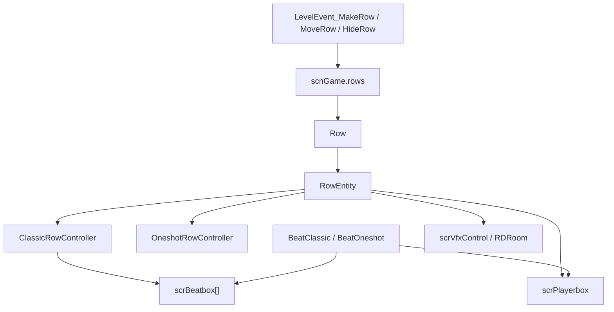

# 行与角色系统

本页整理运行时行系统。`Row` 保存一行的逻辑数据，`RowEntity` 是场景中的显示实体，`scrPlayerbox` 处理玩家输入和命中结果，`scrBeatbox` 负责 Classic 行的六个 beatbox 视觉状态。编辑器里的 MakeRow、MoveRow、HideRow、ChangeCharacter、ChangePlayersRows、ReorderRow 等事件最终会落到这些类型。

## 源码范围

| 类型 | 源码路径 | 职责 |
| --- | --- | --- |
| `Row` | `RDFucked/Assets/Scripts/Assembly-CSharp/Row.cs` | 行数据模型，保存行类型、玩家归属、声音、syncopation、跳拍、角色、房间、错误权重和实体引用。 |
| `RowEntity` | `RDFucked/Assets/Scripts/Assembly-CSharp/RowEntity.cs` | 行显示实体，管理角色、心脏、hit line、playerbox、beatbox、oneshot wave、排序、显隐、移动和特效。 |
| `scrPlayerbox` | `RDFucked/Assets/Scripts/Assembly-CSharp/scrPlayerbox.cs` | 玩家判定框，负责按下判定、释放判定、hit offset、hold bar、命中动画、标签事件和命中条。 |
| `scrBeatbox` | `RDFucked/Assets/Scripts/Assembly-CSharp/scrBeatbox.cs` | Classic beatbox 视觉状态机，负责 pulse、hold、X、synco、banana bend 和烟雾 shader。 |
| `ClassicRowController` | `RDFucked/Assets/Scripts/Assembly-CSharp/ClassicRowController.cs` | Classic 行控制器，持有 6 个 `scrBeatbox` 并同步 shine 与显隐。 |
| `OneshotRowController` | `RDFucked/Assets/Scripts/Assembly-CSharp/OneshotRowController.cs` | Oneshot 行控制器，持有 wave、shadow、skipshot、spark 和线条材质。 |
| `Character` | `RDFucked/Assets/Scripts/Assembly-CSharp/Character.cs` | 官方和自定义角色枚举。 |
| `RowType` | `RDFucked/Assets/Scripts/Assembly-CSharp/RowType.cs` | 行类型枚举。 |
| `RowVisibilityMode` | `RDFucked/Assets/Scripts/Assembly-CSharp/RowVisibilityMode.cs` | 行显示状态枚举。 |
| `RowEffect` | `RDFucked/Assets/Scripts/Assembly-CSharp/RowEffect.cs` | 行特效枚举。 |
| `MoveRowTarget` | `RDFucked/Assets/Scripts/Assembly-CSharp/MoveRowTarget.cs` | MoveRow 的移动目标枚举。 |

## 总体关系

`scnGame.rows` 是运行时行数组。`Row.ent` 指向场景实体，`RowEntity.row` 反向指向数据行。Classic 节拍刷新 `scrBeatbox`；Oneshot 节拍刷新 `RDWave`；玩家输入由 `scrPlayerbox` 转成 `HitType` 和 `OffsetType`。

## 枚举

### RowType

| 值 | 数值 | 用途 |
| --- | --- | --- |
| `Classic` | `0` | 显示 Classic beatbox。 |
| `Oneshot` | `1` | 显示 Oneshot wave。 |
| `Hold` | `2` | 行类型占位，运行时外观切换逻辑没有单独分支。 |
| `None` | `3` | 隐藏 Classic 与 Oneshot 外观。 |

### RowVisibilityMode

| 值 | 数值 | 用途 |
| --- | --- | --- |
| `Visible` | `0` | 行和角色都显示。 |
| `Hidden` | `1` | 行和角色都隐藏。 |
| `OnlyCharacter` | `2` | 只显示角色。 |
| `OnlyRow` | `3` | 只显示行，不显示角色。 |

### RowEffect

| 值 | 数值 | 用途 |
| --- | --- | --- |
| `None` | `0` | 关闭行效果。 |
| `Electric` | `1` | 启用 `smokes` 对象并更新排序。 |
| `Smoke` | `2` | 枚举值存在，`RowEntity.SetEffect()` 没有单独处理分支。 |

### MoveRowTarget

| 值 | 数值 | 用途 |
| --- | --- | --- |
| `WholeRow` | `0` | 移动、缩放、旋转整行。 |
| `Character` | `1` | 移动、缩放、旋转角色。 |
| `Heart` | `2` | 移动、缩放、旋转心脏容器。 |

## Row 数据模型

`Row` 是普通 C# 类，不继承 Unity 组件。构造函数创建 `show = new bool[6]`，默认六个 beatbox 都显示，默认 pulse sound 是 `sndKick`，`cpuCharacter` 默认为 `Otto`。

### Row 字段

| 字段 | 类型 | 作用 |
| --- | --- | --- |
| `room` | `int` | 行所在房间索引。 |
| `rowType` | `RowType` | 当前行类型。 |
| `rowChangeWarning` | `bool` | 行玩家切换警告相关状态。 |
| `pulseSounds` | `SoundData[]` | 七个 pulse sound 数据。 |
| `tick` | `float` | 行节拍间隔。 |
| `showAesthetic` | `bool[]` | 视觉层面的显示数组。 |
| `showdelay` | `float` | 显示延迟。 |
| `syncoBeat` | `int` | syncopation beatbox 索引，默认 `-1`。 |
| `syncoSwing` | `float` | syncopation swing。 |
| `syncoVolume` | `float` | syncopation 音量，默认 `1`。 |
| `syncoPitch` | `float` | syncopation 音高，默认 `1`。 |
| `syncoStyle` | `SyncoStyle` | syncopation cue 样式。 |
| `syncoShouldPlayModifierOffSound` | `bool` | syncopation modifier off 音效开关。 |
| `isFlashing` | `bool` | 行是否处于闪烁状态。 |
| `faceDirection` | `bool` | 角色朝向标记。 |
| `cpuCharacter` | `Character` | CPU marker 使用的角色，默认 `Otto`。 |
| `cpuCharacterToChangeInto` | `Character` | scrub 刷新时应用的 CPU marker 目标。 |
| `transferTarget` | `int` | 命中转移目标行，默认 `-1`。 |
| `rowLengthForNarration` | `int` | 旁白使用的行长度，默认 `7`。 |
| `rowCountingVoiceEnabled` | `bool` | 行计数音开关。 |
| `countingSounds` | `SoundData[]` | 七个计数音数据。 |
| `rowCountingVoiceSubdivOffset` | `float` | 计数音 subdivision 偏移，默认 `0.5`。 |
| `rowExplosionPitch` | `float` | 行爆心音高，默认 `1`。 |
| `rowSoundHitOverride` | `string` | 行命中音覆盖文件名。 |
| `rowSoundHitOverrideMultiplier` | `float` | 行命中音覆盖倍率，默认 `1`。 |
| `ent` | `RowEntity` | 行实体引用。 |
| `reflection` | `SpriteReflection` | 行反射实体。 |
| `dead` | `bool` | 行是否已死亡或删除。 |
| `lastMissedFrame` | `int` | 最近记录 miss 的帧。 |
| `lastHitFrame` | `int[]` | P1/P2 最近命中帧，静态数组长度为 2。 |
| `mistakeWeight` | `float` | 行错误权重，默认 `1`。 |
| `singleplayer` / `multiplayer` | `RDPlayer` | 单人和双人模式下的当前玩家归属。 |
| `isShadow` | `bool` | 是否为 shadow row。 |
| `shadowOrHostID` | `int` | shadow 或 host 行 id，默认 `-1`。 |
| `multiplayerToChangeInto` / `singleplayerToChangeInto` | `RDPlayer` | scrub 刷新时应用的玩家归属目标。 |

### Row 属性

| 属性 | 类型 | 作用 |
| --- | --- | --- |
| `id` | `int` | 行索引，只能在构造函数内设置。 |
| `show` | `bool[]` | 六个 Classic beatbox 是否参与显示和 pulse。 |
| `rowSound` | `string` | 读写第一个 pulse sound 的文件名；写入时会把七个 pulse sound 都设成同一个 `SoundData`。 |
| `rowSoundVolMultiplier` | `float` | 读写七个 pulse sound 的音量百分比。 |
| `rowSoundMinPitch` / `rowSoundMaxPitch` | `float` | 读写七个 pulse sound 的最小和最大音高百分比。 |
| `rowSoundPan` | `float` | 读写七个 pulse sound 的声像百分比。 |
| `rowSoundPanAdjustedFor2P` | `float` | 通过 `RDUtils.OverridePanFor2P(this, rowSoundPan)` 得到双人模式声像。 |
| `cpuControlled` | `bool` | 当前玩家是否为 `RDPlayer.CPU`。 |
| `showBeats` | `string` setter | 把字符串转为 `show` 数组。 |
| `beatboxes` | `scrBeatbox[]` | Classic 行返回 `ent.classicRowController.beatboxes`，其他情况返回 null。 |
| `playerBox` | `scrPlayerbox` | 返回 `ent.playerBox`。 |
| `hasBeatsWithinMargin` | `bool` | 遍历 `scnGame.instance.beats`，检查本行是否有 0.4 秒范围内可命中的 beat。 |

### Row 方法

| 方法 | 行为 |
| --- | --- |
| `SetPulseSounds(SoundData)` | 把七个 pulse sound 槽都填成同一个 `SoundData`。 |
| `SetCountingSounds(CountingVoiceSource, float)` | 根据计数音来源生成 `1` 到 `7` 的文件名，并写入音量。 |
| `GetCurrentPlayer()` | 单人模式返回 `singleplayer`，双人模式返回 `multiplayer`。 |
| `GetPlayerWeAreGoingToChangeInto()` | 单人模式返回 `singleplayerToChangeInto`，双人模式返回 `multiplayerToChangeInto`。 |
| `ToggleReflections(bool)` | 创建或启用角色反射 `SpriteReflection`。 |
| `ShowBeatsFromString(string)` | 把 6 位字符串转为 bool 数组，字符 `x` 表示隐藏。 |
| `StringFromShowBeats(bool[])` | 把 bool 数组转成 `-` 和 `x` 组成的字符串。 |
| `SetBeatSkipsLegacy(string, float)` | 设置跳拍数组，并用 `scrExecuteOnCertainBeat` 安排视觉刷新。 |
| `SetBeatSkips(bool[])` | 直接写入 `show`。 |
| `SetBeatSkipsAesthetic(bool[])` | 对每个 `scrBeatbox` 调用 `SetBeatSkip()`。 |
| `RefreshRowPlayersScrub()` | scrub 后应用待切换玩家和 CPU marker，并刷新实体颜色与玩家标记。 |
| `RefreshBeatSkipAesthetic()` | 用当前 `show` 刷新 beatbox X 显示。 |
| `SetSyncopation(int, float)` | 写入 `syncoBeat` 和 `syncoSwing`。 |
| `SetSyncopationCueStyle(SyncoStyle)` | 写入 `syncoStyle`。 |
| `SetSyncopationAesthetic(int)` | 对指定 beatbox 显示 synco 状态。 |
| `RefreshSyncopationAesthetic()` | 用当前 `syncoBeat` 刷新 synco 显示。 |
| `HasBeatsAutohitByHeldbeat(Beat)` | 检查本行是否有输入点位于 hold beat 的输入到释放时间段内。 |

## RowEntity 场景实体

`RowEntity` 继承 `InvisibleEntity`，负责把 `Row` 数据呈现到 Unity 场景。`Setup()` 会建立 tintable 实体列表、设置排序、绑定 `Row`、初始化心脏、角色、playerbox、Classic beatbox、Oneshot wave、spotlight 和 freeze ice。

### RowEntity 关键字段

| 字段 | 类型 | 作用 |
| --- | --- | --- |
| `classicRowController` | `ClassicRowController` | Classic 行控制器。 |
| `oneshotRowController` | `OneshotRowController` | Oneshot 行控制器。 |
| `markersDict` | `Dictionary<string, Sprite>` | 玩家或角色 marker sprite 缓存。 |
| `playerParticle` | `ParticleSystem` | happy 命中粒子。 |
| `pivot` / `pivotTransform` | `float` / `Transform` | 行 pivot 与实际 pivot transform。 |
| `rowContainer` | `Transform` | 行内容容器。 |
| `heart` / `heartContainer` | `scrHeart` / `Transform` | 心脏实体与容器。 |
| `character` / `characterContainer` | `scrChar` / `Transform` | 角色实体与容器。 |
| `playerBox` | `scrPlayerbox` | 玩家判定框。 |
| `holdBar` | `scrHoldBar` | hold 进度条。 |
| `lineLeft`、`lineHitLeft`、`lineHitRight` | `Entity` | hit line 的主体和左右段。 |
| `hitstripCenter` | `Transform` | 命中条中心点。 |
| `lineEntrance` | `RDWaveRenderer_Pulse` | 行入场动画线。 |
| `playerIndicator` / `playerIndicatorInner` | `SpriteRenderer` | 玩家指示器。 |
| `characterMarker` | `SpriteRenderer` | 行角标角色或玩家 marker。 |
| `characterMarkerAnimation` | `SpriteAnimation` | marker 多帧动画。 |
| `smokes` | `GameObject[]` | 行特效对象。 |
| `targetCharacterRowEnt` | `RowEntity` | 表情和 Oneshot sparks 使用的目标角色行实体。 |
| `row` | `Row` | 绑定的数据行。 |
| `appearance` | `RowVisibilityMode` | 当前显示状态。 |
| `effect` | `RowEffect` | 当前行效果。 |
| `entranceSequence` | `Sequence` | DOTween 入场动画序列。 |
| `positionTweenX/Y`、`scaleTweenX/Y` | `Tween` | 整行位置和缩放 tween。 |
| `charPositionTweenX/Y`、`charScaleTweenX/Y` | `Tween` | 角色位置和缩放 tween。 |
| `heartPositionTweenX/Y`、`heartScaleTweenX/Y` | `Tween` | 心脏位置和缩放 tween。 |
| `pivotTweenX` | `Tween` | pivot tween。 |
| `overlayTween` / `noiseTween` | `Tween` | overlay 和 noise shader power tween。 |
| `rowMisses` | `float` | 本行累计错误权重。 |
| `beatsLeftToHit` | `int` | 还要命中的 beat 数。 |
| `sortDepth` | `int` | 行排序深度。 |
| `visualRowLength` | `float` | 当前视觉行长度，默认 `7`。 |
| `spinningRowsController` | `SpinningRows` | 旋转行控制器。 |
| `subdivisionSpotlightController` | `SubdivisionSpotlightController` | subdivision spotlight。 |
| `freezeshotIceController` | `FreezeshotIceController` | freeze 冰块控制器。 |

### RowEntity 属性

| 属性 | 类型 | 作用 |
| --- | --- | --- |
| `iceBlock` | `Entity` | `freezeshotIceController.iceBlock`。 |
| `rowID` | `int` | `row.id`。 |
| `tintableEntities` | `List<InvisibleEntity>` | 会同步排序、材质和 shader 数据的实体列表。 |
| `heartHasCracked` | `bool` | `rowMisses >= currentLevel.missesToCrackHeart`。 |
| `rowIsVisible` | `bool` | `appearance` 为 `Visible` 或 `OnlyRow`。 |

### RowEntity 生命周期

| 方法 | 行为 |
| --- | --- |
| `Awake()` | 调用基类 `Awake()`，缓存心脏 mesh renderer。 |
| `Setup(...)` | 建立实体引用、排序、位置、心脏、角色、playerbox、beatbox、Oneshot、反射、freeze ice 和 marker。 |
| `Update()` | 处理 invisible chars/heart、行闪烁、调试文本和 freezeshot overlay 动画。 |
| `LateUpdate()` | 修正 marker 缩放，刷新 marker 显示、hit line 颜色、prehit 表情和 pivot transform。 |

### RowEntity 显示与外观

| 方法 | 行为 |
| --- | --- |
| `UpdatePlayerSprites()` | 根据当前玩家或 CPU 角色选择 marker sprite；多帧 marker 会挂 `SpriteAnimation`。 |
| `Present(bool)` | 根据关卡设置显示行，或在 `charsOnlyOnStart` 时只保留角色。 |
| `Show(ShowAnimationType, bool, bool)` | 显示行，安排或立即执行入场动画，并设置 `appearance`。 |
| `Hide(bool, bool)` | 隐藏 hit line、heart、playerbox、beatbox、Oneshot waves，并按参数保留角色或播放移除效果。 |
| `DoEntrance(ShowAnimationType)` | 构建 DOTween 入场序列，包含角色入场、线条展开、心脏弹出、marker 缩放和 playerbox 显示。 |
| `SwitchRowTypeAppearance(RowType)` | Classic 时显示 Classic controller，Oneshot 时显示 Oneshot waves，None 时隐藏两者。 |
| `SetRowLength(int, float)` | 移动和缩放 beatbox，更新 Oneshot line、playerbox hit line、粒子、hitstrip 和 hold bar 位置。 |
| `GetRowWidth()` | 返回 `19 + (visualRowLength - 1) * 24 + HitlineWidth + 12`。 |
| `SetSortOrder(int, bool)` | 更新 tintable 实体、Oneshot polygon、spark、marker 和粒子的 sorting order。 |
| `SetSortLayer(string)` | 更新 tintable 实体、Oneshot polygon、spark、marker、粒子和 electric 效果的 sorting layer。 |
| `Reposition(int, bool)` | 非自定义位置行按给定 y 坐标移动到默认 x，并复位旋转和缩放。 |
| `Rotate(float, float, Ease, MoveRowTarget)` | 对整行、角色或心脏执行旋转 tween。 |
| `SetRowMarkerCorner(bool)` | 把 marker 移到左角或右角。 |

### RowEntity 角色、心脏与效果

| 方法 | 行为 |
| --- | --- |
| `ExpressionPlusFX(string, bool)` | 播放角色表情；happy 时触发心脏 hit 和粒子。 |
| `Heal(float)` | 降低 `rowMisses`，调用 `OnMistakeOrHeal()`，刷新心脏裂纹和玩家血条。 |
| `CrackAdvance(float, bool)` | 增加 `rowMisses`，震动心脏和角色，刷新裂纹；血条模式下可删除双人死亡行或失败关卡。 |
| `ChangeCharacter(Character, bool)` | 切换官方角色，可播放烟雾粒子。 |
| `ChangeCharacterCustom(string, bool)` | 切换自定义角色，可播放烟雾粒子。 |
| `ChangeCharacterRandom()` | 从 `Character` 枚举中随机选择角色。 |
| `SetHeart(RDHeartType, bool)` | 设置心脏类型，包括 infected、cracked、split、halloween、unbeatable 和 none。 |
| `ShowIceBlock(bool)` | 显示或爆开 freeze 冰块，并切换角色 outline shader。 |
| `SetEffect(RowEffect)` | `None` 关闭 smokes；`Electric` 启用 smokes 并更新排序。 |
| `UpdateEffectSort()` | Electric 效果时按 `sortDepth * 10` 追加排序。 |
| `ShowRowSmokes()` | 在角色和心脏之间生成 12 个烟雾。 |
| `DoRemoveRowEffects()` | 删除行时生成烟雾并震动房间相机。 |
| `SetOverrideAdditiveColor(Color)` | 同步 additive color 到行和 tintable 实体。 |
| `FlashChildren(float, float)` | 对 tintable 实体中的 `Entity` sprite 执行 flash。 |
| `FadeOutRowExceptChar(float, float)` | 角色淡到指定 alpha，其他 tk2d sprite 淡出。 |
| `FadeInRow(float)` | tintable tk2d sprite 淡入。 |
| `PlayFreezeAnimation(float)` | 播放 freezeshot overlay 帧动画。 |
| `SetOverlayTexturePower(float, bool)` / `TweenOverlayTexturePower(float, float)` | 设置或缓动 overlay power。 |
| `SetNoiseTexturePower(float, bool)` / `TweenNoiseTexturePower(float, float)` | 设置或缓动 noise power。 |

## scrPlayerbox 判定框

`scrPlayerbox` 继承 `Entity`，在 `Setup()` 中设置 tag、动画前缀、行号、动画完成回调和颜色。它不直接读取键盘或手柄；输入已经由 `RDInput` 和 `scnGame` 转成对 `SpaceBarEvent()` 与 `SpaceBarReleased()` 的调用。

### scrPlayerbox 字段与属性

| 成员 | 类型 | 作用 |
| --- | --- | --- |
| `rowID` | `int` | 所属行索引。 |
| `ent` | `RowEntity` | 所属行实体。 |
| `doingEntranceAnimation` | `bool` | 入场动画期间不按普通方式更新 playerbox 位置。 |
| `currentHoldBeat` | `Beat` | 当前被 hold 的 beat。 |
| `defaultPosX` | `float` | 默认 X 坐标。 |
| `holdAssist` | `bool` | hold assist 开关。 |
| `forceTrueOffset` | `bool` | 强制按真实 offset 计算释放结果。 |
| `clumsyCPUTiming` | `float` | CPU timing 修饰。 |
| `lastGlowColor` | `Color` | hold 期间恢复用的 glow 颜色。 |
| `hitLineLength` | `float` | hit line 长度，默认 `6`。 |
| `releaseOffsetType` | `OffsetType` | 根据 `currentHoldBeat.releaseTime`、release margin、CPU、Auto 和 defib mode 计算释放结果。 |
| `HitlinePadding` | `float` | `Max(0, hitLineLength - 1)`。 |
| `PlayerboxDistance` | `float` | `hitLineLength * 3`。 |
| `HalfHitlineWidth` | `float` | `HitlinePadding + PlayerboxDistance * 2 + 12`。 |
| `HitlineWidth` | `float` | `HalfHitlineWidth * 2`。 |

### 按下判定

`SpaceBarEvent(bool CPUTriggered)` 是按下判定入口。

| 步骤 | 行为 |
| --- | --- |
| 1 | 行已 dead 时直接返回。 |
| 2 | CPU 触发时显示 CPU 命中条，并播放 marker 动画。 |
| 3 | 从 `game.beats` 中找到当前玩家最早的可命中 beat。 |
| 4 | 在 smart judgment 开启时，查找更接近当前输入时间的后续 beat。 |
| 5 | 遍历本行 beat，使用 `HitCheckBeat()` 检查当前输入是否处于命中范围。 |
| 6 | 带 `specialRowToTransferHitTo` 的 beat 会把 `Pulse()` 转发到目标行 playerbox。 |
| 7 | 普通 beat 记录 P1/P2 hit time，写入玩家驱动第 7 拍时间，并调用 `Pulse()`。 |
| 8 | 命中后调用 `Create8thBeat()` 安排爆心。 |
| 9 | hold beat 被捕获后写入 `game.playerCaughtHoldBeat[(int)player]`。 |

`HitCheckBeat(float margin, Beat beat, double positiontouse = 999.0)` 的规则已经在 [节拍与判定](/api/runtime/beats-judgement.md) 详写：bomb 使用 `0.08` 秒范围，普通 beat 使用传入 margin，lenient beat 使用 `0.4` 秒或玩家驱动第 7 拍的时间规则。

### Pulse 行为

| 行为 | 说明 |
| --- | --- |
| 计算 offset | 根据 `timeOffset` 得出 `VeryEarly`、`SlightlyEarly`、`Perfect`、`SlightlyLate` 或 `VeryLate`。 |
| 反馈音 | JustMiss 播放 small mistake，BigMiss 或 bomb 播放 big mistake。 |
| 统计 | 调用 `game.AddHitOffset(rowID, offsetType)`；hold press 在 `countHeldPresses` 关闭时跳过普通统计。 |
| 错误 | 非 Perfect 或 bomb 时调用 `OnMistakeOrHeal()`、`CrackAdvance()` 和错误边框。 |
| hold | held clap Perfect 后显示 hold bar、命中条，并把 beat 写入 `currentHoldBeat`。 |
| 标签 | 运行 `[onHit]`、`[onMiss]`、`[onHeldPressHit]`、`[onHeldPressMiss]` 和对应 `[rowX]` 标签。 |
| 关卡回调 | 调用 `currentLevel.OnHit(hitType, beat)` 和 `currentLevel.OnHeldPress(hitType, beat)`。 |
| 视觉 | 调整 playerbox 水平位置、播放 pulse/die/hold 动画、刷新 beatbox 或 wave。 |
| 统计管理器 | 写入 absolute mistake 和 consecutive mistake。 |

### hold 释放

`SpaceBarReleased(RDPlayer player, bool cpuTriggered = false)` 只处理当前行所属玩家。CPU 触发时会释放命中条并写入模拟释放键。

| 释放结果 | 行为 |
| --- | --- |
| `SlightlyEarly` | playerbox 移到 early，错误边框，big mistake 音，错误统计，hold bar early 释放效果。 |
| `SlightlyLate` | playerbox 移到 late，错误边框，低音高 big mistake 音，错误统计，角色和心脏恢复。 |
| `Perfect` | 正确边框，happy 表情，创建爆心，释放特效，自动 pulse 释放时间附近的同玩家 beat。 |

释放结束后会运行 `[onHit]`、`[onHeldReleaseHit]`、`[onMiss]`、`[onHeldReleaseMiss]` 和对应 `[rowX]` 标签，调用 `currentLevel.OnHit(offsetType, currentHoldBeat)`，清空 hold bar 与 `currentHoldBeat`，并销毁 hold beat。

### scrPlayerbox 辅助方法

| 方法 | 行为 |
| --- | --- |
| `SetHorizontalPosition(int)` | 按 early/perfect/late 偏移移动 playerbox。 |
| `UpdateSize()` | 用最近 hit offset 重新计算 playerbox 和 hit line 尺寸。 |
| `Flatten()` | 播放 die 动画，并把 sprite 颜色缓回默认 playerbox 颜色。 |
| `GetMistakeGroupPathFor2P()` | 根据 P1/P2 返回双人 mistake mixer group 路径。 |
| `UpdateHold()` | 根据音频时间更新 hold glow、hold bar、心脏 flash 和命中条进度。 |
| `ListAll()` | 从 `scnGame.instance.rows` 收集所有 playerbox。 |
| `ReleasePop()` | 播放 `pulseInstant`。 |
| `ReleaseEffect()` | 释放命中条并标记 `beatReleased`。 |

## scrBeatbox 状态机

`scrBeatbox` 负责 Classic 行的 6 个 beatbox。`BeatClassic.LateUpdate()` 会在需要刷新时调用 `RefreshPulseStatus()`。

### scrBeatbox 字段

| 字段 | 类型 | 作用 |
| --- | --- | --- |
| `beatSkip` | `Entity` | X 或 gap 覆盖标记。 |
| `theBeatThatPulsedMe` | `Beat` | 最近 pulse 这个 beatbox 的 beat。 |
| `index` | `int` | beatbox 索引，0 到 5。 |
| `removeOnNextBar` | `bool` | 下个小节销毁对象。 |
| `pulseMode` | `char` | `-`、`b`、`r`、`u`、`d` 等 pulse 模式。 |
| `animate` | `bool` | 是否播放入场相关动画。 |
| `beatboxRefreshedThisFrame` | `bool` | 本帧是否刷新过 pulse 状态。 |
| `shine` | `float` | shader shine 值。 |

### XState

| 值 | 数值 | 用途 |
| --- | --- | --- |
| `On` | `0` | beatSkip 正在显示 X。 |
| `Off` | `1` | beatSkip 关闭。 |
| `Gap` | `2` | syncopation gap 状态。 |

### scrBeatbox 方法

| 方法 | 行为 |
| --- | --- |
| `Setup(int, int, bool, RowEntity)` | 设置索引、行号、动画回调、材质烟雾贴图和颜色。 |
| `RefreshPulseStatus()` | 遍历 `game.beats` 找本行未死亡 `BeatClassic`，根据当前 beatbox 或 rolling 状态决定 pulse、roll 或 flatten。 |
| `PulseOrXPulseOrRoll(Beat, bool, int, bool)` | 根据 X 状态、synco、pulseMode、double pulse、hold、banana bend 播放对应动画和房间 pulse VFX。 |
| `TweenBend(float, float, Ease)` | 缓动 sprite bend。 |
| `ArrowPulseAnimation(tk2dSprite, float)` | syncopation arrow 闪光并临时加速动画。 |
| `Flatten()` | bend 归零，并把 pulse/hold/release/arrow 动画切到 die。 |
| `OnAnimEnd(...)` | die 或 synco_on 结束后回到 `flat` 或 `synco`。 |
| `OnBeatSkipAnimEnd(...)` | X 关闭动画结束后隐藏 beatSkip。 |
| `SetBeatSkip(bool)` | 根据 `shouldPulse`、当前 X 状态和 synco 状态播放 X 开关或 gap 动画。 |
| `SetSynco(bool)` | 切换 synco 显示。 |
| `CheckXState()` | 根据 beatSkip 当前动画返回 `On`、`Gap` 或 `Off`。 |
| `LateUpdate()` | 刷新颜色和 `_Shine` shader 参数。 |
| `OnNewBar()` | `removeOnNextBar` 为 true 时销毁对象。 |

## ClassicRowController

| 成员 | 作用 |
| --- | --- |
| `beatboxes` | 6 个 `scrBeatbox`。 |
| `shineSpeed` | shine 推进速度。 |
| `shine` | 当前 shine 进度。 |
| `LateUpdate()` | 按 `1 / conductor.crotchet * shineSpeed` 推进 shine，并写入每个 beatbox。 |
| `SetVisible(bool)` | 设置 beatbox 可见性；显示时按 X 状态同步 `beatSkip.visible`。 |

## OneshotRowController

| 成员 | 作用 |
| --- | --- |
| `rowEntity` | 所属行实体。 |
| `waveManager` | Oneshot wave 管理器。 |
| `waves` / `firstWave` / `shadows` | 从 `waveManager` 读取 wave 与 shadow。 |
| `Setup()` | 根据全局 shadow 设置创建 wave shadows，并隐藏 skipshot indicator。 |
| `LateUpdate()` | 把行 shader overlay、noise 和 pixel scale 同步到 line 材质。 |
| `PlaySkipshotAnimation(float)` | 播放 skipshot indicator 横向移动和淡出。 |
| `PlaySparks(bool)` | 播放或停止角色、线和心脏 sparks。 |
| `EmitSparks(int)` | 发射 sparks。 |
| `ToggleAllWavesVisible(bool)` | 切换 wave 可见性，polygon renderer 受额外条件保护。 |
| `ResizeLine(float)` | 缩放 pulse wave 和 shadow 的宽度与 canvas。 |
| `FlattenWaves()` | flatten 所有 wave 并隐藏 shadows。 |

## 事件入口

| 编辑器事件 | 运行时落点 |
| --- | --- |
| `LevelEvent_MakeRow` | `Prepare()` 预加载自定义角色和 pulse sound，`CreateRow()` 调用 `game.MakeRow()`，写入 pulse sound 和行长度；`Run()` 调用 `ent.Present()` 并处理 `hideAtStart`。 |
| `LevelEvent_MoveRow` | 对整行、角色或心脏创建位置、缩放、角度和 pivot tween；整行自定义位置会更新房间行布局。 |
| `LevelEvent_HideRow` | 根据 `RowVisibilityMode` 调用 `ent.Show()` 或 `ent.Hide()`，显示状态变化时重新排布行和命中条。 |
| `LevelEvent_ReorderRow` | 修改房间、SiblingIndex、sorting order 和 sorting layer，并刷新相关房间布局。 |
| `LevelEvent_ChangeCharacter` | 预加载自定义角色，运行时调用 `ChangeCharacter()` 或 `ChangeCharacterCustom()`。 |
| `LevelEvent_ChangePlayersRows` | 调用 `ChangeRowPlayers()` 或 tagged variant 的 `ChangeRowPlayersImmediately()`，更新玩家归属和 CPU marker。 |
| `LevelEvent_SetRowXs` | 通过 `Row.SetBeatSkips()` 与 `SetBeatSkipsAesthetic()` 影响 beatbox X 显示和跳拍。 |
| `LevelEvent_TintRows` | 通过行实体 shader 数据和 tintable 实体影响行颜色、overlay 与 noise。 |
| `LevelEvent_SpinningRows` | 为行挂接或更新 `SpinningRows` 控制器。 |

## Character 枚举

`Character` 枚举包含官方角色、特殊 marker 和 `Custom`。运行时切换角色时，`scrChar` 会根据枚举和自定义角色名加载对应动画数据。

| 范围 | 内容 |
| --- | --- |
| `0` 到 `25` | Samurai、Farmer、Boy、Girl、Ian、Politician、Stevenson、Barista、Miner、节庆和动物变体等早期角色。 |
| `26` 到 `30` | `None`、`Otto`、替代角色、`Custom`。 |
| `31` 到 `59` | Rodney、Lucia、Cole、Nicole、鸟类、DancingCouple、Controller、Samurai 变体、节拍角色和 `BlankCPU`。 |
| `60` 到 `87` | Wren、Canary、Athlete 系列、Lucky 系列、Saturday、Allison、Weightlifter、Lune、Sophia、Tango、Beans、Rhythm 系列和 Book 系列。 |

## 源码研究关注点

| 场景 | 关注内容 |
| --- | --- |
| 读取行状态 | 从 `scnGame.instance.rows[rowID]` 读取 `Row`，再通过 `ent` 访问显示实体。 |
| 改变玩家归属 | `Row.singleplayer`、`Row.multiplayer` 是当前归属；切换流程还要同步 `singleplayerToChangeInto`、`multiplayerToChangeInto` 和实体颜色。 |
| 改变行外观 | 通过 `RowEntity.Show()`、`Hide()`、`SwitchRowTypeAppearance()`、`SetRowLength()`、`SetSortOrder()` 操作实体层。 |
| 改变角色 | 官方角色用 `ChangeCharacter()`，自定义角色用 `ChangeCharacterCustom()`；自定义角色资源加载逻辑在 `LevelEvent_MakeRow`。 |
| 命中判定 | 不直接修改 `scrPlayerbox.Pulse()` 的内部统计；读结果可从 `LevelBase.OnHit()`、标签事件或 `mistakesManager` 追踪。 |
| Classic beatbox | 跳拍使用 `Row.SetBeatSkips()` 和 `RefreshBeatSkipAesthetic()`；syncopation 使用 `SetSyncopation()` 和 `RefreshSyncopationAesthetic()`。 |
| 行删除和死亡 | `Row.dead` 会让 playerbox 输入直接返回；双人血条模式下 `CrackAdvance()` 会删除死亡玩家行。 |

## 相关页面

| 页面 | 关系 |
| --- | --- |
| [运行时系统总览](/api/runtime/overview.md) | 阶段 3 总入口。 |
| [节拍与判定](/api/runtime/beats-judgement.md) | `scrPlayerbox` 的按下、释放和 offset 计算。 |
| [输入系统](/api/runtime/input-system.md) | P1/P2 输入进入 `scrPlayerbox` 前的聚合层。 |
| [行控制与自由节拍事件](/api/editor-events/RowControlEvents.md) | MakeRow、MoveRow、HideRow、FreeTime 和行事件来源。 |
| [SetRowXs](/api/editor-events/SetRowXs.md) | Classic beatbox X pattern 的编辑器事件页。 |
| [scnGame](/api/core/scnGame.md) | `rows`、`MakeRow()`、`ChangeRowPlayers()`、行重排和判定入口。 |

