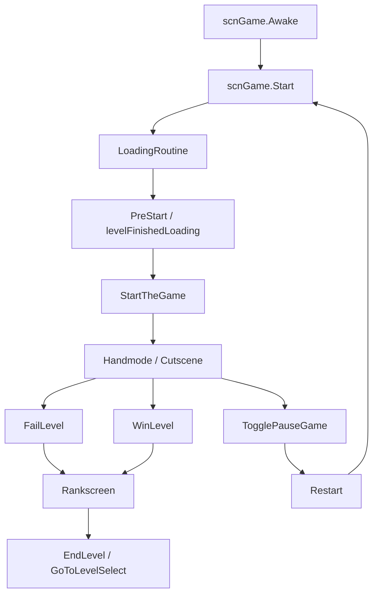

# 场景流程与暂停流程

本页整理 `scnGame` 驱动的运行时场景流程，包括关卡加载、开始、暂停、跳过、重开、失败、胜利和结算退出。暂停菜单的 UI 细节归在本页的暂停入口部分，重点仍放在运行时状态如何变化。

## 源码范围

| 类型 | 源码路径 | 职责 |
| --- | --- | --- |
| `scnGame` | `RDFucked/Assets/Scripts/Assembly-CSharp/scnGame.cs` | 游戏场景主控制器，负责加载关卡、创建房间、开始游戏、暂停、重开、退出、失败和胜利流程。 |
| `PauseMenu` | `RDFucked/Assets/Scripts/Assembly-CSharp/PauseMenu.cs` | 暂停菜单容器，负责显示手机 UI、模式切换、输入分发和场景跳转动画。 |
| `PauseMenuMode` | `RDFucked/Assets/Scripts/Assembly-CSharp/PauseMenuMode.cs` | 暂停菜单单个模式，负责内容列表、按钮可见性、选择项执行和设置项联动。 |
| `Rankscreen` | `RDFucked/Assets/Scripts/Assembly-CSharp/Rankscreen.cs` | 结算和失败 UI，负责 rank 展示、失败文本、继续提示、存档写入和最终退出。 |
| `GameState` | `RDFucked/Assets/Scripts/Assembly-CSharp/GameState.cs` | 运行时主状态枚举。 |
| `LevelSource` | `RDFucked/Assets/Scripts/Assembly-CSharp/LevelSource.cs` | 关卡来源枚举：外部文件、内部关卡、cutscene 路径。 |
| `LevelType` | `RDFucked/Assets/Scripts/Assembly-CSharp/LevelType.cs` | 关卡类型枚举：教程、常规、Boss、Challenge、Intro、Cutscene 等。 |

## 主流程

## 状态枚举

### GameState

| 值 | 作用 |
| --- | --- |
| `PreStart` | 关卡已加载但未开始，等待玩家按键。 |
| `SpacePressedPreStart` | 已触发开始流程，`StartTheGame()` 正在执行开场准备。 |
| `HandmodePreCutscene` | 手部模式进入 cutscene 前的过渡状态。 |
| `Handmode` | 普通可输入游玩状态。 |
| `Cutscene` | Cutscene 状态，手部隐藏，输入不按普通节拍处理。 |
| `CutsceneSkippable` | 可长按跳过的 cutscene 状态。 |
| `RankShown` | 结算 rank 已显示。 |

### LevelSource

| 值 | 作用 |
| --- | --- |
| `ExternalPath` | 从外部 `.rdlevel` 路径读取关卡文本。 |
| `InternalPath` | 从 `Resources/InternalLevels` 或内置 `Level_*` 类加载。 |
| `CutscenesPath` | 从 cutscene 资源路径加载。 |

### LevelType

| 值 | 用途 |
| --- | --- |
| `Tutorial` | 教程关卡，开始、跳过和重开规则与常规关卡不同。 |
| `Regular` | 常规关卡。 |
| `Boss` | Boss 关卡，结算 rank 保存规则走 Boss 分支。 |
| `Bonus` | Bonus 类型。 |
| `Intermission` | 幕间类型。 |
| `Collab` | 合作类型。 |
| `Challenge` | Challenge 类型。 |
| `Intro` | Intro 类型。 |
| `Cutscene` | Cutscene 类型。 |

## scnGame 初始化

### Awake

`Awake()` 建立运行时全局状态和 UI 引用。

| 步骤 | 行为 |
| --- | --- |
| 基类初始化 | 调用 `base.Awake()`，并把 `scnBase._instance` 设置为当前 `scnGame`。 |
| 相机组 | 把 `uiCamera`、`pauseMenuCamera`、`windowCamera` 放入 `uiCameras`。 |
| 存档和统计 | 调用 `Persistence.SetMistakeOffset(999f)`，创建 `MistakesManager`。 |
| 角色和音效 | 调用 `scrChar.FlushCharacters()`、`RDGameSounds.LoadDefaults()`、`LoadPlayerHandPopSounds()`。 |
| 移动端与事件系统 | 移动端显示 `MobileButtons`，非编辑器启用 `eventSystem`。 |
| 结果与暂停 | 调用 `rankscreen.Setup()` 和 `pauseMenu.Initialize()`。 |
| Mixer group | 缓存 `CuesoundsParent`、`RDGSVoice`、`RDGSClicks`。 |
| 输入与辅助设置 | 读取 defib、reduced flash、two-player、level speed 等持久化设置。 |
| 首场景跳转 | 如果 `RDStartup.firstScene` 等于当前场景名，则读取 PlayerPrefs 并调用 `scnBase.GoToLevel()`。 |

### Start

`Start()` 负责决定当前关卡来源，并启动 `LoadingRoutine()`。

| 步骤 | 行为 |
| --- | --- |
| 全局状态 | 清空旁白，重置 VFX，设置 `gameState = PreStart`，设置 `SpeedrunValues.isLoading = true`。 |
| 输入模式 | 读取 drum mode 和 taps only，并把 `RDTime.speed` 设置为 `levelSpeed`。 |
| 编辑器关卡 | `editorMode` 下把 `levelToLoadSource` 设为 `ExternalPath`，读取 `base.editor.rdlevelText`。 |
| 内部关卡 | 按 tutorial、night、2P、普通内部路径查找 `TextAsset`；找不到文本时尝试实例化对应 `Level_*` 类。 |
| 外部关卡 | 从 `currentLevelPath` 读取文本。 |
| Cutscene | 用 `scnBase.PathForCutscene()` 找资源并读取文本。 |
| LevelBase | 文本路径下调用 `LevelBase.InstantiateLevelClass(jsonText)`；教程和 cutscene 会改写 `levelType`。 |
| Rich Presence | 写入关卡名、关卡类型和是否自定义关卡。 |
| 窗口舞蹈 | `RDC.windowDance` 且关卡数据启用窗口舞蹈时创建真实或虚拟 `WindowChoreographer`。 |
| Top render texture | 编辑器或窗口舞蹈存在时创建 top camera render texture。 |
| 行数组 | 创建 16 个 `Row`，初始化 row sort order、beat alarm 和 oneshot loop。 |
| 房间加载 | 开始协程 `LoadingRoutine()`。 |

## LoadingRoutine

`LoadingRoutine()` 是关卡正式可开始前的异步加载流程。

| 步骤 | 行为 |
| --- | --- |
| Loading UI | `showLoadingScreen` 为 true 时显示 blades，手部按钮置前。 |
| 房间创建 | 根据 `currentLevel.multiroom` 创建 1 个或 4 个 `RDRoom`，并调用 `RDRoom.Setup()`。 |
| HUD camera | 多房间时 HUD camera 清黑色，单房间时使用 depth clear。 |
| VFX | 调用 `RDBase.Vfx.LoadGameEffects()`。 |
| Listener | 把 listener object 挂到 0 号房间相机下。 |
| 音乐准备 | 调用 `currentLevel.PrepareMusic()`。 |
| Rank 描述 | 内部常规关卡调用 `SetRankDescriptionsFromLocalizationData()`。 |
| 窗口舞蹈 | 等待 `windowChoreographer.setup`。 |
| 资产加载 | 调用 `currentLevel.LoadBigAssets()`，有 `RDLevelData` 时继续 `LoadCustomAssets()`。 |
| AudioManager | 访问 `Singleton<AudioManager>.Instance` 保证音频单例存在。 |
| 完成加载 | 设置 `levelFinishedLoading = true`。 |
| 开始提示 | 显示 begin level 文本、extra credits、特殊提示，并调用 `RDBase.Vfx.BlackScreenOn()`。 |

`showLoadingScreen` 排除了 Intro、Tutorial、Cutscene、`startImmediately` 和 `forceNextTimeStartImmediately`。编辑器中如果正在 scrub，也不会显示 loading screen。

## 开始游戏

`StartTheGame(float speed, string customMessage)` 是从等待开始进入游玩状态的入口。

| 步骤 | 行为 |
| --- | --- |
| Checkpoint | 非教程关卡如果上次死在 checkpoint 之后，设置 `barToScrubTo`，并让 conductor 进入 scrub。 |
| 防重复 | 已开始时直接结束协程。 |
| 窗口舞蹈 | 调用 `windowChoreographer.StartUsingCustomWindows()`。 |
| 速度 | 非教程、非编辑器时记录 `levelSpeed`，设置 `RDTime.speed` 和 `Time.timeScale`。 |
| 状态 | 设置 `SpeedrunValues.currentGameState` 和 `gameState` 为 `SpacePressedPreStart`。 |
| UI | 隐藏双人换位 UI，停止 HUD shake，隐藏移动端状态文字。 |
| 关卡回调 | 调用 `currentLevel.OnLevelStartedBase()` 和 `conductor.OnPreBar()`。 |
| 开场表现 | loading screen 下淡入、播放 `sndSwitch`、打开 blades；否则淡入并隐藏 blades。 |
| 手部 | 按 `noHands`、`hideHandsAfterStart`、`hideHandsOnStart` 决定手部显示。 |
| 进入 Handmode | 临时禁止 gameState 自动改手部，设置 `gameState = Handmode`。 |
| Scrub | 如果 `barToScrubTo` 大于当前 bar，执行 `conductor.ScrubToBarNum(barToScrubTo)`。 |
| 收尾 | 非编辑器等待 1 秒，清空 LED 状态，重置 `forceNextTimeStartImmediately`。 |

`Update()` 在 `gameState == PreStart` 且 `levelFinishedLoading` 时等待输入。单人任意玩家按下即可开始；双人需要 P1 和 P2 同时按住。双人中只有一侧按下时会播放对应 hand pop 反馈。

## Pause 与菜单

### scnGame.TogglePauseGame

| 分支 | 行为 |
| --- | --- |
| `pauseBlocked` | 直接返回。 |
| 切到暂停 | `paused = true`，必要时记录 `unpauseAudioOnResume` 并设置 `base.audioPaused = true`，`Time.timeScale = 0`。 |
| 取消暂停 | 如果之前由暂停设置了 audio pause，则恢复 `base.audioPaused = false`，`Time.timeScale = visualSpeed`。 |
| 非编辑器 UI | 设置鼠标显示，按 Boss2 窗口舞蹈条件显示 `windowDanceMovement`，淡入或淡出 pause menu 背景。 |
| 暂停菜单 | 暂停时调用 `pauseMenu.Show()`，恢复时调用 `pauseMenu.Hide()`。 |
| 窗口舞蹈 | 游戏已开始时调用 `windowChoreographer.OnPauseChanged(paused)`。 |
| 相机 | 恢复时调用 `SetEnabledCameras(true)`。 |

`Update()` 中非编辑器、非输入框状态下，`RDInput.cancelPress && !paused` 会把 `PauseMenu.contentsToSelect` 设为 Continue / Dog_Continue，并调用 `TogglePauseGame()`。

### PauseMenu

| 方法 | 行为 |
| --- | --- |
| `Initialize()` | 初始化 `contentsToSelect`、暂停菜单数据、模式字典和初始模式。 |
| `Update()` | 暂停时处理上下移动、取消、skip、restart、quit、确认和左右调值。 |
| `ChangeMode(PauseModeName, bool)` | 懒加载 `PauseMenuMode`，切换当前模式，处理 narration 和预选内容。 |
| `Show()` | 选择 ice/chili/normal phone 外观，启用相机，切到当前模式，播放 `sndPagerOpen`。 |
| `Hide()` | 收回 phone，关闭相机和 GameObject，播放 `sndPagerClose`，松开所有手臂按钮。 |
| `GoToScene(string)` | 菜单层场景跳转入口。 |

### PauseMenuMode

| 方法或区域 | 行为 |
| --- | --- |
| `CheckButtonsVisibility()` | 在 Game / DogMode 下根据 `levelIsSkippable`、`levelIsRestartable`、`levelIsQuittable` 和 checkpoint 显示或隐藏按钮。 |
| `SelectContent()` | 对当前选项执行动作。 |
| Continue | 游戏中调用 `base.game.TogglePauseGame()`。 |
| Restart / Dog_Restart / RestartFromCheckpoint | 禁用菜单，调用 `base.game.Restart(fromCheckpoint)`。 |
| Skip / Dog_Skip | 禁用菜单，调用 `base.game.WinLevel()`。 |
| Quit / Dog_Quit | 游戏中调用 `base.game.Quit()`。 |
| Back | 停止音频预览，返回上一模式或隐藏菜单。 |

## 跳过、退出和重开

### SkipLevel

`SkipLevel()` 先检查 `levelIsSkippable`。可跳过时会 block controls，闪白色 overlay，再淡到黑色。Cutscene 会跳到关卡选择或特殊的 `HelpingHands`；其他关卡跳到 `currentLevel.levelToSkipTo`。

### Quit

| 方法 | 行为 |
| --- | --- |
| `Quit()` | 计算最多 1 秒的过渡时间，启动 pixelate 动画，排队 `QuitTimer()`，播放 `sndTransitionOut`。 |
| `PixelateAnimation(float)` | 激活 pause overlay，淡到黑色，开启 pixelate image effect 并把时间从 `0` 插到 `8`。 |
| `QuitTimer()` | 恢复 `Time.timeScale` 和 `RDTime.speed`，停止所有声音，把 `LevelMasterVolume` 设回 `1`，Intro 可直接回主菜单，其他关卡回关卡选择。 |

`QuitTimer()` 会设置 `scnLevelSelect.playerQuitLevel = true`。`CheckForSpecialRoute()` 在 HelpingHands 特殊路线中改去主菜单。

### Restart

| 方法 | 行为 |
| --- | --- |
| `Restart(bool fromCheckpoint)` | Intro 或 Tutorial 在非 debug 下不允许重开；删除现有行，关闭 blades，排队 `RestartTimer()`。 |
| `RestartTimer()` | 调用 `IncrementLevelTries()`，再 `scnBase.GoToScene("scnGame")` 重载游戏场景。 |
| `IncrementLevelTries()` | 内部非 Cutscene、Tutorial、Intro 关卡增加 tries 计数。 |

`Restart()` 会按 `fromCheckpoint` 处理 `lastBarDiedAt`：不从 checkpoint 重开时清零；从 checkpoint 重开且当前值为 0 时记录当前 conductor bar。下一次 `StartTheGame()` 会根据 `currentLevel.checkpointBarsDesc` 找到不超过 `lastBarDiedAt` 的 checkpoint，并 scrub 到该 bar。

## 失败流程

### FailLevel

`FailLevel(RowEntity ent)` 只在 `failedLevel` 为 false 时执行。

| 步骤 | 行为 |
| --- | --- |
| 状态文本 | 显示 `status.gameOver`。 |
| 清调度 | 清空 `conductor.executes`，调用 `scrVolumeTracker.ClearAll()`。 |
| 窗口舞蹈 | 关卡未设置 `dontKillWindowDanceOnGameOverUntilExit` 时调用 `windowChoreographer.Cancel()`。 |
| VFX 清理 | 关闭 oneshot spotlights，结束房间 stutter，重置 renderTexPaster，关闭 wavy rows。 |
| Beat 与音乐 | 设置 visual speed，`StopBeats()`、`conductor.StopSong()`、`OffAllBeatLoops()`，再恢复 visual speed 和 slowdown。 |
| 统计 | 保存 mistake 数据，调用 `AddLevelDeath()`。 |
| 关卡回调 | 调用 `currentLevel.FailLevel(ent)`；返回 false 时进入 `LevelFailSequence()`，返回 true 时只执行 VFX flash。 |
| 标记 | 设置 `failedLevel = true`。 |

`FailLevelLite()` 是轻量清理：清调度、清 volume tracker、停止 beat、停止歌曲、关闭 beat loops、恢复 visual speed。

### LevelFailSequence

| 时间点 | 行为 |
| --- | --- |
| 立即 | 保存 rank 为 `-1`，设置 `failedLevel`，震屏，切换角色 animator deltaTimeStyle。 |
| 1 秒 | 调用 `SpotlightFocusFromCenter()` 聚焦失败行。 |
| 2 秒 | 最终裂开心脏。 |
| 3 秒 | `rankscreen.ShowLevelFailed()`。 |
| 5 秒 | `rankscreen.ShowDontGiveUp()`，随后 `ExitLevelAfterSeconds(3f)`。 |

## 胜利与结算

### WinLevel

`WinLevel()` 对 Tutorial、Cutscene、Intro 直接调用 `SkipLevel()`。常规结果流程中，`Level_Lesmis` 会先设置胜利结局；随后调用 `rankscreen.AdvanceGameover()`。如果当前处于暂停，先 `TogglePauseGame()` 取消暂停。

### Rankscreen

`Rankscreen` 使用 `trueGameover` 表示结算阶段。

| 阶段 | 行为 |
| --- | --- |
| `trueGameover == 1` | 真实窗口舞蹈下取消窗口舞蹈并重置主窗口位置；显示 header/rank 前置文本。 |
| `trueGameover == 2` | `ShowAndSaveRank()` 计算 rank、保存内部或自定义关卡成绩、播放 rank 语音。 |
| `trueGameover == 3` | `ShowRankDescription()` 显示 rank 描述、mistake 统计和继续提示。 |
| `trueGameover == 4` | `ExitLevelAfterSeconds()` 进入倒计时退出。 |

`ShowAndSaveRank()` 对内部关卡和外部关卡使用不同存档路径。内部关卡写入 `Persistence.SetLevelRank()`、`SetLastPlayedLevel()` 和分数；Boss 关卡走 `SaveCurrentBossLevelAsPassed()`；外部关卡使用关卡 hash 和 `levelSpeed` 保存自定义关卡 rank。

`ExitLevelCoroutine()` 如果 `closeBlades` 为 true，会先调用 `base.game.CloseBlades()` 并等待；如果 `levelToJump` 有值，则跳到指定关卡，否则调用 `base.game.EndLevel()`。

## Cutscene 跳过

`Update()` 在 `gameState == CutsceneSkippable && !paused` 时处理长按跳过。

| 输入状态 | 行为 |
| --- | --- |
| 长按时间超过 `HoldDurationToSkipCutscene` | 清零计时，切到 `Cutscene`，按 `currentLevel.cutsceneBarsDesc` scrub 到 cutscene 终点，显示 `status.skipping`。 |
| P1 或 P2 正在按住 | 显示 keep holding 文本，累加 `skippingCutsceneElapsedTime`。 |
| 没有按住 | 显示 skip cutscene 指示文本。 |

`Rankscreen.Update()` 会根据 `GameState.CutsceneSkippable` 改变 `SkippableLabel` 的 pivot，并在需要时清空 LED 状态。

## Blade 与过渡

| 方法 | 行为 |
| --- | --- |
| `CloseBlades(float)` | `startImmediately` 时直接打开；否则播放 `sndTransitionShort`，启用 blades，旋转 blade sprites，调用 `currentLevel.FadeOutMusic(duration)`。 |
| `OpenBlades(bool)` | 启用 blades；非 instant 时把手放到前景；旋转 blade sprites 到最终角度。 |
| `PixelateAnimation(float)` | Quit 过渡使用，显示黑色 overlay 和 pixelate 效果。 |

## 源码研究关注点

| 场景 | 关注内容 |
| --- | --- |
| 判断是否开始 | `scnGame.started` 排除 `PreStart` 和 `SpacePressedPreStart`。 |
| 判断是否暂停 | `scnGame.paused` 保存暂停状态，`TogglePauseGame()` 同步 `Time.timeScale`、音频暂停、菜单 UI 和窗口舞蹈。 |
| 关卡是否可操作 | `levelIsSkippable`、`levelIsRestartable`、`levelIsQuittable` 会影响暂停菜单按钮显示和快捷输入。 |
| 从 checkpoint 重开 | `lastBarDiedAt` 记录死亡 bar，下一次开始时用 `checkpointBarsDesc` 设置 `barToScrubTo`。 |
| 失败清理 | `FailLevel()` 会清事件、关音频、停 beat、取消窗口舞蹈和保存 mistake 数据。 |
| 胜利结算 | `WinLevel()` 进入 `Rankscreen.AdvanceGameover()`，rank 存档发生在 `ShowAndSaveRank()`。 |
| 退出关卡 | `QuitTimer()` 和 `EndLevel()` 都会把 `LevelMasterVolume` 设回 `1`。 |
| 暂停菜单动作 | `PauseMenuMode.SelectContent()` 是 Continue、Restart、Skip、Quit 的集中分发点。 |

## 相关页面

| 页面 | 关系 |
| --- | --- |
| [运行时系统总览](/api/runtime/overview.md) | 阶段 3 总入口。 |
| [scnGame](/api/core/scnGame.md) | 游戏场景核心类页面。 |
| [LevelBase](/api/core/LevelBase.md) | 关卡脚本回调、事件准备和失败胜利扩展点。 |
| [音频运行时](/api/runtime/audio-runtime.md) | 暂停、退出、失败和结算中涉及的音频停止与播放。 |
| [窗口系统](/api/runtime/windows.md) | 暂停、失败和结算中的窗口舞蹈处理。 |
| [节拍与判定](/api/runtime/beats-judgement.md) | 失败和 mistake 流程的输入来源。 |

