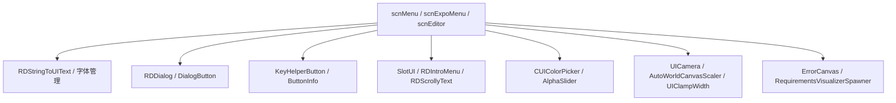

# UI 与菜单辅助类

本页补阶段 7 的根目录 UI 与菜单辅助覆盖，集中整理 `Assembly-CSharp` 根目录下用于菜单、对话框、文本、本地化、按钮提示、错误展示、颜色控件、Canvas 和若干编辑器通用 UI 的脚本。`PauseMenu`、`PauseMenuMode`、`scnMenu`、`scnExpoMenu` 等主流程仍以专门页面和场景流程页为主，本页只记录辅助类如何支撑这些主流程。

## 源码范围

| 类型 | 源码路径 | 职责 |
| --- | --- | --- |
| `AccessibilityScope` | `RDFucked/Assets/Scripts/Assembly-CSharp/AccessibilityScope.cs` | 可访问性设置作用域枚举，区分只作用于故事关卡或全部关卡。 |
| `AlphaSlider` | `RDFucked/Assets/Scripts/Assembly-CSharp/AlphaSlider.cs` | 颜色选择器透明度滑条，把 `Slider.value` 同步到 `CUIColorPicker.Color.a`。 |
| `ApprovalLevelBadge` | `RDFucked/Assets/Scripts/Assembly-CSharp/ApprovalLevelBadge.cs` | 艺术家授权等级徽章，按 `ApprovalLevel` 设置颜色、文本、尺寸和免责声明入口。 |
| `ArtistDisclaimer` | `RDFucked/Assets/Scripts/Assembly-CSharp/ArtistDisclaimer.cs` | 艺术家免责声明数据对象，保存 id、文本、语言和创建更新时间。 |
| `ArtistUIDisclaimer` | `RDFucked/Assets/Scripts/Assembly-CSharp/ArtistUIDisclaimer.cs` | 艺术家免责声明弹窗，显示授权等级、条件说明、确认按钮和外部说明链接。 |
| `AutoWorldCanvasScaler` | `RDFucked/Assets/Scripts/Assembly-CSharp/AutoWorldCanvasScaler.cs` | 按屏幕高度更新 `CanvasScaler.dynamicPixelsPerUnit`。 |
| `BlinkingText` | `RDFucked/Assets/Scripts/Assembly-CSharp/BlinkingText.cs` | 每拍切换 `MeshRenderer.enabled` 的闪烁文字。 |
| `ButtonInfo` | `RDFucked/Assets/Scripts/Assembly-CSharp/ButtonInfo.cs` | 按键提示用 sprite 与颜色结构体。 |
| `CustomInputField` | `RDFucked/Assets/Scripts/Assembly-CSharp/CustomInputField.cs` | 获得焦点时把光标移动到文本末尾的输入框。 |
| `DialogButton` | `RDFucked/Assets/Scripts/Assembly-CSharp/DialogButton.cs` | `RDDialog` 的按钮项，点击后把自身传给对话框。 |
| `DownArrow` | `RDFucked/Assets/Scripts/Assembly-CSharp/DownArrow.cs` | 以 2 秒周期上下移动 1 像素的箭头提示。 |
| `DropdownAutoScroll` | `RDFucked/Assets/Scripts/Assembly-CSharp/DropdownAutoScroll.cs` | Dropdown 打开时按当前选项调整滚动条位置。 |
| `EditorDropdown` | `RDFucked/Assets/Scripts/Assembly-CSharp/EditorDropdown.cs` | 编辑器 Dropdown 启用或禁用时强制隐藏下拉列表。 |
| `ErrorCanvas` | `RDFucked/Assets/Scripts/Assembly-CSharp/ErrorCanvas.cs` | 错误展示面板，创建错误目录、截图、复制日志并显示错误文本。 |
| `FanArtLoader` | `RDFucked/Assets/Scripts/Assembly-CSharp/FanArtLoader.cs` | 启动时读取当前 fan art JSON 与图片，并缓存到 `persistentDataPath`。 |
| `GeneralPauseButton` | `RDFucked/Assets/Scripts/Assembly-CSharp/GeneralPauseButton.cs` | 暂停菜单按钮基类，定义 `SetFocus()` 和 `Select()`。 |
| `PauseArrowButton` | `RDFucked/Assets/Scripts/Assembly-CSharp/PauseArrowButton.cs` | 带左右箭头的暂停菜单条目，焦点状态控制箭头显示。 |
| `PauseButton` | `RDFucked/Assets/Scripts/Assembly-CSharp/PauseButton.cs` | 普通暂停菜单按钮，保存索引和焦点状态。 |
| `KeyHelperButton` | `RDFucked/Assets/Scripts/Assembly-CSharp/KeyHelperButton.cs` | 输入提示按钮，按键盘或手柄类型显示标签、图标和按下状态。 |
| `RDDialog` | `RDFucked/Assets/Scripts/Assembly-CSharp/RDDialog.cs` | 通用对话框，显示消息、选项按钮、遮罩动画和回调。 |
| `RDIntroMenu` | `RDFucked/Assets/Scripts/Assembly-CSharp/RDIntroMenu.cs` | Expo 入口菜单的 logo、平台提示、移动端或桌面文本切换和淡出。 |
| `RDScrollyText` | `RDFucked/Assets/Scripts/Assembly-CSharp/RDScrollyText.cs` | 背景滚动文字，按 beat 时长、房间、字体、随机缩放和颜色生成移动 Tween。 |
| `RDStringToUIText` | `RDFucked/Assets/Scripts/Assembly-CSharp/RDStringToUIText.cs` | 把本地化 key 写入 `Text`、`TextMesh` 或 TMP，并按语言替换字体。 |
| `RDTextMeshFontManager` | `RDFucked/Assets/Scripts/Assembly-CSharp/RDTextMeshFontManager.cs` | `TextMesh` 字体替换辅助，CJK 语言下切换字体和材质。 |
| `RDUITextFontManager` | `RDFucked/Assets/Scripts/Assembly-CSharp/RDUITextFontManager.cs` | UI `Text` 字体替换辅助，调用 `RDStringToUIText.Apply()`。 |
| `RDUITextColorCrossfade` | `RDFucked/Assets/Scripts/Assembly-CSharp/RDUITextColorCrossfade.cs` | 在两种颜色之间按 `Time.unscaledTime` 正弦交叉淡入淡出。 |
| `RDVersionText` | `RDFucked/Assets/Scripts/Assembly-CSharp/RDVersionText.cs` | 版本文本，两页切换显示 7th Beat Games 与 release/build 信息。 |
| `RequirementsVisualizerSpawner` | `RDFucked/Assets/Scripts/Assembly-CSharp/RequirementsVisualizerSpawner.cs` | 根据 `LevelErrorContainer` 中推荐错误创建关卡设置 helper 按钮。 |
| `RequiredControllerTablet` | `RDFucked/Assets/Scripts/Assembly-CSharp/RequiredControllerTablet.cs` | 控制器需求提示板，占位方法保留在源码中。 |
| `scrTextMobileDesktopSwitch` | `RDFucked/Assets/Scripts/Assembly-CSharp/scrTextMobileDesktopSwitch.cs` | 按移动端或桌面平台切换 UI 文本。 |
| `SetVisibilityRequirement` | `RDFucked/Assets/Scripts/Assembly-CSharp/SetVisibilityRequirement.cs` | 按 `RDBase.isDev` 控制对象可见性。 |
| `SlotUI` | `RDFucked/Assets/Scripts/Assembly-CSharp/SlotUI.cs` | 主菜单存档槽 UI，读取存档完成度、皮肤、星星、卷轴、百分比和焦点动画。 |
| `StarSlider` | `RDFucked/Assets/Scripts/Assembly-CSharp/StarSlider.cs` | 把 Slider 值转成空星、半星、满星显示，并输出星数文本。 |
| `TextHyperlinks` | `RDFucked/Assets/Scripts/Assembly-CSharp/TextHyperlinks.cs` | UI `Text` 超链接点击检测，解析 `<a href="">` 并打开 URL。 |
| `TMPTextHyperlinks` | `RDFucked/Assets/Scripts/Assembly-CSharp/TMPTextHyperlinks.cs` | TMP 文本超链接点击检测，读取 TMP link id 并打开 URL。 |
| `TextSwitch` | `RDFucked/Assets/Scripts/Assembly-CSharp/TextSwitch.cs` | 左右切换选项的 `TextMesh` 菜单控件，用于 Expo 入口选项。 |
| `UICamera` | `RDFucked/Assets/Scripts/Assembly-CSharp/UICamera.cs` | UI 相机，窗口舞蹈渲染时按窗口缩放调整相机和 CanvasScaler。 |
| `UIClampWidth` | `RDFucked/Assets/Scripts/Assembly-CSharp/UIClampWidth.cs` | 按 Canvas 参考宽度、padding、最小最大值限制 RectTransform 宽度。 |
| `WaitForSecondsForDialogueCharacters` | `RDFucked/Assets/Scripts/Assembly-CSharp/WaitForSecondsForDialogueCharacters.cs` | 对话字符等待 yield instruction，使用 `RDInk.deltaTimeForDialogues` 累计时间。 |
| `CachedTexture` | `RDFucked/Assets/Scripts/Assembly-CSharp/CachedTexture.cs` | 缓存贴图结构体，保存文件访问时间、贴图和 Alpha8 标记。 |
| `CUIColorPicker` | `RDFucked/Assets/Scripts/Assembly-CSharp/CUIColorPicker.cs` | UI 颜色选择器，处理 hue、saturation、value、alpha 和随机色。 |

## 总体关系

这些脚本的共性是“依附主场景”。它们通过 `RDBase` 访问 `game`、`editor`、`gc`、`conductor` 等对象，或直接依赖 Unity UI 组件。它们负责表现、输入提示、文本、本地化和小型交互，不承担关卡事件调度和判定逻辑。

## 文本与字体

| 类型 | 行为 |
| --- | --- |
| `RDStringToUIText.RefreshText()` | 在 `Text`、`TextMesh`、`TextMeshProUGUI` 中查找可用文本组件；`key` 非空时读取 `RDString.Get(key)`。 |
| `RDStringToUIText.Apply(Text)` | CJK 或减少像素字体时切换到 `RDString.currentLanguageFont`，调整行距和 outline；否则使用拉丁字体。 |
| `RDStringToUIText.Apply(TextMesh)` | CJK 或减少像素字体时切换字体、材质、字号和 `characterSize`。 |
| `RDTextMeshFontManager.Awake()` | `changeFontForLanguage` 开启且当前语言为 CJK 时，替换 `TextMesh.font` 和材质。 |
| `RDUITextFontManager.Start()` | 非 `inactive` 时调用 `RDStringToUIText.Apply()`。 |
| `scrTextMobileDesktopSwitch.Start()` | 读取 `scnBase.isMobile`，在 `mobileText` 与 `desktopText` 之间选择。 |
| `RDVersionText.NextPage()` | 在版权和 release/build 信息之间切换。 |
| `BlinkingText.OnBeat()` | 每次 beat 反转 `MeshRenderer.enabled`。 |

`RDStringToUIText` 是这组里最核心的字体入口，菜单、对话框和编辑器弹窗都会调用它来保证不同语言的字体和材质一致。

## 对话框、按钮与输入提示

### RDDialog 与 DialogButton

| 方法 | 行为 |
| --- | --- |
| `RDDialog.Awake()` | 对消息文本和所有按钮 label 调用 `RDStringToUIText.Apply()`。 |
| `Show(string, string[], Action<int>)` | 退出编辑器 fullscreen，显示 overlay，设置消息和按钮文本，按文本高度调整对话框尺寸，播放弹窗音效并启动 Tween。 |
| `Hide(DialogHideCallback)` | 播放收起音效，移动对话框，隐藏 overlay，结束时关闭对象并调用回调。 |
| `SelectedOption(DialogButton)` | 找到按钮索引并传给 `callback`。 |
| `DialogButton.Awake()` | 注册按钮点击，把自身传给父级 `RDDialog.SelectedOption()`。 |

`hideOnEnterPressed` 开启时，Return 或 Escape 会关闭对话框。

### 暂停菜单按钮

| 类型 | 行为 |
| --- | --- |
| `GeneralPauseButton` | 保存 `index` 和 `rectTransform`，定义 `SetFocus(bool)` 与 `Select()` 抽象方法。 |
| `PauseArrowButton.SetFocus()` | 控制左右箭头显示。 |
| `PauseButton.Initialize()` | 缓存 `Button` 组件。 |
| `PauseButton.SetFocus()` | 写入内部 focused 状态。 |
| `PauseButton.ShowAsSelected()` | 清除 focused 状态。 |

暂停菜单的状态切换和选项执行在 [场景流程与暂停流程](/api/runtime/scene-flow.md) 中整理，本页只记录按钮 UI 层。

### KeyHelperButton

| 方法 | 行为 |
| --- | --- |
| `UpdateKeyboardLabels()` | 按 `KeyCode` 生成显示文本、图标状态和宽度；方向、Escape、Tab、Space、Return 有专门显示规则。 |
| `Update()` | 根据 `RDInputAction` 读取 `RDInput` 静态字段或 `Input.GetKey(keyCode)`，再按 pressed 状态改变高度。 |
| `UpdateControllerType()` | 读取 `KeyHelper.currentInfo`，用 `ButtonInfo` 设置背景 sprite 和颜色；键盘类型显示文字和图标，手柄类型使用固定宽度。 |

`RDInputAction.Main` 会检查 `ignoreKeys`，这些键按下时不把 `RDInput.anyPlayerIsPressed` 显示成主输入按下。

## 菜单与存档槽表现

### RDIntroMenu 与 TextSwitch

| 类型 | 行为 |
| --- | --- |
| `RDIntroMenu.Awake()` | 按 `scnBase.isMobile` 选择移动端或桌面端的 `TextSwitch`、提示文本和开始提示对象。 |
| `RDIntroMenu.FadeOut()` | 隐藏选项和提示，把 logo 上移并淡出静态与动画 logo。 |
| `TextSwitch.Start()` | 获取 `TextMesh`，应用字体并调用 `UpdateText()`。 |
| `TextSwitch.Update()` | 左右输入切换选项，任意玩家按下时调用 `optionSelected(currentOption)`。 |
| `TextSwitch.UpdateOption()` | 循环切换选项；在 `scnExpoMenu` 中会重置 `startAfreshSelected`、播放移动音效并恢复默认提示。 |
| `TextSwitch.UpdateText()` | 选项含 `.` 时走 `RDString.Get()`，再用左右尖括号包裹当前文本。 |

`scnExpoMenu` 把 `TextSwitch.optionSelected` 绑定到主菜单、语言、语音语言、credits、重新开始和退出等分支。

### SlotUI

| 方法 | 行为 |
| --- | --- |
| `Awake()` | 实例化材质，记录初始 X 坐标，把按钮移出屏幕，然后调用 `LoadSlotData()`。 |
| `LoadSlotData()` | 从 `Persistence.skins` 读取手臂皮肤；设置当前存档槽，读取完成度并显示通关数、完美数和百分比。 |
| `Localize()` | 使用当前语言字体，写入 slot 标题。 |
| `SetSkin()` | 把袖子贴图、袖子颜色、皮肤色、指甲色和掌心亮度写入 UI。 |
| `SetFocused(bool)` | 控制外框和左右箭头显示。 |
| `SetOpen(bool)` | Tween 展开或收起存档槽宽度、手的位置和按钮位置，并切换手部帧。 |
| `PressButton()` | 切换按钮与手部按下帧，并调用 `Flash()`。 |
| `OnBeat(bool)` | 随 beat 切换外框帧和左右箭头位置。 |

`SlotUI` 被 `scnMenu` 用于主菜单存档槽选择，数据来自 `Persistence.GetGameCompletion()`。

## 错误、要求和艺术家提示

### ErrorCanvas

| 成员或方法 | 行为 |
| --- | --- |
| `ErrorDirectoryPath` | `Application.persistentDataPath/Errors`。 |
| `StartErrorProcess(string)` | 删除旧错误目录，创建新目录，截图到 `Screenshot.png`，下一帧复制日志并显示错误。 |
| `PostErrorFrameActions(string)` | 从 `persistentDataPath/output_log.txt` 复制到 `Errors/errorOutput.log`，显示容器和错误文本。 |
| `ShowInputFileLocation()` | 调用 `RDUtils.RevealInExplorer()` 打开日志所在目录。 |
| `Quit()` | 调用 `Application.Quit()`。 |

### RequirementsVisualizerSpawner

`RequirementsVisualizerSpawner.Start()` 遍历 `levelErrorContainer.showableErrors`。当错误项的 `settingName` 在自身 `settings` 列表内，并且 `SettingCondition.recommended` 为真时，它会实例化 `levelSettingsHelper`，放到 `helperPosition`，并给按钮注册 `requirementsVisualizer.Show(rectTransform, settings)`。

### 艺术家免责声明

| 类型 | 行为 |
| --- | --- |
| `ApprovalLevelBadge.UpdateUI()` | `Pending` 时隐藏；其他等级按 `RDConstants` 颜色显示；`onlyColor` 模式只显示色块。 |
| `ApprovalLevelBadge.ShowDisclaimer()` | 调用 `editor.levelSettingsPanel.currentArtistDisclaimerAction()`。 |
| `ArtistDisclaimer.ToString()` | 输出语言和免责声明文本。 |
| `ArtistUIDisclaimer.Awake()` | 初始化标题、确认、取消、关闭文本和字体。 |
| `ArtistUIDisclaimer.SetData()` | 写入当前艺术家、输入框、确认模式、授权等级文本和条件说明；Declined 时只显示关闭按钮。 |
| `ArtistUIDisclaimer.ShowArtistDisclaimer()` | 打开 7th Beat 的艺术家说明 URL。 |
| `ArtistUIDisclaimer.Confirm()` | 非检查模式下写回 `levelSettings.artist` 和输入框文本，刷新徽章。 |

## 颜色、滑条和小型控件

| 类型 | 行为 |
| --- | --- |
| `CUIColorPicker` | 把 RGB 转 HSV，创建 hue 与 saturation/value 贴图，拖动 hue 或 sat/value 区域时更新 `Color` 和结果图像。 |
| `AlphaSlider` | 启用时绑定 `cuiColorPicker.result`，LateUpdate 同步滑条；`UpdateResultAlpha()` 把滑条值写入颜色 alpha。 |
| `StarSlider` | 按 `slider.value * stars.Count` 设置空星、半星或满星；`NumberOfStars()` 返回星数文本。 |
| `DropdownAutoScroll` | 首次 Update 时根据 dropdown 当前 value 计算 scrollbar value。 |
| `EditorDropdown` | OnEnable 和 OnDisable 都调用 `dropdown.Hide()`。 |
| `CustomInputField` | LateUpdate 中检测从未聚焦到聚焦的切换，并调用 `MoveTextEnd(true)`。 |
| `DownArrow` | 根据 `Time.timeSinceLevelLoad % 2` 让箭头在初始 Y 和初始 Y + 1 之间切换。 |
| `RDUITextColorCrossfade` | 用正弦曲线在 `colorA` 和 `colorB` 之间插值。 |

## 超链接、Canvas 和窗口 UI

### 超链接

| 类型 | 行为 |
| --- | --- |
| `TextHyperlinks.FindIntersectingCharacterIndex()` | 把屏幕坐标转为 `Text` 的本地坐标，再根据 `TextGenerator` 找字符索引。 |
| `TextHyperlinks.OnPointerClick()` | 从点击字符向前查找 `<a href`，读取引号中的 URL 并调用 `Application.OpenURL()`。 |
| `TMPTextHyperlinks.LateUpdate()` | 使用 `TMP_TextUtilities.FindIntersectingLink()` 找 TMP link，鼠标左键按下时打开 link id。 |

### Canvas 与 UI 相机

| 类型 | 行为 |
| --- | --- |
| `AutoWorldCanvasScaler.Update()` | 设置 `dynamicPixelsPerUnit = Screen.height / 198`。 |
| `UICamera.UpdateCameraSize()` | 窗口舞蹈渲染时按 dancer 的 `windowScale` 调整 `orthographicSize` 和 aspect。 |
| `UICamera.RenderManually(Window)` | 把相机输出到指定窗口 render texture；窗口需要 UI 时按窗口缩放更新 `CanvasScaler.referenceResolution`。 |
| `UIClampWidth.LateUpdate()` | 用 `canvasScaler.referenceResolution.x - padding` 计算宽度并 clamp 到 `minWidth..maxWidth`。 |

## 其他辅助类型

| 类型 | 行为 |
| --- | --- |
| `FanArtLoader.Awake()` | `DontDestroyOnLoad(this)` 后启动 fan art 数据加载协程。 |
| `FanArtLoader.LoadCurrentFanArtData()` | 拉取 JSON，失败时读缓存；再拉取图片或读缓存，成功后设置 `art.filterMode = Point` 并销毁对象。 |
| `RDScrollyText.Setup()` | 设置文本、字体、房间偏移、位置、缩放、排序层和颜色。 |
| `RDScrollyText.Run()` | 按 `beatsToTravel * conductor.crotchet` 计算时长，把文本移动到屏外并隐藏。 |
| `SetVisibilityRequirement.Awake()` | `requireDev` 为真时只在 `RDBase.isDev` 为真时显示对象。 |
| `WaitForSecondsForDialogueCharacters.keepWaiting` | 用 `RDInk.deltaTimeForDialogues` 累加到 delay 后结束等待。 |
| `CachedTexture` | 保存 `fileLastAccessed`、`texture` 和 `isAlpha8`，供贴图缓存逻辑使用。 |

## 相关页面

| 页面 | 关系 |
| --- | --- |
| [场景流程与暂停流程](/api/runtime/scene-flow.md) | `PauseMenu`、`PauseMenuMode`、`Rankscreen` 和运行时状态切换。 |
| [输入系统](/api/runtime/input-system.md) | `KeyHelperButton` 显示的输入状态来源。 |
| [窗口系统](/api/runtime/windows.md) | `UICamera` 在窗口舞蹈中渲染 UI。 |
| [自定义关卡与错误模型](/api/data-models/custom-levels-errors.md) | `LevelErrorContainer`、错误展示和设置校验。 |
| [编辑器 UI 辅助类](/api/editor-events/editor-ui-auxiliary.md) | 编辑器侧的弹窗、选择器和属性控件辅助。 |

