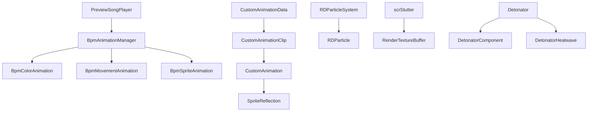

# 视觉与动画辅助类

本页覆盖根目录中尚未进入主干页面的视觉、动画、粒子、后处理和小型相机辅助类。它们多数不是关卡运行流程的入口，而是被官方关卡脚本、房间 VFX、UI 动画、精灵事件或场景物体挂载调用的组件。

## 源码范围

| 类型族 | 主要文件 | 职责 |
| --- | --- | --- |
| BPM 动画 | `BpmAnimationManager`、`BpmColorAnimation`、`BpmMovementAnimation`、`BpmSpriteAnimation`、`AnimationData`、`AnimationType` | 按预览歌曲 BPM 推进 UI 颜色、位置和 Sprite 帧动画 |
| 自定义动画 | `CustomAnimation`、`CustomAnimationData`、`CustomAnimationClip`、`SpriteAnimation`、`SpriteFX`、`SpriteReflection`、`SpriteChangeOnBeat` | 读取自定义动画 JSON、更新网格或 UI 贴图、播放精灵序列、处理反射和节拍换图 |
| 背景与相机辅助 | `BackgroundAddon`、`RDTiledBackground`、`RDSpaceBackground`、`CameraOffsetGizmo`、`CameraSizeCalculation`、`CameraTest` | 背景平铺移动、背景内容模式、太空背景切换、编辑器 Gizmo 和相机调试 |
| 后处理与颜色 | `CascadeStutterEffect`、`ChromaAberrationDupe`、`TwoColorTintFilter`、`ColorCycler`、`RDModifyMaterial` | RenderTexture blit、材质参数写入、文字颜色轮换和材质属性刷新 |
| 粒子与装饰 | `RDParticle`、`RDParticleSystem`、`RDChangeParticleAlpha`、`RDChangeParticleColor`、`UnityParticleSystem`、`Smoke`、`SmokeTexturizer` | RD 自有粒子、Unity 粒子包装、烟雾实例和烟雾贴图生成 |
| 专项视觉组件 | `RDKaleidoscope`、`RDManyEyes`、`EdegaEye`、`LevelSelectDreamBubble`、`BubbleMask`、`BungeeRope` | 万花筒、眼睛阵列、梦境泡泡、遮罩粒子网格和弹性绳动画 |
| 爆炸与 Stutter | `Detonator`、`DetonatorComponent`、`DetonatorHeatwave`、`scrStutter`、`StutterAction` | 爆炸组件协调、热浪平面、画面录制回放式 Stutter |
| 运动小物件 | `BaseballRainSpawner`、`FallingBaseball`、`MovingArrow`、`NoteTileAnimation`、`ScanlineAnimation` | 棒球雨、重力反弹、箭头脉冲、材质贴图偏移和扫描线 |

## 协作关系

## BPM 动画

| 类型 | 关键字段或方法 | 源码行为 |
| --- | --- | --- |
| `AnimationData` | `duration`、`ease` | 可序列化结构体，保存一个动画段的时长和 DOTween ease。 |
| `AnimationType` | `Once`、`Loop`、`LoopOnBeat` | 自定义动画和精灵动画共用的播放模式枚举。 |
| `BpmAnimationManager` | `instance`、`deltaDspTime`、`onBeat` | 场景级 BPM 动画时钟。`Awake()` 缓存 `PreviewSongPlayer` 并监听预览歌曲开始；`Update()` 用 `AudioSettings.dspTime` 计算 dsp 增量和下一拍剩余时间，并在到拍时触发 `onBeat(timeToNextBeat)`。 |
| `BpmAnimationManager.SetBpm(float newBpm, float newOffset)` | BPM 与 offset 设置 | 将 BPM 归一到 70 到 200 区间，offset 以毫秒换算并叠加 `RDCalibration.calibration_v`，再与 `PreviewSongPlayer.startTime` 对齐。 |
| `BpmColorAnimation` | `ColorAnimation[] animations`、`StartAnimation(float timeToNextBeat)` | 继承 `CLSAnimation`。`Play()` 订阅 `BpmAnimationManager.onBeat`；每拍创建 DOTween sequence，按颜色数组把 `Image.color` tween 到目标颜色；`Stop()` 退订并恢复默认颜色。 |
| `BpmMovementAnimation` | `MovementAnimation[] animations`、`repetitionsPerBeat` | 每拍按配置 tween `RectTransform.anchoredPosition`，可在一拍内重复多次；`Stop()` 杀掉旧 sequence 并回到默认位置。 |
| `BpmSpriteAnimation` | `SpriteAnimation.SpriteAnimationData animationData`、`Playing`、`Update()` | 通过 `Playing` 属性订阅或退订 `onBeat`。到拍后根据 `timeToNextBeat * speedMultiplier / sprites.Length` 计算单帧时长，`Update()` 使用 `BpmAnimationManager.deltaDspTime` 推进帧。 |

`BpmSpriteAnimation.Stop()` 会回到 `defaultSpriteIndex` 指向的 Sprite；如果默认帧不在数组范围内，则调用 `OnStopAction`。这个行为让同一套节拍 Sprite 动画可以在停止时交给外部组件恢复画面。

## 自定义动画

| 类型 | 关键字段或方法 | 源码行为 |
| --- | --- | --- |
| `CustomAnimationData` | `Setup(...)`、`LoadFromJson(string jsonText)`、`clips`、`jsonErrors` | 读取自定义动画 JSON、主贴图、描边贴图、发光贴图和 freeze 贴图。`LoadFromJson` 解析名称、voice、sprite size、clip、portrait、pivot、reflection、loop、fps、frame event 和 end event；clip 字典使用大小写不敏感 comparer。 |
| `CustomAnimationData.CheckSize(int width, int height)` | 尺寸校验 | 检查贴图宽高是否能按 `spriteSize` 整除，不符合时写入 `jsonErrors`。 |
| `CustomAnimationData.GetUVsForSheetFrame(int sheetFrame)` | UV 计算 | 根据 `spriteSize` 和主贴图尺寸计算 Sprite sheet 中指定帧的四个 UV。 |
| `CustomAnimationClip` | `name`、`frames`、`fps`、`animationType`、`loopStart`、`pivotOffset`、`reflectionOffset`、`frameEvents`、`endEvent` | 保存单段动画播放数据。`GetPortraitTransformSize()` 返回四舍五入后的 portrait 尺寸乘以 portrait scale。 |
| `CustomAnimation` | `renderMode`、`customAnimationData`、`currentClip`、`Play(...)`、`PlayFromClip(...)`、`LateUpdate()` | 支持 `MeshRenderer` 与 `RawImage` 两种渲染模式。`LateUpdate()` 更新贴图、推进帧、处理 `Once` 完成、`Loop` 回到 `loopStart`、`LoopOnBeat` 到结束帧后等待拍点重启，并调用 `onClipFrameUpdate`。 |
| `CustomAnimation.UpdateTexture()` | 贴图写入 | 把主贴图、发光贴图、描边贴图和 freeze 贴图写入材质属性。 |
| `CustomAnimation.UpdateMesh()` | 网格或 UI 更新 | `MeshRenderer` 模式写 quad 顶点和 UV；`RawImage` 模式写 `uvRect`，并使用 portrait 字段调整显示区域。 |
| `SpriteAnimation` | `SpriteAnimationData`、`PlayFromFrame(int frame)`、`Rewind()`、`Stop()`、`SetSprite(Sprite sprite)` | 继承 `CLSAnimation`，可控制 `Image` 或 `SpriteRenderer`。`Update()` 使用 `RDTime.unscaledDeltaTime` 推进帧，按 `loops` 和 `stopOnLoopEnding` 决定循环或停止。 |
| `SpriteFX` | `Flash`、`ReverseFlash`、`Tint` | 静态工具，作用于 `tk2dSprite.flash`。调用时杀掉同目标旧 tween，再追加新的颜色或闪光 tween。 |
| `SpriteReflection` | `SetSprite(CustomAnimation sprite)`、`LateUpdate()` | 复制目标 `CustomAnimation` 的 mesh、材质和排序信息，Y 轴反转显示反射。角色反射模式会结合行对象的 reflection 跳动与 `currentClip.reflectionOffset` 计算位置。 |
| `SpriteChangeOnBeat` | `originalSprite`、`onBeatSprite`、`LateUpdate()` | 保存原 Sprite，并用 `Time.timeSinceLevelLoad % 1` 在每秒后四分之一时段显示 `onBeatSprite`。 |
| `SpriteLocalization` | `language`、`sprite` | 把 `SystemLanguage` 与 Sprite 绑定，用作按语言替换图片的配置项。 |
| `CustomSprite` | 精灵事件实例 | 作为房间和精灵事件创建出的对象，承接平铺、混合、动画、排序和材质更新；事件行为见 [精灵生命周期事件](/api/editor-events/SpriteLifecycleEvents.md) 与 [精灵渲染与排序事件](/api/editor-events/SpriteRenderEvents.md)。 |

## 背景与相机辅助

| 类型 | 关键字段或方法 | 源码行为 |
| --- | --- | --- |
| `BackgroundAddon` | `velocity`、`Update()` | 根据 `velocity * Time.deltaTime * currentSpriteDef.untrimmedBoundsData[1]` 移动 tiled sprite，并用 floor 取模方式把 localPosition 包回可循环范围。 |
| `RDTiledBackground` | `Show(...)`、`Hide()`、`Update()` | 负责平铺背景显示。`Show` 设置 texture、wrap/filter、内容模式、颜色、排序层、排序值、滚动速度、动画 fps 和脉冲参数；`Update` 按 `AudioSettings.dspTime`、`RDTime.speed` 和 fps 切换 texture 帧，并移动材质 offset。 |
| `RDSpaceBackground` | closeup 相关对象 | closeup 模式隐藏飞船，移动星球、小行星、星星和背景平面，调整粒子模拟速度、相机 fov、clear flags 与 depth。 |
| `CameraOffsetGizmo` | `OnDrawGizmosSelected()` | `ExecuteInEditMode` 组件。被选中时在 y=99 绘制红色线框立方体，尺寸为 352 x 198 x 1，用于观察房间相机偏移范围。 |
| `CameraSizeCalculation` | `Default`、`FullyDynamic`、`DefaultOrLess` | 相机尺寸计算模式枚举。 |
| `CameraTest` | `OnPostRender()`、`OnRenderImage(RenderTexture src, RenderTexture dest)` | 相机调试脚本，输出渲染回调堆栈并执行 blit；当 `RDC.pauseEditorAtTheEndOfThisFrame` 为真时，把当前 RenderTexture 存到桌面 `rt{frame}.png`。 |
| `RDCamera`、`RoomCamera`、`TopCamera`、`UICamera`、`WindowCamera`、`RDCenterCamera` | 相机组件族 | 运行时房间、UI、窗口和顶层相机的具体挂载脚本。主流程见 [房间与 VFX 系统](/api/runtime/rooms-vfx.md) 和 [窗口系统](/api/runtime/windows.md)。 |

## 后处理与颜色

| 类型 | 关键字段或方法 | 源码行为 |
| --- | --- | --- |
| `CascadeStutterEffect` | `OnRenderImage(RenderTexture source, RenderTexture destination)` | 在材质上写入 `_Rows` 与 `_Shown` 后把 source blit 到 destination。 |
| `ChromaAberrationDupe` | `shader`、`material`、`Offset`、`ChangeOffset`、`OnRenderImage` | 创建 `CameraFilterPack/Color_Chromatic_Aberration` 材质；`Update()` 把 `ChangeOffset` 写入 `Offset`；渲染时写 `_TimeX`、`_Distortion`、`_ScreenResolution` 后 blit；禁用时销毁材质。 |
| `TwoColorTintFilter` | `shader`、`colorA`、`colorB`、`OnRenderImage` | 渲染时向材质写 `_ColorA` 与 `_ColorB` 后 blit；没有材质时直接 blit。 |
| `ColorCycler` | `Text text`、`Color[] colors`、`colorDuration` | 用 `Time.unscaledTime % (colorDuration * colors.Length)` 在颜色数组中循环设置 Text 颜色。 |
| `ColorOrPalette`、`ColorInfoAttribute`、`RDPresetColors` | 颜色配置辅助 | 作为颜色字段、调色板和属性显示的轻量辅助类型。数据模型关联见 [音频与辅助数据模型](/api/data-models/audio-and-auxiliary.md)。 |
| `RDModifyMaterial` | `RDShaderProperties shader`、`Renderer renderer`、`LateUpdate()` | 当 `shader.frameChanged` 晚于本组件记录帧时，把 shader 属性应用到 Renderer 材质，并更新 `lastFrameUpdatedGraphics`。 |
| `RDSetUIColorToTabSection`、`RDUITextColorCrossfade`、`RDColorHoverEventTrigger` | UI 颜色组件 | UI 层颜色联动和 hover/crossfade 辅助，和菜单控件页面共同覆盖。 |

## 粒子与装饰

| 类型 | 关键字段或方法 | 源码行为 |
| --- | --- | --- |
| `RDParticle` | `Setup(...)`、`Update()`、`spriteName`、`SetColor(Color color)` | 继承 `Entity`。`Setup` 配置贴图或动画库；`Update` 按速度和 `system.speedMultiplier` 移动，超过屏幕或 lifetime 到期后销毁；`spriteName` setter 从 `Vfx.scLevelElements` 取 Sprite；`SetColor` 写 shader overlay color。 |
| `RDParticleSystem` | `SpawnParticle()`、`Setup(...)`、`StartStream()`、`StopStream()`、`KillAllParticles()` | 按固定数量或 stream 模式生成 `RDParticle` prefab。生成时随机 y、scale、角度、颜色和 lifetime，写排序层与排序值；`Setup` 可把粒子系统挂到房间相机并设置速度与位置范围。 |
| `RDChangeParticleAlpha` | `Update()` | 每帧选择当前关卡数据中的 row shader data 或全局 shader data，并写入 `_Opacity`。 |
| `RDChangeParticleColor` | `Update()` | 每帧选择 row shader data 或全局 shader data，并把 overlay color 与 black 值混合后写入 `_ColorOverlay`。 |
| `UnityParticleSystem` | `selectedPreset` | 对 Unity `ParticleSystem` 的轻量包装，源码只保存当前 preset 索引。 |
| `scrBitternessParticles` | `ToggleRain`、`ToggleFastRain`、`ToggleBurst` | 控制 rain、fastRain、burst 三组粒子 GameObject 的显隐。 |
| `scrCareLessParticles` | `ReplaceSystemSprite`、`ReplaceSwarmSprite`、`DropSystem`、`DropSwarm`、`ToggleAllSystemsActive` | 初始化时把上下粒子系统设为相同 randomSeed；可替换粒子 Sprite，并通过 tween 把粒子速度改为下落和随机横向速度。 |
| `scrInjuryBubbles` | `ToggleSystems(bool active)` | 播放或停止全部 `ParticleSystem`，停止时清理粒子，并同步 bubble wall 对象显隐。 |
| `Smoke` | `Add(...)`、`AddMany(...)` | 继承 `Entity`。`Awake` 设置 animator 的 delta 模式、随机旋转并在动画完成时销毁父对象；静态 `Add` 从 `gm` prefab 实例化烟雾并配置位置、缩放和排序。 |
| `SmokeTexturizer` | RenderTexture 与 `LateUpdate()` | 创建 96 x 216 RenderTexture 并赋给材质；按参考 `tk2dSprite` mesh、行数、内部百分比和曲线重建顶点和 UV，再把材质 blit 到 RenderTexture。 |

## 专项视觉组件

| 类型 | 关键字段或方法 | 源码行为 |
| --- | --- | --- |
| `RDKaleidoscope` | `SetColorA`、`SetColorB`、`SetSpeed`、`SetEmissionRate`、`ToggleVolumeTracker`、`SetRepeat`、`SetOffset`、`SetRoll`、`ToggleSymmetry`、`SyncSeed` | 缓存 `Kino.Mirror` 和粒子材质。`Update` 用房间相机颜色更新背景；`LateUpdate` 让 kaleido 相机跟随房间相机启用状态；颜色、速度、发射率、重力、模拟速度、旋转和 Mirror 参数都有对应 setter。 |
| `RDKaleidoscopeTester` | `Update()` | 读取 `scnGame.instance.currentLevel`，并暴露颜色倍率与 power 字段用于场景内测试。 |
| `RDManyEyes` | `SpawnEyes()`、`SetTarget`、`ResetTarget`、`TweenScroll`、`TweenEyeColors`、`Blink`、`CloseEyes` | 生成 20 x 20 共 400 个 `EdegaEye`，按 scroll 速度与角度移动并包回范围；支持注视 Transform、行或指定坐标，并可 tween 眼睛颜色、背景色、滚动方向和闭眼比例。 |
| `EdegaEye` | `LateUpdate()`、`SetFrame(int frame)`、`DoBlink()`、`TweenColor`、`TweenBackgroundColor` | 根据 target Transform 或 target vector 计算 pupil localPosition，按半径夹取并四舍五入；blink 通过切换 frame 表现开合。 |
| `LevelSelectDreamBubble` | `Awake()`、`Update()` | 依据 dream quad scale 创建 dream 与 mask RenderTexture，写入材质主贴图和 mask 贴图；`Update` 固定 renderQueue、sorting layer 与 sorting order。 |
| `BubbleMask` | `playing`、`Play(bool on)`、`Update()` | 按 resolution 创建粒子网格。每帧检查粒子位置是否与 `shapes` 中任一 `Collider2D` 重叠，并结合 `invert` 决定该粒子的 emission 是否启用。 |
| `BungeeRope` | `Awake()` | 初始化绳子 localPosition 为 `Vector3.down * 2`，使用 DOTween 在 y=-2 和 y=2 间 yoyo 循环，并初始化 `SubdivisionSpotlightController`。 |
| `LevelConditionVisualizer`、`RequirementsVisualizerSpawner` | 条件展示辅助 | 和关卡选择或要求展示相关，负责把条件/要求信息转成可视 UI。 |

## 爆炸与 Stutter

| 类型 | 关键字段或方法 | 源码行为 |
| --- | --- | --- |
| `Detonator` | `size`、`color`、`duration`、`detail`、`direction`、`UpdateComponents()`、`Explode()` | 爆炸协调器。`Awake` 收集 `DetonatorComponent`，查找或自动创建 `DetonatorHeatwave`；`UpdateComponents` 用 Detonator 的 size、duration、detail、force、velocity、color 缩放子组件；`Explode` 记录时间并调用每个子组件 `Explode()`。 |
| `Detonator.DefaultHeatwaveMaterial()` | 默认热浪材质 | 使用 shader `HeatDistort`，加载 `Detonator/Textures/Heatwave` 作为默认贴图。 |
| `DetonatorComponent` | `on`、`detonatorControlled`、`duration`、`size`、`detail`、`delayMin`、`delayMax`、`force`、`velocity`、`color`、`Explode()`、`Init()` | 抽象基类，定义爆炸子组件共用参数。`SetStartValues()` 缓存初始尺寸、力、速度、detail、颜色和 localPosition。 |
| `DetonatorHeatwave` | `Explode()`、`Update()`、`Rewind()` | 创建 primitive plane 作为热浪平面，复制 Detonator 的热浪材质；爆炸时启用平面，随时间放大并写 `_BumpAmt`，到持续时间后禁用。 |
| `scrStutter` | `AddStutter(...)`、`EndCurrentStutter()`、`EndStutterOnBeat(...)`、`ClearStutterCache()` | 通过内部 `AudioDspManager` 建立游戏时间到 dsp 时间的回归关系，`RecordingManager` 把源画面记录到 RenderTexture buffer，`PlaybackManager` 按 dsp 时间回放并支持 playbackSpeed、循环次数和 stack 绘制。 |
| `StutterAction` | `Add`、`Cancel` | Stutter 事件动作枚举，对应添加或取消 Stutter。 |

`scrStutter.AddStutter(playBeat, sourceBeat, length, numOfLoops, stack, playbackSpeed)` 会校验播放 beat、来源 beat、长度和速度，再通过 `scrExecuteOnCertainBeat` 安排录制和回放。它属于图像层面的 Stutter，不改变节拍判定本身。

## 运动小物件与枚举

| 类型 | 关键字段或方法 | 源码行为 |
| --- | --- | --- |
| `BaseballRainSpawner` | `ballsPerSecond`、`SpawnBall()`、`Kill()` | 按 `ballsPerSecond` 计时实例化 `Perspective2DSprite` 棒球，位置在配置 bounds 内随机；监听 `FallingBaseball.onDestroy` 从列表移除；`Kill` 销毁并清空当前对象。 |
| `FallingBaseball` | `gravity`、`bounciness`、`Update()`、`OnDestroy()` | 模拟重力、反弹、随机旋转和阴影透明度；首次触地后加入随机水平速度，延迟后淡出 Sprite，销毁时触发 `onDestroy`。 |
| `MovingArrow` | `Update()`、`Pulse()` | 平时按时间在上下 1 像素范围移动；`Pulse()` 杀掉旧 tween，把箭头上移 3 像素再 tween 回初始位置。 |
| `PauseArrowButton`、`PauseModeContentArrows`、`DownArrow` | 箭头 UI | 暂停菜单或 UI 中的箭头显示与输入反馈辅助。 |
| `NoteTileAnimation` | `Update()` | 复制材质并按速度持续移动 `_MainTex` offset，可选择 scaled 或 unscaled delta。 |
| `ScanlineAnimation` | `StartScan()` | 按随机 delay 和 duration 把 RectTransform 从 topY tween 到 bottomY，完成后重置位置并继续下一轮。 |
| `DoubleOutline` | 编辑器刷新 | 确保对象上有两个 `Outline` 组件，并把一个设为横向偏移，一个设为纵向偏移。 |
| `FourSidedOutlineCheap` | `Awake()`、`LateUpdate()`、`SetText(string text)` | 创建或同步四个 Text 轮廓副本，把它们放在右、上、左、下偏移位置，并复制主 Text 的颜色 alpha、对齐和字号。 |
| `Perspective2DSprite`、`Perspective2DSpriteExtensions` | 透视 Sprite | 供棒球、房间透视或 DOTween 扩展调用的 2D 透视对象。 |
| `BananaBend` | `Straight`、`Pull`、`Release`、`PullLittle`、`ReleaseNoSpring` | 香蕉弯曲状态枚举。 |
| `TextureFilter` | `NearestNeighbor`、`Bilinear` | 贴图过滤模式枚举。 |
| `ShowAnimationType` | `InstantNoEffects`、`InstantWithEffects`、`FullAnimation` | 显示动画模式枚举。 |
| `SpriteBlendType`、`SpriteMode`、`MaskType` | Sprite 显示枚举 | 控制 Sprite 混合、显示模式和遮罩模式，事件入口见房间与精灵事件页面。 |
| `RDWaveAnimation` | 曲线字段 | `ScriptableObject`，保存波形动画的 duration、timeScale、waveTime、waveSpeed、sine/triangle 参数、decay 和 angularFrequency。 |

## 与其他页面的关系

| 页面 | 关系 |
| --- | --- |
| [房间与 VFX 系统](/api/runtime/rooms-vfx.md) | 主干解释 `scrVfxControl`、`RDRoom`、房间相机和事件如何落到 VFX。 |
| [视觉样式与特效事件](/api/editor-events/VisualStyleEvents.md) | 解释主题、VFX preset、背景、前景、闪光、行染色和手部事件如何触发视觉变化。 |
| [房间与精灵事件](/api/editor-events/room-sprite-events.md) | 解释自定义 Sprite 的创建、移动、播放动画、平铺和渲染排序事件。 |
| [窗口系统](/api/runtime/windows.md) | 解释窗口相机、窗口舞蹈和 blit 链路。 |
| [视觉与窗口特殊关卡](/api/levels/visual-special.md) | 官方关卡脚本中使用 kaleidoscope、粒子、窗口和特殊画面的案例。 |

